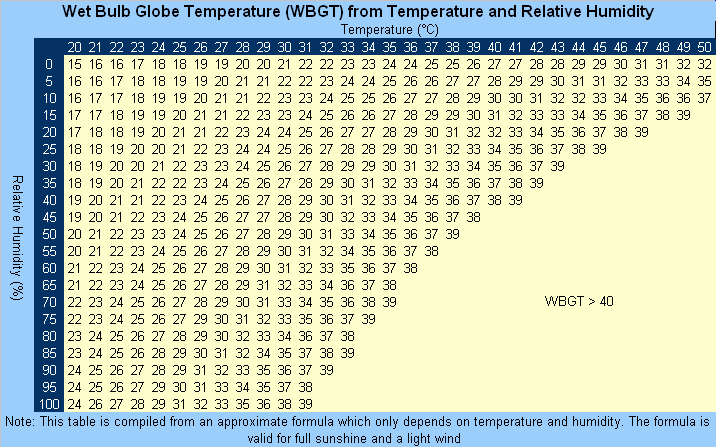
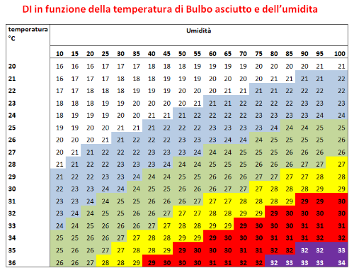
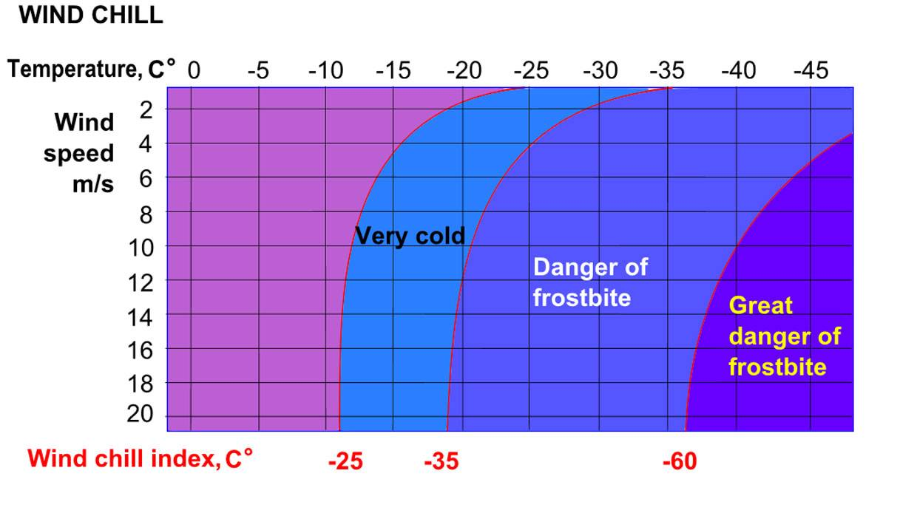
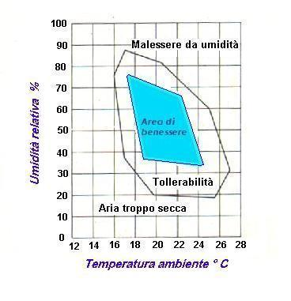
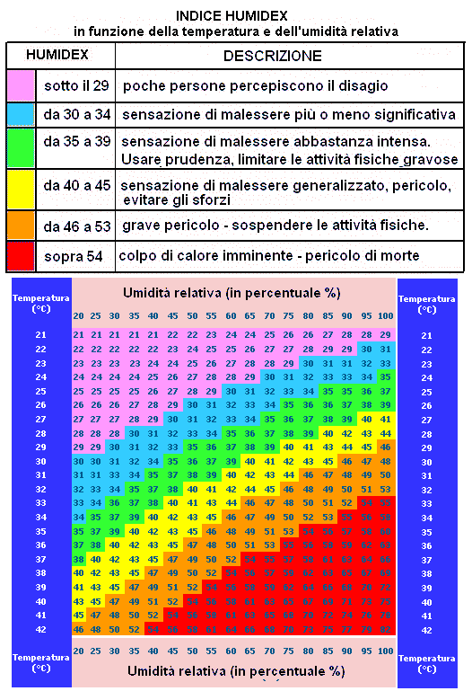

Biometeorologia umana
=====================

La biometeorologia è una disciplina scientifica interdisciplinare che
analizza le interazioni tra la biosfera e l'atmosfera
terrestre. Questa branca della meteorologia si focalizza
sull'influenza delle condizioni meteo come temperatura, pressione,
umidità e intensità della radiazione solare sugli esseri viventi,
inclusi piante, animali e esseri umani.

Indici Termici
--------------

Gli effetti dell'ambiente termico sugli esseri umani sono meglio
determinati con l'ausilio di indici termici basati sul bilancio
energetico del corpo umano.

Applicazioni comuni sono la PMV (Predicted MeanVote) (Fanger 1972), la
PET (Physiologically Equivalent Temperature) (VDI 1998; Höppe 1999;
Matzarakis et al. 1999), la SET* (Standard Effective Temperature)
(Gagge et al. 1986) o Outdoor Standard Effective Temperature
(Out_SET*) (Spagnolo e de Dear 2003) e la Temperatura percepita (Tinz
e Jendritzky2003).

Questi indici termici, ben documentati, hanno obiettivi diversi, ma
sono essenzialmente combinazioni diverse dello stesso insieme di
importanti parametri meteorologici e termofisiologici (Matzarakis
2001).

Sfortunatamente, i dati su molti di questi parametri, come le onde
corte e lunghe, non sono generalmente disponibili nelle registrazioni
climatiche. Di conseguenza, le valutazioni climatiche e gli studi sul
comfort termico sono spesso ricorsi all'uso di indici climatici che
non includono questi fattori chiave. Ad esempio, il rapporto
dell'Intergovermental Panel onClimate Change (IPCC 2001) descrive gli
effetti del tempo e del clima sull'uomo con un semplice indice basato
sulla combinazione di temperatura dell'aria e umidità
relativa. L'esclusione di importanti variabili meteorologiche
(velocità del vento e flussi di radiazione) e termofisiologiche
(attività dell'uomo e abbigliamento) riduce notevolmente la
significatività dei risultati.

Dai dati sinottici, climatologici e astronomici si possono ottenere
stime dei flussi di radiazione a onde corte e lunghe (Verein Deutscher
Ingenieure 1998; Matzarakis et al. 2000).

A partire dagli anni '60, i modelli di bilancio termico del corpo
umano sono stati sempre più accettati nella valutazione del comfort
termico. La base di questi modelli è l'equazione del bilancio
energetico umano. Uno dei primi modelli di bilancio termico, tuttora
molto diffuso, è l'equazione del comfort definita da Fanger
(1972). Fanger introdusse gli indici termici "Predicted Mean Vote"
(PMV) e "Predicted Percentage Dissatisfied" (PPD) per aiutare gli
ingegneri della climatizzazione a creare ambienti interni termicamente
confortevoli. Due decenni dopo, Jendritzky et al. (1990) sono riusciti
a rendere l'approccio di Fanger applicabile alle condizioni esterne,
assegnando parametri appropriati per adattare il modello alle
condizioni di irraggiamento esterno, molto più complesse. Poiché
questo modello è stato concepito solo per stimare un indice integrale
della componente termica del clima e non per rappresentare una
descrizione realistica delle condizioni termiche del corpo, è in grado
di funzionare senza considerare i processi fondamentali di regolazione
termofisiologica. Ad esempio, nell'approccio di Fanger la temperatura
media della pelle e il tasso di sudorazione sono quantificati come
"valori di comfort", essendo dipendenti solo dall'attività e non dalle
condizioni climatiche (Höppe 1999).

I modelli più universalmente applicabili tengono conto di tutti i
processi termoregolatori di base, come la costrizione o la dilatazione
dei vasi sanguigni periferici e il tasso di sudorazione fisiologico
(Höppe 1993, 1999). Essi consentono all'utente di prevedere i "valori
reali" delle grandezze termiche del corpo, come la temperatura della
pelle, la temperatura interna, il tasso di sudorazione o l'umidità
della pelle.

Il modello di bilancio energetico di Monaco per gli individui" (MEMI)
(Höppe 1993) è un modello di bilancio termico fisiologico. È la base
per il calcolo della temperatura fisiologicamente equivalente
(PET). In dettaglio, il modello MEMI si basa sull'equazione del
bilancio energetico per il corpo umano:

M + W + R + C + Ed + Ere + Esw + S = 0

Dove, M è il tasso metabolico (produzione interna di energia), W è il
rendimento fisico, R è la radiazione netta del corpo, C è il flusso di
calore convettivo, Ed è il flusso di calore latente per l'evaporazione
dell'acqua che si diffonde attraverso la pelle (sudorazione
impercettibile), Ere è la somma dei flussi di calore per il
riscaldamento e l'umidificazione dell'aria inspirata, Esw è il flusso
di calore dovuto all'evaporazione del sudore e S è il flusso di calore
di accumulo per il riscaldamento o il raffreddamento della massa
corporea. I singoli termini di questa equazione hanno segno positivo
se determinano un guadagno di energia per il corpo e segno negativo in
caso di perdita di energia (Mis è sempre positivo; W, ED ed Esw sono
sempre negativi). L'unità di misura di tutti i flussi di calore è il
Watt (Höppe 1999).I singoli flussi di calore dell'equazione sono
controllati dai seguenti parametri meteorologici (Verein Deutscher
Ingenieure 1998; Höppe 1999):

* Temperatura dell'aria: C, Ere- Umidità dell'aria: Ed, Ere, Esw
* Velocità del vento: C, Esw
* Temperatura media radiante: R

Sono inoltre necessari parametri termofisiologici:

* Resistenza termica degli indumenti (unità clo)
* Attività dell'uomo (in Watt)

La resistenza termica del vestiario rappresenta la resistenza al
flusso di calore opposta dai vestiti e dallo strato d’aria presente
tra i vestiti e la pelle. Nel sistema internazionale la resistenza
termica è espressa in m2 °C/W, anche se, in genere, viene utilizzata
un’unità di misura incoerente, il “clo”:

1 clo = 0.155 m2 °C/W
  
Il corpo umano non dispone di sensori selettivi per la percezione dei
singoli parametri climatici, ma può solo registrare (tramite
termorecettori) e dare una risposta termoregolatoria alla temperatura
(e alle sue eventuali variazioni) della pelle e al flusso sanguigno
che passa dall'ipotalamo (Höppe 1993, 1999). Queste temperature,
tuttavia, sono influenzate dall'effetto integrato di tutti i parametri
climatici, che sono in qualche modo interrelati, cioè si influenzano a
vicenda. In situazioni climatiche senza velocità del vento, per
esempio, la temperatura media radiante ha più o meno la stessa
importanza della temperatura dell'aria per il bilancio termico del
corpo umano. Nei giorni in cui la velocità del vento è più elevata, la
temperatura dell'aria è più importante della temperatura media
radiante, perché ora domina l'aumento dello scambio termico
convettivo. Queste interazioni sono quantificabili in modo realistico
solo attraverso modelli di bilancio termico (Verein Deutscher
Ingenieure 1998; Höppe 1999).

Gli indici termici possono essere classificati come empirici o
razionali. Gli indici empirici [ad esempio la temperatura del bulbo
umido (WBGT) sono stati sviluppati per condizioni termiche o
meteorologiche specifiche e limitate, come gli ambienti interni o gli
ambienti caldi o freddi. Gli indici empirici sono regolarmente
espressi attraverso una formula semplice e non sono adatti per
l'applicazione ad altre condizioni termiche o per un uso generale. Gli
indici razionali sono calcolati utilizzando complicati modelli
computazionali basati sull'equilibrio energetico umano. Uno studio
ha proposto che alcuni indici termici razionali, come
l'Indice Universale di Clima Termico in C (UTCI), la Temperatura
Percepita in C (PT), la Temperatura Fisiologicamente Equivalente in
C (PET) e la Temperatura Standard Efficace Esterna in C (SET*),
siano efficaci per valutare gli ambienti termici generali a livello
globale.

La PET è definita come equivalente alla temperatura dell'aria
necessaria per riprodurre in un ambiente interno standardizzato e per
una persona standardizzata le temperature del nucleo e della pelle
osservate nelle condizioni oggetto di valutazione (VereinDeutscher
Ingenieure 1998; Höppe 1999). La persona standardizzata è
caratterizzata da un metabolismo lavorativo di 80 W di attività
leggera, oltre al metabolismo di base, e da una resistenza termica di
0,9 clo dovuta all'abbigliamento.

Per il clima interno di riferimento sono state fatte le seguenti ipotesi:

* La temperatura media radiante è uguale alla temperatura dell'aria (Tmrt = Ta).
* La velocità dell'aria (velocità del vento) è fissata a v = 0,1 m/s.
* La pressione del vapore acqueo è impostata a 12 hPa
  (approssimativamente equivalente a un'umidità relativa del 50% a Ta
  = 20°C).

Il calcolo del PET comprende le seguenti fasi:

* Calcolo delle condizioni termiche del corpo con MEMI per una
  determinata combinazione di parametri meteorologici.
  
* Inserimento dei valori calcolati per la temperatura media della
  pelle e la temperatura del nucleo nel modello MEMI e risoluzione del
  sistema di equazioni del bilancio energetico per la temperatura
  dell'aria Ta (con v = 0,1 m/s, VP = 12 hPa e Tmrt = Ta).

Infine la temperatura dell'aria risultante è equivalente alla PET. La
PET consente di valutare le condizioni termiche anche in modo
fisiologicamente significativo. A questo proposito, Matzarakis e
Mayer (1996) hanno trasferito gli intervalli di PMV per la percezione
termica e il grado di stress fisiologico sull'uomo (Fanger 1972) nei
corrispondenti intervalli di PET.

Intervalli della temperatura equivalente fisiologica (PET) per diversi
gradi di percezione termica da parte dell'uomo e di stress fisiologico
sull'uomo; produzione di calore interno: 80 W, resistenza al
trasferimento di calore dell'abbigliamento: 0,9 clo (secondo
Matzarakis e Mayer 1996).

+--------+--------------------------+-------------------------------+
| PET    | Thermal perception       | Grade of physiological stress |
+========+==========================+===============================+
|        | Very cold                | Extreme cold stress           |
+--------+--------------------------+-------------------------------+
| 4°C    |                          |                               |
+--------+--------------------------+-------------------------------+
|        | Cold                     | Strong cold stress            |
+--------+--------------------------+-------------------------------+
| 8°C    |                          |                               |
+--------+--------------------------+-------------------------------+
|        |  Cool                    | Moderate cold stress          |
+--------+--------------------------+-------------------------------+
| 13°C   |                          |                               |
+--------+--------------------------+-------------------------------+
|        |  Slightly cool           | Slight cold stress            |
+--------+--------------------------+-------------------------------+
| 18°C   |                          |                               |
+--------+--------------------------+-------------------------------+
|        |  Comfortable             | No thermal stress             |
+--------+--------------------------+-------------------------------+
| 23°C   |                          |                               |
+--------+--------------------------+-------------------------------+
|        | Slightly warm            | Slight heat stress            |
+--------+--------------------------+-------------------------------+
| 29°C   |                          |                               |
+--------+--------------------------+-------------------------------+
|        | Warm                     | Moderate heat stress          |
+--------+--------------------------+-------------------------------+
| 35°C   |                          |                               |
+--------+--------------------------+-------------------------------+
|        | Hot                      | Strong heat stress            |
+--------+--------------------------+-------------------------------+
| 41°C   |                          |                               |
+--------+--------------------------+-------------------------------+
|        | Very hot                 | Extreme heat stress           |
+--------+--------------------------+-------------------------------+

Indici Termici Empirici
-----------------------

Wet Bulb Globe Temperature (WBGT)
.................................

Il WBGT è stato sviluppato alla fine degli anni '50 per il Corpo dei
Marines degli Stati Uniti a Parris Island, nella Carolina del Sud.
Il WBGT è stato successivamente utilizzato dai ricercatori come indice
generale di stress da calore facilmente misurabile. Col tempo il suo
uso si è esteso. Poiché il suo uso è raccomandato dalla norma ISO
7243, viene spesso utilizzato nelle linee guida per la salute e la
sicurezza sul lavoro in ambienti caldi. È stato raccomandato per l'uso
negli sport che richiedono uno sforzo continuo, come la
maratona. Viene anche utilizzato per i cavalli negli eventi equestri.

Il WBGT è un indicatore di stress da caldo espresso in °C che
considera la combinazione di diverse importanti variabili per la
valutazione delle condizioni microclimatiche, e in particolare la
temperatura naturale del bulbo umido (Tnwb, °C), la temperatura
globotermometrica (Tg, °C) e la temperatura del bulbo secco (Ta, °C),
stimando in questo modo l'esposizione della persona allo stress
termico considerando anche il contributo radiativo legato
all’esposizione al sole o considerando solo zone d’ombra.

L'indicatore permette l'individuazione di soglie di criticità da caldo
per specifici livelli di attività fisica, corretti anche in funzione
del vestiario indossato, oltre le quali sarebbe necessario prendere
dei provvedimenti per contrastare gli effetti del caldo. Permette
quindi una personalizzazione dello stress da caldo anche sulla base
delle caratteristiche fisiche di una persona (in particolare altezza e
peso), oltre che del tipo di vestiario indossato, del livello di
attività fisica svolta, dell’ambiente (esposto al sole o all’ombra),
tenendo anche conto se la persona è acclimatata o meno al caldo.

WBGT = (0.7 * Tw) + (0.2 * Tg) + (0.1 * T)

*    T = Temperatura a bulbo secco (temperatura dell'aria) in gradi Celsius.
*    Tg = Temperatura del termometro a globo in Celsius, misurata utilizzando un globo nero per valutare il calore radiante.
*    Tw = Temperatura a bulbo umido (in gradi Celsius).

.. image:: WETBULB.avif

**Temperatura del globo**

La temperatura del globo Tg è una grandezza che si misura direttamente
con il termometro a globo.

Il termometro a globo è uno dei più comuni strumenti di misurazione
della temperatura radiante, introdotto da Vernon (1930). È costituito
da una sfera di rame cava del diametro di 150 mm (o 100 mm), rivestita
di vernice nera opaca e contenente un normale termometro con il bulbo
fissato al centro della sfera, senza fonte di calore.

Per approfondire "operative temperature and globe temperature" pdf :download:`pdf <20_3_319.pdf>`

http://www.engineeringmechanics.cz/pdf/20_3_319.pdf

**temperatura di bulbo umido**

La temperatura di bulbo umido (in inglese wet bulb temperature) è la
temperatura a cui si porta l'acqua in condizioni di equilibrio di
scambio convettivo con una massa d'aria in moto turbolento
completamente sviluppato. Viene solitamente misurata da un apposito
termometro coperto da un panno imbevuto d'acqua.[1]

Tale temperatura riflette l'effetto refrigerante dell'evaporazione
dell’acqua. Può essere determinata facendo passare l’aria sopra un
termometro che sia stato avvolto con un tessuto umido. L'effetto
refrigerante dell’evaporazione dell'acqua causa una temperatura più
bassa rispetto a quella del bulbo secco.

A partire dal valore della temperatura di bulbo umido si ricava
l'umidità assoluta di un ambiente.

https://it.wikipedia.org/wiki/Temperatura_di_bulbo_umido

E' possibile usare una approssimazione che non tiene conto delle
variazioni dell'intensità della radiazione solare o della velocità del
vento e presuppone un livello di radiazione moderatamente elevato in
condizioni di vento leggero.

L'uso di questa approssimazione può portare a stime errate dello
stress termico, soprattutto in condizioni di nuvolosità e vento. In
queste condizioni è probabile che l'approssimazione porti a una
sovrastima dello stress. L'approssimazione sovrastima anche le
condizioni notturne e mattutine quando il sole è basso o sotto
l'orizzonte.

La formula semplificata è:

WBGT = 0,567 * T + 0,393 * e + 3,94

dove:

* T = temperatura di bulbo secco (°C)
* e = Pressione del vapore acqueo (hPa)

Indice di Thom (Discomfort Index)
.................................

L'Indice di Thom, noto anche come Indice di Disagio (Discomfort Index,
DI), è una misura utilizzata per valutare il disagio umano causato
dagli effetti combinati della temperatura e dell'umidità. È
particolarmente utile per valutare lo stress termico in ambienti caldi
e umidi.

Caratteristiche principali

* Tiene conto sia della temperatura dell'aria che dell'umidità relativa.
* Facile da calcolare, non richiede dati meteorologici complessi.

L'indice di Thom si calcola con la seguente formula:

.. math::
   \text{Indice di Thom (DI)} = T - (0.55 - 0.0055 \times RH) \times (T - 14.5)

Dove:

    :math:T = Temperatura dell'aria in °C (temperatura secca).

    :math:RH = Umidità relativa in percentuale (%).

Il valore dell'indice di Thom può essere interpretato come segue:

+----------------------+-----------------------------------------+
| Indice di Thom (DI)  | Livello di Disagio                      |
+======================+=========================================+
| < 21°C               | Nessun disagio                          |
+----------------------+-----------------------------------------+
| 21–24°C              | Meno della metà della popolazione       |
|                      | avverte disagio                         |
+----------------------+-----------------------------------------+
| 24–27°C              | Più della metà della popolazione        |
|                      | avverte disagio                         |
+----------------------+-----------------------------------------+
| 27–29°C              | La maggior parte della popolazione      |
|                      | avverte disagio                         |
+----------------------+-----------------------------------------+
| 29–32°C              | Tutti avvertono un forte disagio        |
+----------------------+-----------------------------------------+
| > 32°C               | Allerta sanitaria: rischio di malattie  |
|                      | legate al calore                        |
+----------------------+-----------------------------------------+

Limiti: ignora gli effetti del vento e della radiazione solare.

Wind Chill
..........

L'indice di raffreddamento, chiamato Wind Chill, esprime la sensazione
di raffreddamento causato dall'effetto combinato di temperatura e
vento.

Il corpo umano non percepisce infatti la temperatura dell'aria
misurata dal termometro. La sensazione di freddo percepita è legata
alla temperatura della nostra pelle: in caso di vento la temperatura
cutanea è più bassa perché aumenta la perdita di calore a causa del
mescolamento dell’aria a contatto con la pelle.

Questa sensazione è ciò che il Wind Chill tenta di misurare.

Autori: Osczevski R.,Bluestein M. (2001)

Formula:

WC =13.12+(0.6215 * T)-(11.37 * V^0.16) +(0.3965 * T * V^0.16)

* T[°C] = temperatura dell’aria
* V [km/h] = velocità del vento

La formula indicata è valida solo per velocità del vento maggiori o
uguali a 1,3 metri al secondo (4,68 km/h) e per temperature effettive
inferiori a 10 °C

Rischio di congelamento definito in letteratura:

+------------+-------------------------------------------------------------------+
| -27≤WC<0   | Basso rischio di congelamento                                     |
+------------+-------------------------------------------------------------------+
| -39≤WC<-27 | Rischio: la pelle esposta può gelare in 10-30 minuti              |
+------------+-------------------------------------------------------------------+
| -47≤WC<-39 | Rischio elevato: la pelle esposta può gelare in 5-10 minuti       |
+------------+-------------------------------------------------------------------+
| -54≤WC<-47 | Rischio molto elevato: la pelle esposta può gelare in 2-5 minuti  |
+------------+-------------------------------------------------------------------+
| WC< - 55   | Rischio estremamente elevato                                      |
+------------+-------------------------------------------------------------------+

+------------------+---------------------------------------------------------------------------------------------------------------------------+
| Da 4 a –6°C      | FREDDO, impressione sgradevole                                                                                            |
+------------------+---------------------------------------------------------------------------------------------------------------------------+
| Da –7°C a –17°C  | MOLTO FREDDO, impressione molto sgradevole                                                                                |
+------------------+---------------------------------------------------------------------------------------------------------------------------+
| Da –18°C a –28°C | GELIDO, congelamento possibile. La pelle esposta può gelare in 5 minuti. Evitare l’attività all’aperto                    |
+------------------+---------------------------------------------------------------------------------------------------------------------------+
| Da –29°C a –56°C | ESTREMAMENTE FREDDO, congelamento probabile. La pelle esposta può gelare in un minuto. L’attività all’aperto è pericolosa |
+------------------+---------------------------------------------------------------------------------------------------------------------------+
| Oltre –56°C      | GELATO, congelamento sicuro. La pelle esposta può gelare in 30 secondi                                                    |
+------------------+---------------------------------------------------------------------------------------------------------------------------+

 
Temperatura Apparente
.....................

Questo indice considera tutte le conzioni ambientali e corporee che
condizionano la termoregolazione umana.  Nel 1984 Steadman implementa
una scala di "temperatura apparente" basata sulle reazioni di una
popolazione campione sottoposta a differenti condizioni.

Steadman implementa la formula empirica per stimare la temperatura
apparente in ambiente esterno all'ombra tenendo conto dei valori di
temperatura dell'aria, pressione di vapore e velocità del vento.

Autore: R.G. Steadman
https://journals.ametsoc.org/view/journals/apme/23/12/1520-0450_1984_023_1674_ausoat_2_0_co_2.xml?tab_body=pdf

Formula:

AT[°C] = -2.7+1.04 * T + 2.0 * e/10  -0.65 * V

* T [K]=temperatura aria
* e [hPa]=tensione di vapore
* V [m/s]= Vento a 10 m dal suolo (media in 1 minuto)

+--------------+-------------------+
| AT<27 °C     |  Benessere        |
+--------------+-------------------+
| 27 ≤ AT < 32 |  Cautela          |
+--------------+-------------------+
| 32 ≤ AT < 40 |  Estrema cautela  |
+--------------+-------------------+
| 40 ≤ AT < 54 |  Pericolo         |
+--------------+-------------------+
|      AT  ≥54 |  Elevato pericolo |
+--------------+-------------------+

Humidex
.......

E’ uno degli indici utilizzati per valutare il benessere climatico
dell’uomo in relazione all’umidità ed alla temperatura.

I primi studi sono stati effettuati nel 1965 in Canada, ma solo
successivamente, alcuni meteorologi canadesi, hanno individuato una
scala, chiamata appunto Humidex, la quale cerca, considerando la
temperatura dell’aria e l’umidità relativa, di calcolare un singolo
valore in grado di descrivere il disagio, per l’uomo, che si verifica
in giorni umidi e caldi.

Tale indice si basa su di una semplice relazione empirica che prende
in considerazione la temperatura dell’aria e la tensione di vapore.

L’equazione che consente di calcolare l’indice Humidex, individua
diversi gradi di stress da calore descritti nella tabella.

Autori: Masterton J.M, Richardson F.A.
https://publications.gc.ca/collections/collection_2018/eccc/En57-23-1-79-eng.pdf

Formula:

H = T + ( 0.5555 * ( e–10 ) )

* T [°C] = temperatura dell’aria
* e [hPa] = tensione di vapore

 Soglie di disagio fisiologico definite in letteratura: 

+-----------------+--------------------+
| H<27 °C         | Benessere          |
+-----------------+--------------------+
| 27 ≤ H < 30     | Cautela            |
+-----------------+--------------------+
| 30 ≤ H < 40     | Estrema cautela    |
+-----------------+--------------------+
| 40 ≤ 55         | Pericolo           |
+-----------------+--------------------+
| H  ≥ 55         | Elevato pericolo   |
+-----------------+--------------------+

Indicatori di qualità dell'aria
-------------------------------

Sai cos’è l’indice di qualità dell’aria?
........................................

Diversi studi hanno evidenziato la correlazione tra esposizione a
inquinanti dell’atmosfera, effetti negativi sulla salute e crescita
della mortalità. Allo scopo di controllare la qualità dell'aria
ambiente, in particolare nelle città, viene effettuato un monitoraggio
continuo delle concentrazioni di vari inquinanti. I dati raccolti sono
utilizzabili da esperti del settore per analizzare le tendenze a medio
e lungo termine, ma non sono adatti a fornire un’informazione
comprensibile e immediata sugli impatti a breve termine della qualità
dell’aria.

L’indice di qualità dell’aria (IQA) è un indicatore che permette di
fornire una stima immediata e sintetica sullo stato dell’aria. Non
esiste un modo univoco di definire un tale indice ed attualmente sono
adoperate in Italia ed in Europa diverse formulazioni che tengono
conto delle concentrazioni misurate, stimate o previste di un numero
variabile di inquinanti che hanno effetti sulla salute, specialmente
di tipo respiratorio, cardiaco e cardiovascolare.

L'indice di qualità dell'aria europeo
.....................................

L'Indice europeo della qualità dell'aria permette agli utenti di
capire meglio la qualità dell'aria nel luogo in cui vivono, lavorano o
viaggiano. Visualizzando informazioni aggiornate informazioni
aggiornate per l'Europa, gli utenti possono ottenere approfondimenti
sulla qualità dell'aria nei singoli paesi, regioni e città.

L'indice si basa sui valori di concentrazione di un massimo di cinque inquinanti chiave, tra cui:

*    polveri (PM10);
*    polveri sottili (PM2.5);
*    ozone (O3);
*    biossido di azoto (NO2);
*    biossido di zolfo (SO2).

Riflette l'impatto potenziale della qualità dell'aria sulla salute, in
base all'inquinante per il quale le concentrazioni sono più scarse a
causa degli impatti sulla salute associati.

L'indice viene calcolato ogni ora per oltre 3.500 stazioni di
monitoraggio della qualità dell'aria in tutta Europa, utilizzando una
combinazione di dati aggiornati riportati dai Paesi membri dell'AEA
(non verificati formalmente dai Paesi) e previsioni del livello di
qualità dell'aria fornite dal Copernicus Atmospheric Monitoring
Service (CAMS).

Per impostazione predefinita, l'indice di qualità dell'aria
rappresenta la situazione di 3 ore fa. Gli utenti possono poi
selezionare qualsiasi ora delle 48 ore precedenti e visualizzare i
valori previsti per le 24 ore successive.

.. image:: map_air_quality_index.png

L'utente può filtrare la selezione per paese e per tipo di
stazione. Le stazioni sono classificate in relazione alle fonti di
emissione predominanti: traffico, industria e fondo (dove il livello
di inquinamento non è dominato né dal traffico né
dall'industria). L'utente può visualizzare tutte le stazioni, solo
quelle di traffico o solo quelle non di traffico (cioè quelle
industriali e di fondo).

La legislazione dell'Unione Europea stabilisce standard di qualità
dell'aria sia a breve termine (orari o giornalieri) che a lungo
termine (annuali). Gli standard per i livelli a lungo termine sono più
severi di quelli a breve termine, poiché l'esposizione a lungo termine
agli inquinanti può avere gravi effetti sulla salute.

L'Indice indica la situazione della qualità dell'aria a breve
termine. Non riflette la situazione della qualità dell'aria a lungo
termine (annuale), che può essere molto diversa.

L'indice di qualità dell'aria non è uno strumento per verificare la
conformità agli standard di qualità dell'aria e non può essere
utilizzato a tale scopo.

Metodologia
...........

L'indice utilizza dati "aggiornati" sulla qualità dell'aria comunicati
ufficialmente ogni ora dai Paesi membri del SEE, integrati, ove
necessario, da dati modellati sulla qualità dell'aria provenienti dal
Copernicus Atmosphere Monitoring Service (CAMS) dell'Unione Europea.

I valori delle concentrazioni di fino a cinque inquinanti chiave
determinano il livello dell'indice che riflette la qualità dell'aria
in ogni stazione di monitoraggio. L'indice corrisponde al livello più
basso per uno qualsiasi dei cinque inquinanti, secondo la tabella
riportata di seguito.

I cerchi e i punti sulla mappa rappresentano le posizioni delle
stazioni di monitoraggio della qualità dell'aria. I colori riflettono
la qualità dell'aria alla data ora in quella stazione.

**Calcolo dell'indice per le stazioni di traffico**

Nel calcolare l'indice per le stazioni di traffico si utilizzano solo
i dati relativi a NO2 e PM (PM2,5, PM10 o entrambi). Questo perché le
concentrazioni di SO2 possono essere elevate in aree localizzate e
distorcere il quadro della qualità dell'aria locale, mentre i livelli
di ozono sono normalmente molto bassi nelle stazioni di traffico.

**Calcolo dell'indice per le stazioni industriali e di fondo**

Nelle stazioni industriali e di fondo, l'indice viene calcolato per le
stazioni con dati (misurati o modellati) per almeno i tre inquinanti
NO2, O3 e PM (PM2,5, PM10 o entrambi).

**Stazioni con dati mancanti per alcuni inquinanti**

Per evitare di escludere le stazioni che non riportano dati per tutti
gli inquinanti o per le quali i dati mancanti non possono essere
colmati, l'indice viene calcolato per tutte le stazioni di
monitoraggio con dati per almeno un inquinante. Le stazioni che non
riportano dati o per le quali non è possibile colmare le lacune per
gli inquinanti minimi per quel tipo di stazione sono rappresentate
come cerchi semitrasparenti, a indicare che l'indice non viene
calcolato con la gamma minima di inquinanti. La stazione è colorata in
grigio a meno che l'indice non sia scarso o peggiore, quando si
utilizza il colore dell'indice corrente.

I punti grigi indicano le stazioni per le quali non sono stati
riportati dati che consentano di calcolare l'indice.

Tempo di mediazione per gli inquinanti
......................................

Per NO2, O3 e SO2, le concentrazioni orarie vengono inserite nel
calcolo dell'indice.

Per il PM10 e il PM2,5, le medie consecutive delle ultime 24 ore
vengono inserite nel calcolo dell'indice. La media mobile su 24 ore
viene calcolata se sono presenti valori per almeno 18 delle 24 ore.

Dati mancanti e riempimento delle lacune
........................................

Quando i dati non sono riportati per una determinata ora, i valori
vengono approssimati o "riempiti" utilizzando i dati sulla qualità
dell'aria modellati da CAMS. In questi casi, sono contrassegnati da un
asterisco.

Il metodo utilizzato per colmare le lacune dipende dall'inquinante.

* Per NO2, PM2,5 e PM10 si utilizza il metodo della differenza.
* Per l'O3 si utilizza il metodo moltiplicativo.
* Per l'SO2 non viene effettuato alcun riempimento delle lacune.

Metodo della differenza: Il valore viene approssimato prendendo il
valore modellato da CAMS e aggiungendo o sottraendo una differenza di
correzione. Questa correzione è la differenza media tra i valori
misurati in precedenza e il valore modellato da CAMS per la stessa ora
per almeno tre dei quattro giorni precedenti.

Metodo moltiplicativo: Il valore viene approssimato prendendo il
valore modellato da CAMS e applicando un fattore di correzione. Questa
correzione è il rapporto medio tra i valori misurati in precedenza e i
valori modellati da CAMS per la stessa ora per almeno tre dei quattro
giorni precedenti.

Nel caso in cui non vi siano valori misurati per la stessa ora in tre
dei quattro giorni precedenti, il valore per il determinato inquinante
non viene calcolato.  Indice di previsione

I valori previsti sono rappresentati da cerchi trasparenti. I cerchi
sono colorati in grigio se non è stato possibile prevedere il numero
minimo di inquinanti richiesti, a seconda del tipo di stazione, e se
l'indice di previsione è buono, discreto o moderato.

Per calcolare i valori di previsione per le 24 ore successive, vengono
utilizzati i dati sulla qualità dell'aria modellati da CAMS e corretti
utilizzando i metodi di riempimento delle lacune descritti in
precedenza. Non vengono forniti valori di previsione per l'SO2.

Fasce di concentrazioni e livelli di indice

Le fasce si basano sui rischi relativi associati all'esposizione a
breve termine a PM2,5, O3 e NO2, come definito dall'Organizzazione
Mondiale della Sanità nel suo rapporto sul progetto Health Risks of
Air Pollution in Europe (rapporto del progetto HRAPIE).

Il rischio relativo di esposizione al PM2,5 è assunto come base per la
determinazione dell'indice, in particolare l'aumento del rischio di
mortalità per ogni incremento di 10 µg/m3 della concentrazione media
giornaliera di PM2,5.

Assumendo la linearità delle funzioni di rischio relativo per O3 e
NO2, si calcolano le concentrazioni di questi inquinanti che
comportano un rischio relativo equivalente a un aumento di 10 µg/m3
della media giornaliera di PM2,5.

Per le concentrazioni di PM10, si assume un rapporto costante tra PM10
e PM2,5 di 1:2, in linea con le linee guida dell'Organizzazione
Mondiale della Sanità sulla qualità dell'aria in Europa.

Per l'SO2, le fasce riflettono i valori limite stabiliti dalla
Direttiva UE sulla qualità dell'aria.

Livello dell'indice di inquinamento (basato sulle concentrazioni di inquinanti in µg/m3)

+------------------------------------+--------+---------+------------+--------------+---------------+--------------------+
|          Pollulant                 |  Good  |	Fair    | Moderate   |   Poor       |    Very poor  |	Extremely poor   |
+====================================+========+=========+============+==============+===============+====================+
| Particles less than 2.5 µm (PM2.5) |	0-10  | 10-20   |  20-25     |	25-50 	    |    50-75      |    75-800          |
+------------------------------------+--------+---------+------------+--------------+---------------+--------------------+
| Particles less than 10 µm (PM10)   |	0-20  |	20-40   |  40-50     |	50-100 	    |    100-150    |	150-1200         |
+------------------------------------+--------+---------+------------+--------------+---------------+--------------------+
| Nitrogen dioxide (NO2) 	     |  0-40  |	40-90   |  90-120    |	120-230     |	230-340     |	340-1000         |
+------------------------------------+--------+---------+------------+--------------+---------------+--------------------+
| Ozone (O3) 	                     |  0-50  |	50-100  |  100-130   |	130-240     |	240-380     |	380-800          |
+------------------------------------+--------+---------+------------+--------------+---------------+--------------------+
| Sulphur dioxide (SO2) 	     |  0-100 |	100-200 |   200-350  |	350-500     |	500-750     |	750-1250         |
+------------------------------------+--------+---------+------------+--------------+---------------+--------------------+

Le misurazioni della qualità dell'aria che superano i valori massimi
della categoria "estremamente scarsa" non vengono prese in
considerazione per il calcolo dell'indice, poiché questi valori sono
in genere ritenuti errati.

Messaggi sulla salute
.....................

Le fasce dell'indice sono integrate da messaggi sulla salute che
forniscono raccomandazioni sia per la popolazione generale che per le
popolazioni sensibili. Quest'ultima comprende adulti e bambini con
problemi respiratori e adulti con patologie cardiache.

+--------------+----------------------------------------------------------------+----------------------------------------------------------------------------------------------------+
| AQ index     | Popolazione generale 	 	                                | Popolazione sensibile                                                                              |
+==============+================================================================+====================================================================================================+
| Buono        | La qualità dell'aria è buona. Godetevi le vostre               | La qualità dell'aria è buona. Godetevi le vostre consuete attività all'aperto.                     |
|              | consuete attività all'aperto.                                  |                                                                                                    |
+--------------+----------------------------------------------------------------+----------------------------------------------------------------------------------------------------+
| Giusto       | Godetevi le vostre abituali attività all'aperto                | Godetevi le vostre abituali attività all'aperto                                                    |
+--------------+----------------------------------------------------------------+----------------------------------------------------------------------------------------------------+
| Moderato     | Godetevi le vostre abituali attività all'aperto 	        | Considerare la possibilità di ridurre le attività intense all'aperto, se si manifestano i sintomi. |
+--------------+----------------------------------------------------------------+----------------------------------------------------------------------------------------------------+
| Scarso       | Considerate la possibilità di ridurre le attività              | Considerare la possibilità di ridurre le attività fisiche, in particolare                          |
|              | intense all'aperto, se avvertite sintomi come mal              | quelle all'aperto, soprattutto se si avvertono i sintomi.                                          |
|	       | d'occhi, tosse o mal di gola.                                  |                                                                                                    |
+--------------+----------------------------------------------------------------+----------------------------------------------------------------------------------------------------+
| Molto scarso | Considerate la possibilità di ridurre le attività intense      | Ridurre le attività fisiche, in particolare                                                        |
|              | all'aperto, se avvertite sintomi come mal d'occhi, tosse       | quelle all'aperto, soprattutto se si avvertono i sintomi.                                          |
|	       | o mal di gola.                                                 |                                                                                                    |
+--------------+----------------------------------------------------------------+----------------------------------------------------------------------------------------------------+
| Estremamente | Ridurre le attività fisiche all'aperto. 	                | Evitare le attività fisiche all'aperto                                                             |
| scarso       |	                                                        |                                                                                                    |
+--------------+----------------------------------------------------------------+----------------------------------------------------------------------------------------------------+

**Informazioni aggiuntive**

Facendo clic su una stazione sulla mappa, viene visualizzata una
finestra pop-up con le seguenti informazioni aggiuntive:

1. Il nome della stazione e l'indice di qualità dell'aria in quella
   stazione e ora.
2. Un'opzione "Visualizza stazione", che fornisce la posizione della
   stazione utilizzando © Google Maps.
3. Un'opzione "Mostra dettagli", con un riepilogo delle informazioni
   sulla stazione; l'indice di qualità dell'aria e i consigli sanitari
   associati per la popolazione generale e per le popolazioni
   sensibili; collegamenti a informazioni sull'inquinamento
   atmosferico per il Paese in cui si trova la stazione e alla pagina
   web dell'amministrazione incaricata di riportare le concentrazioni
   per quella stazione e due grafici.

I valori indicati quando si passa il mouse sui diagrammi orizzontali
mostrano l'indice AQ orario, le concentrazioni orarie di NO2, O3 e SO2
e le medie consecutive di 24 ore per il PM misurate nella stazione o
in gap-filled negli ultimi 7 giorni. Un asterisco accanto a un valore
indica che il valore è stato riempito di lacune.

Il grafico a torta indica il numero di giorni in cui si è sentito
sotto ogni fascia dell'Indice negli ultimi 365 giorni. Il livello
orario più alto dell'Indice in un giorno determina il livello
giornaliero dell'Indice preso in considerazione.  Ulteriori
informazioni

L'Agenzia europea dell'ambiente pubblica una serie di informazioni
sulla qualità dell'aria:

* Pagina web sull'inquinamento atmosferico
* Qualità dell'aria in diretta: Misurazione aggiornata della qualità
  dell'aria
* Statistiche chiave sulla qualità dell'aria per i principali
  inquinanti atmosferici: visualizzatore di mappe
* Qualità dell'aria in Europa - ultimo rapporto
* Profili dei Paesi con inquinamento atmosferico

L'Indice europeo della qualità dell'aria è stato sviluppato
congiuntamente dalla Direzione generale Ambiente della Commissione
europea e dall'Agenzia europea dell'ambiente per informare i cittadini
e le autorità pubbliche sul recente stato della qualità dell'aria in
Europa.
