Global Observing System
=======================

World Meteorological Organization
---------------------------------

Il WMO ( World Meteorological Organization ) è l'organizzazione
fondata nel 1873 e facente parte all'ONU dal 1950, con sede a Ginevra
(CH), che si occupa di meteorologia e clima.

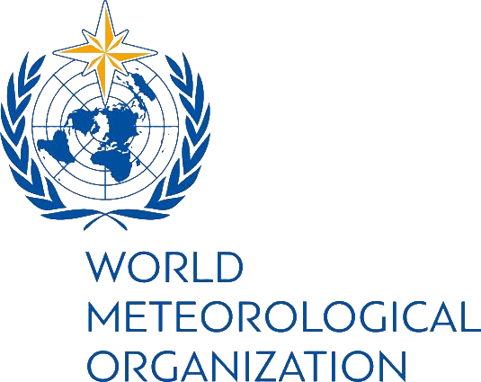

Global Observing System
-----------------------

Currently, well over 10 000 manned and automatic surface weather
stations, 1 000 upper-air stations, 7 000 ships, 100 moored and 1 000
drifting buoys, hundreds of weather radars and 3 000 specially
equipped commercial aircraft measure key parameters of the atmosphere,
land and ocean surface every day.

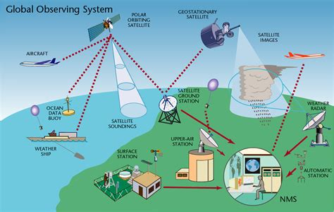

Add to these some 16 meteorological and 50 research satellites to get
an idea of the size of the global network for meteorological,
hydrological and other geophysical observations. Once collected,
observations are quality-controlled, based on technical standards
defined by the WMO Instruments and Methods of Observation Programme
(IMOP), then made freely available to every country in the world
through the WMO Information System (WIS).

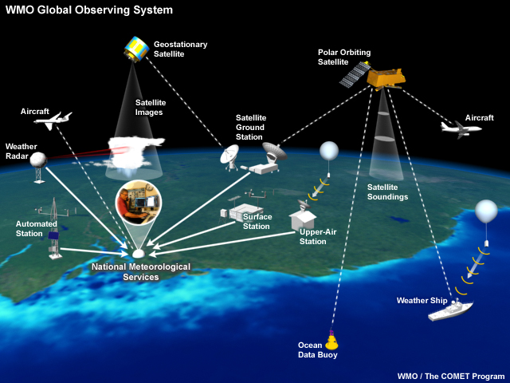

WMO facilitated the establishment, maintenance and continuing
expansion of this global network, the activities of which are
coordinated within the Global Observing System (GOS) of the WMO World
Weather Watch (WWW). The WMO co-sponsored Global Climate Observing
System (GCOS) and Global Ocean Observing System (GOOS) also play a
major role in improving the collection of required data for the
development of climate forecasts and climate change detection.

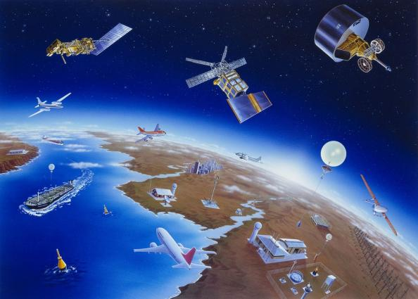

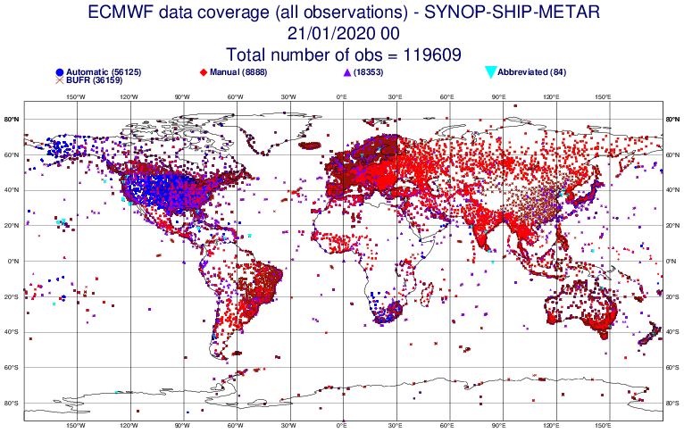
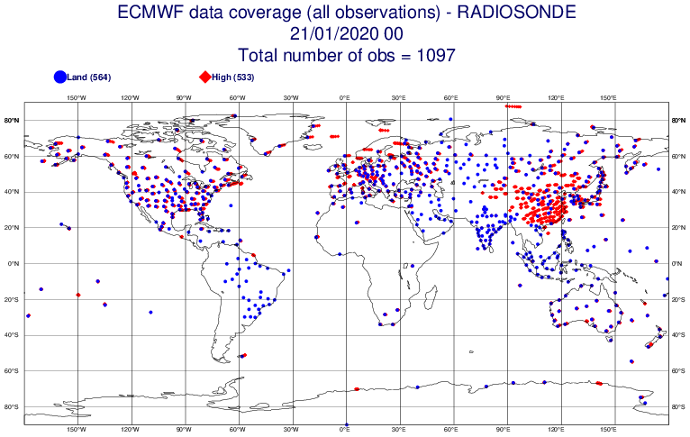
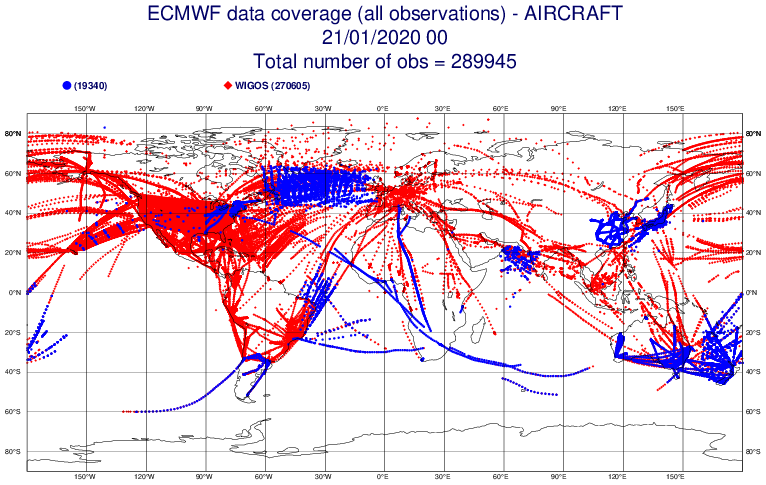
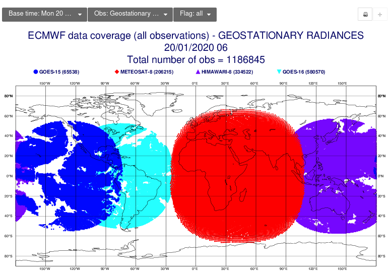
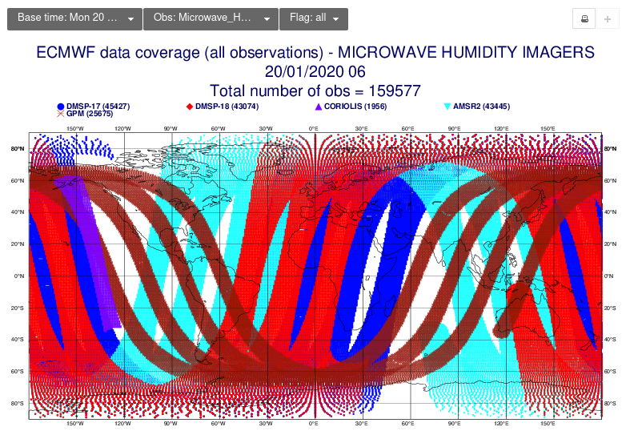

Stazione sinottica
------------------

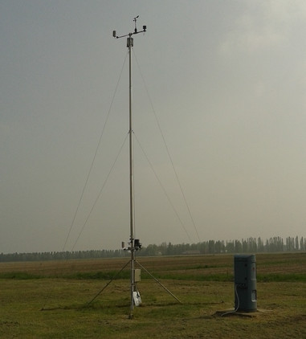

Norme WMO per stazioni meteorologiche
.....................................

In una sua pubblicazione, la n°8, il WMO norma i metodi di misura per
parametri meteorologici

+--------------------------------------------+--------------------------------------+-----------------------------------------------------------------------------+
| Sensor Type                                | Altezza o profondità della misura    | Considerazioni sull'esposizione                                             |    
+--------------------------------------------+--------------------------------------+-----------------------------------------------------------------------------+
| Vento                                      | 10m                                  | Non più di dieci volte l'altezza dell'ostacolo.                             |
+--------------------------------------------+--------------------------------------+-----------------------------------------------------------------------------+
| Temperatura dell'aria e umidità relativa   | 1.25-2.0 m                           | Il sensore deve essere alloggiato in uno schermo antiradiazioni ventilato   |
|                                            |                                      | per proteggerlo dalle radiazioni termiche.                                  |
+--------------------------------------------+--------------------------------------+-----------------------------------------------------------------------------+
| Precipitazioni                             | 30 cm minimo                         | AASC ed EPA suggeriscono che il sensore non sia più vicino di quattro volte |
|                                            |                                      | l'altezza dell'ostacolo. L'orifizio del sensore deve trovarsi su un piano   |
|                                            |                                      | orizzontale, aperto verso il cielo e al di sopra del livello di spruzzi e   |
|                                            |                                      | accumuli di neve.                                                           |
+--------------------------------------------+--------------------------------------+-----------------------------------------------------------------------------+
| Radiazione solare                          | L'altezza deve essere coerente con   | Il cielo non deve essere bloccato da alcun oggetto circostante. Tuttavia,   |
|                                            | lo standard di esposizione           | sono ammessi oggetti <10° sopra il piano orizzontale del sensore.           |
+--------------------------------------------+--------------------------------------+-----------------------------------------------------------------------------+
| Temperatura del suolo                      | 5 cm, 10 cm, 20 cm, 50 cm, 100 cm    | Il sito di misurazione deve essere di 1 m² e tipico della superficie di     |
|                                            |                                      | interesse. La superficie del suolo deve essere livellata rispetto all'area  |
|                                            |                                      | circostante (10 m di raggio).                                               |
+--------------------------------------------+--------------------------------------+-----------------------------------------------------------------------------+

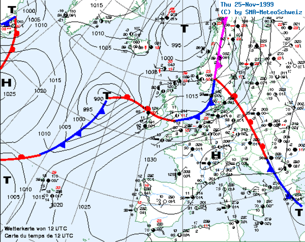

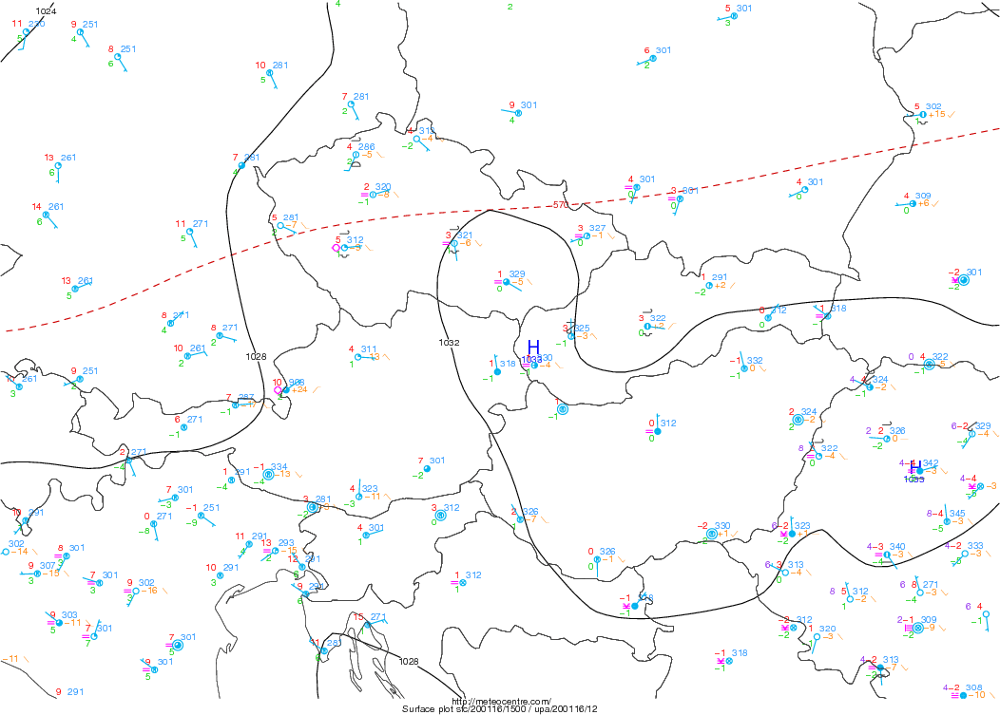

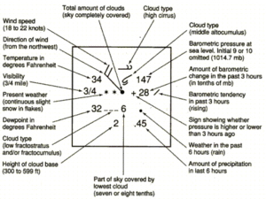

Stazione agrometeorologica
--------------------------

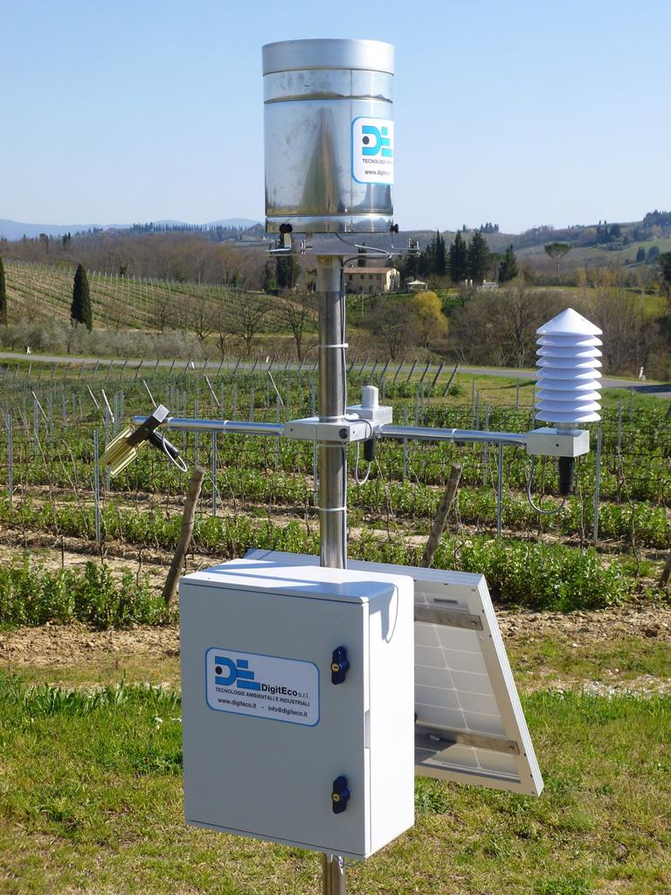

Stazione urbana
---------------

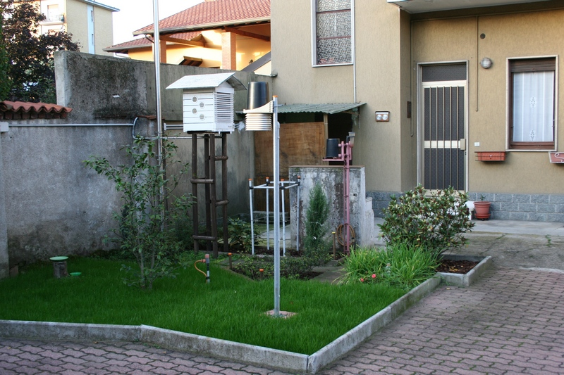

	   
