Isola di calore urbana
======================

Isola di calore urbana: un’area superficiale urbanizzata relativamente
più calda dell’ambiente (rurale o naturale) circostante

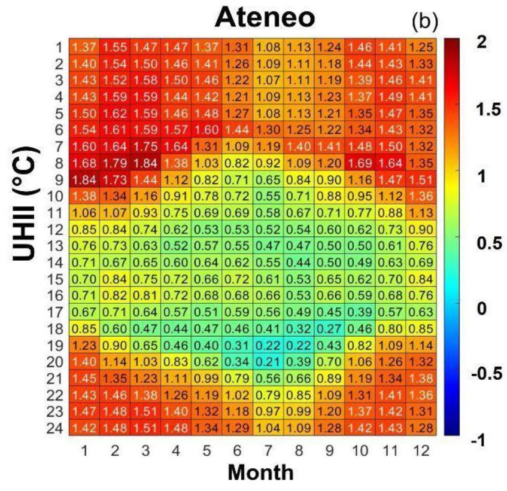

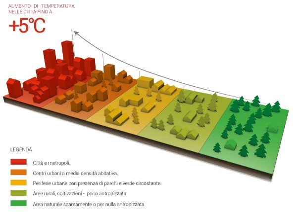

Un semplice indice dell’isola di calore è dato dalla differenza di
temperatura tra ambiente urbano e ambiente naturale circostante
(talvolta definita anche come Intensità: UHII):

Indice o Intensità UHI: IUHI ≡ UHII ≡ ∆ T = Turb – Trur

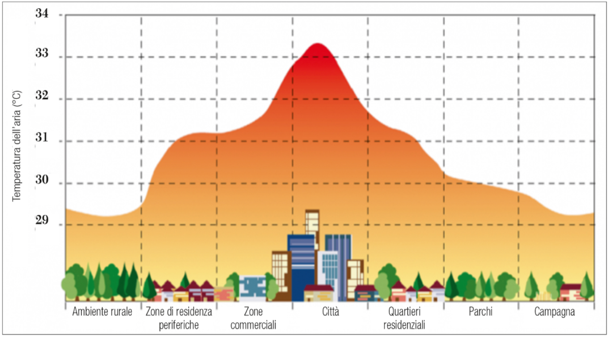

L’indice UHI di una grande città (∼ 10 milioni di abitanti) può essere di 1° ÷
2°C in una media annua, mentre in singole notti calme e serene può
raggiungere quasi 12°C.

	   
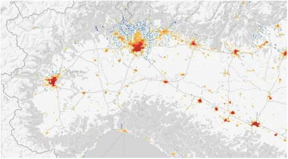

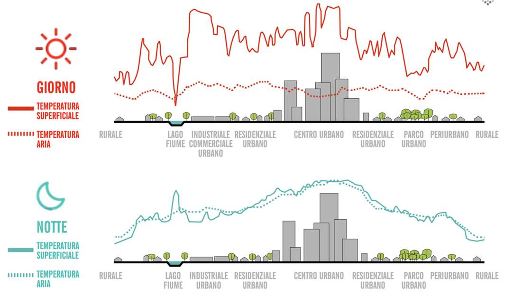

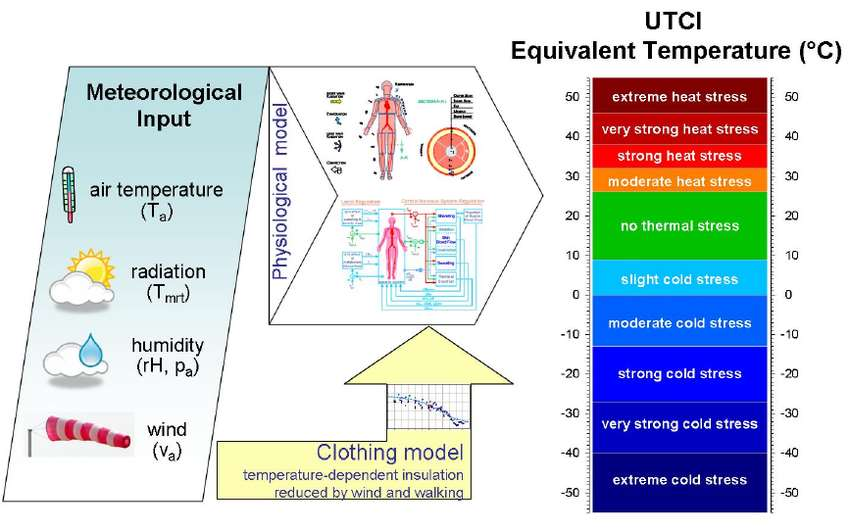

Classificazione delle Aree Urbane
---------------------------------

Il sistema di classificazione delle Local Climate Zone (LCZ) è uno
strumento utile allo studio dell’isola di calore urbana e, più in
generale, agli studi micro-climatici.

Il sistema divide l’ambiente urbano in classi sulla base di proprietà
che influiscono sulla temperatura dell’aria nei più bassi strati
atmosferici: struttura (altezza e spaziatura di edifici ed alberi) e
copertura (permeabile o impermeabile) delle superfici.

Le LCZ sono regioni uniformi in termini di copertura, struttura, e
materiale delle superfici e si estendono da alcune centinaia di metri
fino a diversi chilometri

In funzione di:
	   
Altezza

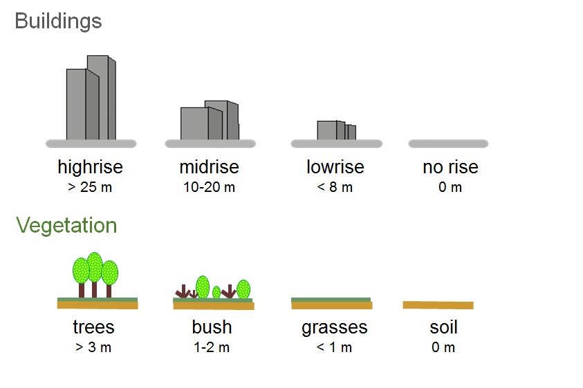

Suolo

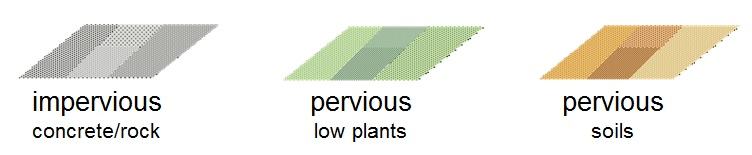

Compattezza

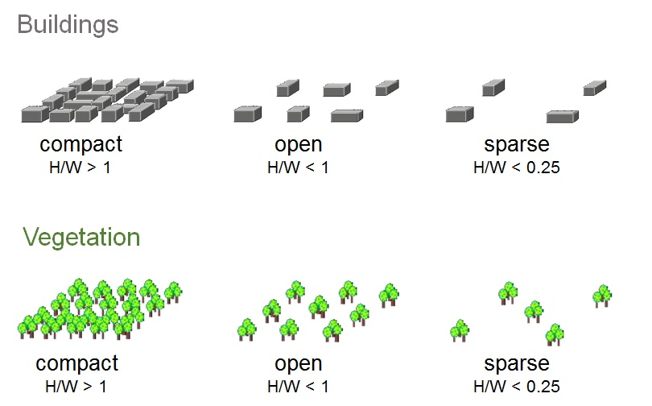

Materiale

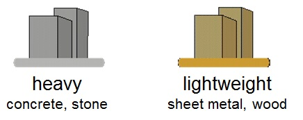

Classificazione

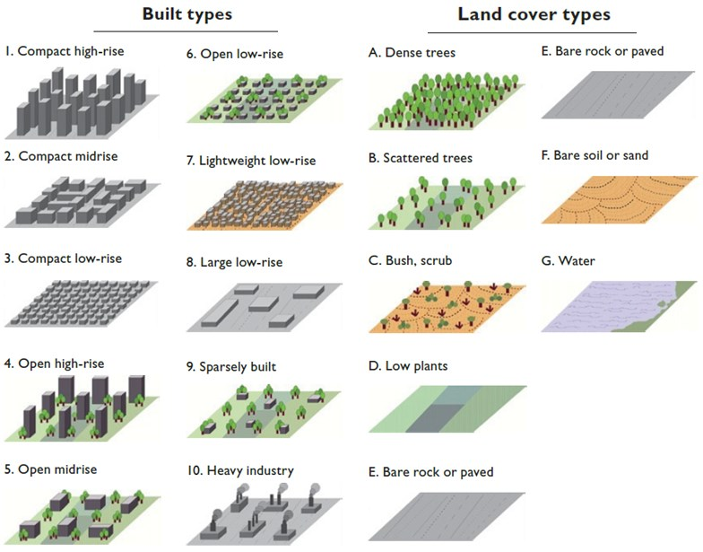

Isola di calore a Trento

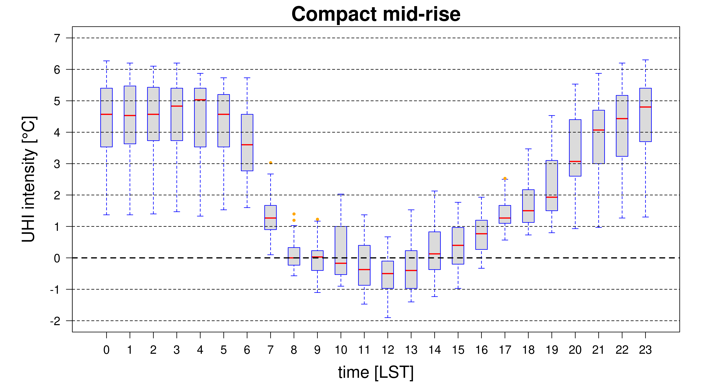

   LCZ 1

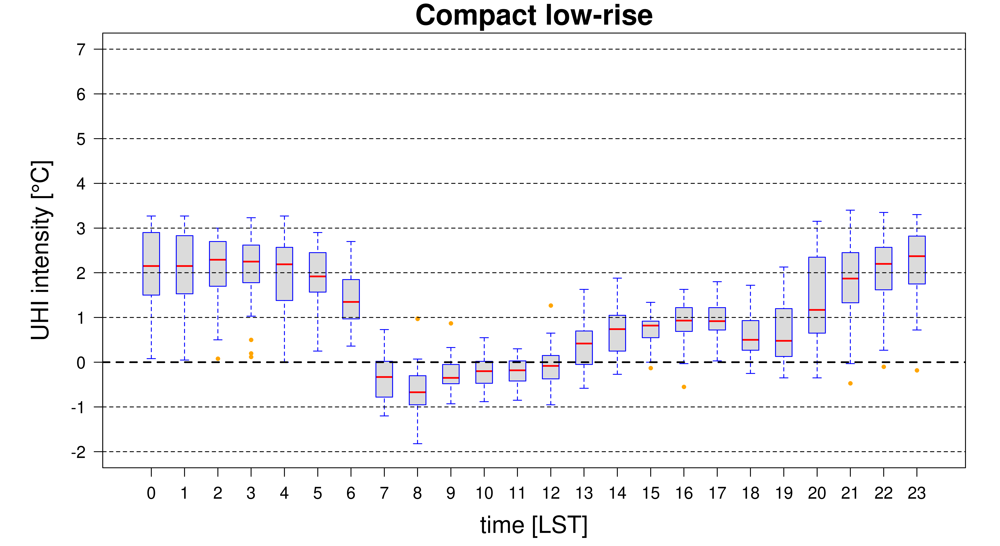

   LCZ 3
	    
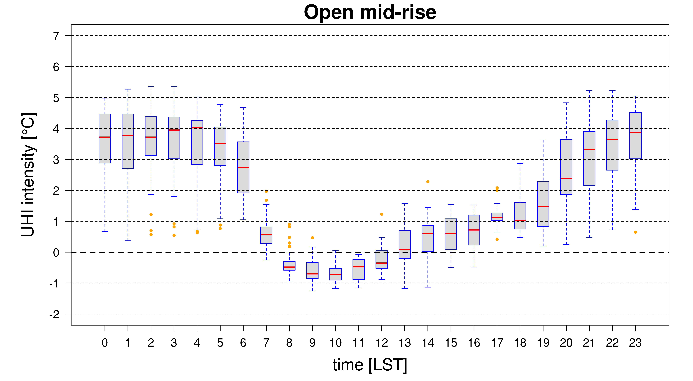

   LCZ 5
   
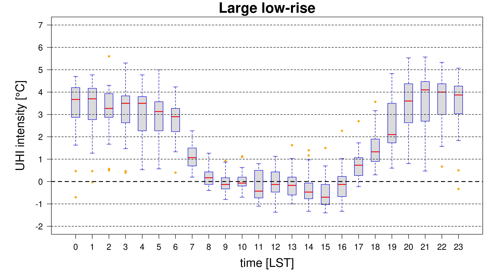

   LCZ 8
	    
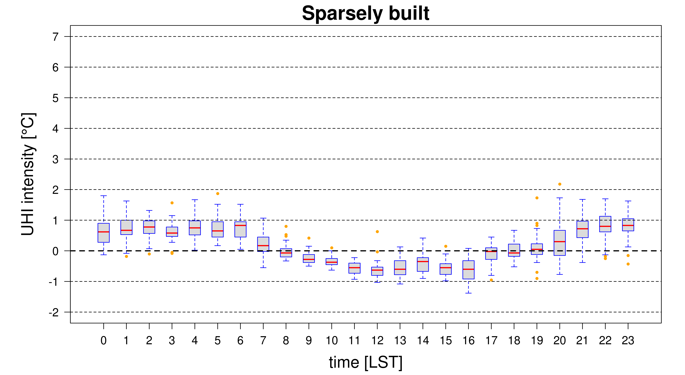

   LCZ 9
