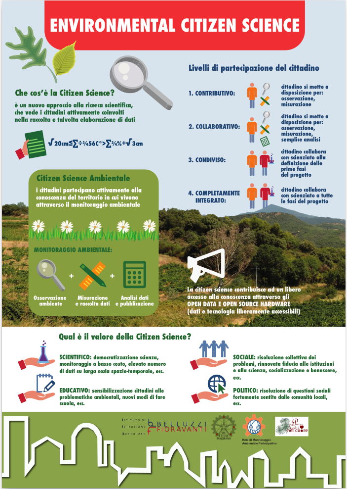

La scienza partecipata
======================

La **scienza partecipata** o **citizen science** o **la scienza di tutti**.

“lo sviluppo di concetti di cittadinanza scientifica ponendo in primo
piano la necessità di aprire al pubblico la scienza e ai processi
delle regole scientifiche”

Alan Irwin[1]

“attività scientifica condotta da membri del pubblico indistinto in
collaborazione con scienziati o sotto la direzione di scienziati
professionisti e istituzioni scientifiche”

Oxford English Dictionary

Ma le definizioni sono molteplici

* Associazione Europea di Citizen Science
  Dieci principi di Citizen Science
  https://ecsa.citizen-science.net/wp-content/uploads/2021/06/ECSA_Ten_principles_of_CS_Italian.pdf
* http://citizenscience.org/
* https://ecsa.citizen-science.net
* https://www.tcss.center/english
* https://scistarter.org

  
Scarica in formato pdf :download:`pdf <Citizen_scienze_4_PP.pdf>`

La rivoluzione scientifica del seicento
---------------------------------------

* Comunicare tutto a tutti.
* Abbattere definitivamente il paradigma della segretezza
* Eliminare tutti gli ostacoli che si oppongono alla libera
  circolazione della conoscenza scientifica.
* Tutti i risultati della ricerca devono essere accessibili a chiunque

Paolo Rossi (storico)

Scienza aperta
--------------

l’accesso libero e gratuito alla conoscenza scientifica è un bene in
sé, perché rendendo del tutto libero il suo scambio, la conoscenza
aumenta.

Cinque diverse scuole di pensiero nel movimento della scienza aperta:

* **“democratica”**, il cui obiettivo è rendere la conoscenza
  scientifica liberamente disponibile per chiunque;
* **“pragmatica”**, che mira a rendere più efficiente la ricerca
  attraverso la collaborazione tra scienziati;
* **“infrastrutturale”**, che si concentra sugli strumenti
  (elettronici) per rendere effettivamente aperta la scienza;
* **“valutativa”**, che cerca di mettere a punto sistemi di
  valutazione alternativi del lavoro scientifico

Scienza aperta “pubblica”
-------------------------

Cerca di abbattere definitivamente le mura della torre d’avorio che
separa la “repubblica della scienza” dal resto della società,
proponendo il coinvolgimento attivo dei cittadini nell’impresa
scientifica. L’obiettivo è la Citizen science da raggiungere
attraverso lo science blogging e, più in generale, il social
networking. In poche parole, impegnando gli scienziati in un dialogo
fitto e diretto con i cittadini mediante gli strumenti del Web 2.0.

La scienza deve uscire dai confini della comunità degli esperti per
rendersi accessibile a un audience più vasta. L’assunzione base è che
le tecnologie del social Web e del Web 2.0 consentono e anzi quasi
impongono agli scienziati:

* di “aprire” i risultati della ricerca ai non-esperti, rendendoli
  comprensibili;
* di “aprire” i processi di ricerca chiamando il grande pubblico a
  parteciparvi.

La citizen science è ancora “top-down”?
---------------------------------------

Fecher e Friesike sostengono che molti progetti di citizen science
seguono una logica top-down: sono i ricercatori professionali a
gestire il gioco e a conservare il ruolo di leader nel processo di
ricerca, utilizzando i cittadini comuni non come partner alla pari, ma
come forza lavoro gratuita.

Qualcuno sostiene persino che molti progetti di citizen science non
sono pensati affatto per coinvolgere cittadini con qualifiche e
capacità tali da poter influenzare la ricerca in maniera
significativa.

Crowdsourcing
-------------

Il crowdsourcing è la pratica di coinvolgere una "folla" (in inglese
"crowd") o un gruppo per un obiettivo comune Questo fenomeno può
fornire alle organizzazioni l'accesso a nuove idee e soluzioni, un
maggiore coinvolgimento dei consumatori, opportunità di co-creazione,
ottimizzazione dei compiti e riduzione dei costi.

Internet e i social media hanno avvicinato le organizzazioni ai loro
stakeholder, ponendo le basi per nuovi modi di collaborare e creare
valore insieme come mai prima d'ora.

Nella scienza e nella sanità, il crowdsourcing può democratizzare la
risoluzione dei problemi e accelerare l'innovazione.

Living Lab
----------

Un living lab è un concetto ed approccio all'attività di ricerca,
incentrato sull'utente e sull'ecosistema di Open innovation, operando
spesso in un contesto territoriale (città, agglomerato urbano,
regione) e integrando processi d'innovazione e di ricerca in una
partnership tra persone, pubblico e privato.

Il modello si basa sul concetto di open innovation in cui l'approccio
alla ricerca prevede il coinvolgimento della comunità di utenti, non
solo come soggetti osservati, ma anche come fonte della creazione, non
più solo al centro dell'innovazione, ma piuttosto veri e propri
"driver" del cambiamento.  L'esplorazione, la sperimentazione e la
valutazione delle idee innovative fanno dei living labs piuttosto un
ambiente esperienziale in cui gli utenti sono immersi , "vivono" per
l'appunto, in uno spazio creativo da cui nasce la progettazione
sociale e prendono vita servizi e prodotti del futuro.

Smart city, smart citizen e citizen science
-------------------------------------------

Smart city: territorio urbano che permette di soddisfare le esigenze
dei cittadini, delle imprese e delle istituzioni, mediante l'ausilio
di strumenti innovativi e partecipazione attiva.

Ad esempio, reti di sensori per il controllo di parametri ambientali.

Per la Comunità Europea, il grado di intelligenza di una città
dovrebbe essere valutato secondo economia, mobilità, ambiente,
persone, tenore di vita e governo.

All'interno di questo ambiente, il cittadino può (deve) avere un ruolo attivo (smart citizen)

Un esempio di partecipazione attiva può essere ritrovata nella citizen
science, una modalità di ricerca scientifica condotta totalmente o in
parte da scienziati non professionisti

Citizen science e aspetti educativi
-----------------------------------

La Citizen science rappresenta un potente strumento per far acquisire
agli studenti quelle particolari competenze per eccellere nel campo
delle scienze, della tecnologia e della matematica in quanto i
partecipanti ai progetti di citizen science acquisiscono competenze
realizzando “vera”scienza anche al di fuori dell’ambito strettamente
scolastico invitando, nel contempo, a sviluppare sempre più numerosi
progetti di Citizen science.

D'altra parte recentemente si è incominciato, nell'ambito della
ricerca educativa, anche a valutare la valenza della citizen science
nell'ambito dell’apprendimento trasformativo (trasformative learning)
in cui gli allievi reinterpretano il senso dell'esperienza per la
costruzione di significato e apprendimento.

  
Citizen science
---------------

**Qual è il valore della Citizen Science?**

SCIENTIFICO: democratizzazione scienza, monitoraggio a basso costo,
elevato numero di dati su larga scala spazio-temporale SOCIALE:
risoluzione collettiva dei problemi, rinnovata fiducia alle istituzioni
e alla scienza, socializzazione e benessere

POLITICO: risoluzione di questioni sociali fortemente sentite dalle
comunità locali

EDUCATIVO: sensibilizzazione cittadini alle problematiche ambientali,
nuovi modi di fare scuola

L'essenza fondamentale del crowdsourcing risiede nell'intelligenza
collettiva, ovvero la convinzione che un gruppo eterogeneo di
individui possa raggiungere risultati che una persona da sola non
potrebbe. Ciò è particolarmente rilevante quando si tratta di
comprendere eventi meteorologici ad alto impatto. Sfruttando il potere
della folla, possiamo ottenere una comprensione più completa e
localizzata degli eventi, il che in definitiva ci aiuta a prepararci e
rispondere meglio

L’altra faccia della medaglia Non è tutto rose e fiori

* qualità delle osservazioni
* rispetto dei protocolli di raccolta dati
* scarsa partecipazione (dopo innamoramento iniziale)
* etica e privacy
* costi di gestione (non solo economici) della rete di partecipanti

Qual è il valore della Citizen Science?

La citizen science contribuisce ad un libero accesso alla conoscenza
attraverso
- OPEN DATA
- OPEN SOURCE SOFTWARE
- OPEN SOURCE HARDWARE

  (dati e tecnologia liberamente accessibili)

**Livelli di coinvolgimento:**

1. CONTRIBUTIVO:cittadino si mette a disposizione per osservazione,
   misurazione
2. COLLABORATIVO: cittadino si mette a disposizione per: osservazione,
   misurazione, semplice analisi
3. CONDIVISO:cittadino collabora con scienziato alla definizione delle
   prime fasi del progetto
4. COMPLETAMENTE INTEGRATO: cittadino collabora con scienziato a tutte
   le fasi del progetto

Rilevamento sociale
-------------------

Il crowdsourcing interseca anche il concetto di rilevamento
sociale. Il rilevamento sociale è definito in senso lato come un
paradigma di raccolta dati in cui i dati vengono raccolti da esseri
umani o dispositivi per loro conto per dare un senso all'ambiente
(Wang et al., 2015). La raccolta dati per il rilevamento sociale
potrebbe avvenire tramite rilevamento partecipativo, rilevamento
opportunistico e indagativo dei dati sociali (Wang et al., 2015):
 
• Il rilevamento partecipativo è quando gli individui sono attivamente
  coinvolti nella raccolta dei dati in cui svolgono attività o
  operazioni;
• Il rilevamento opportunistico è quando gli individui sono coinvolti
  passivamente, ma pre-autorizzano i loro dispositivi a raccogliere e
  condividere le loro informazioni per loro conto;
• L'indagine dei dati sociali è quando gli individui non sono
  consapevoli di partecipare al processo di raccolta dati; un esempio
  è quando i dati disponibili al pubblico dai social media vengono
  ricercati e utilizzati per dare un senso.

Caffè-scienza
-------------

**Scopo** dei caffè-scienza è quello di demitizzare la comunicazione
scientifica, togliendola dal piedistallo cattedratico. Molto spesso,
infatti, si pensa alla comunicazione scientifica come a un flusso di
informazioni a senso unico, dagli esperti verso i comuni cittadini,
che devono semplicemente assorbire qualche concetto. È vero che molte
delle nozioni tecniche necessarie per prendere una decisione ponderata
non sono patrimonio di tutti, e che spesso per comprenderle bisogna
possedere competenze specifiche, ma è anche vero che il metodo
scientifico prevede la discussione da pari a pari, senza preclusioni o
diritti ex cathedra.  Il movimento dei caffè scientifici è nato negli
anni 2000 in Francia e in Gran Bretagna e da allora si è diffuso in
tutti i continenti.

**Il metodo** dei caffè-scienza è molto semplice: ci ritroviamo in un
posto piacevole e rilassante, in compagnia di qualche esperto
dell’argomento in questione e allietati da un caffè, un bicchiere di
birra o un succo di frutta, chiacchieriamo dell’argomento in
programma.

**Un caffè-scienza non è una conferenza**: gli esperti introducono e
dicono la loro, ma questa parte è limitata al minimo. Il motore
dell’incontro sono sempre le domande, gli interventi e le discussioni
del pubblico, il tutto animato—o smorzato—da un moderatore.

Smart city, smart citizen e citizen science
-------------------------------------------

Smart city: territorio urbano che permette di soddisfare le esigenze
dei cittadini, delle imprese e delle istituzioni, mediante l'ausilio
di strumenti innovativi e partecipazione attiva

Ad esempio, reti di sensori per il controllo di parametri ambientali.
Per la Comunità Europea, il grado di intelligenza di una città
dovrebbe essere valutato secondo economia, mobilità, ambiente,
persone, tenore di vita e governo.

All'interno di questo ambiente, il cittadino può (deve) avere un ruolo
attivo (smart citizen)

Un esempio di partecipazione attiva può essere ritrovata nella citizen
science, una modalità di ricerca scientifica condotta totalmente o in
parte da scienziati non professionisti

Linee guida STEM del Ministero dell'Istruzione e del Merito
-----------------------------------------------------------

https://www.mim.gov.it/web/guest/-/nota-prot-4588-del-24-ottobre-2023

Non forniscono nuovi contenuti, ma suggerimenti metodologici. Perché
il corretto approccio all'insegnamento delle STEM non può prescindere
da una prospettiva interdisciplinare e dall'intreccio tra teoria e
pratica.

Bisogna insomma appassionare i bambini, fin da piccoli, alla
matematica e alle scienze, attraverso giochi, esperimenti, dibattiti,
sfide, e un uso consapevole delle tecnologie. Ecco allora i
suggerimenti metodologici del Ministero in pillole.

10 punti principali:

Insegnare attraverso l’esperienza
^^^^^^^^^^^^^^^^^^^^^^^^^^^^^^^^^

L’apprendimento per esperienza è uno dei metodi didattici più
efficaci, soprattutto nel primo ciclo di istruzione. Gli ambienti di
vita naturali e artificiali sono permeati di concetti matematici,
scientifici, tecnologici che possono essere esplorati attraverso
esperienze dirette e concrete, che consentano l’esame dei diversi
aspetti della realtà o dei problemi, l’emergere di domande e ipotesi,
la ricerca attiva di una pluralità di risposte e soluzioni possibili,
il confronto, la verifica, l’emergere di nuovi interrogativi o nuovi
sviluppi.

Utilizzare la tecnologia in modo critico e creativo
^^^^^^^^^^^^^^^^^^^^^^^^^^^^^^^^^^^^^^^^^^^^^^^^^^^

La tecnologia è uno strumento potente per supportare l’apprendimento,
grazie alla sua attrattività, all’innovazione continua, alle
innumerevoli applicazioni a tanti settori di ricerca e di vita
quotidiana, ma va utilizzata in modo critico e creativo, tenendo conto
sia delle potenzialità, sia dei rischi legati a un utilizzo non
corretto. Le attività che coinvolgono la tecnologia, se ben progettate
e finalizzate a sviluppare specifiche competenze, rendono l’alunno
attivo, ideatore di contenuti e soluzioni originali; pertanto, va
evitato un uso passivo e ripetitivo degli strumenti tecnologici.

Favorire la didattica inclusiva
^^^^^^^^^^^^^^^^^^^^^^^^^^^^^^^

Nella progettazione delle attività connesse alle discipline STEM
occorre prendere in considerazione le diverse potenzialità, capacità,
talenti e le diverse modalità di apprendimento degli alunni. È
importante valorizzare le differenze e promuovere un clima di
accoglienza e rispetto reciproco. La ricerca, infatti, procede per
prove ed errori e l’apporto di ciascuno diventa il punto di partenza
per successive elaborazioni. L’errore diventa, quindi, una risorsa
preziosa e la discussione, con il confronto tra una pluralità di punti
di vista, favorisce l’emergere di soluzioni innovative.

Promuovere la creatività e la curiosità
^^^^^^^^^^^^^^^^^^^^^^^^^^^^^^^^^^^^^^^

Nella scuola del primo ciclo gli alunni esprimono creatività e
curiosità: nelle discipline STEM, così come in quelle umanistiche, il
pensiero divergente rappresenta un valore, in quanto apre a soluzioni
inedite. Viceversa, la proposta di situazioni stereotipate, che
richiedano soluzioni univoche o la semplice applicazione di formule o
meccanismi automatici, non favorisce l’attivazione degli alunni,
l’emergere di nuove curiosità e del desiderio di ricerca. Promuovere
attività che incoraggino fantasia e creatività consente di trasformare
la didattica frontale in didattica attiva.

Sviluppare l’autonomia degli alunni
^^^^^^^^^^^^^^^^^^^^^^^^^^^^^^^^^^^

Gli alunni imparano fin dalla scuola primaria essere autonomi, a
gestire il proprio tempo e a organizzare il proprio lavoro. Promuovere
attività che permettano agli alunni di ricercare in autonomia le
soluzioni ai problemi proposti, avendo a disposizione una pluralità di
strumenti e materiali, anche tecnologici e digitali, consente di
sviluppare le loro abilità organizzative.

Utilizzare attività laboratoriali
^^^^^^^^^^^^^^^^^^^^^^^^^^^^^^^^^

L’acquisizione di competenze tecniche specifiche attraverso l’utilizzo
di strumenti e attrezzature, considerata la dimensione costitutiva
delle discipline STEM, si realizza individuando attività sperimentali
particolarmente significative che possono essere svolte in
laboratorio, in classe o “sul campo”. Tali attività sono da
privilegiare rispetto ad altre puramente teoriche o mnemoniche.

Utilizzare metodologie attive e collaborative
^^^^^^^^^^^^^^^^^^^^^^^^^^^^^^^^^^^^^^^^^^^^^

Con il lavoro di gruppo, il problem solving, la ricerca guidata, il
dibattito, la cooperazione con gli altri studenti, si favorisce
l’acquisizione del metodo sperimentale, dove l’esperimento è inteso
come interrogazione ragionata dei fenomeni naturali, analisi critica
dei dati e dell’affidabilità di un processo di misura, costruzione e/o
validazione di modelli.

Problem solving e metodo induttivo
^^^^^^^^^^^^^^^^^^^^^^^^^^^^^^^^^^

Lo sviluppo delle competenze di problem solving è essenziale per le
discipline STEM se promosso attraverso attività che mettano gli
studenti di fronte a problemi reali e li sfidino a trovare soluzioni
innovative. Inoltre, stabilire collegamenti con il mondo reale può
rendere l’apprendimento più significativo e coinvolgente. E proprio la
matematica, come disciplina che consente di comprendere e costruire la
realtà, sostiene lo sviluppo del pensiero logico fornendo gli
strumenti necessari per la descrizione e la comprensione del mondo e
per la risoluzione dei problemi.

Favorire la costruzione di conoscenze attraverso l’utilizzo di strumenti tecnologici e informatici
^^^^^^^^^^^^^^^^^^^^^^^^^^^^^^^^^^^^^^^^^^^^^^^^^^^^^^^^^^^^^^^^^^^^^^^^^^^^^^^^^^^^^^^^^^^^^^^^^^

Un uso appropriato, critico e ragionato degli strumenti tecnologici ed
informatici favorisce l’apprendimento significativo laddove tali
strumenti sostengono processi cognitivi quali investigare, esplorare,
progettare,costruire modelli e richiedono agli studenti di riflettere
e rielaborare le informazioni per costruire, in gruppo,nuove
conoscenze, abilità e competenze. Si può, così, intercettare
l’evoluzione del fabbisogno di competenze che emerge dalle richieste
del mondo del lavoro offrendo possibili risposte alle nuove necessità
occupazionali.

Realizzare attività di PCTO nell’ambito STEM per le scuole secondarie superiori
^^^^^^^^^^^^^^^^^^^^^^^^^^^^^^^^^^^^^^^^^^^^^^^^^^^^^^^^^^^^^^^^^^^^^^^^^^^^^^^

La realizzazione di percorsi per le competenze trasversali e
l’orientamento in contesti scientifici e tecnologici rende
significativo il raccordo tra competenze trasversali e competenze
tecnico-professionali. Si possono offrire agli studenti reali
possibilità di sperimentare interessi, valorizzare stili di
apprendimento e facilitare la partecipazione autonoma e responsabile
ad attività formative nell’incontro con realtà innovative del mondo
professionale.

Come integrare l'ESD (Educazione allo Sviluppo Sostenibile) nell'istruzione STEM?
---------------------------------------------------------------------------------

Estratto e tradotto da:

http://ejournal.uin-suska.ac.id/index.php/JNSI
Zuana Habibaturrohmah1, Ida Kaniawati1, Rini Solihat, Wahyu Fadzilla Nirbayati

Journal of Natural Science and Integration is licensed under a Creative Commons Attribution 4.0 International License.

L'istruzione svolge un ruolo cruciale nel raggiungimento degli
Obiettivi di sviluppo sostenibile (SDG). Ogni SDG si basa
sull'istruzione per dotare gli individui delle conoscenze, delle
competenze, delle abilità e dei valori necessari per lo sviluppo
personale e il contributo sociale. Da qui nasce il concetto di
educazione allo sviluppo sostenibile (ESD). All'interno di questo
quadro , l'educazione STEM (scienza, tecnologia, ingegneria e
matematica) è fondamentale per preparare le giovani generazioni ad
affrontare le sfide della società. L'integrazione dei principi ESD
nell'educazione STEM è quindi un approccio efficace per promuovere un
futuro sostenibile.

Indubbiamente, l'integrazione dell'ESD nei programmi scolastici è di
estrema importanza. L'educazione alle materie STEM emerge come uno
strumento vitale per preparare le giovani generazioni ad affrontare le
molteplici sfide della società. Pertanto, combinare i concetti di ESD
nell'educazione STEM diventa un modo efficace per promuovere un futuro
sostenibile. In questo studio spieghiamo in dettaglio come integrare
l'ESD nell'educazione STEM. Per raggiungere gli obiettivi
dell'educazione alla sostenibilità, è obbligatorio implementare una
pedagogia appropriata nel processo di
insegnamento-apprendimento.

Le strategie per integrare l'ESD nell'educazione STEM sono:

Incorporare i concetti degli SDGs nelle lezioni STEM
^^^^^^^^^^^^^^^^^^^^^^^^^^^^^^^^^^^^^^^^^^^^^^^^^^^^

Per integrare l'educazione allo sviluppo sostenibile (ESD)
nell'educazione STEM, gli insegnanti possono incorporare i concetti di
sostenibilità e gli Obiettivi di Sviluppo Sostenibile (SDGs) nelle
lezioni STEM.

Gli SDGs dell'UNESCO consistono in diciassette obiettivi, che sono:
1) nessuna povertà,
2) zero fame,
3) buona salute e benessere,
4) istruzione di qualità,
5) uguaglianza di genere,
6) acqua pulita e servizi igienici,
7) energia pulita e accessibile,
8) lavoro dignitoso e crescita economica,
9) industria, innovazione e infrastrutture,
10) riduzione delle disuguaglianze,
11) città e comunità sostenibili,
12) consumo e produzione responsabili,
13) azione per il clima,
14) vita sotto l'acqua,
15) vita sulla terra,
16) pace, giustizia e istituzioni forti,
17) partnership per gli obiettivi.

Tra questi diciassette obiettivi, gli insegnanti devono scegliere gli
argomenti compatibili con gli obiettivi dello sviluppo sostenibile
(Campbell & Speldewinde, 2022).

La ricerca condotta da AlAli et al. (2023) ha indicato che l'impiego
dell'approccio STEM nell'insegnamento è promettente per affrontare
tutti gli obiettivi di sviluppo sostenibile nell'educazione. I
risultati dello studio suggeriscono che questo metodo è in grado di
affrontare tutti e diciassette gli obiettivi, sottolineando i benefici
e i vantaggi dell'insegnamento basato sulle STEM, così come delineato
nella letteratura educativa.

Questi benefici comprendono la promozione del pensiero creativo e
sistemico, il miglioramento della comprensione e la sua rilevanza
economica nell'affrontare le sfide presenti e future, contribuendo
così al miglioramento e allo sviluppo ambientale, in linea con gli
obiettivi di apprendimento sostenibile.

Integrando i campi STEM con la tecnologia e la matematica, tutte le
discipline scientifiche possono affrontare e discutere lo sviluppo
sostenibile all'interno dei loro ambiti, migliorando così la
comprensione degli studenti del loro ruolo nel raggiungimento degli
SDGs (Martín-Sánchez et al., 2022). Pertanto, gli insegnanti devono
promuovere la cooperazione interdisciplinare tra le materie STEM e i
principi della sostenibilità. Per esempio, possono incorporare le
scienze ambientali nelle lezioni di biologia, le energie rinnovabili
in fisica, o il design sostenibile nei progetti di ingegneria (Wahono
& Chang, 2019), esplorando i sistemi agro-ecologici e integrando
l'educazione alla biologia con altre discipline scientifiche come la
chimica e la fisica possono contribuire al raggiungimento degli SDGs
1, 2, 14 e 15. Allo stesso modo, l'educazione chimica può contribuire
al raggiungimento degli SDGs 3, 6, 12, 14 e 15 migliorando la
comprensione da parte degli studenti delle proprietà fisiche chimiche
e delle loro implicazioni per l'ambiente e la salute umana.  Inoltre,
l'utilizzo della guida all'educazione allo sviluppo sostenibile
pubblicata dall'UNESCO può aiutare gli educatori a integrare nel loro
curriculum gli obiettivi di apprendimento specifici di e le competenze
essenziali per la sostenibilità.

È anche fondamentale che gli insegnanti adottino prospettive
sostenibili e coinvolgano gli studenti in progetti sostenibili per
promuovere la consapevolezza e instillare un senso di coscienza della
sostenibilità (Del Cerro Velázquez & Rivas, 2020). L'inserimento dei
concetti degli Obiettivi di Sviluppo Sostenibile (SDGs)
nell'educazione STEM può facilitare lo sviluppo di un curriculum STEM
interdisciplinare incentrato sullo sviluppo sostenibile
(Gavari-Starkie et al., 2022). Questo approccio può approfondire la
comprensione del significato della sostenibilità da parte degli
studenti e ispirarli a impegnarsi in azioni per costruire un futuro
più sostenibile (Rico et al., 2021; Ulmeanu et al., 2021), e aiutare
gli studenti a riconoscere la rilevanza della scienza nella loro vita
quotidiana e a vedersi come catalizzatori del cambiamento nel
raggiungimento degli SDGs (Burbules et al, 2020).

Promuovere attività e progetti pratici
^^^^^^^^^^^^^^^^^^^^^^^^^^^^^^^^^^^^^^

È essenziale promuovere attività e progetti pratici che si concentrino
su soluzioni sostenibili nell'implementazione dell'apprendimento
STEM-ESD. Incorporare gli SDGs nell'educazione STEM non solo permette
agli studenti di esplorare soluzioni sostenibili utilizzando le loro
competenze STEM (AlAli et al., 2023) ma li mette anche in grado di
partecipare a compiti autentici, condurre ricerche e ideare soluzioni
a problemi del mondo reale (Nguyen et al., 2020; Suh & Han,
2019). Queste strategie aiutano gli studenti a coltivare la loro
creatività e a promuovere una mentalità innovativa, che è cruciale per
affrontare le sfide attuali e future dello sviluppo (Nguyen et
al., 2020) Incoraggiare le attività pratiche, in particolare quelle
incentrate sulla progettazione di prodotti o oggetti da parte degli
studenti, è un approccio prezioso per promuovere le loro capacità di
comprensione scientifica e di risoluzione dei problemi (Fortus et al.,
2004). Questo metodo è riconosciuto come una promettente tecnica
didattica per arricchire l'impegno e la comprensione delle scienze da
parte degli studenti.(Apedoe et al.,2008)

Inoltre, promuove un insegnamento interattivo e incentrato sul
discente che facilita esperienze di apprendimento esplorative,
orientate all'azione, riflessive e trasformative (Campbell &
Speldewinde, 2022).  Sulla base di ricerche precedenti, gli insegnanti
spesso progettano progetti in linea con gli Obiettivi di Sviluppo
Sostenibile (SDGs), affrontando questioni sia locali che globali, come
il consumo e la produzione sostenibili , la qualità e la disponibilità
dell'acqua, la sostenibilità energetica, l'agricoltura e la produzione
alimentare sostenibili (Nguyen et al., 2020). Ad esempio, alcuni
progetti mirano a insegnare agli studenti di come creare semplici
oggetti o prodotti sostenibili di uso quotidiano utilizzando materiali
riciclati e come gestire efficacemente i rifiuti. Altri esempi
includono progetti incentrati sulla sicurezza alimentare, sul
trattamento e la conservazione dell'acqua e sulle energie
rinnovabili. Questi progetti incorporano anche lezioni sulla
protezione ed educazione alla salute, sulla previsione delle
inondazioni, sulla mitigazione della siccità e sulla protezione
agroambientale . Nel complesso, la maggior parte dei progetti è
strutturata intorno a problemi del mondo reale e a fenomeni , che
fungono da base per gli obiettivi educativi, mentre solo pochi
progetti sono incentrati esclusivamente sulla sperimentazione e
sull'indagine scientifica (Nguyen et al., 2020).  Coinvolgere gli
studenti in progetti e attività pratiche favorisce un senso di
partecipazione a loro apprendimento.  Quando gli insegnanti offrono ai
bambini l'opportunità di impegnarsi attivamente, permettendo loro di
controllare gli input e i risultati del loro apprendimento, gli
studenti possono approfondire la comprensione dei concetti chiave
della sostenibilità attingendo alle loro competenze STEM e al processo
scientifico. Questo coinvolgimento attivo consente agli studenti di
intraprendere azioni ragionate all'interno del loro ambiente di
apprendimento (Pahnke et al., 2019). Valorizzando il contributo di
ogni studente e cercando il suo apporto, gli insegnanti coltivano un
ambiente di rispetto reciproco. Gli studenti riconoscono l'importanza
dei loro contributi al gruppo e il modo in cui il loro coinvolgimento
può avere un impatto sui risultati (Campbell & Speldewinde, 2022).
Per sostenere le attività consistenti nell'apprendimento STEM-ESD
basato sulle mani e sui progetti, può essere applicato con
l'apprendimento basato sui problemi (Gamage et al., 2022; Nguyen,
2023; Ulmeanu et al.,2021) e l'apprendimento basato sui progetti
(Abdurrahman et al., 2023; AlAli et al., 2023; Fakhrudin et al., 2021;
Gamage et al., 2022; Nguyen et al., 2020; Suh & Han, 2019; Wahono &
Chang, 2019) che vengono utilizzati per indagare scientificamente
fenomeni o problemi naturali e introdurre nuovi concetti agli studenti
durante il processo di insegnamento-apprendimento. Questi metodi si
rivolgono specificamente alla curiosità e all'inclinazione
all'esplorazione degli studenti, incoraggiandoli a indagare, a porre
domande e a cercare risposte a problemi attuali con comprensione.

Sulla base delle teorie dell'apprendimento costruttivista,
l'apprendimento basato su problemi e l'apprendimento basato su
progetti sono stati ampiamente utilizzati nelle STEM-ESD, offrendo
opportunità di esplorazione pratica, sperimentazione, domande e
risposte ragionate. In aggiunta alla risoluzione di problemi, gli
studenti acquisiscono una comprensione più profonda dei fenomeni
naturali ("menti accese") attraverso indagini approfondite, ad esempio
impegnandosi in progetti e attività pratiche simili a come lavorano
gli scienziati (Gamage et al., 2022), in modo da poter affrontare le
sfide della sostenibilità del mondo reale, spingendoli ad applicare le
loro conoscenze STEM per ideare soluzioni sostenibili in contesti
pratici (Fakhrudin et al., 2021).

Affrontare problemi del mondo reale per applicare le STEM nell'affrontare le sfide della sostenibilità
^^^^^^^^^^^^^^^^^^^^^^^^^^^^^^^^^^^^^^^^^^^^^^^^^^^^^^^^^^^^^^^^^^^^^^^^^^^^^^^^^^^^^^^^^^^^^^^^^^^^^^

Una delle caratteristiche dell'istruzione STEM è che la maggior parte
dei corsi è incentrata su problemi del mondo reale, allineandosi bene
con l'obiettivo dell'ESD di mettere le generazioni attuali e future in
grado di affrontare i loro bisogni utilizzando un approccio
equilibrato alle sfide economiche, sociali e ambientali (Suh & Han,
2019). L'istruzione STEM può essere strutturata in modo da enfatizzare
problemi reali legati allo sviluppo sostenibile (Nguyen et al.,
2020). Queste esplorazioni del mondo reale comportano indagini
autentiche con obiettivi complessi, offrendo opportunità per la
risoluzione di problemi e incorporando le convinzioni e i valori degli
studenti (Redman, 2013). Secondo Brundiers et al. (2010),
l'apprendimento dal mondo reale aiuta gli studenti ad approfondire la
comprensione dei problemi di sostenibilità (conoscenza) e a migliorare
la loro capacità di applicare i metodi di risoluzione dei problemi
(competenza strategica). Inoltre, fornisce esperienza pratica nel
collegare la conoscenza con l'azione per la sostenibilità (competenza
pratica). Gli studenti imparano a creare strategie di sostenibilità e
programmi nel contesto di processi, politiche o tradizioni
esistenti. Inoltre, le opportunità di apprendimento reali consentono
agli studenti di riconoscere e partecipare a varie forme di
collaborazione con diversi livelli di intensità (competenza
collaborativa).  Assegnando compiti incentrati su sfide reali di
sostenibilità, gli insegnanti possono coinvolgere gli studenti e
guidare le istituzioni verso comportamenti e politiche più
sostenibili. Questo approccio consente agli studenti di applicare le
conoscenze teoriche nella pratica e di sviluppare competenze
interpersonali essenziali per coinvolgere gli stakeholder, entrambi
cruciali per la sostenibilità (Redman, 2013).

Quattro metodi per fornire agli studenti esperienze di apprendimento
nel mondo reale sono:
(1) integrare nelle aule scolastiche scenari reali ,
(2) portare gli studenti in gita per osservare ambienti reali,
(3) utilizzare simulazioni per replicare condizioni reali e
(4) coinvolgere gli studenti in un impegno diretto con attività reali (Brundiers et al., 2010).

Questi approcci possono aiutare gli studenti a cogliere l'importanza
dello sviluppo sostenibile, applicando al contempo i concetti STEM
(AlAli et al., 2023). Per esempio, gli insegnanti possono incorporare
nelle lezioni di STEM questioni di sostenibilità globale, come il
cambiamento climatico, la perdita di biodiversità e la gestione delle
risorse. Gli studenti possono quindi progettare e costruire edifici
ecologici, creare sistemi di filtraggio dell'acqua o sviluppare
soluzioni di energia rinnovabile come parte delle loro attività di
apprendimento (Wahono & Chang, 2019). Questo permette agli studenti di
vedere le applicazioni pratiche dei concetti STEM nell'affrontare le
sfide ambientali, sociali ed economiche a livello globale (Rustaman,
2021; Suh & Han, 2019; Wahono & Chang, 2019).  Ricerche precedenti
dimostrano che gli approcci didattici basati su contesti reali aiutano
gli studenti a riconoscere la rilevanza della scienza nella loro vita
quotidiana, aumentando il loro interesse e il piacere di affrontare
situazioni di vita reale (Bennett & Holman, 2003; George & Lubben,
2002; Pedretti & Hodson, 1995).

L'insegnamento e l'apprendimento basati sul contesto del mondo reale
suggeriscono che situazioni quotidiane familiari agli studenti possono
essere studiate e che l'apprendimento STEM-ESD relativo a questi
problemi può essere esplorato per spiegare queste situazioni (Lubben
et al., 1996). Inoltre, questo approccio può incoraggiare gli studenti
a lavorare in gruppo su progetti che affrontano le sfide reali della
sostenibilità , promuovendo la collaborazione, il pensiero critico e
le abilità di problem solving, che sono essenziali per le competenze
di sostenibilità (AlAli et al., 2023).  Una ricerca di
Remington-Doucette (2013) ha dimostrato l'impatto dell'incorporazione
di problemi del mondo reale nell'istruzione, valutando un corso
incentrato sulla sostenibilità attraverso casi di studio . Questi casi
di studio hanno richiesto agli studenti di affrontare problemi
complessi del mondo reale, portando a un aumento significativo delle
loro competenze in materia di sostenibilità. I risultati hanno
indicato che l'educazione allo sviluppo sostenibile (ESD) è efficace
quando gli istruttori integrano contesti del mondo reale rilevanti per
la vita quotidiana degli studenti. Inoltre, le ricerche di George e
Lubben (2002), Gutwill-Wise (2001), e King e Henderson (2018) hanno
dimostrato che l'interesse degli studenti per le scienze cresce quando
l'insegnamento si basa su situazioni reali.

Quando gli studenti possono collegare il contesto di vita reale con i
concetti che stanno apprendendo, diventano più impegnati e
interessati, vedendo la rilevanza della loro istruzione nella vita di
tutti i giorni. Questo tipo di apprendimento e di ragionamento può
anche influenzare positivamente il comportamento degli studenti nei
confronti dell'ambiente.

Promuovere partenariati con le comunità locali, le organizzazioni e gli operatori del settore
^^^^^^^^^^^^^^^^^^^^^^^^^^^^^^^^^^^^^^^^^^^^^^^^^^^^^^^^^^^^^^^^^^^^^^^^^^^^^^^^^^^^^^^^^^^^^

Alla luce di quanto detto, è fondamentale incorporare le esperienze
del mondo reale nel processo di apprendimento STEM-ESD. A tal fine,
gli studenti dovrebbero impegnarsi in attività che favoriscano i
legami con la loro comunità (Castro et al., 2020). La collaborazione
con comunità locali, organizzazioni o esperti di sostenibilità può
offrire agli studenti esperienze reali e opportunità di tutoraggio
(Wahono & Chang, 2019). Le esperienze nelle comunità e nelle
organizzazioni che si occupano di sostenibilità permettono agli
studenti di esporsi alle esperienze del mondo reale e di avere un
focus comune sui problemi contestuali (Gamage et al., 2022). Questo
approccio è efficace per l'educazione alla sostenibilità, in quanto
aiuta gli studenti a sviluppare le competenze chiave della
sostenibilità (Brundiers et al., 2010).

Diversi studi sottolineano l'importanza di condividere le conoscenze
con gli stakeholder esterni (Lai et al., 2015) per fornire soluzioni
innovative per profondi cambiamenti nei sistemi ambientali, sociali o
economici (Van Tulder et al., 2016). Allineando background, valori,
idee e risorse diverse, le partnership possono affrontare
efficacemente questioni sociali complesse, come gli Obiettivi globali
delle Nazioni Unite ( ) (Van Tulder & Keen, 2018). Un risultato chiave
della collaborazione e del partenariato è la capacità di trasferire le
conoscenze e facilitare l'apprendimento tra le diverse parti
interessate (Décamps et al., 2021).  La creazione di partenariati con
più parti interessate è stata ampiamente riconosciuta come un fattore
critico per promuovere la conoscenza e l'innovazione (Moon et al.,
2019).

L'integrazione dei partenariati nelle classi STEM-ESD può assumere
varie forme, come conferenze con ospiti , workshop, gite sul campo o
stage legati alle pratiche sostenibili. L'organizzazione di gite sul
campo presso strutture sostenibili o l'invito di relatori ospiti
provenienti da industrie sostenibili offre spunti pratici
sull'applicazione dei principi STEM nello sviluppo sostenibile (AlAli
et al., 2023).  Queste esperienze consentono agli studenti di
impegnarsi in azioni reali, attive e approfondite per promuovere lo
sviluppo sostenibile . Inoltre, è stato dimostrato che il
coinvolgimento degli studenti nel servizio alla comunità aumenta la
ritenzione dell'apprendimento e la motivazione verso le attività
scolastiche (Martín-Sánchez et al., 2022).  La promozione di
partenariati con esperti e con la comunità nel campo della
sostenibilità collega le conoscenze e le competenze degli studenti con
il servizio agli altri, allineando gli aspetti teorici, il talento e
la creatività all'impegno sociale. Questo approccio permette agli
studenti di acquisire conoscenze e mettere in pratica le loro abilità
contribuendo al miglioramento della loro realtà (Martín-Sánchez et
al., 2022). Attraverso le attività di , gli studenti vedono in prima
persona come vengono implementate le pratiche sostenibili in vari
settori.  Ad esempio, gli studenti possono visitare impianti di
energia solare, fattorie eoliche, impianti di trattamento delle acque,
fattorie biologiche o edifici verdi. La presenza sul posto consente
agli studenti di confrontarsi con l'ambiente e con la tecnologia di ,
migliorando il loro apprendimento attraverso l'osservazione e
l'interazione.
Possono assistere al funzionamento di di sistemi di energia
rinnovabile, processi di gestione dei rifiuti e pratiche agricole
sostenibili .
Invitare esperti di sostenibilità nelle classi o organizzare gite sul
campo può rendere l'apprendimento più dinamico e contestuale. Queste
esperienze aiutano gli studenti a collegare la teoria in classe con le
applicazioni pratiche, favorendo una comprensione più profonda dello
sviluppo sostenibile.  Inoltre, forniscono una piattaforma per
l'apprendimento interdisciplinare, dato che la sostenibilità spesso
richiede conoscenze in diversi campi STEM. È stato dimostrato che il
collegamento degli studenti alla loro comunità li coinvolge e li
motiva in modo più efficace nel processo di apprendimento (Holmens et
al., 2022). Questo approccio offre agli studenti l'opportunità di
partecipare a progetti di sostenibilità e di applicare le competenze
STEM in scenari di vita reale (Abdurrahman et al., 2023; Khadri,
2022), fornendo una comprensione olistica della sostenibilità (AlAli
et al., 2023).

Fornire formazione e risorse agli educatori per migliorare la loro comprensione dell'insegnamento delle STEM-ESD
^^^^^^^^^^^^^^^^^^^^^^^^^^^^^^^^^^^^^^^^^^^^^^^^^^^^^^^^^^^^^^^^^^^^^^^^^^^^^^^^^^^^^^^^^^^^^^^^^^^^^^^^^^^^^^^^

Redman (2013) ha sottolineato l'integrazione cruciale della pedagogia
educativa, del cambiamento comportamentale e delle competenze di
sostenibilità per promuovere la sostenibilità e attuare un cambiamento
duraturo. Questo sottolinea il ruolo centrale dei metodi pedagogici
nell'educazione incentrata sulla sostenibilità (Gamage et al.,
2022). Pertanto, gli insegnanti sono i principali artefici
dell'educazione STEM-ESD e necessitano di un'adeguata formazione e di
risorse per incorporare senza problemi l'ESD nell'insegnamento delle
materie STEM. Ciò potrebbe comportare uno sviluppo professionale
mirato che copra i principi della sostenibilità, le tecniche di
insegnamento e le applicazioni pratiche attraverso casi di vita reale
(Nguyen et al., 2020).  Offrire iniziative di sviluppo professionale
agli educatori per approfondire la comprensione dell'ESD e la sua
fusione con l'educazione STEM è fondamentale (Fakhrudin et al.,
2021). Attraverso la formazione degli insegnanti, possono affinare le
loro competenze nell'ideazione e nell'esecuzione di metodi didattici,
nella scelta di materiali adeguati, e nella valutazione delle
metodologie didattiche per fonderle senza soluzione di continuità
(Stouthart et al., 2023).

L'obiettivo principale del programma è quello di far progredire
l'insegnamento delle materie STEM abbinato ai principi ESD . Questa
iniziativa può anche stimolare la collaborazione interdisciplinare, lo
scambio di idee e metodologie didattiche innovative tra gli educatori
del settore STEM-ESD. Il programma è progettato per fornire agli
amministratori scolastici, ai responsabili delle politiche educative e
agli operatori del settore uno sviluppo professionale sui concetti
STEM, sulle strategie di integrazione, sugli approcci didattici e sul
ruolo di sviluppo dell'educazione STEM. Inoltre, incoraggia gli
educatori a collaborare con i colleghi di nello sviluppo di progetti e
argomenti didattici STEM-ESD, promuovendo la sperimentazione di
metodologie di insegnamento STEM-ESD nelle loro scuole (Nguyen et al.,
2020). Attraverso l'offerta di formazione e risorse, gli educatori
possono fondere abilmente l'ESD nell'educazione STEM, alimentando una
comprensione completa delle sfide della sostenibilità e mettendo gli
studenti in condizione di guidare un cambiamento positivo nelle loro
comunità e a livello globale.

Conclusioni
^^^^^^^^^^^
In sostanza, la promozione di un mondo più sostenibile attraverso
l'istruzione STEM-ESD richiede l'acquisizione da parte degli studenti
delle conoscenze, delle competenze, dei valori e degli atteggiamenti
necessari. Questi elementi li mettono in grado di partecipare
attivamente promuovendo lo sviluppo sostenibile, e ciò può essere
ottenuto solo attraverso lo sforzo collaborativo di tutti i
partecipanti, in particolare degli insegnanti, che devono impegnarsi
per migliorare l'attuazione dell'insegnamento STEM-ESD al suo massimo
potenziale.

Che cos'è il tinkering?
-----------------------

https://didatticapersuasiva.com/che-cose-il-tinkering/
© 2024 DIDATTICA PERSUASIVA del "Dott. Leonardo Povia" 
licenza Creative Commons

Il tinkering è un approccio all’apprendimento basato sull’azione che
incoraggia gli studenti a manipolare, modificare e costruire oggetti
fisici o concetti digitali. Si distingue per il suo aspetto ludico e
sperimentale, che invita a un’apprendimento attraverso il “fare”
piuttosto che il semplice “ascoltare” o “osservare”. Questa
metodologia si basa sulla curiosità innata degli studenti, spingendoli
a esplorare materiali, idee e strumenti in modi che non sono
strettamente prescritti dall’insegnante.

Perché è Importante?
^^^^^^^^^^^^^^^^^^^^

L’importanza del tinkering nell’educazione deriva dalla sua capacità
di promuovere competenze chiave per il 21° secolo, come il pensiero
critico, la creatività, la risoluzione di problemi e la
collaborazione. Attraverso il processo di tinkering, gli studenti
imparano a tollerare l’ambiguità, ad accettare e imparare dai
fallimenti, e a perseguire la perseveranza. Queste competenze sono
essenziali non solo nell’ambito accademico, ma anche nella vita
personale e professionale degli studenti.

Quali differenze tra Tinkering e attività laboratoriali?
^^^^^^^^^^^^^^^^^^^^^^^^^^^^^^^^^^^^^^^^^^^^^^^^^^^^^^^^

Il tinkering e le attività laboratoriali sono entrambe forme di
apprendimento esperienziale che valorizzano il “fare” come parte
essenziale del processo di apprendimento. Tuttavia, esistono
differenze significative tra i due approcci in termini di obiettivi,
metodi e ambienti di apprendimento.  Tinkering

* Obiettivo: Il tinkering è incentrato sull’esplorazione e la
  sperimentazione in un contesto aperto. L’obiettivo è spesso legato
  al processo di apprendimento stesso, piuttosto che al raggiungimento
  di un risultato specifico. Si tratta di incoraggiare la creatività,
  l’innovazione e la curiosità.

* Metodo: Gli approcci al tinkering sono caratterizzati dalla libertà
  e dalla flessibilità. Gli studenti sono incoraggiati a giocare con
  materiali, strumenti e idee senza un percorso prefissato o
  istruzioni dettagliate. Gli errori e i fallimenti sono visti come
  parte naturale del processo di apprendimento.

* Ambiente: Gli spazi dedicati al tinkering, come i makerspaces, sono
  ricchi di varie risorse e strumenti che permettono agli studenti di
  scegliere liberamente cosa e come creare. L’ambiente è progettato
  per stimolare la curiosità e l’immaginazione.  Attività
  Laboratoriale

* Obiettivo: Le attività laboratoriali hanno spesso obiettivi
  specifici e ben definiti. Sono progettate per insegnare concetti
  scientifici o tecniche particolari attraverso l’esperienza
  diretta. L’enfasi è posta sul comprendere principi specifici o
  sull’applicare metodi esatti.

* Metodo: Queste attività sono generalmente più strutturate e guidate
  rispetto al tinkering. Gli studenti seguono istruzioni dettagliate o
  protocolli per raggiungere un risultato previsto, eseguendo
  esperimenti con passaggi chiaramente definiti.

* Ambiente: L’ambiente laboratoriale è tipicamente organizzato intorno
  a specifiche esercitazioni o esperimenti. Gli strumenti, i materiali
  e le attrezzature sono selezionati in anticipo dagli insegnanti o
  dai tecnici per soddisfare gli obiettivi dell’attività.  Confronto e
  Complementarità

* Apprendimento: Il tinkering promuove l’apprendimento attraverso la
  scoperta e l’innovazione personale. Le attività laboratoriali,
  d’altra parte, mirano a rafforzare la comprensione di concetti
  scientifici o tecniche attraverso la pratica diretta.

* Errore e Fallimento: Nel tinkering, l’errore è considerato una
  risorsa preziosa per l’apprendimento. Nelle attività laboratoriali,
  sebbene gli errori possano essere utili per il processo di
  apprendimento, c’è spesso una maggiore enfasi sul raggiungimento di
  risultati accurati e sulla riproducibilità degli esperimenti.
  
* Creatività e Innovazione: Il tinkering incoraggia l’espressione
  personale e l’innovazione senza limiti. Le attività laboratoriali,
  pur potendo essere creative, hanno generalmente limiti più stretti
  imposti dagli obiettivi didattici.

Il tinkering e le attività laboratoriali offrono approcci
complementari all’apprendimento. Mentre il tinkering apre le porte
alla creatività illimitata e all’esplorazione personale, le attività
laboratoriali forniscono un contesto strutturato per l’applicazione
pratica e la comprensione profonda dei concetti scientifici e
tecnici. Integrare entrambi gli approcci nell’educazione può offrire
un’esperienza di apprendimento ricca e bilanciata agli studenti.

Come Integrare il Tinkering nella Didattica
^^^^^^^^^^^^^^^^^^^^^^^^^^^^^^^^^^^^^^^^^^^

Integrare il tinkering nella didattica richiede un approccio olistico
che consideri lo spazio, le risorse, la cultura dell’apprendimento e
le strategie di valutazione. Ecco un approfondimento sui cinque punti
principali per incorporare efficacemente il tinkering nell’ambiente
educativo.

1. **Spazi Creativi** Gli spazi creativi o makerspaces sono ambienti
   fisici dedicati dove gli studenti hanno accesso a una varietà di
   materiali, strumenti e tecnologie. Questi spazi dovrebbero essere
   progettati per essere flessibili e adattabili, in modo da
   supportare una gamma di attività di tinkering. Importante è che
   siano sicuri e accoglienti, incoraggiando gli studenti a
   sperimentare senza paura. L’organizzazione dello spazio dovrebbe
   promuovere l’autonomia degli studenti nell’accedere e utilizzare le
   risorse, stimolando la loro creatività e capacità di problem
   solving.

2. **Progetti Basati sui Problemi** I progetti basati sui problemi
   sono un ottimo modo per incorporare il tinkering, poiché mettono
   gli studenti di fronte a sfide reali che richiedono soluzioni
   creative. Questo approccio stimola gli studenti a fare domande,
   esplorare diverse soluzioni, e applicare ciò che hanno imparato in
   contesti pratici. Gli insegnanti possono facilitare il processo
   offrendo problemi aperti che non hanno una singola soluzione
   corretta, permettendo agli studenti di esplorare diverse vie e
   apprendere attraverso tentativi ed errori.

3. **Valutazione Formativa** La valutazione formativa gioca un ruolo
   cruciale nell’integrazione del tinkering nella didattica. Questo
   tipo di valutazione si concentra sul processo di apprendimento
   tanto quanto sui prodotti finali, offrendo feedback costruttivo che
   guida gli studenti nel loro percorso di crescita. Gli insegnanti
   possono utilizzare rubriche che valorizzino la creatività, il
   pensiero critico, la collaborazione e la riflessione personale,
   oltre alla competenza tecnica. Incoraggiare gli studenti a
   riflettere sul proprio lavoro e sul processo di apprendimento è
   essenziale per sviluppare la capacità di autovalutazione e la
   resilienza di fronte alle sfide.

4. **Collaborazione** La collaborazione è un pilastro del tinkering,
   che promuove non solo l’apprendimento tra pari ma anche lo sviluppo
   di abilità sociali importanti. Creare opportunità per il lavoro di
   gruppo su progetti consente agli studenti di condividere
   conoscenze, idee e competenze diverse, arricchendo l’esperienza di
   apprendimento di tutti. Gli insegnanti possono incoraggiare la
   collaborazione creando compiti che richiedono diversi punti di
   vista e competenze, e facilitando la comunicazione e il rispetto
   reciproco all’interno dei gruppi.

5. **Tecnologia e Materiali Diversi** L’uso di una varietà di
   tecnologie e materiali arricchisce l’esperienza di tinkering,
   permettendo agli studenti di esplorare e creare in modi
   diversi. Dalle semplici carte e matite alle tecnologie avanzate
   come la stampa 3D e l’elettronica programmabile, la varietà di
   materiali stimola la creatività e permette agli studenti di trovare
   i propri mezzi di espressione. Gli insegnanti dovrebbero cercare di
   rendere disponibili queste risorse, magari collaborando con la
   comunità locale o cercando sovvenzioni, e incoraggiare gli studenti
   a sperimentare con diversi strumenti e materiali per realizzare i
   loro progetti.

Incorporando questi cinque elementi nella didattica, gli insegnanti
possono creare un ambiente di apprendimento dinamico che valorizza il
processo creativo, promuove l’apprendimento attivo e prepara gli
studenti a diventare pensatori critici e risolutori di problemi
innovativi.

Esempi di Attività di Tinkering
^^^^^^^^^^^^^^^^^^^^^^^^^^^^^^^

**Robotica Educativa**: Assemblare e programmare robot semplici,
permettendo agli studenti di comprendere i principi di base
dell’ingegneria e dell’informatica.

**Arte e Tecnologia**: Creare progetti artistici che incorporano
elementi elettronici, come LED e sensori, esplorando l’intersezione
tra arte e tecnologia.

**Giardinaggio Urbano**: Progettare e costruire sistemi di
giardinaggio sostenibili, integrando concetti di biologia, ecologia e
design sostenibile.

Conclusione
^^^^^^^^^^^

Il tinkering offre un approccio ricco e multidimensionale
all’apprendimento, che valorizza la curiosità, l’esplorazione e la
creatività. Integrando il tinkering nella didattica, gli insegnanti
possono fornire agli studenti le competenze e la mentalità necessarie
per navigare e prosperare in un mondo complesso e in rapida
evoluzione. Creando ambienti di apprendimento dinamici e supportando
l’apprendimento basato sul fare, gli educatori possono ispirare una
nuova generazione di pensatori critici, innovatori e problem
solver. L’essenza del tinkering, con il suo invito a sperimentare,
fallire e riprovare, prepara gli studenti non solo ad affrontare le
sfide accademiche ma anche quelle della vita reale, inculcando un
senso di resilienza e adattabilità.

Incoraggiare il tinkering significa riconoscere che l’apprendimento
avviene in molti modi e che la conoscenza è più significativa quando è
frutto di scoperta personale. Gli educatori che adottano questo
approccio stanno aprendo le porte a infinite possibilità di
apprendimento, mostrando che l’educazione non è solo una questione di
riempire le menti, ma di accendere scintille che possono illuminare un
percorso di esplorazione e crescita per tutta la vita.

Il tinkering non è solo un metodo didattico, ma una filosofia
educativa che celebra l’apprendimento attraverso l’esplorazione e la
creazione. Offre agli studenti la libertà di esprimere la loro
creatività e curiosità, fornendo allo stesso tempo un solido terreno
su cui possono costruire le competenze essenziali per il futuro. Per
gli insegnanti, adottare il tinkering significa coltivare un ambiente
di apprendimento in cui ogni studente può brillare, scoprendo i propri
talenti e passioni in un viaggio di apprendimento senza fine.

Sistemi di rilevamento
----------------------

Monitoraggio meteorologico
^^^^^^^^^^^^^^^^^^^^^^^^^^

Per raccogliere informazioni dalla folla si possono utilizzare vari
metodi e piattaforme. Questa sezione riassume i tipi comuni di
informazioni raccolte per progetti di crowdsourcing meteorologici e
piattaforme che sono state utilizzate per raccogliere dati.

Tipi di informazioni raccolte
"""""""""""""""""""""""""""""

I dati raccolti tramite crowdsourcing possono variare. I tipi comuni
di informazioni raccolte sono media visivi, report descrittivi,
osservazioni tramite strumenti dedicati e informazioni geografiche. La
Tabella descrive in dettaglio il tipo di informazioni che possono
essere raccolte per progetti di crowdsourcing meteorologici.

Tipi di informazioni raccolte tramite progetti di crowdsourcing

+--------------------------------+-------------------------------------------------------+
| Tipo di informazione           | | Descrizione                                         | 
+--------------------------------+-------------------------------------------------------+
| media visuali                  | | Foto o video che catturano osservazioni prima,      |
|                                | | durante o dopo gli eventi.                          |
+--------------------------------+-------------------------------------------------------+
|report descrittivi              | | Descrizioni testuali delle condizioni               |
|                                | | meteorologiche, inclusi dettagli su precipitazioni, |
|                                | | visibilità, impatti e altri fattori                 |
+--------------------------------+-------------------------------------------------------+
| osservazioni tramite strumenti | | Le letture della temperatura, le condizioni         |
|                                | | atmosferiche, la velocità e la direzione del vento  |
|                                | | e altri parametri meteorologici rilevanti possono   |
|                                | | essere registrati tramite strumenti. Gli strumenti  |
|                                | | potrebbero essere stazioni meteorologiche dedicate  |
|                                | | o gadget come smartphone, dispositivi indossabili o |
|                                | | dati dei veicoli.                                   |
+--------------------------------+-------------------------------------------------------+
| informazioni geografiche       | | Le informazioni vengono fornite tramite una         |
|                                | | piattaforma basata su GIS per raccogliere dati      |
|                                | | specifici della posizione, come la mappatura,       |
|                                | | l'identificazione di aree vulnerabili o di impatto  |
|                                | | o il monitoraggio del movimento di aree             |
|                                | | meteorologicamente omogenee                         |
+--------------------------------+-------------------------------------------------------+

Sistemi di rilevamento meteorologico
""""""""""""""""""""""""""""""""""""

* Stazioni meteorologiche e sensori: Le stazioni meteorologiche
  personali e i sensori installati dal pubblico raccolgono
  informazioni rilevanti.  Questi possono essere autonomi o collegati
  a una rete più ampia.
* Dati da sensori di dispositivi: I dispositivi, con il permesso degli
  utenti, possono raccogliere e fornire dati. Le osservazioni possono
  essere effettuate attraverso sensori negli smartphone, dispositivi
  indossabili, veicoli e altri dispositivi intelligenti.
* applicazioni integrate o dedicate per dispositivi mobili: Le app
  mobili consentono ai collaboratori di inviare report e osservazioni
  o contribuire a una attività di crowdsourcing. Queste app possono
  essere progettate appositamente per il crowdsourcing o app esistenti
  utilizzate per scopi di crowdsourcing.
* Siti web e software dedicato: Piattaforme basate sul Web o sul
  software in cui i collaboratori possono fornire report e
  osservazioni attraverso moduli predefiniti, piattaforme di mappatura
  o altri vari formati di dati.
* Social media o piattaforme di messaggistica: foto, video, post o
  messaggi possono essere condivisi sui social media o sulle
  piattaforme di messaggistica online.

* Telefonate, email e messaggi vocali: queste piattaforme utilizzano
  una comunicazione one-to-one più manuale e diretta, in cui i
  collaboratori inviano direttamente all'entità proponente.

Problemi di latenza dei dati per la segnalazione in tempo reale
"""""""""""""""""""""""""""""""""""""""""""""""""""""""""""""""

I progetti di crowdsourcing meteorologico ad alto impatto spesso si
basano sulla segnalazione in tempo reale per migliorare le previsioni
e gli avvisi. Tuttavia, è essenziale riconoscere che queste iniziative
possono incontrare sfide di latenza dei dati. Queste possono includere
ritardi nella raccolta, trasmissione ed elaborazione dei dati dovuti
al volume sostanziale di informazioni in arrivo, che, a sua volta,
influisce sulla consegna tempestiva dei dati.

I progetti devono stabilire in modo proattivo meccanismi di ridondanza
per affrontare la latenza dei dati, in particolare per le iniziative
in cui la raccolta, l'elaborazione e la segnalazione in tempo reale
sono cruciali. Inoltre, una comunicazione chiara e trasparente con le
parti interessate e i collaboratori in merito ai limiti del progetto e
ai risultati previsti è importante per gestire le aspettative.
   

La rete RMAP mira a favorire sia la collaborazione a più livelli che
l’accesso alla conoscenza.

Stazione di Monitoraggio
^^^^^^^^^^^^^^^^^^^^^^^^

Strumento autocostruito che trasmette periodicamente i campionamenti ad
un server centrale.
Usa una connessione wifi per comunicare con il server centrale
Espone un'interfaccia per l'accesso diretto ai dati raccolti.
Il software operativo(firmware) è rilasciato con licenza open source, GPL.

Server RMAP
^^^^^^^^^^^

* Raccoglie dati ottenuti dalle stazioni installate sul territorio,
* li elabora e li rende disponibili per ulteriori elaborazioni.
* Si interfaccia anche a stazioni meteo differenti da quelle del progetto
* Il software operativo è rilasciato con licenza open source GPL
* I dati sono rilasciati con licenza libera CC-BY-4.0

È possibile usare i più diffusi linguaggi di programmazione, anche
visuali, per costruire nuovi dispositivi e programmi per la
visualizzazione dei dati o per condurre esperimenti.

I dati raccolti, distribuiti con licenza libera (CC 4.0), sono a
disposizione di chi voglia usarli per capire meglio l'ambiente in cui
viviamo

 
Controllo della qualità dei dati
^^^^^^^^^^^^^^^^^^^^^^^^^^^^^^^^

Garantire la qualità, l'affidabilità e la coerenza dei dati è
fondamentale quando si utilizza il crowdsourcing. I dati forniti dai
contributori possono essere di scarsa qualità, inaffidabili o
addirittura contenere informazioni false o fasulle, che possono
influire sugli output e sull'integrità del progetto.

La qualità può essere gestita da due fronti: prima dell'input del
contributore e dopo aver ricevuto i dati. Questo approccio garantisce
che i dati siano standardizzati e accurati durante la raccolta e
l'analisi. Ecco alcuni approcci suggeriti per aiutare a gestire la
qualità dei dati:

Standardizzazione:

* Definire linee guida e standard chiari per la raccolta dei dati per
  garantire la coerenza tra i contributori
* Fornire istruzioni chiare sull'acquisizione o la misurazione di
  informazioni specifiche
* Utilizzare parametri di reporting standardizzati
* Utilizzare formati coerenti per l'invio dei dati
* Offrire formazione o risorse ai contributori per migliorare la loro
  comprensione dei requisiti dei dati

Funzionalità della piattaforma di crowdsourcing:

* Incorporare funzionalità all'interno della piattaforma di
  crowdsourcing per migliorare il controllo della qualità dei dati. Le
  funzionalità possono includere:

 - Utilizzo di funzionalità del dispositivo come la posizione GPS e la
   funzionalità di timestamp
 - Controlli di garanzia della qualità integrati
 - Moderazione dei dati da parte degli amministratori del progetto
 - Meccanismi di feedback in tempo reale per i collaboratori
 - La possibilità di segnalare o segnalare dati non accurati.

Feedback o revisione paritaria:

* Implementare cicli di monitoraggio e feedback continui o regolari
  per identificare e correggere problemi nei dati. Ciò può comportare
  la richiesta di feedback da parte di collaboratori e utenti e
  affrontare tempestivamente eventuali preoccupazioni o discrepanze.

Garanzia di qualità

* Stabilire regolari processi di garanzia della qualità per
  identificare e affrontare potenziali errori o distorsioni nei dati
  raccolti. (Vuckovic et al., (2023)) suggeriscono almeno tre aspetti
  da controllare per la qualità dei dati:

 - Controllo di completezza: verifica di valori di dati mancanti o
   incompleti
 - Controllo di coerenza: verifica di eventuali cambiamenti improvvisi
   o previsti nei dati confrontandoli con fonti esterne
 - Controllo dei valori anomali: verifica di valori superiori o
   inferiori alle soglie.
 - L'esecuzione di questi controlli include processi manuali a basso
   costo come la pulizia dei dati e revisioni manuali dei dati tramite
   ispezione visiva e test grafici e statistici.
 - Possono essere utilizzati metodi più sofisticati, come:

   + Algoritmi automatizzati per rilevare valori anomali o
     incongruenze
   + Validazione basata su modelli da modelli esistenti o dati di
     crowdsourcing convalidati in precedenza
   + Integrazione semantica di dati di crowdsourcing e autorevoli.

 - I progetti possono anche seguire le best practice e i framework
   delle iniziative di crowdsourcing esistenti.  Ad esempio, un grande
   progetto di crowdsourcing che utilizza un'app meteo ha applicato
   punti di controllo (ad es. controlli di plausibilità) per
   convalidare i risultati di ogni osservazione in più passaggi
   (Kempf, 2021). Le osservazioni vengono confrontate con i dati
   meteorologici esistenti da radar, satellite e altre fonti.
 - I progetti dovrebbero impostare dei passaggi per garantire la
   garanzia della qualità. I ​​processi differiranno a seconda del
   contesto del progetto.

Benessere
^^^^^^^^^

Garantire il benessere dei collaboratori è fondamentale nei progetti di crowdsourcing. È importante
dare priorità alla loro sicurezza fisica ed emotiva durante tutto il progetto. Misure da considerare:

* Valutazione del rischio: condurre una valutazione approfondita per
  identificare eventuali rischi o danni potenziali che i collaboratori
  potrebbero incontrare durante la raccolta dati.
* Istruzioni per la sicurezza: fornire istruzioni e linee guida chiare
  ai collaboratori per ridurre al minimo il rischio di danni fisici.
* Segnalazione di problemi: istituire un meccanismo per sollevare
  preoccupazioni o segnalare eventuali problemi, con un team dedicato
  responsabile di affrontare tempestivamente tali preoccupazioni.
* Verifica dell'età: implementare un processo di verifica dell'età,
  quando necessario, per garantire la partecipazione di individui che
  soddisfano i criteri di età appropriati per il progetto.
* Carico di lavoro: monitorare il carico di lavoro e l'impegno di
  tempo dei collaboratori per evitare richieste eccessive.
* Recesso: fornire ai collaboratori modi per ritirarsi dal progetto in
  qualsiasi momento durante il progetto senza conseguenze
  negative. Dovrebbero essere stabiliti chiari percorsi di uscita per
  agevolare il processo di opt-out

Privacy
^^^^^^^

Rispettare e salvaguardare la privacy è essenziale nei progetti di crowdsourcing. Ecco alcune
misure per proteggere le informazioni personali dei collaboratori:

* Protezione dei dati: implementare rigidi protocolli di protezione
  dei dati per garantire la conformità con le normative e le leggi
  sulla privacy pertinenti.
* Trasparenza: fornire informazioni chiare e trasparenti su come i
  loro contributi e i loro dati personali saranno archiviati e
  utilizzati.
* Consenso informato e autorizzazioni: ottenere il consenso informato
  dai collaboratori sulla raccolta e l'elaborazione dei loro dati.
  Ottenere l'autorizzazione dal titolare dei diritti per utilizzare i
  loro contenuti di crowdsourcing.
* Archiviazione sicura: utilizzare meccanismi sicuri e tecniche di
  crittografia per proteggere le informazioni dei collaboratori da
  accessi non autorizzati.
* Controllo della privacy: offrire il controllo sulla visibilità e l'accessibilità dei loro dati, consentendo loro di gestire
  le loro preferenze sulla privacy.

Coinvolgimento e riconoscimento
^^^^^^^^^^^^^^^^^^^^^^^^^^^^^^^

Coinvolgimento e riconoscimento sono essenziali per promuovere una
partecipazione e una motivazione significative nei progetti di
crowdsourcing. Per coinvolgere e riconoscere efficacemente i
collaboratori, è possibile impiegare le seguenti strategie di best
practice:

* Riconoscere la natura volontaria della partecipazione
  
  - Riconoscere che la maggior parte dei collaboratori non è
    retribuita e dedica volentieri il proprio tempo e impegno a
    beneficio degli altri;
  - Evidenziare la natura altruistica del loro coinvolgimento nel
    progetto di crowdsourcing.
    
* Offrire incentivi, ricompense e riconoscimenti
  
  - Possono essere forniti come incentivi dei gettoni di
    apprezzamento, monetari o non monetari;
  - Fornire un feedback ai collaboratori, informandoli che il loro
    tempo e i loro contributi sono apprezzati e hanno un impatto positivo;
  - Esprimere gratitudine e apprezzamento tramite varie piattaforme,
    tra cui newsletter e shout-out sui social media.
    
* ​​Condividere i progressi e i risultati del progetto

  - Tenere informati i collaboratori sui progressi e sui risultati
    dello studio o del progetto; ○ Condividere piattaforme in cui
    possono vedere i dati forniti (ad esempio mappe interattive);
  - Offrire ai collaboratori l'opportunità di analizzare i dati
    raccolti, migliorando il loro senso di appartenenza e
    riconoscimento.
  - Comunicare l'importanza del loro coinvolgimento e il modo in cui i
    loro contributi hanno contribuito alla ricerca scientifica o
    all'impatto sulla comunità.
* Coinvolgimento a lungo termine
  
  - Per progetti di lunga durata, valutare di reclutare collaboratori
    in base alle loro prestazioni e offrire opportunità di ulteriore
    coinvolgimento o potenziali posizioni all'interno del progetto o
    dell'organizzazione.
  - Fornire informazioni su potenziali opportunità di sviluppo di
    carriera, istruzione o impiego in linea con le loro competenze e
    il loro impegno dimostrati.

Limitazioni
^^^^^^^^^^^

Il crowdsourcing offre potenziale nella ricerca meteorologica e molto
può essere ottenuto attraverso i nostri sforzi collettivi. Sebbene sia
possibile gestire progetti di successo, è anche importante riconoscere
le limitazioni e le sfide del crowdsourcing e le aree per le direzioni
future.

Limitazioni del crowdsourcing

In questa sezione, esploriamo le limitazioni note del crowdsourcing e forniamo preziosi suggerimenti per
affrontarle e mitigarle.

Pregiudizi
""""""""""

Il crowdsourcing si basa sui contributi di un gruppo specifico, che
può inavvertitamente introdurre pregiudizi. Questo pregiudizio
intrinseco può derivare dalla composizione demografica o
dall'esperienza dei contributori, portando potenzialmente a dati
distorti. Ad esempio, le stazioni meteorologiche personali sono una
fonte significativa di dati meteorologici crowdsourcing,
prevalentemente situate in aree urbane o accessibili alle popolazioni
più abbienti. Questo scenario può introdurre pregiudizi come disparità
tra aree urbane e rurali o tecnologiche. Identificare questi
pregiudizi in base alle caratteristiche dei collaboratori è il primo
passo per affrontarli. L'implementazione di politiche e strategie
deliberate per raccogliere dati da aree poco riconosciute è essenziale
per mitigare questi pregiudizi.

Barriere dovute alla tecnologia
"""""""""""""""""""""""""""""""

Sebbene la tecnologia abbia facilitato il crowdsourcing, ha anche
introdotto un livello di dipendenza.  I cambiamenti tecnologici, in
particolare all'interno delle piattaforme dei social media, possono
avere un impatto significativo sulla raccolta dati e spesso vanno
oltre il controllo immediato di un progetto. L'introduzione di
ridondanza nelle opzioni di raccolta dati utilizzando vari canali è
essenziale per mitigare le dipendenze dalla tecnologia.

La dipendenza dalla tecnologia può anche amplificare un divario
digitale nella partecipazione. Il divario può escludere alcuni gruppi,
come gli anziani, le persone con disabilità o coloro che vivono in
aree senza accesso a Internet. Si può prendere in considerazione la
fornitura di mezzi per la formazione o materiali per l'accesso non
digitale per ridurre il divario digitale. I progetti dovrebbero essere
consapevoli di questo potenziale divario e integrare strategie
ponderate per mitigarlo. Le soluzioni possono includere l'offerta di
formazione e materiali per dotare gli individui delle competenze
necessarie per partecipare in modo efficace o fornire vie per
l'accesso non digitale. Allo stesso tempo, gli sforzi di
collaborazione con le organizzazioni della comunità, i governi locali
e gli istituti scolastici possono migliorare significativamente
l'inclusività e l'accessibilità nei progetti di crowdsourcing.

Sovraccarico di informazioni
""""""""""""""""""""""""""""

Un'altra sfida affrontata dalle iniziative di crowdsourcing è
l'afflusso di dati. Mentre la diversità nei dati raccolti è preziosa,
la gestione e l'elaborazione di un grande volume di invii può
richiedere molto tempo e denaro. Semplificare la gestione dei dati
attraverso scopi di raccolta dati ben definiti, ruoli chiari, metodi
di raccolta mirati e un controllo della qualità dei dati consolidato,
come delineato in questa nota guida, è fondamentale per ridurre il
sovraccarico di informazioni.

