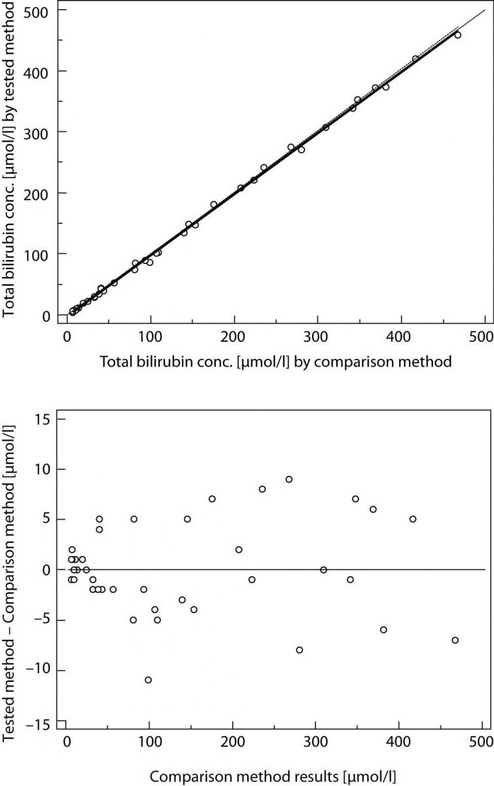
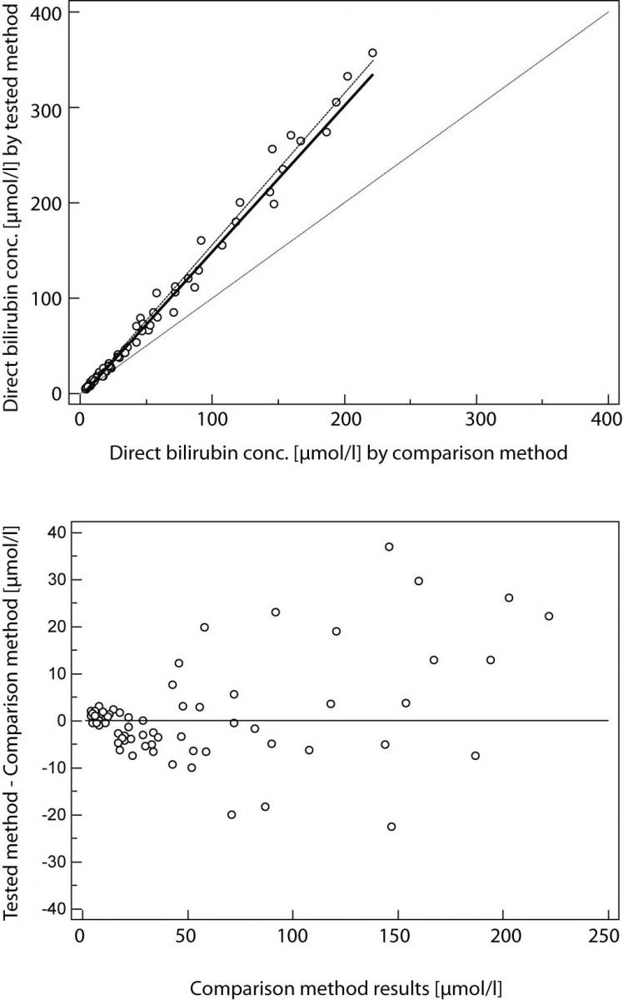

Lavorare con i dati
===================

Leggi di scala
..............

Le leggi di scala riguardano il comportamento di una struttura in
funzione della scala da cui la si guarda. Per i sistemi regolari, sia
matematici sia fisici e naturali, il sistema a grande scala è, in
genere, molto diverso da quello a piccola scala. Per esempio, la Terra
è un punto rispetto alla scala galattica, poi se ci si avvicina appare
come una sfera, dopo ancora come una superficie quasi piana, in
seguito appaiono i rilievi montuosi e le coste, poi le città, e così
via. Le strutture matematiche usuali sono, in genere, molto più
semplici e perdono struttura alle scale molto piccole. Per esempio,
una sfera può essere approssimata dal suo piano tangente.

A partire dalla struttura stessa dell'Universo a grande scala,
passando per le complesse forme delle strutture biologiche, fino alle
interazioni elementari tra i costituenti fondamentali della materia,
tutti questi sistemi mostrano delle ben definite leggi di
scala. Queste leggi caratterizzano il cambiamento del sistema sotto
l'effetto di una trasformazione della scala delle lunghezze, e
rappresentano un elemento essenziale per la comprensione della
complessità del sistema.

Per un sistema con una scala caratteristica, come un atomo, le leggi
di scala non sono particolarmente interessanti. Infatti, se
consideriamo una scala di lunghezze dell'ordine di quella dell'atomo
stesso, potremo definire in modo adeguato tutte le sue proprietà: il
nucleo centrale e la distribuzione degli elettroni intorno a esso. Se
però consideriamo una scala molto più grande, l'atomo diventa a tutti
gli effetti puntiforme e non mostra proprietà particolarmente
interessanti. Questa situazione cambia completamente se prendiamo in
esame una struttura molto familiare, ma abbastanza complessa, come
quella di un albero. In questo caso possiamo partire dagli atomi che
formano molecole, che poi formano le cellule, le fibre, quindi le più
piccole foglie e i rami, i quali sono man mano più grandi e mostrano
ramificazioni sia a piccole sia a grandi scale. Infine, arriviamo
all'intero albero che, per scale molto più grandi, può essere
considerato anch'esso puntiforme. Esiste però un'ampia varietà di
scale in cui le proprietà sono abbastanza simili, per esempio la
biforcazione dei rami avviene sia per i rami piccoli sia per quelli
più grandi. In questa regione di scale, diciamo dalle fibre al tronco,
possiamo definire un'approssimativa invarianza di scala con le sue
proprietà caratteristiche. Questa proprietà naturalmente si estende da
una scala minima, quella delle fibre, a una massima, quella del tronco
o dell'albero stesso. Queste proprietà di scala sono essenziali per la
comprensione delle complessità della struttura e della sua
funzionalità, e costituiscono una delle caratterizzazioni fondamentali
delle strutture complesse.

:ref:`Data level nelle RMAP RFC<data_level-reference>`

Accuratezza e Precisione
........................

**L’accuratezza** è la vicinanza di un valore misurato al suo valore reale
(accuracy is the closeness of a measured value to its true value) e in
buona parte dipende dallo strumento. Per esempio, nelle misure
ecologiche, il metodo delle trappole per la stima della quantità di
individui in una popolazione e quello del C-14 per la produzione di
plancton nell’oceano tropicale hanno una accuratezza molto bassa; cioè
possono essere molto distanti dal valore reale. Ogni stima, ripetuta
nelle stesse condizioni, può dare la metà del valore reale. Uno
strumento o un reagente che forniscono una risposta sbagliata spesso
sono tarati in modo non corretto e sono definiti inaccurati; i valori
ottenuti sono biased.

Nel processo di misurazione con uno strumento inaccurato si commette
un errore sistematico, chiamato appunto bias. Esso rappresenta un
problema importante e ricorrente, in molte tecniche di stima di una
quantità. In varie discipline, il progresso è spesso collegato alla
ricerca di metodi di misurazione più accurati.

**La precisione (ripetibilità)** è la vicinanza di misure ripetute al medesimo valore (precision is the closeness of repeated measuments to the same item). Spesso dipende dalla capacità del tecnico di ripetere la misurazione con le stesse modalità e ha origine  dalla sua esperienza o abilità.

I concetti di accuracy, precision e bias applicati a una misura di
peso sono rappresentati graficamente nella figura successiva tratta
dall’ottimo testo, per la stima di popolazioni animali e vegetali, di
Charles J. Krebs del 1999 (Ecological methodology, 2nd ed. Menlo Park,
CA, Cummings, pp. XII, 620),

.. figure :: image119.gif 

figura A e B

.. figure :: image120.gif 

figura C e D

* Nella figura A le misure sono accurate, vicine al valore vero (true
  value), e molto precise (high precision).

* Nella figura B le misure sono accurate ma poco precise (low
  precision), cioè differenti tra loro.

* Nella figura C le misure sono non accurate (biased) ma molto precise
  (high precision).

* Nella figura D le misure sono non accurate (biased) e poco
  precise (low precision).

**Esempio**: la differenza tra accuratezza e precisione si può
spiegare facilmente utilizzando l’analogia di una freccia lanciata
verso un bersaglio.  L’accuratezza descrive la vicinanza della freccia
al barilotto.

.. figure ::   sensor-precision-example1.png
   :scale: 30 %

   tiro accurato
   
.. figure :: sensor-accuracy-example1.webp
   :scale: 30 %

   tiro preciso

Se venissero lanciate diverse frecce, la precisione verrebbe indicata
dalle dimensioni del gruppo di frecce.  Se le frecce sono raggruppate
tutte insieme, il tiro viene considerato preciso.
  
Teoria degli errori
...................

Licenza CC BY-NC-ND 2.5 https://creativecommons.org/licenses/by-nc-nd/2.5/

Copyright **WeSchool srl** Rome, 00186, Via Dei Barbieri, 6, VAT
no. 11514241006. For contacts:
rpd@weschool.com. https://library.weschool.com/corso/metrologia-e-teoria-degli-errori-dalla-varianza-alla-deviazione-standard-6310.html
 
La misura è un'operazione fondamentale in Fisica come in tutte le
Scienze. Per questa ragione c'è un'intera disciplina che se ne occupa
sia dal punto di vista teorico, sia per quello che riguarda gli
aspetti pratici: la metrologia.

Una delle sue articolazioni è la teoria degli errori, la quale studia
come l'errore, inevitabile in qualsiasi misurazione, può essere
stimato, controllato ed eventualmente ridotto.

Per misurare una grandezza fisica occorre seguire una serie di
operazioni il cui risultato è esprimibile con un numero e con un'unità
di misura. Tuttavia, nessuna misura sarà mai esatta: a ciascuna
misura, cioè, sarà associata un’incertezza, che rappresenta la
magnitudine degli errori inevitabilmente effettuati durante la
misurazione. Quindi ogni misura non rappresenta il valore “vero” di
una grandezza, ma solo una sua sensibile approssimazione.

Esistono due tipi di errori:

* **Errori sistematici**: sono gli errori insiti nello strumento di
  misura. Non possono essere eliminati del tutto ma è possibile
  ridurre l'errore usando uno strumento più preciso. Le fonti
  principali di questi errori sono, il difetto dello strumento usato,
  l'interazione strumento - sperimentatore, l’interazione strumento -
  fenomeno in esame, le errate condizioni di lavoro o l’imperfetta
  realizzazione del fenomeno. Gli errori sistematici sono difficili da
  individuare e da ridurre poiché, per loro stessa natura, si ripetono
  appunto sistematicamente ad ogni misurazione.
* **Errori casuali**: sono gli errori dovuti a fenomeni casuali e non
  controllabili, che influenzano la lettura della misura. Sono errori
  casuali tutte quelle incertezze sperimentali che possono essere
  rilevate mediante la ripetizione delle misure: non possono mai
  essere eliminati del tutto, ma la loro influenza sulla misurazione
  può essere fortemente ridotta grazie a strumenti statistici.
  Proprio questi strumenti sono oggetto di questo corso: grazie a
  questi strumenti, al ripetersi delle misure, si possono determinare
  dei parametri (principalmente media e deviazione standard) in modo
  tale che le misurazioni che si ottengono oscillano attorno ad un
  valore pressoché costante.

Gli **errori aleatori** possono essere **ridotti mediante l’impiego di
alcuni strumenti statistici**.

Supponiamo di voler effettuare la misura di un aspetto di
un’esperienza fisica. Per poter ridurre l’influenza degli errori
casuali è necessario poter effettuare molte misure della stessa
quantità: è quindi necessario che l’**esperienza fisica** della quale
vogliamo misurare un aspetto **sia riproducibile** a piacimento,
**sempre nelle medesime condizioni**.

Assicuratici di questo, possiamo proseguire, ed effettuiamo un certo
numero N di misure. Indichiamo con x1​ il risultato (sbagliato)
della prima misurazione, con x2 il risultato della seconda,
eccetera, sino ad xN.

**Definizione** 

Si chiama **media aritmetica** o **valor medio** la quantità

.. math::
   X_{m} = \bar{X} = \frac{x1​+x2​+⋯+xN}{N}

cioè la somma complessiva delle misure, diviso il numero delle
misurazioni effettuate.

Questo valore viene comunemente confuso con il Valore Atteso, il quale
però è un risultato teorico (e quindi esatto), mentre la media
arimetica è un valore sperimentale ed errato che approssima il valore
atteso.

La media aritmetica consiste di individuare una approssimazione del
valore “vero” della quantità misurata, la cui precisione aumenta
all’aumentare del numero di misurazioni effettuate.

**Definizione**

Si chiama **errore assoluto**, e si indica con Ea, la differenza in
modulo tra il valore teorico della misura effettuata e il valore
effettivamente misurato: questo dà un’idea di quanto i dati raccolti
si discostino dal valore che si vuole misurare. In questo modo, ogni
misurazione può essere indicata con

.. math::
   (quantitaˋ da misurare)= X_{} \pm E_{a}

il che indica che ci si trova vicino al valor medio, più o meno
distanti, ma al massimo una quantità pari all’errore assoluto. Quindi,
tanto è più piccolo l’errore assoluto, tanto più precisa sarà la
misurazione.

Il problema sorge quando il valore teoricamente esatto della quantità
da misurare non è disponibile, il che accade la maggior parte delle
volte. Come procedere in questi casi al computo dell’errore assoluto?

**Ci sono diversi modi di calcolare l’errore assoluto**: se si hanno a
disposizione pochi dati è sufficiente calcolare la **semidispersione
massima**, ma al crescere dei dati si usa la **deviazione standard**.

**Definizione**

Si definisce **semidispersione massima**, indicata con d o Δx, la
semi-differenza massima tra i valori osservati: se xmax ​ è il valore
più grande e xminx​ quello più piccolo, allora la semi-dispersione
massima è

.. math::
   \Delta x = d = \frac{x_{max}-x_{min}}{2}

A volte è necessario sapere di quanto si sbaglia a fronte di una
misurazione, soprattutto per accorgersi di quanto il valore
dell’errore influisca sulla misurazione effettuata.

**Definizione**

Si dice **errore relativo**, indicato da Er​, il rapporto tra errore
assoluto e la media delle misurazioni:

.. math::
   E_{r}​=\frac{E_{a}}{X_{m}}​​

Si dice **errore percentuale**, indicato da E%​, l’indicazione
percentuale dell’errore relativo:

.. math::
   E\% = E_{r} \cdot 100 \%

Errore relativo e percentuale, essendo rapporti fra grandezze
omologhe, non hanno unità di misura: sono semplicemente
numeri. L’errore assoluto e il valor medio, invece, posseggono la
stessa unità di misura della quantità che si desidera misurare.

Errore statistico e deviazione standard
.......................................

Per effettuare il più correttamente possibile una misurazione, è
necessario ridurre al minimo l’errore assoluto. L’**errore assoluto**,
tuttavia, essendo la differenza tra il valore medio delle valori
ottenuti e il valore teorico della misura desiderata, non può essere
assunto a priori, ma deve essere calcolato a fronte delle misurazioni
effettuate.

A seconda della misurazione da effettuare, per valutare l’errore
assoluto si possono usare metodi differenti. Nella gran parte dei casi
si ricorre alla deviazione **standard**.

**Definizione**

Effettuiamo una serie di misurazioni x1,x2,…,xN​ e calcoliamone il valor medio

.. math::
   x_{m}=\frac{x_{1}+...+x_{N}}{N}

Lo **scarto**, indicato con la lettera ξ (“csi” greca), è la
differenza tra il valore medio e il valore di una singola misurazione:

.. math::
   \xi_{k} = x_{k} - \bar{X}

**Definizione**

Ora definiamo la varianza campionaria come la media aritmetica del
quadrato degli scarti:

.. math::
   S_{n}^{2} = \frac{\xi_{1}​^{2}+\xi_{2}​^{2}+...+\xi_{N}​^{2}}{N} = \frac{(x_{1}-x_{m})^{2}+...+(x_{N}-x_{m})^{2}}{N}

**Definizione**

La **deviazione standard** è la radice quadrata (positiva) della varianza
campionaria:

.. math::
   \sigma = \sqrt{S_{N}^{2}} = \sqrt{\frac{(x_{1}-x_{m})^{2}+...+(x_{N}-x_{m})^{2}}{N}}

Per motivi di correttezza statistica, al crescere del numero di
misurazioni effettuate, si usa una formula leggermente diversa, lo
**scarto quadratico medio**, dividendo per N−1 invece che per N:

.. math::
   S_{x} =  \frac{\xi_{1}​^{2}+\xi_{2}​^{2}+...+\xi_{N}​^{2}}{N-1} = \sqrt{\frac{(x_{1}-x_{m})^{2}+...+(x_{N}-x_{m})^{2}}{N-1}}

La deviazione standard, in presenza di un numero abbastanza alto di
misurazioni, rappresenta al meglio l’errore assoluto, ed è quindi di
fondamentale importanza per determinare con correttezza l’entità delle
fluttuazioni riscontrate in una misura.

.. image :: normale.jpg

Usare media e deviazione standard
.................................

Quando riporti variabili distribuite normalmente, utilizzare media e
deviazione standard è corretto e utile perché significa fornire
informazioni molto precise: stai dicendo al tuo lettore che circa il
95,5% dei valori della variabile che stai descrivendo rientra
nell’intervallo “media ± 2*deviazione standard”, che circa il 99,7%
dei valori rientra nell’intervallo “media ±3*deviazione standard”, che
il 68,3 rientra nell’intervallo “media ±1*deviazione standard, e così
via con tutte le altre caratteristiche della distribuzione normale.

Quando invece descrivi una variabile distribuita in modo non-normale,
utilizzare media e deviazione standard non ha più questo tipo di
utilità, anzi è addirittura dannoso per il lettore che cerca di
interpretare i tuoi dati, perché stai fornendo implicitamente
informazioni false.

Devi perciò usare utilizzare altre statistiche descrittive,
solitamente mediana (al posto della media) e range interquartile(come
dispersione, al posto della distribuzione standard).

Valutare la concordanza tra metodi
..................................

Una delle operazioni che spesso sono necessarie è la
valutazione della concordanza di due metodi (o due diversi strumenti,
o due diversi operatori) nell’effettuare una misura quantitativa.

Ad esempio, se lo strumento A e lo strumento B misurano la temperatura
in modo concordante.

Il confronto,  non va effettuato tenendo conto delle medie dei
valori prodotti dallo strumento A e delle medie prodotte dallo
strumento B.

La strategia corretta è, invece, calcolare la differenze per ogni
campione tra il valore generato dallo strumento A e il valore fornito
dallo strumento B.

E' quindi evidente che la valutazione di concordanza tra due
misuratori non va mai condotta attraverso il confronto tra medie, ma
attraverso l’analisi delle differenze tra i valori.

Scatter plot/grafico di dispersione
-----------------------------------

Abbiamo un metodo A e un metodo B, e vogliamo capire se i due
strumenti sono concordanti e, perciò, se uno può essere utilizzato al
posto dell’altro indistintamente.

**Scatter plot** è un tipo di grafico in cui due variabili di un set
di dati sono riportate su uno spazio cartesiano.  I dati sono
visualizzati tramite una collezione di punti ciascuno con una
posizione sull'asse orizzontale determinato da una variabile e
sull'asse verticale determinato dall'altra.

.. image :: Final-scatterplot-in-Seaborn.png

Il coefficiente di correlazione
-------------------------------

Il Coefficiente di correlazione di Pearson (r) è lo standard
statistico per misurare il grado di relazione lineare tra due
variabili. Questo coefficiente fornisce un riepilogo numerico che va
da -1 a +1, dove ciascun punto finale rappresenta una relazione
lineare perfetta, negativa o positiva. Un valore 'r' pari a 0 indica
alcuna correlazione lineare tra le variabili. Riflette quanto una
variabile può prevederne un'altra attraverso un'equazione lineare. In
pratica, il valore della "r" guida gli analisti nel determinare la
prevedibilità e la forza della relazione

test:

* lo scatter plot deve mostrare una relazione di tipo lineare tra le due variabili
* non devo essere presenti outliers influenti
* la distribuzione di entrambe le variabili deve essere normale

.. math::
   r=\frac{\sum(X-\overline{X})(Y-\overline{Y})}{\sqrt{\sum{(X-\overline{X})^2}\sum(Y-\overline{Y})^2}}

Di seguito è riportata una rappresentazione visiva di questi scenari
tramite scatter plot:

* Correlazione positiva: All’aumentare di una variabile, aumenta anche
  l’altra.
* Correlazione negativa: All’aumentare di una variabile, l’altra
  diminuisce.
* Nessuna correlazione: Nessun modello lineare distinguibile nella
  relazione tra le variabili.

.. image :: Pearson-Correlation-Coefficient-Statistical-Guide-2-1024x576.webp
	   :width: 100%

Regressione lineare
-------------------

La regressione lineare è un metodo statistico utilizzato per modellare
la relazione tra una variabile dipendente (risposta o output) e una o
più variabili indipendenti (predittori o input).

Nella sua forma più semplice, la regressione lineare è una relazione
lineare tra le variabili descritta dall'equazione:

y=mx+q+ϵ

Dove:

* y è la variabile dipendente.
* x è la variabile indipendente.
* m è il coefficiente angolare (pendenza) che misura l’effetto di x su y.
* q è l'intercetta, ovvero il valore di y quando x=0.
* ϵ è l'errore residuo o rumore, che rappresenta la differenza tra i valori osservati e quelli predetti.

Una volta stimati questi parametri, posso usare l'equazione per fare
previsioni o analizzare l’effetto delle variabili indipendenti sulla
variabile dipendente.
  

Il metodo dei minimi quadrati
-----------------------------

Il metodo dei minimi quadrati (in inglese OLS: Ordinary Least Squares)
è una tecnica di ottimizzazione (o regressione) che permette di
trovare una funzione, rappresentata da una curva ottima (o curva di
regressione), che si avvicini il più possibile ad un insieme di dati
(tipicamente punti del piano). In particolare, la funzione trovata
deve essere quella che minimizza la somma dei quadrati delle distanze
tra i dati osservati e quelli della curva che rappresenta la funzione
stessa. Questo metodo converge solo nel suo caso limite a
un'interpolazione, per cui di fatto si richiede che la curva ottima
contenga tutti i punti dati.

Regressione lineare con il metodo dei minimi quadrati
-----------------------------------------------------

Considero un insieme di punti (xi,yi) per i=1,2,…,n, devo trovare i parametri m e q
che minimizzano la seguente funzione obiettivo:

y=mx+q

Per prima cosa calcolo il coefficiente angolare m

.. math::
   m=\frac{n \sum(xy)-\sum x\sum y}{n\sum x^2-\sum(x)^2}

Poi calcolo dell'intercetta q:

.. math::
   q=\frac{\sum y-m\sum x}{n}
   

Valutare la concordanza tra due stimatori
-----------------------------------------

**Tramite coefficiente di correlazione**: errore: non è sufficiente
per interpretare la concordanza tra due stimatori attraverso la
correlazione.

Nell’ immagine puoi vedere 3 casi comuni di analisi di concordanza con
i relativi scatter-plot.

.. image :: CorrelationAgreement1.jpg

* **scatter-plot rosso in alto** E’ evidente che in questo caso vi è
  una buona correlazione ma questo non vuol dire che vi sia
  concordanza tra i metodi. Perchè? Perchè l’intercetta (il punto in
  cui la linea che modellizza la correlazione interseca l’asse Y) è
  diversa da zero. E questa intercetta indica lo scostamento
  sistematico tra i due metodi, il cosiddetto “bias”. Chiamiamola
  volgarmente la differenza media tra le misure dello strumento A e la
  misura dello strumento B.

* **scatter-plot blu in basso** in questo caso la retta passa
  dall’origine ma ancora non basta. Il problema è la pendenza. Quando
  la pendenza della retta è diversa da 1, vuol dire che c’è una
  differenza tra i risultati prodotti dai due strumenti che dipende
  dal valore vero che stiamo stimando.

* **scatter-plot verde** finalmente qua ci siamo. In questo caso sono
    rispettati tutti e due criteri necessari a parlare di concordanza:
    la retta passa per l’origine degli assi, indicando che non c’è un
    bias sistematico tra i due strumenti; la retta ha pendenza uguale
    a 1 (cioè è inclinata di 45 gradi) e ci dice che non c’è una
    proporzionalità della concordanza con il valore dell’analita.

Per parlare di concordanza, è ovviamente necessaria la correlazione
dei dati. Uno scatter-plot potrebbe tranquillamente avere una retta
passante per l’origine ed una pendenza uguale a 1 ma avere un indice
di correlazione molto basso. Vedi ad esempio lo scatterplot sotto.

.. image :: CorrelationeAgreement2.jpg

Grafico di Bland-Altman
-----------------------

* Sull’asse verticale sono riportate le differenze tra le due misure
  (cioè l’errore di misura)
* Sull’asse orizzontale le medie aritmetiche delle due
  misure. Assumendo infatti che le due misure effettuate siano
  equivalenti, la miglior stima del valore vero della misura è
  rappresentata dalla media aritmetica delle due misure.

.. image :: Bland_Altman_Plot.svg

Creative Commons Attribution-Share Alike 3.0 Unported license
Matlab Figure Converted by PLOT2SVG written by Juerg Schwizer

Su questo grafico, oltre ai punti che rappresentano le singole unità
statistiche, sono riportate poi anche delle linee orizzontali. In
particolare:

* la linea continua indica l’altezza in cui si collocano le differenze
  uguali a 0.
* la linea centrale tratteggiata rappresenta la media delle differenze
  tra le misurazioni dei due metodi.
* le due linee tratteggiate in alto ed in basso delimitano una banda
  che rappresenta i limiti dell’intervallo di confidenza della media
  delle differenze. La posizione di queste due linee è calcolabile
  come: media delle differenze ±1.96×SD.

Quando si osserva il grafico di Bland-Altman, tenere a mente questi punti:

* Differenza media (bias): Controlla quanto differiscono in media i
  due metodi. Una piccola differenza significa che vanno molto
  d'accordo e hanno poche differenze sistematiche.
* Limiti dell'accordo: Guarda il limiti dell'accordo. Questi mostrano
  l'intervallo in cui cade il 95% delle differenze. Limiti ristretti
  significano migliore precisione e concordanza.  I punti del grafico
  che ricadono all’interno dell’intervallo di confidenza indicano le
  unità statistiche per le due metodiche indicano risultati
  statisticamente congruenti tra loro, mentre i punti collocati al di
  fuori dalle degli estremi dell’intervallo di confidenza
  rappresentano i casi per cui i due metodi non sono congruenti tra
  loro.  Il fatto che vi sia congruenza statistica tra le due
  misurazioni, non significa però necessariamente che allora i due
  metodi siano tra loro interscambiabili. Questo grafico infatti
  valuta l’ampiezza delle differenze attraverso la costruzione di un
  intervallo di confidenza calcolato sulla differenza media, ma non ci
  dice se ai fini pratici l’ampiezza di questi intervalli sia
  accettabile o meno. La definizione di cosa si intende per limite
  accettabile, ovvero quale deve essere l’ampiezza massima
  dell’intervallo di confidenza affinché le due misurazioni possano
  essere considerate tra loro interscambiabili, deve essere infatti
  definita a priori in base a considerazioni teoriche, cliniche,
  biologiche o di altra natura sul fenomeno che si sta analizzando.
* Limiti accettabili: Verificare se i limiti osservati rientrano nel
  limiti accettabili che hai impostato. Se lo sono, i metodi
  probabilmente concordano bene.
* Tendenza e variabilità: Cerca se ci sono tendenze nelle differenze
  e quanto coerenti sono. Questo può dirti di più su come i metodi si
  differenziano.
  
Ma il metodo Bland-Altman ha alcuni limiti. Si presume che i dati
abbiano una distribuzione normale, il che potrebbe non essere vero.

Regressione di Passing and Bablok
---------------------------------

Considerando i limiti del modello di regressione ai minimi quadrati
ordinari, W. Bablok e H. Passing hanno proposto un modello di
regressione per il confronto dei metodi basato su un modello robusto e
non parametrico. A differenza della regressione lineare ai minimi
quadrati, la regressione di Passing e Bablok non è sensibile agli
outlier, presuppone che gli errori di misura in entrambi i metodi
abbiano la stessa distribuzione, non necessariamente normale, un
rapporto di varianza costante, una distribuzione di campionamento
arbitraria e imprecisione in entrambi i metodi. I requisiti della
regressione di Passing e Bablok sono: misure distribuite in modo
continuo (che coprono un ampio intervallo di misura) e relazione
lineare tra i due metodi. La regressione di Passing e Bablok calcola
l'equazione della retta di regressione da due serie di dati.

Il risultato della regressione di Passing e Bablok si compone di
diverse parti, ognuna delle quali ha il suo ruolo nell'interpretazione
dei dati di confronto dei metodi e nella conclusione dell'accordo tra
i metodi. Il primo risultato è il diagramma di dispersione con la
retta di regressione, che consente l'ispezione visiva dei dati
misurati e l'evidente accordo tra la retta di regressione e la retta
di identità (Figure 1A e 2A). L'equazione di regressione (y = a + bx)
ha rivelato una differenza costante (intercetta della retta di
regressione (a)) e proporzionale (pendenza della retta di regressione
(b)) con i relativi intervalli di confidenza del 95% (95% CI). Gli
intervalli di confidenza spiegano se il loro valore differisce dal
valore zero (0) per l'intercetta e dal valore uno (1) per la pendenza
solo per caso.

Pertanto, se l'IC al 95% per l'intercetta include il valore zero, si
può concludere che non vi è alcuna differenza significativa tra il
valore dell'intercetta ottenuto e il valore zero e che non vi è alcuna
differenza costante tra i due metodi. Viceversa, se l'IC al 95% per la
pendenza include il valore uno, si può concludere che non c'è una
differenza significativa tra il valore della pendenza ottenuto e il
valore uno e che non c'è una differenza proporzionale tra i due
metodi. In questo caso possiamo assumere che x = y e che non vi è
alcuna differenza significativa tra i metodi, per cui entrambi possono
essere utilizzati in modo intercambiabile. Il primo esempio di analisi
di regressione di Passing e Bablok su una serie di dati ottenuti
misurando la concentrazione di bilirubina totale nel siero dei
pazienti con due diversi analizzatori automatici è presentato in
figura 1.

   figura 1

Si noti che esiste una piccola differenza costante tra i due metodi
(Figura 1). La compensazione di tale differenza può essere effettuata
dopo ulteriori indagini sull'accuratezza di entrambi i metodi.

Il secondo esempio presenta una serie di dati ottenuti misurando la
bilirubina diretta nel siero con due metodi, che rivelano una piccola
costante ma un enorme errore proporzionale (Figura 2).

   figura 2

Questi metodi differiscono notevolmente e non possono essere
utilizzati contemporaneamente. Si noti che il coefficiente di
correlazione in entrambi gli esempi è r = 0,99; ciò dimostra che i
risultati del confronto dei metodi non possono essere valutati
utilizzando la correlazione di Pearson.

Tabelle di contingenza
----------------------

Le tabelle di contingenza sono usate per valutare l’interazione tra
due variabili categoriche (qualitative). Possono essere chiamate anche
tabelle a doppia entrata.

**Tabelle di contingenza a doppia entrata e distribuzioni marginali**

Una tabella a doppia entrata è una tabella che contiene righe e
colonne ed aiuta organizzare i dati da variabili categoriali:

* Le righe rappresentano le possibili categorie per una variabile qualitativa, ad esempio maschi e femmine.
* Le colonne rappresentano le possibili categorie per una seconda
  variabile qualitativa, ad esempio se piace la pizza oppure no…

Un distribuzione marginale mostra quante risposte complessive ci sono
per ogni categoria della variabile. La distribuzione marginale di una
variabile può essere determinata guardando alla colonna (o alla riga)
“Totale”.

Un evento è qualcosa che accade con uno o più possibili esiti.
Un esperimento è il processo di misurare o fare un’osservazione.

Definizione importante: la probabilità di un evento è il rapporto tra
il numero dei casi favorevoli e il numero dei casi possibili.

Metodo di valutazione delle performance di un sistema di allarme
attraverso indici statistici ottenuti applicando il metodo delle
misure dicotomiche. Il metodo di verifica si basa sul criterio binario
della frequenza di occorrenze “si” e “no” di un evento. Tale evento
viene definito da soglie quantitative predefinite, come ad esempio
“precipitazioni > 1mm”. Il criterio viene ben sintetizzato dalle
quattro combinazioni di previsione si/no e osservazione si/no incluse
nella nota tabella di contingenza:

.. image :: conttable.png

Un sistema di previsione perfetto produrrebbe solo risultati positivi
e negativi corretti, senza errori o falsi allarmi. La tabella di
contingenza è un modo utile per ottenere una grande varietà di
statistiche categoriali calcolate combinando gli elementi della
tabella. Gli indici che ne conseguono determinano le tipologie di
errore commesso dalla previsione.

POD - “Probability Of Detection(%)” [0 100]
Quale frazione degli eventi "sì" osservati è stata correttamente prevista?”
Frazione(%) degli eventi correttamente previsti (HITS) rispetto tutti gli eventi osservati (HITS+MISSING).

POFD - “Probability Of False Detection(%)” [0 100]
Quale frazione degli eventi "no" osservati è stata erroneamente prevista come "sì"?
Frazione(%) degli eventi previsti ma non osservati (FALSE ALARM) rispetto a tutti i non osservati(FALSE ALARM+REJECT).

FAR - “False Alarm Ratio(%)” [0 100]
Quale frazione degli eventi "sì" previsti in realtà erano falsi allarmi?
Frazione(%) dei FALSE ALARM rispetto l’insieme degli eventi correttamente previsti(HITS) e dei FALSE ALARM.

ACC - “Accuracy(%)” [0 100]
Nel complesso, quale frazione delle previsioni é corretta?
Frazione(%) degli eventi corretti (HITS+REJECT) rispetto al numero totale N di eventi(per tutte le stazioni incluse nel calcolo).

SR - “Success Ratio(%)” [0 100]
Quale frazione degli eventi "sì" previsti sono stati correttamente osservati?
Frazione(%) delle HITS rispetto tutte gli eventi, osservate e non osservate (HITS+FALSE ALARM).

FBI - “Frequency Bias Index” [0 ∞]
Come si confronta la frequenza prevista degli eventi "sì" con la frequenza osservata degli eventi "sì"?
Indice per la stima del BIAS o rapporto tra eventi previsti
(HITS+FALSE ALARM) e quelli osservati (HITS+MISS). FBI>1 (FBI<1)
indica una sovrastima (sottostima) della previsione; FBI=1 il perfect
score.

Per approfondire
----------------

Manuale di Statistica per la Ricerca e la Professione © Lamberto
Soliani - Dipartimento di Scienze Ambientali, Università di Parma (apr
05 ed) ebook version by SixSigmaIn Team - © 2007

* Il confronto tra due metodi quantitativi :download:`pdf <il sei sigma nel controllo di qualita .pdf>`

* http://www.sixsigmain.it/eBook/CAPU0.html

* https://pmc.ncbi.nlm.nih.gov/articles/PMC4470095/

* https://editverse.com/it/limits-of-agreement-bias-difference-plot/
