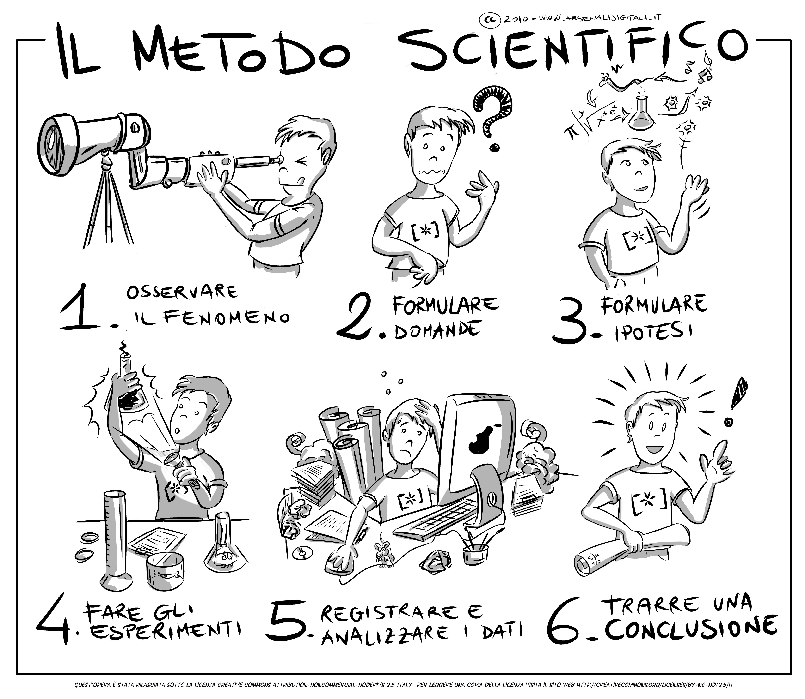
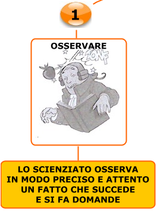
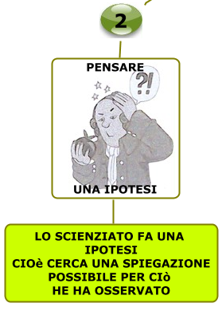
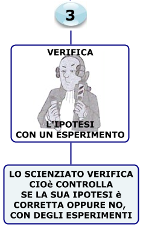
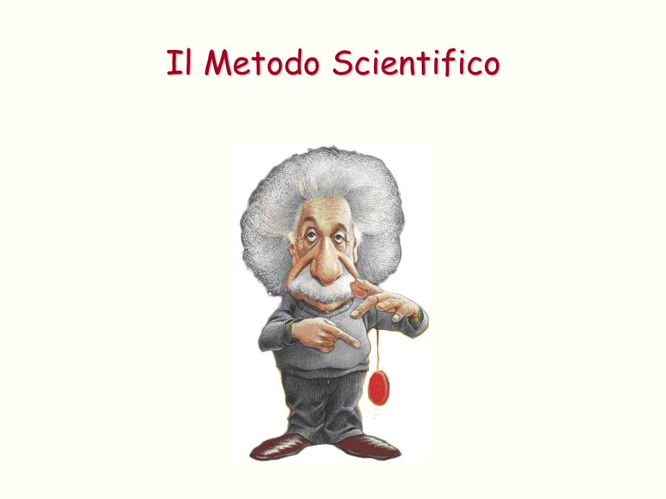
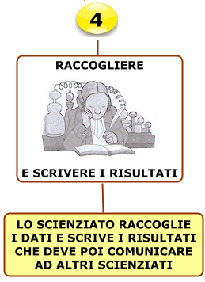
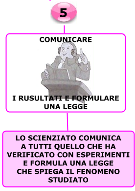
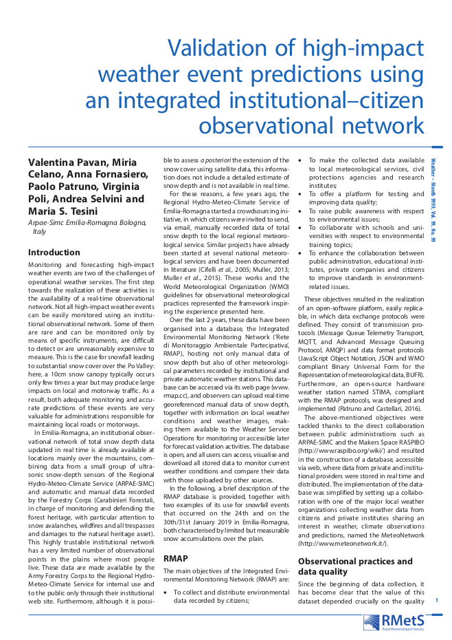

Il metodo scientifico
=====================

Cos’è e come funziona la comunità scientifica
---------------------------------------------

**La scienza: un grande puzzle globale**

Immagina un enorme puzzle, con milioni di pezzi sparsi in tutto il
mondo. Ogni pezzo rappresenta una scoperta, un esperimento,
un'idea. Mettere insieme questo puzzle è il lavoro degli scienziati,
un gruppo di persone unite dalla passione per la conoscenza e dalla
curiosità verso il mondo che ci circonda.

La comunità scientifica è una rete globale di ricercatori che
cooperano per ampliare le nostre conoscenze sul mondo.  Questa
comunità è estremamente diversificata, con esperti provenienti da ogni
angolo del globo e da molteplici discipline: dal biologo marino che
studia gli ecosistemi corallini al fisico delle particelle che indaga
i misteri dell'universo. Gli scienziati condividono un metodo comune:
quello scientifico, un approccio rigoroso che prevede la formulazione
di ipotesi, la progettazione di esperimenti e l'analisi dei risultati.
Gli scienziati inoltre credono al valore universale della
conoscenza.

E’ facile capire che la scienza si esprima come un coro più
che come una voce unitaria, anzi possano insorgere discussioni
interne e diatribe scientifiche.

Un pilastro fondamentale della ricerca scientifica è la pubblicazione
dei risultati su apposite riviste scientifiche.  Attraverso un
rigoroso processo di peer review, ovvero una valutazione critica da
parte di altri esperti del settore, gli articoli vengono selezionati e
pubblicati.  Ogni scoperta deve essere sottoposta al vaglio della
comunità scientifica, che può adottarla o confutarla. Questo sistema
di controllo garantisce l'affidabilità delle conoscenze scientifiche e
stimola la ricerca di nuove prove.

Lungi dal limitarsi a sommarie conclusioni, questi lavori presentano
nel dettaglio metodi utilizzati, esperimenti condotti, risultati
ottenuti sotto forma di grafici o immagini.

La pubblicazione riporta i nomi degli autori e suggella la paternità
delle scoperte: in alcuni Paesi molti finanziamenti dipendono dal
numero e dalla qualità delle pubblicazioni.

Queste infatti non sono tutte uguali, ma si differenziano per la
portata e il rigore metodologico, deducibili in genere dalla rivista
su cui sono pubblicate. Infatti i lavori da pubblicare sono scelti da
una commissione composta da diversi ricercatori indipendenti,
autorevoli nel loro campo, che leggono il lavoro candidato e ne danno
un giudizio critico. Più la rivista è di alto livello più sarà
accurata la selezione (e viceversa). Difficilmente sarà smentita una
scoperta pubblicata da riviste internazionali e multidisciplinari come
Nature e Science. Mentre annunci sensazionalistici non
supportati da alcuna prova non sono notizie scientifiche e non saranno
mai pubblicati. L’aspetto più bello è che queste riviste sono oggi
disponibili in Internet e quindi è possibile per qualunque
ricercatore informarsi ogni giorno sui progressi compiuti magari
dall’altra parte del mondo!

Gli scienziati si riuniscono regolarmente in conferenze e seminari
per discutere i loro lavori e stabilire nuove collaborazioni.  Questi
eventi, che possono variare da piccoli workshop a grandi conferenze
internazionali, offrono ai ricercatori l'opportunità di presentare le
loro ricerche e di confrontarsi con i colleghi.

Anche se solitamente i singoli laboratori e le istituzioni di ricerca
sono strutture gerarchiche, il confronto tra diversi gruppi avviene
alla pari, con i dati sperimentali come uniche “armi”o obiettivo
comune. E praticamente in tutti i centri di ricerca sono frequenti i
seminari, con ospiti esterni chiamati a raccontare le loro scoperte e
discuterne. Naturalmente gli scienziati sono persone normali, capaci
come chiunque altro di meschinità ed errori. Ma non sarebbe bello
imitarne più spesso la capacità di discutere all’interno di un
territorio comune?

**Perché è importante conoscere il lavoro degli scienziati?**

La scienza ci aiuta a comprendere il mondo che ci circonda, a trovare
soluzioni ai problemi che affliggono l'umanità e a migliorare la
nostra vita. Seguendo le ricerche degli scienziati, possiamo restare
aggiornati sulle ultime scoperte e partecipare al dibattito su temi
importanti come il cambiamento climatico, le malattie e le nuove
tecnologie.

**Cosa puoi fare tu?**

Anche tu puoi contribuire a diffondere la cultura scientifica. Puoi
leggere articoli divulgativi, seguire i canali social dei ricercatori,
partecipare a eventi scientifici e condividere le tue conoscenze con
gli altri.

Filosofia della scienza
-----------------------

La Filosofia della scienza ha per oggetto la conoscenza scientifica,
di cui analizza gli scopi e i fondamenti concettuali. Essa affronta
temi come la natura, l'uso e la funzione delle leggi e delle teorie
scientifiche, la struttura della spiegazione, della previsione e 
delle inferenze volte all'acquisizione di conoscenza scientifica.

Il compito della filosofia della scienza
........................................

Identificare le caratteristiche che rendono la scienza una forma di
conoscenza “vera”, contrapposta ad altre forme di conoscenza
condizionate da opinioni soggettive, illusioni, miti, credenze
religiose, ecc.

**Gli elementi fondanti della scienza moderna occidentale**

* Il metodo sperimentale
* Il ragionamento logico-matematico
* La conoscenza scientifica, a differenza di altre forme di
  conoscenza, consiste in asserzioni “vere” perché dimostrate
  attraverso una catena di deduzioni logiche a partire da osservazioni
  empiriche

La conoscenza del contesto storico e filosofico dà quel tipo di
indipendenza dai pregiudizi della sua generazione di cui soffre la
maggior parte degli scienziati. Questa indipendenza creata
dall'intuizione filosofica è, a mio avviso, il segno di distinzione
tra un semplice artigiano o specialista e un vero ricercatore della
verità.

In primo luogo, la filosofia offre un chiarimento concettuale. I
chiarimenti concettuali non solo migliorano la precisione e l'utilità
dei termini scientifici, ma portano anche a nuove indagini
sperimentali, perché la scelta di un determinato quadro concettuale
vincola fortemente il modo in cui gli esperimenti vengono concepiti.

Oltre al suo ruolo di chiarificazione concettuale, la filosofia può
contribuire alla critica dei presupposti scientifici e può persino
essere proattiva nella formulazione di teorie nuove, testabili e
predittive che aiutano a definire nuovi percorsi per la ricerca
empirica.

La filosofia e la scienza condividono gli strumenti della logica,
dell'analisi concettuale e dell'argomentazione rigorosa. Tuttavia, i
filosofi possono utilizzare questi strumenti con gradi di accuratezza,
libertà e astrazione teorica che i ricercatori praticanti spesso non
possono permettersi nelle loro attività quotidiane. I filosofi con le
conoscenze scientifiche necessarie possono quindi contribuire in modo
significativo al progresso della scienza a tutti i livelli
dell'impresa scientifica, dalla teoria all'esperimento, come
dimostrano gli esempi sopra riportati.

In sintesi, la filosofia della scienza non solo analizza come funziona
la scienza, ma si interroga anche sul suo significato più profondo e
sul suo ruolo nella nostra comprensione del mondo. È un ponte tra la
scienza e le grandi domande filosofiche sulla conoscenza, la realtà e
l'etica.

Il metodo scientifico sperimentale
----------------------------------

Il metodo scientifico: osservazione 
....................................

La prima fase del metodo sperimentale è quella dell'osservazione.
Osservare non vuol dire semplicemente vedere, bensì significa "vedere
ponendosi delle domande, dei quesiti", e quindi interrogandosi sulla
natura e sul motivo del verificarsi di determinati fenomeni piuttosto
che di altri.  La curiosità di fronte al fenomeno è la molla e
l'incipit che scatena nello scienziato il desiderio di conoscere e di
scoprire cose nuove.

Il metodo scientifico:  ipotesi
...............................

La seconda fase è l'ipotesi. Si tratta di una prima spiegazione di
come si svolge un determinato fenomeno (non incorruttibile e
certa). Tale ipotesi deve essere necessariamente verificata affinché
possa diventare una legge.

Il metodo scientifico: verifica
...............................

La terza fase è la verifica, cioè occorre che l'ipotesi sia sostenuta
da esperimenti eseguiti in laboratorio con adeguati strumenti, in modo
tale che assuma una veridicità scientifica ufficialmente riconosciuta.

Il metodo scientifico: la legge fisica
......................................

Infine, la quarta fase è quella che porta alla formulazione della
legge fisica, ovvero il momento in cui un'ipotesi viene confermata
dagli esperimenti e quindi quell'ipotesi può diventare una legge
fisica o scientifica.

	   
Comunicare
..........

E la meteorologia?
------------------

Non è sempre possibile riprodurre e «controllare» sperimentalmente
osservazioni naturali, per esempio quando abbiamo a che fare con spazi
e tempi non riproducibili.

La Meteorologia opera con processi non replicabili (se non in piccola
parte) in laboratori, caratterizzati da variabilità naturali
semplificabili ma non riproducibili esattamente.

Consiste nello studio di una «combinazione» di processi solo in parte
interpretabili con scienze sperimentali (chimica, fisica) e utilizza
anche strumenti quali la statistica e la modellistica.

Cos’è e come funziona la comunità scientifica
---------------------------------------------

* Multiforme e variegata
* Ma capacità di collaborare
* Su spazi fisici e tematici estesissimi
* Adesione a un metodo di lavoro, che è la sperimentazione, e sul
  valore universale della conoscenza
* Il più importante mezzo di comunicazione sono le riviste
  scientifiche
* Lungi dal limitarsi a sommarie conclusioni, questi lavori presentano
  nel dettaglio metodi utilizzati, esperimenti condotti, risultati
  ottenuti
* L’intera comunità può giudicare l’attendibilità e il valore della
  scoperta e ripetere gli stessi esperimenti, per approfondire
  ulteriormente la ricerca o eventualmente smentirla
* La pubblicazione riporta i nomi degli autori, e suggella la
  paternità delle scoperte
* I lavori da pubblicare sono scelti da una commissione composta da
  diversi ricercatori indipendenti, autorevoli nel loro campo, che
  leggono il lavoro candidato e ne danno un giudizio critico
* Più la rivista è di alto livello più sarà accurata la selezione
* Queste riviste sono oggi disponibili in Internet, e quindi è
  possibile per qualunque ricercatore informarsi ogni giorno sui
  progressi compiuti

* vi sono poi raduni e convegni, che possono avere portata locale o
  internazionale, e in genere sono di settore
* Anche se solitamente i singoli laboratori e le istituzioni di
  ricerca sono strutture gerarchiche, il confronto tra diversi gruppi
  avviene alla pari, con i dati sperimentali come uniche “armi”o
  obiettivo comune
* Naturalmente gli scienziati sono persone normali, capaci come
  chiunque altro di meschinità ed errori

https://www.recensito.net/archivio/41-scienza-co/7371-cos-e-e-come-funziona-la-comunita-scientifica.html

Pubblicazione scientifica
.........................

Nell'editoria accademica una pubblicazione scientifica è uno scritto
redatto in modo oggettivo, ovvero evidenziando in maniera trasparente
e verificabile metodo e risultati di ricerca, da parte di scienziati o
tecnici, su un argomento scientifico e pubblicato poi, attraverso i
canali di comunicazione della comunità scientifica, tipicamente su
riviste accademiche, una volta validata secondo le regole della
revisione paritaria, entrando di diritto a far parte della letteratura
scientifica.

   Un articolo di esempio
	   
Convegni e seminari
...................

Vi sono poi raduni e convegni, che possono avere portata locale o
internazionale, e in genere sono di settore Anche se solitamente i
singoli laboratori e le istituzioni di ricerca sono strutture
gerarchiche, il confronto tra diversi gruppi avviene alla pari, con i
dati sperimentali come uniche “armi”o obiettivo comune Naturalmente
gli scienziati sono persone normali, capaci come chiunque altro di
meschinità ed errori

https://www.recensito.net/archivio/41-scienza-co/7371-cos-e-e-come-funziona-la-comunita-scientifica.html

ResearchGate
............

E' un social network gratuito[1] dedicato a tutte le discipline
scientifiche. Da maggio 2008, ResearchGate ha ora oltre 15 milioni
membri attivi provenienti da 192 paesi.

Ecco come funziona:

* Condividi le tue pubblicazioni, accedi a milioni di altre e pubblica
  i tuoi dati.
* Collegatevi e collaborate con colleghi, coautori e specialisti.
* Ottenete statistiche e scoprite chi ha letto e citato il vostro
  lavoro.
* Fate domande, ottenete risposte e risolvete problemi di ricerca.
* Trovate il lavoro giusto utilizzando la nostra job board dedicata
  alla ricerca.
* Condividete gli aggiornamenti sul vostro progetto in corso e
  tenetevi al passo con le ultime ricerche.

Divulgazione scientifica
........................

 L'obiettivo è far conoscere al pubblico, in modo corretto ma
 efficacemente riassunto e comunicato, i risultati delle ricerche e
 delle pubblicazioni scientifiche. Questa attività non presenta in
 genere specifiche intenzioni formative al singolo individuo, ma è
 rivolta alla collettività, con scopo di accrescere la percezione
 dell'importanza della scienza in una società.

nella divulgazione scientifica si è affermata anche l'impostazione di
origine anglosassone delle esperienze bidirezionali, in cui si cerca
il feedback da parte del pubblico, discutendo in luoghi come
laboratori, caffè scientifici, forum partecipati.

La scienza, la tecnologia e l’innovazione giocano un ruolo crescente
nelle nostre vite.

Come cittadini, siamo chiamati a valutare decisioni anche tecniche,
come per esempio la politica dei trasporti, le scelte energetiche,
leggi che riguardano la salute, la ricerca, e in generale scelte che
riguardano noi e i nostri discendenti. Queste decisioni comportano
anche un certo grado di coscienza scientifica. Coscienza, e non
semplicemente conoscenza, perché non si possono limitare le scelte
politiche e culturali a una sola valutazione tecnica, né, d’altra
parte, a una valutazione emotiva.

Le attività di associazionismo è talvolta impegnata nella divulgazione
scientifica e la alimenta.

MeteoNetwork
............

MeteoNetwork è un'associazione ONLUS nata per sostenere e coordinare
lo sviluppo della meteorologia amatoriale di qualità in Italia, della
diffusione e dell’approfondimento della meteorologia e della
climatologia.

Uno degli obiettivi primari dell’Associazione è quello di contribuire,
anche attraverso il coinvolgimento di altri siti meteo italiani ed
esteri, alla crescita dell’interesse comune verso la meteorologia nel
nostro Paese, visti il poco spazio e lo scarso interesse (e spesso
deformato) riservatole dai mezzi istituzionali di informazione.

Vanta importanti collaborazioni con molti Enti del settore pubblici e
privati, e può contare su uno dei forum di meteorologia più letti
d’Italia (oltre 9500 iscritti e 5.000.000 discussioni, dati aggiornati
a Aprile 2019) e su una rete di stazioni meteorologiche tra le più
ramificate della penisola e parte dell'Europa grazie alla
collaborazione con Associazioni estere

Meteonetwork: dati in tempo reale

