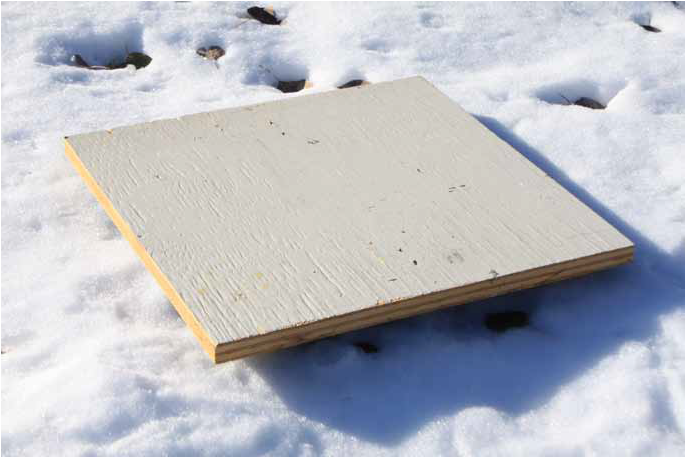
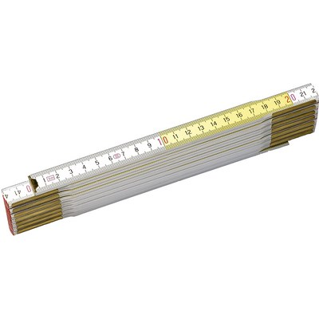
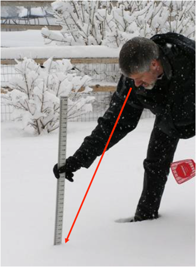
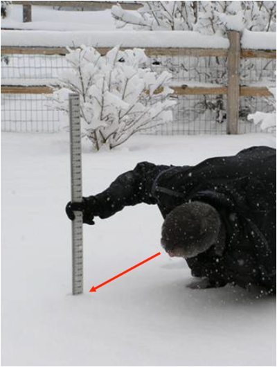

Misurare
++++++++

Come effettuare corrette misurazioni di parametri ambientali.

Definizioni
===========

Campionamenti e osservazioni
----------------------------

- Campionamento è il processo per ottenere una discretizzata sequenza
  di misure di una quantità.

- Campione è una singola misura, tipicamente una di una serie di
  letture di un sistema di sensoristica.

- Una osservazione (misurazione) è il risultato del processo di
  campionamento. Nel contesto di analisi di serie, un'osservazione è
  derivato da un numero di campioni.

Data Level
----------

- Dati Level I , sono le letture dirette degli strumenti espresse in
  appropriate unità fisiche e georeferenziate

- Dati Level II, dati riconosciuti come variabili meteorologiche;
  possono essere ottenuti direttamente da strumenti o derivati dai
  dati Level I

- Dati Level III sono quelli contenuti in dataset internamente
  consistenti, generalmente su grigliato.
   
I dati scambiati a livello internazionale sono livello II o livello III

Campionamento
-------------

Processo per ottenere una sequenza discreta di misurazioni di una
grandezza.

Campione
--------

Una singola misura, in genere una di una serie di letture spot di un
sistema di sensori. Si noti che questo differisce dal significato
usuale in statistica di un insieme di numeri o misure che fa parte di
una popolazione.

Un'osservazione
---------------

Il risultato del processo di campionamento, ovvero la quantità
riportata o registrata (spesso chiamata anche misura). Nel contesto
dell'analisi delle serie temporali, un'osservazione deriva da un certo
numero di campioni.

Una misura
----------

La definizione ISO è "un insieme di operazioni aventi per oggetto la
determinazione del valore di una grandezza". Nell'uso comune, il
termine può essere utilizzato per indicare il valore di un campione o
di un'osservazione.

Tempo di campionamento o periodo di osservazione
------------------------------------------------

La durata del tempo in cui viene effettuata un'osservazione, durante
la quale vengono prelevati un certo numero di campioni individuali.

Intervallo di campionamento
---------------------------

L'intervallo di tempo tra osservazioni successive.

Funzione di campionamento o funzione di ponderazione
----------------------------------------------------

Nella sua definizione più semplice, un algoritmo per calcolare la
media o filtrare i singoli campioni.

Frequenza di campionamento
--------------------------

La frequenza con cui vengono prelevati i campioni. La distanza tra i
campioni è il tempo che intercorre tra un campione e l'altro.

Attenuazione
------------

Processo di attenuazione delle componenti ad alta frequenza dello
spettro senza influenzare in modo significativo le frequenze più
basse. Di solito viene effettuato per rimuovere il rumore (errori e
fluttuazioni casuali non rilevanti per l'applicazione).

Filtro
------

Dispositivo che consente di attenuare o selezionare le frequenze
prescelte. L'attenuazione viene eseguita da un filtro passa-basso e i
termini attenuazione e filtraggio sono spesso usati in modo
intercambiabile in questo senso. In questo senso. Tuttavia, esistono
anche filtri passa-alto e passa-banda. Il filtraggio può essere una
proprietà dello strumento, come l'inerzia, oppure può essere eseguito
elettronicamente o numericamente.

Accuratezza e Precisione
------------------------

**L’accuratezza** è la vicinanza di un valore misurato al suo valore reale
(accuracy is the closeness of a measured value to its true value) e in
buona parte dipende dallo strumento. Per esempio, nelle misure
ecologiche, il metodo delle trappole per la stima della quantità di
individui in una popolazione e quello del C-14 per la produzione di
plancton nell’oceano tropicale hanno una accuratezza molto bassa; cioè
possono essere molto distanti dal valore reale. Ogni stima, ripetuta
nelle stesse condizioni, può dare la metà del valore reale. Uno
strumento o un reagente che forniscono una risposta sbagliata spesso
sono tarati in modo non corretto e sono definiti inaccurati; i valori
ottenuti sono biased.

Nel processo di misurazione con uno strumento inaccurato si commette
un errore sistematico, chiamato appunto bias. Esso rappresenta un
problema importante e ricorrente, in molte tecniche di stima di una
quantità. In varie discipline, il progresso è spesso collegato alla
ricerca di metodi di misurazione più accurati.

**La precisione (ripetibilità)** è la vicinanza di misure ripetute al medesimo valore (precision is the closeness of repeated measuments to the same item). Spesso dipende dalla capacità del tecnico di ripetere la misurazione con le stesse modalità e ha origine  dalla sua esperienza o abilità.

I concetti di accuracy, precision e bias applicati a una misura di
peso sono rappresentati graficamente nella figura successiva tratta
dall’ottimo testo, per la stima di popolazioni animali e vegetali, di
Charles J. Krebs del 1999 (Ecological methodology, 2nd ed. Menlo Park,
CA, Cummings, pp. XII, 620),

.. figure :: image119.gif 

figura A e B

.. figure :: image120.gif 

figura C e D

* Nella figura A le misure sono accurate, vicine al valore vero (true
  value), e molto precise (high precision).

* Nella figura B le misure sono accurate ma poco precise (low
  precision), cioè differenti tra loro.

* Nella figura C le misure sono non accurate (biased) ma molto precise
  (high precision).

* Nella figura D le misure sono non accurate (biased) e poco
  precise (low precision).

**Esempio**: la differenza tra accuratezza e precisione si può
spiegare facilmente utilizzando l’analogia di una freccia lanciata
verso un bersaglio.  L’accuratezza descrive la vicinanza della freccia
al barilotto.

.. figure ::   sensor-precision-example1.png
   :scale: 30 %

   tiro accurato
   
.. figure :: sensor-accuracy-example1.webp
   :scale: 30 %

   tiro preciso

Se venissero lanciate diverse frecce, la precisione verrebbe indicata
dalle dimensioni del gruppo di frecce.  Se le frecce sono raggruppate
tutte insieme, il tiro viene considerato preciso.

Leggi di scala
==============

Le leggi di scala riguardano il comportamento di una struttura in
funzione della scala da cui la si guarda. Per i sistemi regolari, sia
matematici sia fisici e naturali, il sistema a grande scala è, in
genere, molto diverso da quello a piccola scala. Per esempio, la Terra
è un punto rispetto alla scala galattica, poi se ci si avvicina appare
come una sfera, dopo ancora come una superficie quasi piana, in
seguito appaiono i rilievi montuosi e le coste, poi le città, e così
via. Le strutture matematiche usuali sono, in genere, molto più
semplici e perdono struttura alle scale molto piccole. Per esempio,
una sfera può essere approssimata dal suo piano tangente.

A partire dalla struttura stessa dell'Universo a grande scala,
passando per le complesse forme delle strutture biologiche, fino alle
interazioni elementari tra i costituenti fondamentali della materia,
tutti questi sistemi mostrano delle ben definite leggi di
scala. Queste leggi caratterizzano il cambiamento del sistema sotto
l'effetto di una trasformazione della scala delle lunghezze, e
rappresentano un elemento essenziale per la comprensione della
complessità del sistema.

Per un sistema con una scala caratteristica, come un atomo, le leggi
di scala non sono particolarmente interessanti. Infatti, se
consideriamo una scala di lunghezze dell'ordine di quella dell'atomo
stesso, potremo definire in modo adeguato tutte le sue proprietà: il
nucleo centrale e la distribuzione degli elettroni intorno a esso. Se
però consideriamo una scala molto più grande, l'atomo diventa a tutti
gli effetti puntiforme e non mostra proprietà particolarmente
interessanti. Questa situazione cambia completamente se prendiamo in
esame una struttura molto familiare, ma abbastanza complessa, come
quella di un albero. In questo caso possiamo partire dagli atomi che
formano molecole, che poi formano le cellule, le fibre, quindi le più
piccole foglie e i rami, i quali sono man mano più grandi e mostrano
ramificazioni sia a piccole sia a grandi scale. Infine, arriviamo
all'intero albero che, per scale molto più grandi, può essere
considerato anch'esso puntiforme. Esiste però un'ampia varietà di
scale in cui le proprietà sono abbastanza simili, per esempio la
biforcazione dei rami avviene sia per i rami piccoli sia per quelli
più grandi. In questa regione di scale, diciamo dalle fibre al tronco,
possiamo definire un'approssimativa invarianza di scala con le sue
proprietà caratteristiche. Questa proprietà naturalmente si estende da
una scala minima, quella delle fibre, a una massima, quella del tronco
o dell'albero stesso. Queste proprietà di scala sono essenziali per la
comprensione delle complessità della struttura e della sua
funzionalità, e costituiscono una delle caratterizzazioni fondamentali
delle strutture complesse.

:ref:`Data level nelle RMAP RFC<data_level-reference>`

Campionamento delle variabili meteorologiche
--------------------------------------------

Le variabili atmosferiche come la velocità del vento, la temperatura,
la pressione e l'umidità sono funzioni di quattro dimensioni: due
orizzontali, una verticale e una temporale. Esse variano
irregolarmente in tutte e quattro e lo scopo dello studio del
campionamento è quello di definire procedure di misurazione pratiche
per ottenere osservazioni rappresentative con incertezze accettabili
nelle stime della media e della variabilità.

L'argomento può essere affrontato a due livelli:

a) A livello elementare, si può discutere il problema meteorologico di
   base, che consiste nell'ottenere un valore medio di una grandezza
   fluttuante rappresentativa di un determinato intervallo di
   campionamento in un dato momento, utilizzando sistemi strumentali
   con tempi di risposta lunghi rispetto alle fluttuazioni. Al livello
   più semplice, ciò comporta considerazioni sulle statistiche di
   un insieme di misure e dei tempi di risposta degli strumenti e dei
   circuiti elettronici;

b) Il problema può essere considerato in modo più preciso facendo uso
   della teoria dell'analisi delle serie temporali, del concetto di
   spettro delle fluttuazioni e del comportamento dei filtri. Questi
   argomenti sono necessari per il problema più complesso
   dell'utilizzo di strumenti a risposta relativamente rapida per
   ottenere misure soddisfacenti della media o dello spettro di una
   grandezza che varia rapidamente, come il vento.

È importante riconoscere che una variabile atmosferica in realtà non
viene mai campionata. È solo possibile avvicinarsi il più possibile
campionando l'uscita di un sensore di quella variabile.  La
distinzione è importante perché i sensori non creano un analogo esatto
della variabile rilevata.  In generale, i sensori rispondono più
lentamente dei cambiamenti dell'atmosfera e aggiungono rumore.

I sensori fanno anche altre cose, di solito indesiderabili, come la
deriva nella calibrazione, la risposta non lineare, l'interferenza con
la grandezza che stanno misurando, il fallimento più frequente di
quanto previsto e così via, ma questa discussione riguarderà solo la
risposta e l'aggiunta di rumore.

Rappresentatività nel tempo e nello spazio
------------------------------------------

Le osservazioni campionarie vengono effettuate a una frequenza e per
un intervallo di tempo limitati su un'area circoscritta. In pratica,
le osservazioni dovrebbero essere progettate in modo da essere
sufficientemente frequenti da essere rappresentative delle parti non
campionate della variabile (continua) e sono spesso considerate
rappresentative di un intervallo di tempo più lungo e di un'area più
ampia.

L'utente di un'osservazione si aspetta che sia rappresentativa, o
tipica, di un'area e di un tempo, e di un intervallo di
tempo. Quest'area, ad esempio, può essere "l'aeroporto" o l'area
compresa in un raggio di diversi chilometri e facilmente visibile da
un osservatore umano. L'ora è quella in cui è stata fatta la
segnalazione o è stato trasmesso il messaggio, mentre l'intervallo è
una quantità concordata, spesso 1, 2 o 10 minuti.

Per rendere rappresentative le osservazioni, i sensori vengono esposti
ad altezze standard e in posizioni non ostruite e i campioni vengono
elaborati per ottenere valori medi. In alcuni casi, i sensori, ad
esempio i trasmissometri, hanno una media spaziale intrinseca, che
contribuisce alla rappresentatività dell'osservazione. L'osservazione
umana della visibilità ne è un altro esempio. Tuttavia, il resto della
discussione in questo capitolo ignorerà il campionamento spaziale e si
concentrerà sul campionamento temporale delle misure effettuate in un
punto.

Un esempio tipico di campionamento e media temporale è la misurazione
della temperatura ogni minuto (i campioni), il calcolo di una media di
10 minuti (l'intervallo di campionamento e la funzione di
campionamento) e la trasmissione di questa media (l'osservazione) in
un rapporto sinottico ogni 3 ore.

Quando queste osservazioni vengono raccolte per un periodo dallo
stesso sito, diventano esse stesse campioni in una nuova sequenza
temporale con uno spazio di 3 ore. Quando vengono raccolte da un gran
numero di siti, anche queste osservazioni diventano campioni in una
sequenza spaziale. In questo senso, le osservazioni rappresentative
sono anche campioni rappresentativi. In questo capitolo discutiamo
dell'osservazione iniziale.

Gli spettri delle grandezze atmosferiche
----------------------------------------

Applicando l'operazione matematica nota come trasformata di Fourier,
una funzione irregolare del tempo (o della distanza) può essere
ridotta al suo spettro, che è la somma di un gran numero di sinusoidi,
ciascuna con la propria ampiezza, lunghezza d'onda (o periodo o
frequenza) e fase. In generale, queste lunghezze d'onda (o frequenze)
definiscono "scale" o "scale di moto" dell'atmosfera.

La gamma di queste scale è limitata nell'atmosfera. A un estremo dello
spettro, le scale orizzontali non possono superare la circonferenza
della Terra o circa 40 000 km. Per scopi meteorologici, le scale
verticali non superano le poche decine di chilometri. Nella dimensione
temporale, invece, le scale più lunghe sono quelle climatologiche e,
in linea di principio, non hanno limiti, ma in pratica il periodo più
lungo non supera la lunghezza dei record. All'estremità breve, la
dissipazione viscosa dell'energia turbolenta in calore stabilisce un
limite inferiore. Vicino alla superficie della Terra, questo limite si
trova a una lunghezza d'onda di pochi centimetri e aumenta con
l'altezza fino a pochi metri nella stratosfera. Nella dimensione
temporale, queste lunghezze d'onda corrispondono a frequenze di decine
di hertz. È corretto dire che le variabili atmosferiche hanno una
larghezza di banda limitata.

La Figura 2.1 è una rappresentazione schematica dello spettro di una
grandezza meteorologica come il vento, misurato in una particolare
stazione e in un determinato momento.

L'ordinata, comunemente chiamata energia o densità spettrale, è legata
alla varianza delle fluttuazioni del vento ad ogni frequenza n. Lo
spettro della Figura 2.1 ha un minimo di energia alla mesoscala
intorno a un ciclo all'ora, tra picchi nella scala sinottica intorno a
un ciclo ogni quattro giorni e nella microscala intorno a un ciclo al
minuto. Le lunghezze d'onda più piccole sono di pochi centimetri e le
frequenze più grandi sono di decine di hertz.

.. image :: A_typical_spectrum_of_a_meteorological_quantity.png

Errore standard
---------------

Derivato da un'opera di:
Andrea Minini - email: info@andreaminini.com - PEC andreaminini@pec.it

licenza CC BY 4.0 Attribution 4.0 International
https://creativecommons.org/licenses/by/4.0/

L'errore standard ex rappresenta la deviazione standard della media
campionaria, ovvero quanto ci si aspetta che la media E(X) calcolata
su un campione X differisca dalla vera media μ della popolazione.

L'errore standard è dato dalla formula:

.. math ::
  e_{x}=\frac{\sigma}{\sqrt{n}}

Dove:

* σ è la deviazione standard della popolazione, cioè una misura della
  dispersione dei dati nella popolazione.

* n è la dimensione del campione, cioè il numero di osservazioni
  raccolte dal campione.

Se la media campionaria è E(X), allora si posso ragionevolmente
affermare che la media della popolazione μ si trova
approssimativamente all'interno dell'intervallo

E(X)±ex

Dalla formula

.. math ::
   e_{x}=\frac{\sigma}{\sqrt{n}}

deduco che all'aumentare della dimensione del campione n l'errore
standard diminuisce.

Questo avviene perché con campioni più grandi la media campionaria
tende a essere più vicina alla media reale della popolazione.

**Stima**

La deviazione standard σ della popolazione campionata è raramente
nota. Pertanto, l'errore standard della media viene solitamente
stimato sostituendo σ con la deviazione standard σx del campione:

.. math ::
   e_{x}\sim \frac{\sigma_{x}}{\sqrt{n}}

Esempio di campionamento
------------------------

Questo un esempio di campionamento di temperatura con la retta di
regressione lineare:

.. image :: turbolenza_temperature.png

come ordine di grandezza si deduce che campionando ogni 30 secondi
l'errore sulla temperatura media oraria è dell'ordine di grandezza del
decimo di grado con campionamneti ogni 30 secondi

.. math ::
   0.09 = \frac{1}{\sqrt{120}}

Qui alcune considerazioni sulla costante di tempo:
https://www.unirc.it/documentazione/materiale_didattico/597_2011_289_11765.pdf

Taratura e calibrazione
=======================

la taratura è un'operazione che permette di definire le
caratteristiche metrologiche di uno strumento, allo scopo di definirne
la precisione; la calibrazione ha come obiettivo quello di rendere lo
strumento più accurato e spesso, conseguentemente, migliorarne la
precisione

La taratura
-----------

La taratura può essere usata per la determinazione delle
caratteristiche metrologiche dello strumento (es. accuratezza,
ripetibilità, riproducibilità, linearità, ecc.) necessari per
definirne la funzionalità, o per verificarne la rispondenza a dei
requisiti. Inoltre permette di sapere qual è la variazione del valore
della grandezza.

La calibrazione
---------------

L'insieme di operazioni svolte su un sistema di misura, affinché esso
fornisca indicazioni prescritte in corrispondenza di determinati
valori di una grandezza da sottoporre a misurazione

Metodologia
-----------

A confronto, dove una medesima grandezza viene contemporaneamente
letta dallo strumento in calibrazione e da quello campione; a
sostituzione, dove il campione genera direttamente la grandezza di
riferimento che viene fatta misurare allo strumento in calibrazione;

Criteri generali per la scelta del sito
=======================================

La stazione meteorologica deve sorgere in un luogo piano e libero,
possibilmente il suolo deve essere coperto da un tappeto erboso da cui
vanno eliminate erbacce e cespugli. Il taglio della copertura erbosa
deve essere frequente in modo da tenere l'erba uniformemente bassa;
l'erba tagliata deve essere asportata per evitare l'effetto pacciamante
della stessa e le conseguenti modificazioni del regime di temperatura ed
umidità del terreno. E' sempre sconsigliabile lastricare di cemento o
asfaltare o coprire con pietre o ghiaia il terreno del sito; in tale
condizione infatti il calore riverberato altera di diversi gradi la
temperatura dell'aria falsando le misure. Se non vi fossero altre
possibilità , in caso di montaggio su terrazzo si consiglia di
predisporre sotto la capannina un ampio riquadro di terreno inerbito
contenuto in apposito recipiente . Il parco strumenti dovrebbe situarsi
ad una distanza minima pari 4 – 8 volte l'altezza degli ostacoli
esistenti (alberi, siepi, edifici, muri etc.). Non devono esistere
ostacoli che creino ombra ; brevi periodo di ombreggiamento al sorgere
ed al tramontare del sole. La stazione ideale deve essere posta in un
luogo realmente rappresentativo delle condizioni naturali della regione
agricola o urbana considerata, ma non sempre nella ricerca dei siti per
stazioni meteo ambientali è possibile raggiungere il completo rispetto
di queste condizioni. In queste condizioni è consigliabile ricercare le
migliori condizioni possibili avendo l'accortezza di documentare
dettagliatamente le particolarità della collocazione della
strumentazione

Temperatura e umidità
=====================

SHIELDS
-------

La capannina meteorologica
..........................

La capannina solitamente di legno (scarsa conducibilità termica) e
colorata con vernice bianca riflettente (minima assorbimento di
radiazione); inoltre è realizzata in modo da garantire la circolazione
dell'aria all'interno. Per evitare l'effetto della radiazione infrarossa
emessa dal terreno, la capannina deve avere sulla base inferiore una
doppia schermatura. La disposizione della capannina, con la porta
disposta verso nord, evita che l'insolazione diretta penetri fino ai
sensori di temperatura durante l'osservazione / manutenzione.

Istruzioni per la costruzione di una capannina meteorologica
............................................................

The instrument shelter should be constructed of approximately 2 cm thick
White Pine or similar wood and painted white, inside and out. A lock
should be installed to prevent tampering with the instruments. Mounting
blocks should be installed on the interior to insure that the max/min
thermometer does not touch the back wall. The parts should be screwed
together or glued and nailed. The plans are specified in metric units.
Therefore, you may need to make minor adjustments to dimensions
depending on the local standard dimensions of wood in your region. It is
easier to purchase prefabricated louvered panels, and they are usually
available for purchase. The primary criteria for constructing louvres is
that they provide for ventilation of the instrument shelter while
preventing sunlight and rain from entering directly. To prevent sunlight
from entering the shelter we suggest that each louvre slat overlap
slightly with adjacent slats. See Figure AT-IC-1.

.. image :: misure-000.png

There should also be a
gap between slats of approximately 1 cm, and the slat angle should be
roughly 50-60 degrees from horizontal. For shelter mounting
instructions, see image:

.. image :: misure-001.png

Radiation Shield
................

A radiation shield or screen should be designed to provide an enclosure
with an internal temperature that is both uniform and the same as that
of the outside air. It should completely surround the thermometers and
exclude radiant heat, precipitation and other phenomena that might
influence the measurement. Screens with forced ventilation, in which air
is drawn over the thermometer element by a fan, may help to avoid biases
when the microclimate inside the screen deviates from the surrounding
air mass. Such a deviation only occurs when the natural wind speed is
very low (< 1 m s–1). When such artificial ventilation is used, care
should be taken to prevent the deposition of aerosols and rain droplets
on the sensor which decrease its temperature towards the wet-bulb
temperature. As a shield material, highly polished, non-oxidized metal
is favourable because of its high reflectivity and low heat absorption.
Nevertheless, thermally insulating plastic-based material is preferable
because of its simple maintenance requirements. Thermally insulating
material must be used if the system relies on natural ventilation.

Louvred screens
...............

Most of the numerous varieties of louvred screen rely on natural
ventilation. The walls of such a screen should preferably be
double-louvred and the floor should be made of staggered boards, but
other types of construction may be found to meet the above requirements.
The roof should be doublelayered, with provisions for ventilation of the
space between the two layers. In cold climates, owing to the high
reflectivity of snow (up to 88 per cent), the screen should also have a
double floor. At the same time, however, the floor should easily drop or
tilt so that any snow entering the screen during a storm can be removed.
The size and construction of the screen should be such that it keeps the
heat capacity as low as practicable and allows ample space between the
instruments and the walls. The latter feature excludes all possibility
of direct contact between the thermometer sensing elements and the
walls, and is particularly important in the tropics where insolation may
heat the sides to the extent that an appreciable temperature gradient is
caused in the screen. Direct contact between the sensing elements and
the thermometer mounting should also be avoided. The screen should be
painted both inside and outside with white, non-hygroscopic paint. When
double walls are provided, the layer of air between them serves to
reduce the amount of heat that would otherwise be conducted from the
outer wall to the inner enclosure, especially in strong sunshine. When
the wind is appreciable, the air between the walls is changed
continually so that the conduction of heat inwards from the outer walls
is further decreased. The free circulation of air throughout the screen
helps the temperature of the inner wall adapt to ambient air changes. In
this way, the influence of the inner wall upon the temperature of the
thermometer is reduced. Also, the free circulation of air within the
screen enables the thermometer to follow the ambient air changes more
quickly than if radiative exchanges alone were operative. However, the
air circulating through the screen spends a finite time in contact with
the outer walls and may have its temperature altered thereby. This
effect becomes appreciable when the wind is light and the temperature of
the outer wall is markedly different from the air temperature. Thus, the
temperature of the air in a screen can be expected to be higher than the
true air temperature on a day

Temperatura dell'aria
---------------------

Definition
..........

WMO (1992) defines temperature as a physical quantity characterizing the
mean random motion of molecules in a physical body. Temperature is
characterized by the behaviour whereby two bodies in thermal contact
tend to an equal temperature. Thus, temperature represents the
thermodynamic state of a body, and its value is determined by the
direction of the net flow of heat between two bodies. WMO defines air
temperature as “the temperature indicated by a thermometer exposed to
the air in a place sheltered from direct solar radiation”.

* Measurement Units and scales: Kelvin
* Range: 233.15 K / 323.15 K
* Resolution: 0.1 K
* Uncertainty: 0.5 K
* time constant: 20s
* Sampling: 1Hz
* Output observation Averaging time: 60s

Collocazione degli strumenti
............................

I sensori di temperatura vengono racchiusi entro involucri che
proteggono dalla radiazione diretta, generalmente ventilati anche in
modo artificiale dalle cui prestazione dipende in gran parte il
rendimento dei sensori stessi. L'altezza del sensore dal terreno deve
essere compresa tra 180 cm e 200 cm.

Umidità dell'aria
-----------------

.. _definition-1:

Definition
..........

The simple definitions of the most frequently used quantities in
humidity measurements are as follows:

-  Dewpoint temperature Td: The temperature at which moist air saturated
      with respect to water at a given pressure has a saturation mixing
      ratio equal

to the given mixing ratio;

-  Relative humidity U: The ratio in per cent of the observed vapour
      pressure to the saturation vapour pressure with respect to water
      at the same temperature and pressure;

.. _measurement-units-and-scales-1:

Measurement Units and scales
............................

+-----------------------------------------------+----------------------+
| Dew Point Temperature                         | Kelvin               |
+-----------------------------------------------+----------------------+
| Relative Humidity                             | percent %            |
+-----------------------------------------------+----------------------+

.. _range-1:

Range
.....

+-------------------------------------+--------------------------------+
| Dew Point Temperature               | 233.15 K / 303.15 K            |
+-------------------------------------+--------------------------------+
| Relative Humidity                   | 0 - 100                        |
+-------------------------------------+--------------------------------+

.. _resolution-1:

Resolution
..........

+------------------------------------------------------+---------------+
| Dew Point Temperature                                | 0.1 K         |
+------------------------------------------------------+---------------+
| Relative Humidity                                    | 2%            |
+------------------------------------------------------+---------------+

.. _uncertainty-1:

Uncertainty
...........

+------------------------------------------------------+---------------+
| Dew Point Temperature                                | 0.5 K         |
+------------------------------------------------------+---------------+
| Relative Humidity                                    | 5%            |
+------------------------------------------------------+---------------+

.. _time-constant-1:

time constant
.............

+--------------------------------------------------------+-------------+
| Dew Point Temperature                                  | 20 s        |
+--------------------------------------------------------+-------------+
| Relative Humidity                                      | 40 s        |
+--------------------------------------------------------+-------------+

.. _sampling-1:

Sampling
........

10 Hz

.. _output-observation-averaging-time-1:

Output observation Averaging time
.................................

60 s

.. _collocazione-degli-strumenti-1:

Collocazione degli strumenti
............................

I sensori di umidità vengono racchiusi entro involucri che proteggono
dalla radiazione diretta, generalmente ventilati anche in modo
artificiale dalle cui prestazione dipende in gran parte il rendimento
dei sensori stessi. L'altezza del sensore dal terreno deve essere
compresa tra 180 cm e 200 cm.

Osservazioni manuali
====================

All'interno del progetto RMAP vengono archiviate misure manuali delle
seguenti grandezze:

*    altezza del manto nevoso (total snow depth)
*    visibilità (visibility)
*    tempo presente (current weather)

nel seguito viene data una descrizione della metodologia da seguire
per produrre misure corrette di tali grandezze.

Altezza del manto nevoso (total snow depth)
-------------------------------------------

Quando fare la misura
.....................

L'altezza totale del manto nevoso va fatta in due casi:

* In presenza di manto nevoso (che verrà misurato in cm)
* Quando è stata prevista una nevicata in un intorno del punto di
  osservazione, ma nel punto di osservazione non è presente manto
  nevoso (misura pari a 0 cm)

La misurazione di altezza nulla del manto è stata introdotta
recentemente nei disciplinari WMO per distinguere il dato mancante
dall'assenza di manto nevoso. In precedenza infatti il dato mancante
veniva considerato automaticamente come indicativo di assenza del
manto, introducendo un elemento di ambiguità che in alcuni casi ha
portato ad errori di valutazione dell'estensione del manto
nevoso. Questo errore in alcuni casi si è propagato su tutti i
prodotti osservativi a valle fino ad alterare le analisi globali di
ECMWF.

Collocazione del sito di misura
...............................

Il sito di misura deve consistere di una superficie piana regolare non
soggetta ad accumuli anomali rispetto all'area circostante. Il sito
quindi deve essere sufficientemente lontano da alberi, edifici, zone
di passaggio. In particolare la distanza da ostacoli rilevanti, come
edifici o alberi, dovrebbe essere pari al doppio dell'altezza degli
ostacoli stessi.

In genere viene consigliata la collocazione sul sito di misura di una
tavoletta di legno o compensato levigata e di colore bianco, di circa
mezzo metro di lato, simile a quella nella seguente figura e detta
Tavoletta Nivometrica. La tavoletta deve essere posta al livello del
terreno.

In assenza di tale strumento, la misura si può fare su una qualsiasi
superficie piana, possibilmente non metallica e non di colore
scuro. Si sconsiglia la misura su un prato, dal momento che la
presenza di erba sotto la neve può alterare la misura della altezza
totale del manto nevoso.

In generale nel caso non si usi la tavoletta, si consiglia di fare più
misure del manto nevoso in più punti nel raggio di qualche metro e di
ottenere così il valore della misura finale come media dei
campionamenti.

Strumenti di misura
...................

La misura del manto nevoso va fatta utilizzando un righello rigido di
lunghezza sufficiente o, meglio ancora, un metro ripiegabile di legno
o di plastica, tipicamente utilizzato nei cantieri o dai falegnami,
simile a quello in figura.

Come fare la misura
...................

Quando si fa la misura bisogna seguire le seguenti procedure:

* fare attenzione che il righello sia sempre in posizione
  perpendicolare al piano di misura
* rilevare la misura ponendo sempre gli occhi più vicini possibili al
  punto di misura, così da evitare errori di parallasse (vedi figura
  nel seguito).

Visibilità
----------

La misura di visibilità va fatta possibilmente individuando una serie
di oggetti o ostacoli (case gruppi di alberi, cartelli stradali,
ecc...) a distanza nota dall'osservatore. L'osservazione va semper
fatta all'aperto, mai attraverso i vetri di una finestra o di una
vetrina e senza usare di strumenti ottici (binocoli, telescopi, o
simili). L'osservatore dovrebbe essere posto ad una altezza normale
dal suolo (1.5 m circa) e non in cima a torri o balconi. La visibilità
dovrebbe essere rilevata in diverse direzioni. Il valore più basso tra
queli rilevati rappresenta la misura finale di visibilità.

Tempo presente
--------------

Quando si seleziona il tipo di "Tempo presente" bisogna procedere alla
selezione di una voce tra quelle riportate nell'elenco. L'elenco è
ordinato in base all'intensità e quindi alla rilevanza del fenomeno
osservato: fenomeni più intensi o più rilevanti sono più in basso
nell'elenco. Man mano ci si sposta in alto nell'elenco, si trovano
eventi meno rilevanti. L'osservatore dovrà selezionare l'evento
osservato partendo dal basso e potrà inserirne uno solo. Utilizzando
questa procedura, inserirà automaticamente l'evento più significativo.

**Tabella tempo presente**

+--------+---------------------------------------------------------------------------------------+
| Codice | Descrizione                                                                           |
+========+=======================================================================================+
| 100    | Nessun fenomeno significativo osservato                                               |
+--------+---------------------------------------------------------------------------------------+
| 101    | Nubi generalmente in dissolvimento o con sviluppo in riduzione durante l'ultima ora   |
+--------+---------------------------------------------------------------------------------------+
| 102    | Stato del cielo generalmente invariato durante l'ultima ora                           |
+--------+---------------------------------------------------------------------------------------+
| 103    | Nubi generalmente in formazione o sviluppo durante l'ultima ora                       |
+--------+---------------------------------------------------------------------------------------+
| 112    | Fulmini in lontananza                                                                 |
+--------+---------------------------------------------------------------------------------------+
| 110    | Foschia (1000m < visibilita' < 10Km)                                                  |
+--------+---------------------------------------------------------------------------------------+
| 127    | Neve o sabbia sollevata o trasportata dal vento                                       |
+--------+---------------------------------------------------------------------------------------+
| 130    | Nebbia (visibilita' < 1000m)                                                          |
+--------+---------------------------------------------------------------------------------------+
| 150    | Pioviggine (non congelantesi)                                                         |
+--------+---------------------------------------------------------------------------------------+
| 155    | Pioviggine congelantesi al suolo (moderata)                                           |
+--------+---------------------------------------------------------------------------------------+
| 160    | Pioggia (non congelantesi)                                                            |
+--------+---------------------------------------------------------------------------------------+
| 165    | Pioggia congelantesi al suolo (moderata)                                              |
+--------+---------------------------------------------------------------------------------------+
| 167    | Pioggia (o pioviggine) mista a neve, debole                                           |
+--------+---------------------------------------------------------------------------------------+
| 168    | Pioggia (o pioviggine) mista a neve, moderata o intensa                               |
+--------+---------------------------------------------------------------------------------------+
| 171    | Neve, debole                                                                          |
+--------+---------------------------------------------------------------------------------------+
| 172    | Neve, moderata                                                                        |
+--------+---------------------------------------------------------------------------------------+
| 173    | Neve, forte                                                                           |
+--------+---------------------------------------------------------------------------------------+
| 174    | Palline di ghiaccio, debole                                                           |
+--------+---------------------------------------------------------------------------------------+
| 175    | Palline di ghiaccio, moderata                                                         |
+--------+---------------------------------------------------------------------------------------+
| 176    | Palline di ghiaccio, forte                                                            |
+--------+---------------------------------------------------------------------------------------+
| 177    | Granelli di neve                                                                      |
+--------+---------------------------------------------------------------------------------------+
| 178    | Cristalli di ghiaccio                                                                 |
+--------+---------------------------------------------------------------------------------------+
| 184    | Rovesci di pioggia o pioggia intermittente,violenta                                   |
+--------+---------------------------------------------------------------------------------------+
| 185    | Rovesci di neve o neve intermittente, debole                                          |
+--------+---------------------------------------------------------------------------------------+
| 186    | Rovesci di neve o neve intermittente, moderata                                        |
+--------+---------------------------------------------------------------------------------------+
| 187    | Rovesci di neve o neve intermittente, forte                                           |
+--------+---------------------------------------------------------------------------------------+
| 191    | Temporale, debole o moderato, senza precipitazione                                    |
+--------+---------------------------------------------------------------------------------------+
| 192    | Temporale, debole o moderato, con rovesci di pioggia e/o neve                         |
+--------+---------------------------------------------------------------------------------------+
| 193    | Temporale, debole o moderato, con grandine                                            |
+--------+---------------------------------------------------------------------------------------+
| 194    | Temporale, forte, senza precipitazione                                                |
+--------+---------------------------------------------------------------------------------------+
| 195    | Temporale, forte, con rovesci di pioggia e/o neve                                     |
+--------+---------------------------------------------------------------------------------------+
| 196    | Temporale, forte, con grandine                                                        |
+--------+---------------------------------------------------------------------------------------+
| 199    | Tromba d'aria (Tornado)                                                               |
+--------+---------------------------------------------------------------------------------------+
