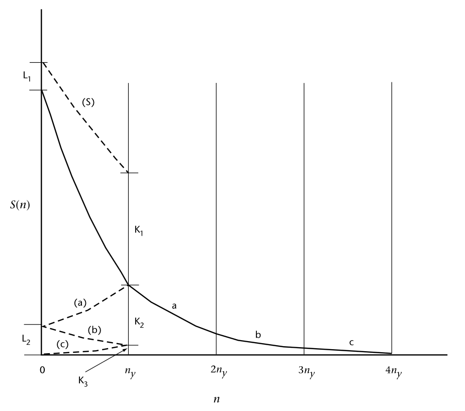
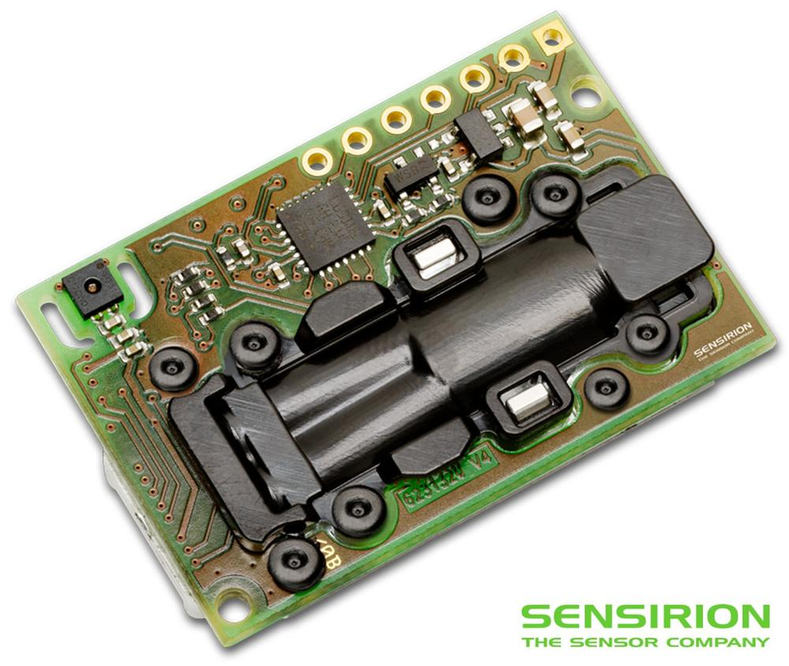

Misurare
++++++++

Come effettuare corrette misurazioni di parametri ambientali.

Metrologia
==========

Scienza della misurazione e delle sue applicazioni

* Vocabolario internazionale di metrologia
  * https://www.ceinorme.it/it/normazione-it/vim/vim-content-it
  * Terminologia per le misurazioni analitiche Introduzione al VIM 3
  :download:`pdf <TAM_2011_IT.pdf>`
* https://www.iso.org/obp/ui/

Monitoraggio ambientale
=======================

Il monitoraggio ambientale descrive i processi e le attività che
devono aver luogo per caratterizzare e monitorare la qualità
dell'ambiente.

Il monitoraggio ambientale viene utilizzato quando le attività umane
comportano un rischio di effetti dannosi sull'ambiente naturale o
viceversa.  Serve per stabilire lo stato attuale di un ambiente o
tendenze dei parametri ambientali.

I risultati del monitoraggio saranno rivisti, analizzati
statisticamente e pubblicati. La progettazione di un programma di
monitoraggio deve pertanto tenere conto dell'uso finale dei dati prima
dell'inizio del monitoraggio.

* Aria
* Acqua
* Suolo

Componenti fisiche, chimiche, biologiche, radiologiche ...

Definizioni
===========

Data Level
----------

- Dati Level I , sono le letture dirette degli strumenti espresse in
  appropriate unità fisiche e georeferenziate

- Dati Level II, dati riconosciuti come variabili meteorologiche;
  possono essere ottenuti direttamente da strumenti o derivati dai
  dati Level I

- Dati Level III sono quelli contenuti in dataset internamente
  consistenti, generalmente su grigliato.
   
I dati scambiati a livello internazionale sono livello II o livello III

Campionamento
-------------

Processo per ottenere una sequenza discreta di misurazioni di una
grandezza.

Campione
--------

Una singola misura, in genere una di una serie di letture spot di un
sistema di sensori. Si noti che questo differisce dal significato
usuale in statistica di un insieme di numeri o misure che fa parte di
una popolazione.

Un'osservazione
---------------

Il risultato del processo di campionamento, ovvero la quantità
riportata o registrata (spesso chiamata anche misura). Nel contesto
dell'analisi delle serie temporali, un'osservazione deriva da un certo
numero di campioni.

Una misura
----------

La definizione ISO è "un insieme di operazioni aventi per oggetto la
determinazione del valore di una grandezza". Nell'uso comune, il
termine può essere utilizzato per indicare il valore di un campione o
di un'osservazione.

Tempo di campionamento o periodo di osservazione
------------------------------------------------

La durata del tempo in cui viene effettuata un'osservazione, durante
la quale vengono prelevati un certo numero di campioni individuali.

Intervallo di campionamento
---------------------------

L'intervallo di tempo tra osservazioni successive.

Funzione di campionamento o funzione di ponderazione
----------------------------------------------------

Nella sua definizione più semplice, un algoritmo per calcolare la
media o filtrare i singoli campioni.

Frequenza di campionamento
--------------------------

La frequenza con cui vengono prelevati i campioni. La distanza tra i
campioni è il tempo che intercorre tra un campione e l'altro.

Attenuazione
------------

Processo di attenuazione delle componenti ad alta frequenza dello
spettro senza influenzare in modo significativo le frequenze più
basse. Di solito viene effettuato per rimuovere il rumore (errori e
fluttuazioni casuali non rilevanti per l'applicazione).

Filtro
------

Dispositivo che consente di attenuare o selezionare le frequenze
prescelte. L'attenuazione viene eseguita da un filtro passa-basso e i
termini attenuazione e filtraggio sono spesso usati in modo
intercambiabile in questo senso. In questo senso. Tuttavia, esistono
anche filtri passa-alto e passa-banda. Il filtraggio può essere una
proprietà dello strumento, come l'inerzia, oppure può essere eseguito
elettronicamente o numericamente.

Accuratezza e Precisione
------------------------

**L’accuratezza** è la vicinanza di un valore misurato al suo valore reale
(accuracy is the closeness of a measured value to its true value) e in
buona parte dipende dallo strumento. Per esempio, nelle misure
ecologiche, il metodo delle trappole per la stima della quantità di
individui in una popolazione e quello del C-14 per la produzione di
plancton nell’oceano tropicale hanno una accuratezza molto bassa; cioè
possono essere molto distanti dal valore reale. Ogni stima, ripetuta
nelle stesse condizioni, può dare la metà del valore reale. Uno
strumento o un reagente che forniscono una risposta sbagliata spesso
sono tarati in modo non corretto e sono definiti inaccurati; i valori
ottenuti sono biased.

Nel processo di misurazione con uno strumento inaccurato si commette
un errore sistematico, chiamato appunto bias. Esso rappresenta un
problema importante e ricorrente, in molte tecniche di stima di una
quantità. In varie discipline, il progresso è spesso collegato alla
ricerca di metodi di misurazione più accurati.

**La precisione (ripetibilità)** è la vicinanza di misure ripetute al medesimo valore (precision is the closeness of repeated measuments to the same item). Spesso dipende dalla capacità del tecnico di ripetere la misurazione con le stesse modalità e ha origine  dalla sua esperienza o abilità.

I concetti di accuracy, precision e bias applicati a una misura di
peso sono rappresentati graficamente nella figura successiva tratta
dall’ottimo testo, per la stima di popolazioni animali e vegetali, di
Charles J. Krebs del 1999 (Ecological methodology, 2nd ed. Menlo Park,
CA, Cummings, pp. XII, 620),

.. figure :: image119.gif 

figura A e B

.. figure :: image120.gif 

figura C e D

* Nella figura A le misure sono accurate, vicine al valore vero (true
  value), e molto precise (high precision).

* Nella figura B le misure sono accurate ma poco precise (low
  precision), cioè differenti tra loro.

* Nella figura C le misure sono non accurate (biased) ma molto precise
  (high precision).

* Nella figura D le misure sono non accurate (biased) e poco
  precise (low precision).

**Esempio**: la differenza tra accuratezza e precisione si può
spiegare facilmente utilizzando l’analogia di una freccia lanciata
verso un bersaglio.  L’accuratezza descrive la vicinanza della freccia
al barilotto.

.. figure ::   sensor-precision-example1.png
   :scale: 30 %

   tiro accurato
   
.. figure :: sensor-accuracy-example1.webp
   :scale: 30 %

   tiro preciso

Se venissero lanciate diverse frecce, la precisione verrebbe indicata
dalle dimensioni del gruppo di frecce.  Se le frecce sono raggruppate
tutte insieme, il tiro viene considerato preciso.

Leggi di scala
==============

Le leggi di scala riguardano il comportamento di una struttura in
funzione della scala da cui la si guarda. Per i sistemi regolari, sia
matematici sia fisici e naturali, il sistema a grande scala è, in
genere, molto diverso da quello a piccola scala. Per esempio, la Terra
è un punto rispetto alla scala galattica, poi se ci si avvicina appare
come una sfera, dopo ancora come una superficie quasi piana, in
seguito appaiono i rilievi montuosi e le coste, poi le città, e così
via. Le strutture matematiche usuali sono, in genere, molto più
semplici e perdono struttura alle scale molto piccole. Per esempio,
una sfera può essere approssimata dal suo piano tangente.

A partire dalla struttura stessa dell'Universo a grande scala,
passando per le complesse forme delle strutture biologiche, fino alle
interazioni elementari tra i costituenti fondamentali della materia,
tutti questi sistemi mostrano delle ben definite leggi di
scala. Queste leggi caratterizzano il cambiamento del sistema sotto
l'effetto di una trasformazione della scala delle lunghezze, e
rappresentano un elemento essenziale per la comprensione della
complessità del sistema.

Per un sistema con una scala caratteristica, come un atomo, le leggi
di scala non sono particolarmente interessanti. Infatti, se
consideriamo una scala di lunghezze dell'ordine di quella dell'atomo
stesso, potremo definire in modo adeguato tutte le sue proprietà: il
nucleo centrale e la distribuzione degli elettroni intorno a esso. Se
però consideriamo una scala molto più grande, l'atomo diventa a tutti
gli effetti puntiforme e non mostra proprietà particolarmente
interessanti. Questa situazione cambia completamente se prendiamo in
esame una struttura molto familiare, ma abbastanza complessa, come
quella di un albero. In questo caso possiamo partire dagli atomi che
formano molecole, che poi formano le cellule, le fibre, quindi le più
piccole foglie e i rami, i quali sono man mano più grandi e mostrano
ramificazioni sia a piccole sia a grandi scale. Infine, arriviamo
all'intero albero che, per scale molto più grandi, può essere
considerato anch'esso puntiforme. Esiste però un'ampia varietà di
scale in cui le proprietà sono abbastanza simili, per esempio la
biforcazione dei rami avviene sia per i rami piccoli sia per quelli
più grandi. In questa regione di scale, diciamo dalle fibre al tronco,
possiamo definire un'approssimativa invarianza di scala con le sue
proprietà caratteristiche. Questa proprietà naturalmente si estende da
una scala minima, quella delle fibre, a una massima, quella del tronco
o dell'albero stesso. Queste proprietà di scala sono essenziali per la
comprensione delle complessità della struttura e della sua
funzionalità, e costituiscono una delle caratterizzazioni fondamentali
delle strutture complesse.

:ref:`Data level nelle RMAP RFC<data_level-reference>`

Campionamento delle variabili
=============================

Le variabili atmosferiche come la velocità del vento, la temperatura,
la pressione e l'umidità sono funzioni di quattro dimensioni: due
orizzontali, una verticale e una temporale. Esse variano
irregolarmente in tutte e quattro e lo scopo dello studio del
campionamento è quello di definire procedure di misurazione pratiche
per ottenere osservazioni rappresentative con incertezze accettabili
nelle stime della media e della variabilità.

L'argomento può essere affrontato a due livelli:

a) A livello elementare, si può discutere il problema meteorologico di
   base, che consiste nell'ottenere un valore medio di una grandezza
   fluttuante rappresentativa di un determinato intervallo di
   campionamento in un dato momento, utilizzando sistemi strumentali
   con tempi di risposta lunghi rispetto alle fluttuazioni. Al livello
   più semplice, ciò comporta considerazioni sulle statistiche di
   un insieme di misure e dei tempi di risposta degli strumenti e dei
   circuiti elettronici;

b) Il problema può essere considerato in modo più preciso facendo uso
   della teoria dell'analisi delle serie temporali, del concetto di
   spettro delle fluttuazioni e del comportamento dei filtri. Questi
   argomenti sono necessari per il problema più complesso
   dell'utilizzo di strumenti a risposta relativamente rapida per
   ottenere misure soddisfacenti della media o dello spettro di una
   grandezza che varia rapidamente, come il vento.

È importante riconoscere che una variabile atmosferica in realtà non
viene mai campionata. È solo possibile avvicinarsi il più possibile
campionando l'uscita di un sensore di quella variabile.  La
distinzione è importante perché i sensori non creano un analogo esatto
della variabile rilevata.  In generale, i sensori rispondono più
lentamente dei cambiamenti dell'atmosfera e aggiungono rumore.

I sensori fanno anche altre cose, di solito indesiderabili, come la
deriva nella calibrazione, la risposta non lineare, l'interferenza con
la grandezza che stanno misurando, il fallimento più frequente di
quanto previsto e così via, ma questa discussione riguarderà solo la
risposta e l'aggiunta di rumore.

Rappresentatività nel tempo e nello spazio
------------------------------------------

Le osservazioni campionarie vengono effettuate a una frequenza e per
un intervallo di tempo limitati su un'area circoscritta. In pratica,
le osservazioni dovrebbero essere progettate in modo da essere
sufficientemente frequenti da essere rappresentative delle parti non
campionate della variabile (continua) e sono spesso considerate
rappresentative di un intervallo di tempo più lungo e di un'area più
ampia.

L'utente di un'osservazione si aspetta che sia rappresentativa, o
tipica, di un'area e di un tempo, e di un intervallo di
tempo. Quest'area, ad esempio, può essere "l'aeroporto" o l'area
compresa in un raggio di diversi chilometri e facilmente visibile da
un osservatore umano. L'ora è quella in cui è stata fatta la
segnalazione o è stato trasmesso il messaggio, mentre l'intervallo è
una quantità concordata, spesso 1, 2 o 10 minuti.

Per rendere rappresentative le osservazioni, i sensori vengono esposti
ad altezze standard e in posizioni non ostruite e i campioni vengono
elaborati per ottenere valori medi. In alcuni casi, i sensori, ad
esempio i trasmissometri, hanno una media spaziale intrinseca, che
contribuisce alla rappresentatività dell'osservazione. L'osservazione
umana della visibilità ne è un altro esempio. Tuttavia, il resto della
discussione in questo capitolo ignorerà il campionamento spaziale e si
concentrerà sul campionamento temporale delle misure effettuate in un
punto.

Un esempio tipico di campionamento e media temporale è la misurazione
della temperatura ogni minuto (i campioni), il calcolo di una media di
10 minuti (l'intervallo di campionamento e la funzione di
campionamento) e la trasmissione di questa media (l'osservazione) in
un rapporto sinottico ogni 3 ore.

Quando queste osservazioni vengono raccolte per un periodo dallo
stesso sito, diventano esse stesse campioni in una nuova sequenza
temporale con uno spazio di 3 ore. Quando vengono raccolte da un gran
numero di siti, anche queste osservazioni diventano campioni in una
sequenza spaziale. In questo senso, le osservazioni rappresentative
sono anche campioni rappresentativi. In questo capitolo discutiamo
dell'osservazione iniziale.

Gli spettri delle grandezze atmosferiche
----------------------------------------

Applicando l'operazione matematica nota come trasformata di Fourier,
una funzione irregolare del tempo (o della distanza) può essere
ridotta al suo spettro, che è la somma di un gran numero di sinusoidi,
ciascuna con la propria ampiezza, lunghezza d'onda (o periodo o
frequenza) e fase. In generale, queste lunghezze d'onda (o frequenze)
definiscono "scale" o "scale di moto" dell'atmosfera.

La gamma di queste scale è limitata nell'atmosfera. A un estremo dello
spettro, le scale orizzontali non possono superare la circonferenza
della Terra o circa 40 000 km. Per scopi meteorologici, le scale
verticali non superano le poche decine di chilometri. Nella dimensione
temporale, invece, le scale più lunghe sono quelle climatologiche e,
in linea di principio, non hanno limiti, ma in pratica il periodo più
lungo non supera la lunghezza dei record. All'estremità breve, la
dissipazione viscosa dell'energia turbolenta in calore stabilisce un
limite inferiore. Vicino alla superficie della Terra, questo limite si
trova a una lunghezza d'onda di pochi centimetri e aumenta con
l'altezza fino a pochi metri nella stratosfera. Nella dimensione
temporale, queste lunghezze d'onda corrispondono a frequenze di decine
di hertz. È corretto dire che le variabili atmosferiche hanno una
larghezza di banda limitata.

La Figura 2.1 è una rappresentazione schematica dello spettro di una
grandezza meteorologica come il vento, misurato in una particolare
stazione e in un determinato momento.

L'ordinata, comunemente chiamata energia o densità spettrale, è legata
alla varianza delle fluttuazioni del vento ad ogni frequenza n. Lo
spettro della Figura 2.1 ha un minimo di energia alla mesoscala
intorno a un ciclo all'ora, tra picchi nella scala sinottica intorno a
un ciclo ogni quattro giorni e nella microscala intorno a un ciclo al
minuto. Le lunghezze d'onda più piccole sono di pochi centimetri e le
frequenze più grandi sono di decine di hertz.

.. image :: A_typical_spectrum_of_a_meteorological_quantity.png

Serie temporali, spettri di potenza e filtri
--------------------------------------------

Questa sezione è un'introduzione per i non addetti ai lavori ai
concetti di analisi delle serie temporali che sono alla base delle
buone pratiche di campionamento. Nel contesto della presente Guida,
sono particolarmente importanti per la misurazione del vento, ma gli
stessi problemi si presentano per la temperatura, la pressione e altre
grandezze. Sono diventati importanti per le misurazioni meteorologiche
di routine quando sono state introdotte le misurazioni automatiche,
perché in tal modo è stato possibile effettuare campionamenti
frequenti e veloci. Se i sistemi non sono progettati correttamente,
possono verificarsi gravi errori nelle stime della media, degli
estremi e dello spettro.

Sebbene le misure di spettro non siano di routine, hanno molte
applicazioni. Lo spettro del vento è importante per l'ingegneria, la
dispersione atmosferica, la diffusione e la dinamica. I concetti qui
discussi sono utilizzati anche per l'analisi quantitativa dei dati
satellitari (nella dimensione spaziale orizzontale) e in climatologia
e micrometeorologia.

In sintesi, l'argomentazione è la seguente:

(a) La frequenza di campionamento ottimale può essere valutata
    considerando la variabilità della grandezza da misurare. Le stime
    della media e di altre statistiche delle osservazioni avranno
    incertezze minori con frequenze di campionamento più elevate, cioè
    con campioni più grandi;

(b) Il teorema di Nyquist afferma che una grandezza continua e
    fluttuante può essere determinata con precisione da una serie di
    campioni equispaziati se sono sufficientemente vicini;

(c) Se la frequenza di campionamento è troppo bassa, le fluttuazioni
    alle frequenze più alte non campionate (al di sopra della
    frequenza di Nyquist) influenzeranno la stima
    del valore medio. Esse influenzeranno anche il calcolo delle
    frequenze più basse e lo spettro misurato non sarà
    corretto. Questo fenomeno è noto come aliasing. Può causare gravi
    errori se non viene compreso e tenuto in considerazione nella
    progettazione del sistema;

(d) L'aliasing può essere evitato utilizzando una frequenza di
    campionamento elevata o filtrando in modo da poter utilizzare una
    frequenza di campionamento più bassa e conveniente;

(e) I filtri possono essere digitali o analogici. Un sensore con un
    tempo di risposta adeguatamente lungo funge da filtro.

Una comprensione completa del campionamento implica la conoscenza
degli spettri di potenza, del teorema di Nyquist, del filtraggio e
della risposta degli strumenti. Si tratta di una materia altamente
specializzata, che richiede la comprensione delle caratteristiche dei
sensori utilizzati, del modo in cui l'uscita dei sensori viene
condizionata, elaborata e registrata, delle proprietà fisiche degli
elementi misurati e dello scopo per cui i dati analizzati devono
essere utilizzati. A sua volta, ciò può richiedere competenze nella
fisica degli strumenti, nella teoria dei sistemi elettronici o di
altro tipo utilizzati nei processi di condizionamento e registrazione,
nella matematica, nella statistica e nella meteorologia dei fenomeni,
tutte cose che vanno ben oltre lo scopo di questo capitolo.

Tuttavia, è possibile per un non esperto comprendere i principi di
buona pratica nella misurazione delle medie e degli estremi e
apprezzare i problemi associati alle misure degli spettri.

Analisi delle serie temporali
.............................

È necessario considerare i segnali nel dominio del tempo o della
frequenza. L'idea fondamentale fondamentale dell'analisi spettrale è
il concetto di trasformata di Fourier. Una funzione, f(t), definita
tra t = 0 e t = τ può essere trasformata nella somma di un insieme di
funzioni sinusoidali:

.. math::
   f(t)=\sum_{j=0 }^{\infty}\alpha_{j}\sin(j\omega t + \phi_{j})

l'ampiezza e la fase associate a ciascun contributo spettrale sono α j
e ϕ j . Entrambi possono essere influenzati dal campionamento e
dall'elaborazione.

Finora si è ipotizzato che la funzione f(t) sia nota in modo continuo
in tutto l'intervallo da t = 0 a t = τ. In realtà, nella maggior parte
degli esempi questo non è il caso; la variabile meteorologica viene
misurata in punti discreti di una serie temporale, che è una serie di
N campioni equidistanti l'uno dall'altro Δt durante un periodo
specifico τ = (N-1)Δt. Si presume che i campioni vengano prelevati
istantaneamente, un'ipotesi che non è assolutamente vera, poiché tutti
i dispositivi di misura richiedono un certo tempo per determinare il
valore che stanno misurando. Nella maggior parte dei casi, questo
tempo è breve rispetto alla distanza tra i campioni Δt.

Anche se non lo è, il tempo di risposta del sistema di misura può
essere tenuto in considerazione nell'analisi, anche se non verrà
trattato in questa sede.

Se si considerano i dati che si otterrebbero campionando una funzione
sinusoidale a intervalli di tempo Δt, si può notare che la frequenza
più alta che può essere rilevata è 1/(2Δt), e che in realtà qualsiasi
sinusoide di frequenza più alta che possa essere presente nella serie
temporale è rappresentata nei dati come se avesse una frequenza più
bassa. La frequenza 1/(2Δt) è chiamata frequenza di Nyquist, qui
indicata come ny . La frequenza di Nyquist è talvolta chiamata
frequenza di ripiegamento. Questa terminologia deriva dalla
considerazione dell'aliasing dei dati. Il concetto è illustrato
schematicamente nella Figura successiva.

Quando si effettua un'analisi spettrale di una serie temporale, a
causa della natura discreta dei dati, il contributo alla stima alla
frequenza n contiene anche contributi da frequenze più alte, cioè da 2
jn y ± n (j = 1 a ∞). Un modo per visualizzare questo aspetto è quello
di considerare il dominio delle frequenze come se fosse piegato, in
modo concertato, a n = 0 e n = ny e così via a passi di ny .

La stima spettrale a ciascuna frequenza dell'intervallo è la somma di
tutti i contributi delle frequenze superiori che la sovrastano.

Gli effetti pratici dell'aliasing sono illustrati al :ref:`capitolo
frequenza di campionamento<frequenza_di_campionamento-reference>`. È
un problema potenzialmente serio e deve essere preso in considerazione
quando si progettano sistemi strumentali. Può essere evitato
minimizzando, o riducendo a zero, l'intensità del segnale a frequenze
superiori a ny . Ci sono un paio di modi per ottenere questo
risultato. In primo luogo, il sistema può contenere un filtro
passa-basso che attenua i contributi alle frequenze superiori a ny
prima che il segnale venga digitalizzato. L'unico svantaggio di questo
approccio è che la tempistica e l'entità delle variazioni rapide non
saranno registrate bene, o addirittura per niente.

Il secondo approccio consiste nell'avere un Δt abbastanza piccolo da
rendere insignificanti i contributi al di sopra della frequenza di
Nyquist. Questo è possibile perché gli spettri della maggior parte
delle variabili meteorologiche cadono molto rapidamente a frequenze
molto alte. Questo secondo approccio, tuttavia, non sarà sempre
praticabile, come nell'esempio delle misure di temperatura su tre ore,
dove se Δt è dell'ordine delle ore, le fluttuazioni su piccola scala
non sono in grado di soddisfare le esigenze di un'analisi di
temperatura dell'ordine delle ore, le fluttuazioni su piccola scala, dell'ordine
dei minuti o dei secondi, possono avere ordinate spettrali
relativamente grandi e alias forti. In questo caso, il primo metodo
può essere appropriato.

Misurazione degli spettri
.........................

La densità spettrale, almeno così come viene stimata da una serie
temporale, è definita come:

S n j = A 2 j + B 2 j
)
n y = α 2 j n y

Si noti che la fase non è rilevante in questo caso.

	    Illustrazione schematica dell'aliasing di uno spettro
	    calcolato da una serie temporale stazionaria. Lo spettro
	    può essere calcolato solo nell'intervallo di frequenza da
	    zero alla frequenza di Nyquist ny . I valori reali delle
	    energie alle frequenze più alte sono indicati dai settori
	    contrassegnati con a, b e c. Questi sono "ripiegati" sul
	    settore da n = 0 a ny, come indicato dalle linee spezzate
	    (a), (b), (c). Lo spettro calcolato, indicato dalla linea
	    spezzata in grassetto (S), include la somma di questi
	    settori.

Lo spettro di una grandezza fluttuante può essere misurato in diversi
modi. In passato, in elettrotecnica, veniva spesso determinato facendo
passare il segnale attraverso filtri passa-banda e misurando la
potenza in uscita. Questa veniva poi messa in relazione con la potenza
della frequenza centrale del filtro.

Esistono diversi modi per affrontare l'analisi spettrale numerica di
una serie temporale. Il più ovvio è la trasformata di Fourier diretta
della serie temporale. In questo caso, poiché la serie ha una
lunghezza finita, la trasformazione avrà solo un numero finito di
componenti di frequenza.

Se ci sono N termini nella serie temporale, ci saranno N/2 frequenze
risultanti da questa analisi.

Il calcolo diretto è molto laborioso e sono stati sviluppati altri
metodi. Il primo sviluppo risale a Blackman e Tukey (1958), che hanno
messo in relazione la funzione di autocorrelazione con le stime di
varie funzioni spettrali. (La funzione di autocorrelazione r(t) è il
coefficiente di correlazione calcolato tra i termini della serie
temporale separati da un intervallo di tempo t). Questo metodo era
appropriato per le strutture di calcolo a bassa potenza degli anni '50
e '60, ma ora è stato generalmente sostituito dalla cosiddetta
trasformata rapida di Fourier (FFT), che sfrutta le proprietà generali
di un computer digitale per accelerare notevolmente i calcoli.

La principale limitazione del metodo è che la serie temporale deve
contenere 2^k termini, dove k è un numero intero. In generale, questo
non è un problema serio, poiché nella maggior parte dei casi ci sono
dati sufficienti per organizzare convenientemente la serie a tale
lunghezza. In alternativa, alcuni programmi informatici FFT possono
utilizzare un numero arbitrario di termini e aggiungere dati sintetici
per arrivare a 2^k .

Poiché la serie temporale ha una durata finita (N termini),
rappresenta solo un campione del segnale di interesse. Pertanto, i
coefficienti di Fourier sono solo una stima del valore vero, o della
popolazione.

Per migliorare l'affidabilità, è prassi comune fare una media di un
numero di termini per ogni lato di una particolare frequenza e
assegnare questa media al valore di tale frequenza. In questo modo
l'intervallo di confidenza della stima si restringe. Come regola
empirica, si suggerisce che 30 gradi di libertà siano un numero
soddisfacente per scopi pratici. Pertanto, poiché ogni stima
effettuata durante la trasformata di Fourier ha 2 gradi di libertà
(associati ai coefficienti dei termini seno e coseno), di solito
vengono mediati circa 15 termini. Si noti che 16 è un numero migliore
se si utilizza un approccio FFT, poiché è 2 4 e ci sono esattamente
2k/24 (= 2^(k-4) ) stime spettrali; ad esempio, se ci sono 1 024 termini
nella serie temporale (quindi k = 10), ci saranno 512 stime degli As e
dei Bs, e 64 (= 2^(10-4) ) stime smussate.

L'uso di queste analisi è sempre più parte integrante dei sistemi
meteorologici e non riguarda solo l'analisi dei dati. La forma esatta
degli spettri che si incontrano in meteorologia può presentare
un'ampia gamma di forme. Come si può immaginare, i contributi possono
andare dalle frequenze più basse associate ai cambiamenti climatici,
ai contributi annuali e stagionali, agli eventi sinottici con periodi
di giorni, ai contributi diurni e semidiurni e agli eventi locali a
mesoscala fino alla turbolenza e alle variazioni molecolari. Per la
maggior parte delle applicazioni meteorologiche, compresa l'analisi
sinottica, l'interesse è compreso tra i minuti e i secondi. Lo spettro
a queste frequenze diminuisce in genere molto rapidamente con la
frequenza. Per periodi inferiori a 1 minuto, lo spettro assume spesso
valori proporzionali a n - 5/3. Pertanto, il contributo delle
frequenze superiori a 1 Hz è spesso relativamente scarso.

Una delle proprietà importanti dello spettro è che:

∑ S ( n j ) = σ 2
(2.4)
j = 0

dove σ^2 è la varianza della grandezza misurata. Spesso è conveniente,
per l'analisi, esprimere lo spettro in forma continua, in modo che
l'equazione 2.4 diventi:

∞
∫ S ( n ) dn = σ
2
(2.5)
0

Dalle equazioni si evince che i cambiamenti causati allo
spettro, ad esempio dal sistema strumentale, altereranno il valore di
σ^2 e quindi le proprietà statistiche dell'uscita rispetto
all'ingresso. Questa può essere una considerazione importante nella
progettazione dello strumento e nell'analisi dei dati.

Si noti anche che il lato sinistro dell'equazione 2.5 è l'area sotto
la curva nella Figura 2.2. Quest'area, e quindi la varianza, non viene
modificata dall'aliasing se la serie temporale è stazionaria, cioè se
il suo spettro non cambia da un momento all'altro.

Risposta del sistema strumentale 
................................

I sensori, e i circuiti elettronici che possono essere utilizzati con
essi e che costituiscono un sistema strumentale, hanno tempi di
risposta e caratteristiche di filtraggio che influenzano le
osservazioni.

Nessun sistema strumentale meteorologico, o qualsiasi altro sistema
strumentale, segue con precisione la grandezza che sta misurando. In
generale, non esiste un modo semplice per descrivere la risposta di un
sistema, anche se esistono alcune approssimazioni ragionevoli. Le più
semplici possono essere classificate come risposte del primo e del
secondo ordine. Ciò si riferisce all'ordine dell'equazione
differenziale utilizzata per approssimare il modo in cui il sistema
risponde. Per un esame dettagliato dei concetti che seguono, ci sono
molti riferimenti nei libri di testo di fisica e nella letteratura (si
veda MacCready e Jex, 1964).

In un sistema del primo ordine, come un semplice sensore o il più
semplice circuito di filtro passa-basso, la velocità di variazione del
valore registrato dallo strumento è direttamente proporzionale alla
differenza tra il valore registrato dallo strumento e il valore reale
della variabile. Pertanto, se il valore vero al tempo t è s(t) e il
valore misurato dal sensore è s0(t), il sistema è descritto
dall'equazione differenziale del primo ordine:

ds 0 ( t )
dt
=
s ( t ) − s 0 ( t )
(2.6)
T I

dove TI è una costante con la dimensione del tempo, caratteristica del
sistema. La risposta di un sistema del primo ordine a una funzione
passo-passo è proporzionale a exp(-t/TI), e TI è osservabile come il
tempo necessario, dopo una variazione di passo, affinché il sistema
raggiunga il 63% della lettura stabile finale. L'equazione 2.6 è
valida per molti sensori, come i termometri.

L'anemometro a coppa è uno strumento del primo ordine, con la
proprietà speciale che TI non è costante.

Varia con la velocità del vento. Infatti, il parametro s0 TI è
chiamato costante di distanza, perché è quasi costante. Come si può
notare in questo caso, l'equazione sopra non è più una semplice
equazione del primo ordine, poiché ora è non lineare e di conseguenza
presenta notevoli problemi nella sua soluzione.
Un ulteriore problema è che TI dipende anche dal fatto che le tazze
stiano accelerando o rallentando, cioè che il lato destro sia positivo
o negativo. Ciò è dovuto al fatto che il coefficiente di resistenza
aerodinamica di una coppa è minore se il flusso d'aria è diretto verso
la parte anteriore piuttosto che verso quella posteriore.

La banderuola approssima un sistema del secondo ordine perché
l'accelerazione della banderuola verso la direzione vera del vento è
proporzionale allo spostamento della banderuola dalla direzione vera.

Questa è, ovviamente, la descrizione classica di un oscillatore (ad
esempio, un pendolo). Le pale, sia per natura che per progettazione,
sono smorzate. Ciò avviene a causa di una forza resistiva
proporzionale e contraria alla sua velocità di variazione. Pertanto,
l'equazione differenziale che descrive l'azione della paletta è:

d 2 φ 0 ( t )
dt
2
= k 1  φ 0 ( t ) − φ ( t )  − k 2
d φ 0 ( t )
dt

dove ϕ è la direzione vera del vento; ϕ0 è la direzione della
banderuola; e k1 e k2 sono costanti. La soluzione è un'oscillazione
smorzata alla frequenza naturale della banderuola (determinata dalla
costante k 1 ). Lo smorzamento è ovviamente molto importante; è
controllato dalla costante k2 . Se è troppo piccola, la banderuola
oscillerà semplicemente alla frequenza naturale; se è troppo grande,
la banderuola non risponderà ai cambiamenti di direzione del vento.

È istruttivo considerare come questi due sistemi rispondono a una
variazione graduale del loro ingresso, poiché questo è un esempio del
modo in cui gli strumenti rispondono nel mondo reale. Le due equazioni precedenti
possono essere risolte analiticamente per questo ingresso. Le
risposte sono mostrate nelle due Figure successive.

Si noti che in nessuno dei due casi il sistema misura il valore reale
dell'elemento. Inoltre, la scelta dei valori delle costanti k1 e k2
può avere un grande effetto sulle uscite.

Una proprietà importante di un sistema strumentale è la sua funzione
di risposta in frequenza o funzione di trasferimento H(n). Questa
funzione indica la quantità di spettro trasmessa dal sistema.

Può essere definita come:

S ( n ) out = H ( n ) S ( n ) in

dove i pedici si riferiscono agli spettri di ingresso e di uscita. Si
noti che, in virtù della relazione dell'equazione 2.5, la varianza
dell'uscita dipende da H(n). H(n) definisce l'effetto del sensore come
filtro, come discusso nella sezione successiva. I modi in cui può
essere calcolato o misurato sono illustrati nel paragrafo
:ref:`determinazione delle caratteristiche del
sistema<determinazione_delle_caratteristiche_del_sistema-reference>`.

I filtri
........

Questa sezione illustra le proprietà dei filtri, con esempi dei modi
in cui possono influenzare i dati.

Il filtraggio è l'elaborazione di una serie temporale (continua o
discreta, cioè campionata) in modo tale che il valore assegnato in un
determinato momento sia ponderato dai valori che si sono verificati in
un altro momento.

	    La risposta di un sistema del primo ordine a una funzione
	    a gradino. Al tempo TI il sistema ha raggiunto il 63%
	    del suo valore finale.

.. figure:: second_order.png

	    La risposta di un sistema del secondo ordine a una
	    funzione a gradino. pN è il periodo naturale, legato a
	    k1 nell'equazione 2.7, che, per una banderuola, dipende
	    dalla velocità del vento. Le curve mostrate si riferiscono
	    a fattori di smorzamento con valori di 0,1 (smorzamento
	    molto leggero), 0,7 (smorzamento critico, ottimale per la
	    maggior parte degli scopi) e 2,0 (smorzamento forte). Il
	    fattore di smorzamento è correlato a k2 nell'equazione
	    2.7

Nella maggior parte dei casi, questi orari saranno adiacenti all'ora
indicata. Ad esempio, in una serie temporale discreta di N campioni
numerati da 0 a N, con valore yi , il valore dell'osservazione
filtrata ӯi può essere definito come:

y i =
m
∑
j = − m
(2.9)
w j y i + j

Qui ci sono 2m + 1 termini nel filtro, numerati dalla variabile dummy
j da -m a +m, e ӯi è centrato su j = 0. Alcuni dati vengono scartati
all'inizio e alla fine del tempo di campionamento.  wj è comunemente
chiamata funzione di ponderazione e tipicamente è:

∑
j = − m
(2.10)
w j = 1

in modo che almeno il valore medio della serie filtrata abbia lo
stesso valore di quella originale.

L'esempio precedente utilizza il filtraggio digitale. Effetti simili
possono essere ottenuti con l'elettronica (ad esempio, con un circuito
di resistenze e condensatori) o con le caratteristiche del sensore (ad
esempio, come nel caso dell'anemometro, discusso in precedenza). Che
sia digitale o analogico, un filtro è caratterizzato da H(n). Se
digitale, H(n) può essere calcolato; se analogico, può essere ottenuto
con i metodi descritti al punto 2.3.

Ad esempio, si confronti un sistema del primo ordine con un tempo di
risposta di TI , e un filtro "box car" di lunghezza Ts su una serie
temporale discreta prelevata da un sensore con una risposta molto più
rapida. Le forme di questi due filtri sono mostrate nella Figura
successiva. Nel primo, è come se lo strumento avesse una memoria che è più
forte nell'istante presente, ma che diminuisce esponenzialmente quanto
più i dati sono lontani nel tempo. Il filtro box car ha tutti i pesi
di uguale entità per il periodo T s e zero oltre. Le funzioni di
risposta in frequenza, H(n), per questi due filtri sono mostrate nella
Figura 2.6.

Nella figura, le frequenze sono state scalate per mostrare la
somiglianza delle due funzioni di risposta. La figura mostra che uno
strumento con un tempo di risposta, ad esempio, di 1 s ha
approssimativamente lo stesso effetto su un ingresso di un filtro box
car applicato per 4 s.

	    I fattori di ponderazione per una funzione di ponderazione
	    del primo ordine (esponenziale) e per una funzione di
	    ponderazione del box auto. Per il box car Ta è Ts , il
	    tempo di campionamento, e w = 1/N. Per la funzione del
	    primo ordine Ta è TI , la costante di tempo del filtro,
	    e w(t) = (1/TI) exp (-t/TI).

	    Funzioni di risposta in frequenza per una funzione di
	    ponderazione del primo ordine (esponenziale) e una
	    funzione di ponderazione box car. La frequenza è
	    normalizzata per il filtro del primo ordine da T I, la
	    costante di tempo, e per il filtro box car da T s, il
	    tempo di campionamento.
	    
Tuttavia, va notato che un filtro box car, che
viene calcolato numericamente, non si comporta in modo semplice. Non
rimuove tutte le frequenze più alte oltre la frequenza di Nyquist e
può essere utilizzato validamente solo se lo spettro cade rapidamente
al di sopra di n y . Si noti che il filtro box car mostrato nella
Figura 2.6 è una soluzione analitica per w come funzione continua; se
il numero di campioni nel filtro è piccolo, il taglio è meno netto e i
picchi indesiderati di frequenza superiore sono più grandi.

Si veda Acheson (1968) per consigli pratici sul box car e sul
filtraggio esponenziale e per un confronto dei loro effetti.

Nella Figura 2.7 è riportata la funzione di risposta di un sistema del
secondo ordine, in questo caso per una banderuola, che mostra come lo
smorzamento agisca come un filtro passa-banda.

Si può notare che l'elaborazione dei segnali da parte dei sistemi può
avere effetti profondi sui dati in uscita e deve essere eseguita con
competenza.

Tra gli effetti dei filtri vi è il modo in cui essi possono modificare
le informazioni statistiche dei dati. Uno di questi è stato accennato
prima e illustrato nelle equazioni 2.5 e 2.8. L'equazione 2.5 mostra
come l'integrale dello spettro su tutte le frequenze dia la varianza
della serie temporale, mentre l'equazione 2.8 mostra come il
filtraggio, in virtù dell'effetto della funzione di trasferimento,
modifichi lo spettro misurato. Si noti che la varianza non sempre
diminuisce con il filtraggio. Ad esempio, in alcuni casi, per un
sistema del secondo ordine, la funzione di trasferimento amplificherà
alcune parti dello spettro ed eventualmente aumenterà la varianza,
come mostrato nella Figura 2.7.

Per fare un altro esempio, se la distribuzione è gaussiana, la
varianza è un parametro utile. Se fosse diminuita dal filtraggio, un
utente dei dati sottostimerebbe l'allontanamento dalla media degli
eventi che si verificano con determinate probabilità o periodi di
ritorno.

Inoltre, la progettazione del filtro digitale può avere effetti
indesiderati o inaspettati. Se si esamina la Figura 2.6, si può notare
che la funzione di risposta del filtro box car presenta una serie di
massimi a frequenze superiori a quella in cui diventa zero. Ciò
conferisce ai dati filtrati una piccola periodicità a queste
frequenze. In questo caso, l'effetto sarà minimo poiché i massimi sono
piccoli. Tuttavia, per alcuni progetti di filtro possono essere introdotti dei massimi
piuttosto significativi. Come regola generale, minore è il numero di
pesi, maggiore è il problema. In alcuni casi, sono state rilevate
periodicità nei dati che esistevano solo perché i dati erano stati
filtrati.

	    Funzioni di risposta in frequenza per un sistema del
            secondo ordine, come una banderuola. La frequenza è
            normalizzata da n N, la frequenza naturale, che dipende
            dalla velocità del vento.  Le curve mostrate si
            riferiscono a fattori di smorzamento con valori di 0,1
            (smorzamento molto leggero), 0,7 (smorzamento critico,
            ottimale per la maggior parte degli scopi) e 2,0
            (smorzamento forte).

Un problema legato al concetto di filtro è la lunghezza del
campione. Questo può essere illustrato osservando che, se la lunghezza
della registrazione è di durata T, contributi alla variabilità dei
dati a frequenze inferiori a 1/T non saranno possibili. Si può
dimostrare che una registrazione finita ha una durata di 1/T. Si può
dimostrare che una lunghezza di registrazione finita ha l'effetto di
un filtro passa-alto. Come per i filtri passa-basso discussi in
precedenza, anche un filtro passa-alto avrà un impatto sulle
statistiche dei dati in uscita.

.. _determinazione_delle_caratteristiche_del_sistema-reference:

Determinazione delle caratteristiche del sistema
------------------------------------------------

Le caratteristiche di filtraggio di un sensore o di un circuito
elettronico, o del sistema che li compone, devono essere note per
determinare la frequenza di campionamento appropriata per le serie
temporali che il sistema produce.  La procedura consiste nel misurare
la funzione di trasferimento o di risposta H(n) di cui all'equazione
2.8.  La funzione di trasferimento può essere ottenuta in almeno tre
modi: tramite misurazione diretta, calcolo e stima.

Misura diretta della risposta
.............................

La risposta può essere misurata direttamente con almeno due
metodi. Nel primo metodo si applica al sensore o al filtro una
variazione nota, ad esempio una funzione a gradino, e si misura il
suo tempo di risposta; si può quindi calcolare H(n). Nel secondo
metodo, l'uscita del sensore viene confrontata con un altro sensore
molto più veloce. Il primo metodo è più comunemente utilizzato del
secondo.

Un semplice esempio di come determinare la risposta di un sensore a un
ingresso noto è la misurazione della costante di distanza di un
anemometro a tazza rotante o a elica. In questo esempio, l'ingresso
noto è una funzione a gradini. L'anemometro viene posto in un flusso
d'aria a velocità costante, gli viene impedito di ruotare, quindi
viene rilasciato e la sua uscita viene registrata. Il tempo impiegato
dall'uscita per passare da zero al 63% della velocità finale o di
equilibrio nel flusso d'aria è il tempo "costante".

Se è disponibile un altro sensore che risponde molto più rapidamente
di quello di cui si vuole determinare la risposta, è possibile
misurare e confrontare con buona approssimazione sia l'ingresso che
l'uscita. Il dispositivo più semplice da utilizzare per effettuare il
confronto è probabilmente un moderno analizzatore di spettro digitale
a due canali. L'uscita del sensore a risposta rapida viene immessa in
un canale, l'uscita del sensore da testare nell'altro canale e la
funzione di trasferimento viene visualizzata automaticamente.

La funzione di trasferimento è una descrizione diretta del sensore
come filtro. Se il dispositivo di cui si vuole determinare la risposta
è un circuito elettronico, generare un ingresso noto o addirittura
veramente casuale è molto più facile che trovare un sensore molto più
veloce. Anche in questo caso, un moderno analizzatore di spettro
digitale a due canali è probabilmente il più conveniente, ma è
possibile utilizzare altri strumenti di test elettronici.

Calcolo della risposta
......................

È l'approccio descritto al punto 2.2.3. Se si conosce a sufficienza la
fisica di un sensore/filtro, la risposta a una grande varietà di
ingressi può essere determinata mediante una soluzione analitica o
numerica. È possibile calcolare sia la risposta a ingressi specifici,
come una funzione a gradini, sia la funzione di trasferimento. Se il
sensore o il circuito è lineare (descritto da un'equazione
differenziale lineare), la funzione di trasferimento è una descrizione
completa, in quanto descrive le risposte in ampiezza e fase in
funzione della frequenza, in altre parole, come un filtro. Considerare
la risposta in funzione della frequenza non è sempre conveniente, ma
la funzione di trasferimento ha una controparte in trasformata di
Fourier, la funzione di risposta all'impulso, che rende molto più
semplice l'interpretazione della risposta in funzione del tempo. Le
figure 2.3 e 2.4 illustrano la risposta in funzione del tempo.

Se possibile, le soluzioni analitiche sono preferibili perché mostrano
chiaramente la dipendenza dai vari parametri.

Stima della risposta
....................

Se le funzioni di trasferimento di un trasduttore e di ogni circuito
successivo sono note, il loro prodotto è la funzione di trasferimento
dell'intero sistema. Se, come di solito accade, le funzioni di
trasferimento sono filtri passa-basso, la funzione di trasferimento
aggregata è un filtro passa-basso la cui frequenza di taglio è
inferiore a quella dei singoli filtri.

Se una delle frequenze di taglio individuali è molto inferiore a
quella degli altri, la frequenza di taglio dell'aggregato è solo
leggermente inferiore.

Poiché la frequenza di taglio di un filtro passa-basso è
approssimativamente l'inverso della sua costante di tempo, ne consegue
che, se una delle costanti di tempo individuali è molto più grande di
qualsiasi altra, la costante di tempo dell'aggregato è solo
leggermente più grande.

Campionamento
-------------

Tecniche di campionamento
.........................

Lo schema successivo illustra schematicamente un tipico sensore e circuito di
campionamento. Quando è esposto all'atmosfera, alcune proprietà del
trasduttore cambiano in funzione di una variabile atmosferica come la
temperatura, la pressione, la velocità o la direzione del vento o
l'umidità e converte tale variabile in un segnale utile, solitamente
elettrico. I circuiti di condizionamento del segnale svolgono
comunemente funzioni quali la conversione dell'uscita del trasduttore
in tensione, l'amplificazione, la linearizzazione, la compensazione e
lo smussamento. Il filtro passa-basso finalizza l'uscita del sensore
per l'ingresso sample-and-hold. Il sample-and-hold e il convertitore
analogico-digitale producono i campioni da cui viene calcolata
l'osservazione nel processore.

Va notato che lo smussamento eseguito nello stadio di condizionamento
del segnale per ragioni ingegneristiche, per eliminare i picchi e
stabilizzare l'elettronica, viene eseguito da un filtro passa-basso;
esso riduce il tempo di risposta del sensore e rimuove le alte
frequenze che possono essere di interesse. Il suo effetto deve essere
esplicitamente compreso dal progettista e dall'utente e la sua
frequenza di taglio deve essere la più alta possibile.

I cosiddetti “sensori intelligenti”, quelli dotati di microprocessore,
possono incorporare tutte le funzioni illustrate. Il circuito di
condizionamento del segnale può non essere presente in tutti i
sensori, oppure può essere combinato con altri circuiti. In altri
casi, come nel caso di un anemometro a tazza rotante o a elica, può
essere facile parlare solo di un sensore perché è difficile
distinguere un trasduttore. Nei pochi casi in cui l'uscita di un
trasduttore o di un sensore è un segnale la cui frequenza varia con la
variabile atmosferica misurata, il sample-and-hold e il convertitore
analogico-digitale possono essere sostituiti da un contatore. Ma
questi non sono dettagli importanti. L'elemento importante nella
progettazione è garantire che la sequenza di campioni rappresenti
adeguatamente le variazioni significative della variabile atmosferica
da misurare.

La prima condizione imposta ai dispositivi illustrati nella Figura 2.8
è che il sensore deve rispondere abbastanza rapidamente da seguire le
fluttuazioni atmosferiche che devono essere descritte
nell'osservazione. Se l'osservazione deve essere una media di 1, 2 o
10 minuti, questo non è un requisito molto impegnativo. Se invece
l'osservazione deve riguardare una caratteristica della turbolenza,
come un picco di vento, è necessario prestare attenzione nella scelta
del sensore.

::

   An instrument system
   
   Atmosphere
      |
   SENSOR/TRANSDUCER
      |
   SIGNAL CONDITIONING CIRCUITS
      |
   LOW-PASS FILTER
      |
   SAMPLE-AND-HOLD
      |                 CLOCK
   ANALOGUE-TO-DIGITAL CONVERTER
      |
   PROCESSOR
      |
   Observation

La seconda condizione imposta ai dispositivi illustrati nella Figura è
che il sample-and-hold e il convertitore analogico-digitale devono
fornire un numero di campioni sufficiente per effettuare una buona
osservazione. L'accuratezza richiesta dalle osservazioni
meteorologiche di solito mette alla prova il sensore, non la
tecnologia di campionamento elettronico. Tuttavia, il sensore e il
campionamento devono essere abbinati per evitare l'aliasing. Se la
frequenza di campionamento è limitata per motivi tecnici, il sistema
sensore-filtro deve essere progettato per eliminare le frequenze che
non possono essere rappresentate.

Se il sensore ha una funzione di risposta adeguata, il filtro
passa-basso può essere omesso,incluso solo come assicurazione, o può
essere incluso perché migliora la qualità del segnale in ingresso al
sample-and-hold. Ad esempio, un filtro di questo tipo può essere
incluso per eliminare il rumore all'estremità di un cavo lungo o per
rendere più uniforme l'uscita del sensore. Ovviamente, questo circuito
deve anche rispondere in modo sufficientemente rapido da seguire le
fluttuazioni atmosferiche di interesse.

.. _frequenza_di_campionamento-reference:

Frequenza di campionamento
..........................

Per la maggior parte delle applicazioni meteorologiche e
climatologiche, le osservazioni sono richieste a intervalli da 30
minuti a 24 ore e ogni osservazione viene effettuata con un tempo di
campionamento dell'ordine di 1-10 minuti. Il Volume I, Capitolo 1,
Allegato 1.A fornisce una dichiarazione recente dei requisiti per
questi scopi.

Una pratica comune per le osservazioni di routine consiste
nell'effettuare una lettura spot del sensore (ad esempio un
termometro) e affidarsi alla sua costante di tempo per fornire un
tempo di campionamento approssimativamente corretto.

Ciò equivale a utilizzare un filtro esponenziale (Figura 2.6). I
sistemi nelle stazioni meteorologiche automatiche utilizzano
comunemente sensori più veloci e devono essere effettuate diverse
letture spot ed elaborate per ottenere una media (filtro box car) o
un'altra media adeguatamente ponderata.

Uno schema pratico consigliato per le frequenze di campionamento è il
seguente:

(a) I campioni prelevati per calcolare le medie devono essere ottenuti
    a intervalli di tempo equidistanti che:

    (i) non superino la costante di tempo del sensore; oppure
    (ii) non superino la costante di tempo di un filtro analogico
         passa-basso che segue l'uscita linearizzata di un sensore a
         risposta rapida; oppure linearizzato di un sensore a risposta
         rapida; oppure

    (iii) sono in numero sufficiente a garantire che l'incertezza
          della media dei campioni sia ridotta a un livello
          accettabile, per esempio, inferiore all'accuratezza
          richiesta della media; (iii) sono in numero sufficiente a
          garantire che l'incertezza della media sia ridotta a un
          livello accettabile, per esempio, inferiore all'accuratezza
          richiesta della media.

(b) I campioni da utilizzare per stimare le fluttuazioni estreme, come
    le raffiche di vento, devono essere prelevati con una frequenza
    almeno quattro volte superiore a quella specificata ai punti (i) o
    (ii).

Per ottenere le medie, sono spesso raccomandate e praticate frequenze
di campionamento un po' più rapide di (i) e (ii), come due volte per
costante di tempo.

I criteri (i) e (ii) derivano dalla considerazione della frequenza di
Nyquist. Se la spaziatura di campionamento Δt ≤ T I , la frequenza di
campionamento n ≥ 1/TI e nT I ≥ 1. Dalla curva esponenziale della
Figura 2.6 si può notare che in questo modo si eliminano le frequenze
più alte e si evita l'aliasing. Se Δt = T I , n y = 1/2T I e i dati
saranno falsati solo dall'energia spettrale alle frequenze di nT I = 2
e oltre, cioè dove le fluttuazioni hanno periodi inferiori a 0,5T I .

I criteri (i) e (ii) sono utilizzati per il campionamento
automatico. Il criterio statistico in (iii) è più applicabile alle
frequenze di campionamento molto più basse delle osservazioni
manuali. L'incertezza della media è inversamente proporzionale alla
radice quadrata del numero di osservazioni e il suo valore può essere
determinato dalle statistiche della grandezza.

Il criterio (b) sottolinea la necessità di alte frequenze di
campionamento, o più precisamente di piccole costanti di tempo, per
misurare le raffiche. Le raffiche registrate sono smussate dalla
risposta dello strumento e il massimo registrato sarà mediato su
diverse volte la costante di tempo.

L'effetto dell'aliasing sulle stime della media può essere visto molto
semplicemente considerando ciò che accade quando la frequenza
dell'onda misurata è uguale alla frequenza di campionamento, o un suo
multiplo. La media derivata dipenderà dalla tempistica del
campionamento. Un campione ottenuto una volta al giorno a un'ora fissa
non fornirà una buona stima della temperatura media mensile.

Per un'illustrazione un po' più complessa dell'aliasing, si consideri
una serie temporale di osservazioni della temperatura effettuate ogni
tre ore con un normale termometro. Se la temperatura varia dolcemente
nel tempo, come accade di solito, la media giornaliera calcolata da
otto campioni è accettabilmente stabile.

Tuttavia, se si è verificato un evento a mesoscala (un temporale) che
ha ridotto la temperatura di molti gradi per 30 minuti, la media
calcolata è errata. L'affidabilità delle medie giornaliere dipende
dalla consueta debolezza dello spettro nella mesoscala e nelle
frequenze più alte.

Tuttavia, il verificarsi di un evento a più alta frequenza (il
temporale) altera i dati, influenzando il calcolo della media, della
deviazione standard e di altre misure di dispersione e dello spettro.

La questione della frequenza di campionamento può essere discussa
anche in base alla Figura 2.8. Nel paragrafo 2.2.1 si è detto che, per
la misura degli spettri, la frequenza di campionamento, che determina
la frequenza di Nyquist, deve essere scelta in modo che lo spettro
delle fluttuazioni al di sopra della frequenza di Nyquist sia troppo
debole per influenzare lo spettro calcolato. Ciò si ottiene se la
frequenza di campionamento impostata dall'orologio nella Figura 2.8 è
almeno il doppio della frequenza più alta di ampiezza significativa
nel segnale di ingresso al sample-and-hold.

L'espressione “massima frequenza di ampiezza significativa” usata
sopra è vaga. È difficile trovare una definizione rigorosa perché i
segnali non sono mai veramente limitati nella larghezza di
banda. Tuttavia, non è difficile garantire che l'ampiezza delle
fluttuazioni del segnale diminuisca rapidamente con l'aumentare della
frequenza e che l'ampiezza al quadrato della radice delle fluttuazioni
al di sopra di una determinata frequenza sia piccola rispetto al
rumore di quantizzazione del convertitore analogico-digitale, piccola
rispetto a un livello di errore o di rumore accettabile nei campioni,
oppure contribuisca in modo trascurabile all'errore o al rumore totale
dell'osservazione.

Nel paragrafo 2.3 sono state illustrate le caratteristiche dei sensori
e dei circuiti che possono essere scelti o regolati per garantire che
l'ampiezza delle fluttuazioni del segnale diminuisca rapidamente con
l'aumentare della frequenza.

La maggior parte dei trasduttori, in virtù della loro incapacità di
rispondere alle fluttuazioni atmosferiche rapide (ad alta frequenza) e
della loro capacità di riprodurre fedelmente i cambiamenti lenti (a
bassa frequenza), sono anche filtri passa-basso. Per definizione, i
filtri passa-basso limitano la larghezza di banda e, per il teorema di
Nyquist, limitano anche la frequenza di campionamento necessaria per
riprodurre accuratamente l'uscita del filtro. Ad esempio, se ci sono
variazioni reali nell'atmosfera con periodi fino a 100 ms, la
frequenza di campionamento di Nyquist sarebbe di 1 ogni 50 ms, il che
è tecnicamente impegnativo. Tuttavia, se vengono osservate attraverso
un sensore e un filtro che rispondono molto più lentamente, ad esempio
con una costante di tempo di 10 s, la frequenza di campionamento di
Nyquist sarebbe di 1 campione ogni 5 s, molto più semplice ed
economica, e preferibile se non sono richieste misure delle alte
frequenze.

Frequenza di campionamento e controllo di qualità
.................................................

Molte tecniche di controllo della qualità dei dati utilizzate negli
AWS dipendono dalla coerenza temporale, o persistenza, dei dati per la
loro efficacia. A titolo di esempio molto semplice, è opportuno
prendere in considerazione due ipotetici algoritmi di controllo della
qualità per le misure di pressione nei SAR. I campioni vengono
prelevati ogni 10 s e le medie di 1 minuto vengono calcolate ogni
minuto. Si presume che la pressione atmosferica cambi solo raramente,
se non mai, a una velocità superiore a 1 hPa al minuto.

Il primo algoritmo rifiuta la media se differisce dalla precedente di
più di 1 hPa. In questo modo non si farebbe un buon uso dei dati
disponibili. Permette a un singolo campione con un errore di 6 hPa di
passare inosservato e di introdurre un errore di 1 hPa in
un'osservazione.

Il secondo algoritmo rifiuta un campione se differisce dal precedente
per più di 1 hPa. In questo caso, una media non contiene errori
superiori a circa 0,16 (1/6) hPa. In realtà, se l'ipotesi è corretta e
cioè che la pressione atmosferica cambia solo raramente a una velocità
superiore a 1 hPa al minuto, i criteri di accettazione/rifiuto dei
campioni adiacenti potrebbero essere ridotti a 0,16 hPa e l'errore
nella media potrebbe essere ancora più ridotto.

Il punto dell'esempio è che le procedure di controllo della qualità
dei dati che dipendono dalla coerenza temporale (correlazione) per la
loro efficacia si applicano meglio ai dati ad alta risoluzione
temporale (frequenza di campionamento). All'estremità delle alte
frequenze dello spettro nell'uscita del sensore/filtro, la
correlazione tra campioni adiacenti aumenta con l'aumentare della
frequenza di campionamento fino a raggiungere la frequenza di Nyquist,
dopo la quale non si verifica un ulteriore aumento della correlazione.

Fino a questo punto della discussione, non è stato detto nulla che
scoraggi l'uso di un sensore/filtro con una costante di tempo, purché
il periodo di mediazione richiesto per l'osservazione sia preso come
un singolo campione da usare come osservazione. Sebbene le esigenze
del sottosistema digitale siano minime, è necessaria un'altra
considerazione per un efficace controllo della qualità dei dati. Le
osservazioni possono essere raggruppate nelle tre categorie seguenti:

(a) Accurate (osservazioni con errori inferiori o uguali a un valore
    specificato);
(b) Inaccurate (osservazioni con errori superiori a un valore
    specificato);
(c) mancanti.

Il controllo della qualità dei dati ha due ragioni: ridurre al minimo
il numero di osservazioni imprecise e ridurre al minimo il numero di
osservazioni mancanti. Per raggiungere entrambi gli obiettivi è
necessario garantire che ogni osservazione sia calcolata da un numero
ragionevolmente elevato di campioni controllati per la qualità dei
dati. In questo modo, è possibile isolare ed escludere i campioni con
errori spuri di grandi dimensioni e il calcolo può comunque procedere
senza essere contaminato da quel campione.

Ulteriore approfondimento:
https://web.stanford.edu/class/engr76/lectures/lecture9-10.pdf

Errore standard
===============

Derivato da un'opera di:
Andrea Minini - email: info@andreaminini.com - PEC andreaminini@pec.it

licenza CC BY 4.0 Attribution 4.0 International
https://creativecommons.org/licenses/by/4.0/

L'errore standard ex rappresenta la deviazione standard della media
campionaria, ovvero quanto ci si aspetta che la media E(X) calcolata
su un campione X differisca dalla vera media μ della popolazione.

L'errore standard è dato dalla formula:

.. math ::
  e_{x}=\frac{\sigma}{\sqrt{n}}

Dove:

* σ è la deviazione standard della popolazione, cioè una misura della
  dispersione dei dati nella popolazione.

* n è la dimensione del campione, cioè il numero di osservazioni
  raccolte dal campione.

Se la media campionaria è E(X), allora si posso ragionevolmente
affermare che la media della popolazione μ si trova
approssimativamente all'interno dell'intervallo

E(X)±ex

Dalla formula

.. math ::
   e_{x}=\frac{\sigma}{\sqrt{n}}

deduco che all'aumentare della dimensione del campione n l'errore
standard diminuisce.

Questo avviene perché con campioni più grandi la media campionaria
tende a essere più vicina alla media reale della popolazione.

**Stima**

La deviazione standard σ della popolazione campionata è raramente
nota. Pertanto, l'errore standard della media viene solitamente
stimato sostituendo σ con la deviazione standard σx del campione:

.. math ::
   e_{x}\sim \frac{\sigma_{x}}{\sqrt{n}}

Esempio di campionamento
------------------------

Questo un esempio di campionamento di temperatura con la retta di
regressione lineare:

.. image :: turbolenza_temperature.png

come ordine di grandezza si deduce che campionando ogni 30 secondi
l'errore sulla temperatura media oraria è dell'ordine di grandezza del
decimo di grado con campionamneti ogni 30 secondi

.. math ::
   0.09 = \frac{1}{\sqrt{120}}

Qui alcune considerazioni sulla costante di tempo:
https://www.unirc.it/documentazione/materiale_didattico/597_2011_289_11765.pdf
:download:`pdf <597_2011_289_11765.pdf>`

Taratura e calibrazione
=======================

la taratura è un'operazione che permette di definire le
caratteristiche metrologiche di uno strumento, allo scopo di definirne
la precisione; la calibrazione ha come obiettivo quello di rendere lo
strumento più accurato e spesso, conseguentemente, migliorarne la
precisione

La taratura
-----------

La taratura può essere usata per la determinazione delle
caratteristiche metrologiche dello strumento (es. accuratezza,
ripetibilità, riproducibilità, linearità, ecc.) necessari per
definirne la funzionalità, o per verificarne la rispondenza a dei
requisiti. Inoltre permette di sapere qual è la variazione del valore
della grandezza.

**Curva di taratura**

Una curva di taratura è una funzione di trasferimento che collega
l'ingresso all'uscita. Il metodo si basa sul rapporto proporzionale
tra la concentrazione e un dato segnale analitico (proprietà).

.. image:: curvataratura.png

La calibrazione
---------------

L'insieme di operazioni svolte su un sistema di misura, affinché esso
fornisca indicazioni prescritte in corrispondenza di determinati
valori di una grandezza da sottoporre a misurazione

La calibrazione consiste nel confrontare i valori ottenuti da uno
strumento di misura con la corrispondente misura di uno strumento di
riferimento (o standard). Secondo l'Ufficio internazionale dei pesi e
delle misure, la calibrazione è "un'operazione che, in condizioni
specifiche, stabilisce in una prima fase una relazione tra i valori e
le incertezze di misura provviste di standard e indicazioni
corrispondenti alle incertezze di misura associate e in una seconda
fase, utilizza queste informazioni per stabilire un rapporto per
ottenere un risultato di misura da un'indicazione".

Da questa definizione si può dedurre che per calibrare uno strumento o
uno standard è necessario uno strumento con una maggiore precisione
(riferimento) che fornisca il valore convenzionale (misure di
riferimento)

Metodologia
-----------

A confronto, dove una medesima grandezza viene contemporaneamente
letta dallo strumento in calibrazione e da quello campione; a
sostituzione, dove il campione genera direttamente la grandezza di
riferimento che viene fatta misurare allo strumento in calibrazione;

La validazione dei dati
=======================

Per validazione dei dati si intende «il processo attraverso il quale
si valuta se l’informazionepuò essere considerata consona alle
finalità per le quali è stata prodotta» (ISTAT, 2001).

L’attività di validazione può essere allora definita, sempre secondo
l’ISTAT, come «l’insiemedelle operazioni attraverso le quali si
giudica lo scarto esistente fra gli obiettivi di qualità programmati
in sede di progettazione dell’indagine [...] e i risultati
effettivamente conseguiti».

http://www.isprambiente.gov.it/contentfiles/00003800/3874-rapporti-02-27.pdf/
 :download:`pdf <3874-rapporti-02-27.pdf>`

Misure meteorologiche
=====================

Criteri generali per la scelta del sito
---------------------------------------

La stazione meteorologica deve sorgere in un luogo piano e libero,
possibilmente il suolo deve essere coperto da un tappeto erboso da cui
vanno eliminate erbacce e cespugli. Il taglio della copertura erbosa
deve essere frequente in modo da tenere l'erba uniformemente bassa;
l'erba tagliata deve essere asportata per evitare l'effetto pacciamante
della stessa e le conseguenti modificazioni del regime di temperatura ed
umidità del terreno. E' sempre sconsigliabile lastricare di cemento o
asfaltare o coprire con pietre o ghiaia il terreno del sito; in tale
condizione infatti il calore riverberato altera di diversi gradi la
temperatura dell'aria falsando le misure. Se non vi fossero altre
possibilità , in caso di montaggio su terrazzo si consiglia di
predisporre sotto la capannina un ampio riquadro di terreno inerbito
contenuto in apposito recipiente . Il parco strumenti dovrebbe situarsi
ad una distanza minima pari 4 – 8 volte l'altezza degli ostacoli
esistenti (alberi, siepi, edifici, muri etc.). Non devono esistere
ostacoli che creino ombra ; brevi periodo di ombreggiamento al sorgere
ed al tramontare del sole. La stazione ideale deve essere posta in un
luogo realmente rappresentativo delle condizioni naturali della regione
agricola o urbana considerata, ma non sempre nella ricerca dei siti per
stazioni meteo ambientali è possibile raggiungere il completo rispetto
di queste condizioni. In queste condizioni è consigliabile ricercare le
migliori condizioni possibili avendo l'accortezza di documentare
dettagliatamente le particolarità della collocazione della
strumentazione

Temperatura e umidità
---------------------

Schermi
.......

La capannina meteorologica
^^^^^^^^^^^^^^^^^^^^^^^^^^

La capannina solitamente di legno (scarsa conducibilità termica) e
colorata con vernice bianca riflettente (minima assorbimento di
radiazione); inoltre è realizzata in modo da garantire la circolazione
dell'aria all'interno. Per evitare l'effetto della radiazione infrarossa
emessa dal terreno, la capannina deve avere sulla base inferiore una
doppia schermatura. La disposizione della capannina, con la porta
disposta verso nord, evita che l'insolazione diretta penetri fino ai
sensori di temperatura durante l'osservazione / manutenzione.

Istruzioni per la costruzione di una capannina meteorologica
^^^^^^^^^^^^^^^^^^^^^^^^^^^^^^^^^^^^^^^^^^^^^^^^^^^^^^^^^^^^

La capannina per gli strumenti deve essere costruito con uno spessore
di circa 2 cm di pino bianco o legno simile e dipinto di bianco, sia
all'interno che all'esterno. È necessario installare una serratura per
impedire la manomissione degli strumenti. All'interno devono essere
installati dei blocchi di montaggio per garantire che il termometro
max/min non tocchi la parete posteriore. Le parti devono essere
avvitate o incollate e inchiodate. I piani sono specificati in unità
metriche.

Pertanto, potrebbe essere necessario apportare piccole modifiche alle
dimensioni in base alle dimensioni standard del legno nella propria
regione. È più facile acquistare pannelli a lamelle prefabbricati, che
di solito sono disponibili per l'acquisto. Il criterio principale per
la costruzione delle feritoie è quello di garantire la ventilazione
della pensilina dello strumento, impedendo al contempo l'ingresso
diretto di luce solare e pioggia. Per evitare che la luce del sole
penetri nel rifugio, si consiglia di sovrapporre leggermente ogni
lamella alle lamelle adiacenti. Vedere la figura:

.. image :: misure-000.png

Inoltre, lo spazio tra le lamelle deve essere di circa 1 cm e l'angolo
delle lamelle deve essere di circa 50-60 gradi rispetto
all'orizzontale. Per le istruzioni di montaggio della pensilina,
vedere l'immagine:

.. image :: misure-001.png

Schermo solare
^^^^^^^^^^^^^^

Lo schermo o la protezione dalle radiazioni deve essere progettato per
fornire un involucro con una temperatura interna uniforme e uguale a
quella dell'aria esterna. Deve circondare completamente i termometri
ed escludere il calore radiante, le precipitazioni e altri fenomeni
che potrebbero influenzare la misurazione. Gli schermi con
ventilazione forzata, in cui l'aria viene aspirata sull'elemento
termometrico da un ventilatore, possono aiutare a evitare distorsioni
quando il microclima all'interno dello schermo si discosta dalla massa
d'aria circostante. Tale deviazione si verifica solo quando la
velocità del vento naturale è molto bassa (< 1 m s-1). Quando si
utilizza una ventilazione artificiale di questo tipo, occorre fare
attenzione a evitare la deposizione di aerosol e gocce di pioggia sul
sensore, che ne riducono la temperatura verso la temperatura di bulbo
umido. Come materiale di schermatura, il metallo altamente lucidato e
non ossidato è favorevole a causa della sua elevata riflettività e del
basso assorbimento di calore. Tuttavia, il materiale termicamente
isolante a base di plastica è preferibile per i suoi semplici
requisiti di manutenzione. Il materiale termoisolante deve essere
utilizzato se il sistema si basa sulla ventilazione naturale.

Schermi a lamelle
^^^^^^^^^^^^^^^^^

La maggior parte delle numerose varietà di schermi a lamelle o
piattelli si basa sulla ventilazione naturale. Le pareti di una
zanzariera di questo tipo dovrebbero essere preferibilmente a doppia
lastra e il pavimento dovrebbe essere costituito da tavole sfalsate,
ma è possibile trovare altri tipi di costruzione che soddisfino i
requisiti di cui sopra.

Il tetto dovrebbe essere a doppio strato, con disposizioni per la
ventilazione dello spazio tra i due strati. Nei climi freddi, a causa
dell'elevata riflettività della neve (fino all'88%), lo schermo
dovrebbe avere anche un doppio pavimento. Allo stesso tempo, però, il
pavimento dovrebbe essere facilmente abbassabile o inclinabile, in
modo da poter rimuovere la neve che entra nello schermo durante una
tempesta.

Le dimensioni e la costruzione dello schermo devono essere tali da
mantenere la capacità termica il più bassa possibile e consentire un
ampio spazio tra gli strumenti e le pareti. Quest'ultima
caratteristica esclude ogni possibilità di contatto diretto tra gli
elementi di rilevamento del termometro e le pareti, ed è
particolarmente importante ai tropici, dove l'insolazione può
riscaldare i lati fino a causare un gradiente di temperatura
apprezzabile nello schermo. Si deve anche evitare il contatto diretto
tra gli elementi di rilevamento e il supporto del termometro.

Lo schermo deve essere dipinto sia all'interno che all'esterno con
vernice bianca non igroscopica. Quando sono previste pareti doppie, lo
strato d'aria tra di esse serve a ridurre la quantità di calore che
altrimenti verrebbe condotta dalla parete esterna verso l'interno,
soprattutto in caso di forte irraggiamento solare. Quando il vento è
notevole, l'aria tra le pareti viene cambiata continuamente, in modo
da ridurre ulteriormente la conduzione di calore verso l'interno dalle
pareti esterne. La libera circolazione dell'aria in tutto lo schermo
aiuta la temperatura della parete interna ad adattarsi ai cambiamenti
dell'aria ambiente. In questo modo, si riduce l'influenza della parete
interna sulla temperatura del termometro. Inoltre, la libera
circolazione dell'aria all'interno dello schermo consente al
termometro di seguire i cambiamenti dell'aria ambiente più rapidamente
rispetto a quanto accadrebbe se fossero attivi solo gli scambi
radiativi. Tuttavia, l'aria che circola attraverso lo schermo
trascorre un tempo limitato a contatto con le pareti esterne e può
subire un'alterazione della temperatura. Questo effetto diventa
apprezzabile quando il vento è leggero e la temperatura della parete
esterna è notevolmente diversa da quella dell'aria. Pertanto, la
temperatura dell'aria in uno schermo può essere superiore alla
temperatura reale dell'aria in una giornata.

Temperatura dell'aria
.....................

Definizione
^^^^^^^^^^^

Il WMO (1992) definisce la temperatura come una grandezza fisica che
caratterizza il moto medio casuale delle molecole in un corpo
fisico. La temperatura è caratterizzata dal comportamento per cui due
corpi in contatto termico tendono a una temperatura uguale. La
temperatura rappresenta quindi lo stato termodinamico di un corpo e il
suo valore è determinato dalla direzione del flusso netto di calore
tra due corpi. La WMO definisce la temperatura dell'aria come "la
temperatura indicata da un termometro esposto all'aria in un luogo
riparato dalla radiazione solare diretta".

* Unità di misura e scala: Kelvin
* Intervallo: 233,15 K / 323,15 K
* Risoluzione: 0.1 K
* Incertezza: 0,5 K
* Costante di tempo: 20s
* Campionamento: 1Hz
* Tempo di mediazione dell'osservazione in uscita: 60s

Collocazione degli strumenti
^^^^^^^^^^^^^^^^^^^^^^^^^^^^

I sensori di temperatura vengono racchiusi entro involucri che
proteggono dalla radiazione diretta, generalmente ventilati anche in
modo artificiale dalle cui prestazione dipende in gran parte il
rendimento dei sensori stessi. L'altezza del sensore dal terreno deve
essere compresa tra 180 cm e 200 cm.

Umidità dell'aria
.................

Definizione
^^^^^^^^^^^

Le definizioni semplici delle grandezze più frequentemente utilizzate
nella misurazione dell'umidità sono le seguenti:

- Temperatura del punto di rugiada Td: la temperatura alla quale, a
  pressione costante, l'aria (o, più precisamente, la miscela
  aria-vapore) diventa satura di vapore acqueo.

- Umidità relativa U: il rapporto in percentuale tra la tensione di
  vapore osservata e la tensione di vapore di saturazione alla stessa
  temperatura e pressione;
  
Specifiche
^^^^^^^^^^

**Unità di misura e scala**

+-----------------------------------------------+----------------------+
|  Temperatura del punto di rugiada             | Kelvin               |
+-----------------------------------------------+----------------------+
| Umidità relativa                              | percento %           |
+-----------------------------------------------+----------------------+

**Campo di misura**

+-------------------------------------+--------------------------------+
| Temperatura del punto di rugiada    | 233.15 K / 303.15 K            |
+-------------------------------------+--------------------------------+
| Umidità relativa                    | 0 - 100                        |
+-------------------------------------+--------------------------------+

**Risoluzione**

+------------------------------------------------------+---------------+
| Temperatura del punto di rugiada                     | 0.1 K         |
+------------------------------------------------------+---------------+
| Umidità relativa                                     | 2%            |
+------------------------------------------------------+---------------+

**Incertezza**

+------------------------------------------------------+---------------+
| Temperatura del punto di rugiada                     | 0.5 K         |
+------------------------------------------------------+---------------+
| Umidità relativa                                     | 5%            |
+------------------------------------------------------+---------------+

**Costante di tempo**

+--------------------------------------------------------+-------------+
| Temperatura del punto di rugiada                       | 20 s        |
+--------------------------------------------------------+-------------+
| Umidità relativa                                       | 40 s        |
+--------------------------------------------------------+-------------+

**Frequenza campionamento**

10 Hz

**Periodo di media per l'osservazione**

60 s

Collocazione degli strumenti
^^^^^^^^^^^^^^^^^^^^^^^^^^^^

I sensori di umidità vengono racchiusi entro involucri che proteggono
dalla radiazione diretta, generalmente ventilati anche in modo
artificiale dalle cui prestazione dipende in gran parte il rendimento
dei sensori stessi. L'altezza del sensore dal terreno deve essere
compresa tra 180 cm e 200 cm.

Strumenti per misurare temperatura e umidità
--------------------------------------------

Strumenti per misurare la temperatura
.....................................

Come funzionano i sensori digitali
^^^^^^^^^^^^^^^^^^^^^^^^^^^^^^^^^^

I transistor CMOS hanno la deprecabile caratteristica di variare il guadagno di corrente in base alla temperatura in cui si trovano ad operare secondo una curva caratteristica (della specifica configurazione di sensori) che può essere misurata, a parità di corrente in ingresso per stabilire la temperatura dell’ambiente in cui il sensore opera.

Strumenti per misurare l'umidità
................................

Come funzionano i sensori capacitivi
^^^^^^^^^^^^^^^^^^^^^^^^^^^^^^^^^^^^

L'elemento del sensore è costituito da un condensatore. Il dielettrico
è un polimero che assorbe o rilascia acqua in modo proporzionale
all'umidità relativa dell'ambiente, modificando così la capacità del
condensatore. Questa variazione di capacità può essere misurata da un
circuito elettronico. In questo modo è possibile determinare l'umidità
relativa dell'aria.

	   

Sensirion SHT85 sensore temperatura e umidità
.............................................

Uscita digitale completamente calibrata, linearizzata e compensata in
temperatura.

L'SHT85 è dotato di una membrana in PTFE dedicata a proteggere
l'apertura del sensore da liquidi, sabbia e polvere, secondo lo
standard IP67, senza influire sul tempo di risposta del segnale RH.

	   
**Humidity Sensors with CMOSens®**

Grazie all'esclusivo collegamento di questi elementi del sensore con
l'unità di amplificazione del segnale, il convertitore
analogico-digitale, la memoria dei dati di calibrazione e
l'interfaccia digitale predisposta per il bus, sono tutti posizionati
su una superficie di pochi millimetri quadrati.

La conversione analogico-digitale, anch'essa eseguita "in loco", rende
il segnale estremamente insensibile al rumore. Per una maggiore
affidabilità, viene utilizzato un checksum generato dal chip
stesso. Infine, i dati di calibrazione caricati sul chip del sensore
garantiscono che i sensori di umidità Sensirion abbiano specifiche
identiche e possano quindi essere sostituiti al 100%.

Interfaccia digitale: i sensori di umidità e temperatura con
tecnologia CMOSens® possono essere collegati direttamente a qualsiasi
sistema a microprocessore tramite l'interfaccia digitale a 2 fili, che
riduce al minimo i tempi di sviluppo del sistema, fa risparmiare sui
costi e porta a un vantaggio significativo, soprattutto per le
applicazioni ad alto volume.

Osservazioni manuali
--------------------

All'interno del progetto RMAP vengono archiviate misure manuali delle
seguenti grandezze:

*    altezza del manto nevoso (total snow depth)
*    visibilità (visibility)
*    tempo presente (current weather)

nel seguito viene data una descrizione della metodologia da seguire
per produrre misure corrette di tali grandezze.

Altezza del manto nevoso (total snow depth)
...........................................

Quando fare la misura
^^^^^^^^^^^^^^^^^^^^^

L'altezza totale del manto nevoso va fatta in due casi:

* In presenza di manto nevoso (che verrà misurato in cm)
* Quando è stata prevista una nevicata in un intorno del punto di
  osservazione, ma nel punto di osservazione non è presente manto
  nevoso (misura pari a 0 cm)

La misurazione di altezza nulla del manto è stata introdotta
recentemente nei disciplinari WMO per distinguere il dato mancante
dall'assenza di manto nevoso. In precedenza infatti il dato mancante
veniva considerato automaticamente come indicativo di assenza del
manto, introducendo un elemento di ambiguità che in alcuni casi ha
portato ad errori di valutazione dell'estensione del manto
nevoso. Questo errore in alcuni casi si è propagato su tutti i
prodotti osservativi a valle fino ad alterare le analisi globali di
ECMWF.

Collocazione del sito di misura
^^^^^^^^^^^^^^^^^^^^^^^^^^^^^^^

Il sito di misura deve consistere di una superficie piana regolare non
soggetta ad accumuli anomali rispetto all'area circostante. Il sito
quindi deve essere sufficientemente lontano da alberi, edifici, zone
di passaggio. In particolare la distanza da ostacoli rilevanti, come
edifici o alberi, dovrebbe essere pari al doppio dell'altezza degli
ostacoli stessi.

In genere viene consigliata la collocazione sul sito di misura di una
tavoletta di legno o compensato levigata e di colore bianco, di circa
mezzo metro di lato, simile a quella nella seguente figura e detta
Tavoletta Nivometrica. La tavoletta deve essere posta al livello del
terreno.

In assenza di tale strumento, la misura si può fare su una qualsiasi
superficie piana, possibilmente non metallica e non di colore
scuro. Si sconsiglia la misura su un prato, dal momento che la
presenza di erba sotto la neve può alterare la misura della altezza
totale del manto nevoso.

In generale nel caso non si usi la tavoletta, si consiglia di fare più
misure del manto nevoso in più punti nel raggio di qualche metro e di
ottenere così il valore della misura finale come media dei
campionamenti.

Strumenti di misura
^^^^^^^^^^^^^^^^^^^

La misura del manto nevoso va fatta utilizzando un righello rigido di
lunghezza sufficiente o, meglio ancora, un metro ripiegabile di legno
o di plastica, tipicamente utilizzato nei cantieri o dai falegnami,
simile a quello in figura.

.. image:: Metro_ripiegabile.jpg

Come fare la misura
^^^^^^^^^^^^^^^^^^^

Quando si fa la misura bisogna seguire le seguenti procedure:

* fare attenzione che il righello sia sempre in posizione
  perpendicolare al piano di misura
* rilevare la misura ponendo sempre gli occhi più vicini possibili al
  punto di misura, così da evitare errori di parallasse (vedi figura
  nel seguito).

.. image::  Errore_parallasse_si.png
.. image::  Errore_parallasse_no.png

Visibilità
..........

La misura di visibilità va fatta possibilmente individuando una serie
di oggetti o ostacoli (case gruppi di alberi, cartelli stradali,
ecc...) a distanza nota dall'osservatore. L'osservazione va semper
fatta all'aperto, mai attraverso i vetri di una finestra o di una
vetrina e senza usare di strumenti ottici (binocoli, telescopi, o
simili). L'osservatore dovrebbe essere posto ad una altezza normale
dal suolo (1.5 m circa) e non in cima a torri o balconi. La visibilità
dovrebbe essere rilevata in diverse direzioni. Il valore più basso tra
queli rilevati rappresenta la misura finale di visibilità.

Tempo presente
..............

Quando si seleziona il tipo di "Tempo presente" bisogna procedere alla
selezione di una voce tra quelle riportate nell'elenco. L'elenco è
ordinato in base all'intensità e quindi alla rilevanza del fenomeno
osservato: fenomeni più intensi o più rilevanti sono più in basso
nell'elenco. Man mano ci si sposta in alto nell'elenco, si trovano
eventi meno rilevanti. L'osservatore dovrà selezionare l'evento
osservato partendo dal basso e potrà inserirne uno solo. Utilizzando
questa procedura, inserirà automaticamente l'evento più significativo.

**Tabella tempo presente**

+--------+---------------------------------------------------------------------------------------+
| Codice | Descrizione                                                                           |
+========+=======================================================================================+
| 100    | Nessun fenomeno significativo osservato                                               |
+--------+---------------------------------------------------------------------------------------+
| 101    | Nubi generalmente in dissolvimento o con sviluppo in riduzione durante l'ultima ora   |
+--------+---------------------------------------------------------------------------------------+
| 102    | Stato del cielo generalmente invariato durante l'ultima ora                           |
+--------+---------------------------------------------------------------------------------------+
| 103    | Nubi generalmente in formazione o sviluppo durante l'ultima ora                       |
+--------+---------------------------------------------------------------------------------------+
| 112    | Fulmini in lontananza                                                                 |
+--------+---------------------------------------------------------------------------------------+
| 110    | Foschia (1000m < visibilita' < 10Km)                                                  |
+--------+---------------------------------------------------------------------------------------+
| 127    | Neve o sabbia sollevata o trasportata dal vento                                       |
+--------+---------------------------------------------------------------------------------------+
| 130    | Nebbia (visibilita' < 1000m)                                                          |
+--------+---------------------------------------------------------------------------------------+
| 150    | Pioviggine (non congelantesi)                                                         |
+--------+---------------------------------------------------------------------------------------+
| 155    | Pioviggine congelantesi al suolo (moderata)                                           |
+--------+---------------------------------------------------------------------------------------+
| 160    | Pioggia (non congelantesi)                                                            |
+--------+---------------------------------------------------------------------------------------+
| 165    | Pioggia congelantesi al suolo (moderata)                                              |
+--------+---------------------------------------------------------------------------------------+
| 167    | Pioggia (o pioviggine) mista a neve, debole                                           |
+--------+---------------------------------------------------------------------------------------+
| 168    | Pioggia (o pioviggine) mista a neve, moderata o intensa                               |
+--------+---------------------------------------------------------------------------------------+
| 171    | Neve, debole                                                                          |
+--------+---------------------------------------------------------------------------------------+
| 172    | Neve, moderata                                                                        |
+--------+---------------------------------------------------------------------------------------+
| 173    | Neve, forte                                                                           |
+--------+---------------------------------------------------------------------------------------+
| 174    | Palline di ghiaccio, debole                                                           |
+--------+---------------------------------------------------------------------------------------+
| 175    | Palline di ghiaccio, moderata                                                         |
+--------+---------------------------------------------------------------------------------------+
| 176    | Palline di ghiaccio, forte                                                            |
+--------+---------------------------------------------------------------------------------------+
| 177    | Granelli di neve                                                                      |
+--------+---------------------------------------------------------------------------------------+
| 178    | Cristalli di ghiaccio                                                                 |
+--------+---------------------------------------------------------------------------------------+
| 184    | Rovesci di pioggia o pioggia intermittente,violenta                                   |
+--------+---------------------------------------------------------------------------------------+
| 185    | Rovesci di neve o neve intermittente, debole                                          |
+--------+---------------------------------------------------------------------------------------+
| 186    | Rovesci di neve o neve intermittente, moderata                                        |
+--------+---------------------------------------------------------------------------------------+
| 187    | Rovesci di neve o neve intermittente, forte                                           |
+--------+---------------------------------------------------------------------------------------+
| 191    | Temporale, debole o moderato, senza precipitazione                                    |
+--------+---------------------------------------------------------------------------------------+
| 192    | Temporale, debole o moderato, con rovesci di pioggia e/o neve                         |
+--------+---------------------------------------------------------------------------------------+
| 193    | Temporale, debole o moderato, con grandine                                            |
+--------+---------------------------------------------------------------------------------------+
| 194    | Temporale, forte, senza precipitazione                                                |
+--------+---------------------------------------------------------------------------------------+
| 195    | Temporale, forte, con rovesci di pioggia e/o neve                                     |
+--------+---------------------------------------------------------------------------------------+
| 196    | Temporale, forte, con grandine                                                        |
+--------+---------------------------------------------------------------------------------------+
| 199    | Tromba d'aria (Tornado)                                                               |
+--------+---------------------------------------------------------------------------------------+

Misurare l'isola di calore urbana
=================================

Strumenti e metodi di misura
L’isola di calore può essere misurata a diversi livelli e con diversa strumentazione:

* S-UHI: in superficie (temperature delle superfici: strade, parchi,
  tetti) tramite misure in telerilevamento (da satellite)
* C-UHI: nella canopea urbana, in genere con misure “in situ“ da
  stazioni fisse tradizionali (termometri) Da: Terrascope, EUMETSAT
  SenJnel 2 + 3
* B-UHI: nell’Urban Boundary Layer (al di sopra della canopea) tramite
  misure su apposite torri o con sondaggi atmosferici

L'incertezza di misura comprende numerose fonti di incertezza, ciascuna
delle quali è detta “componente dell'incertezza” (u 1 , u 2 , … u n
). In particolare, incertezze dovute a:

* calibrazione (di fabbrica, in genere certificata) e taratura
  (periodica, a carico dell’utente)
* ubicazione della stazione (“sitting“): dipende dal “misurando“ e dalle
  difficoltà logistiche dell’ubicazione
* esposizione del sensore (“exposure“): dipende dalle difficoltà
  logistiche dell’esposizione
* altre incertezze(invecchiamento dello shelter, deriva strumentale,
  ecc.)

NB: Le incertezze (se indipendenti) si compongono al quadrato: u^2 = ∑ ui^2

Ubicazione delle stazioni in ambito urbano
------------------------------------------

* Le misure devono essere rappresentative di un’area urbana omogenea
* E’ condizionata dalla necessità di risolvere spazialmente l’ambito
  urbano (scala)
* E’ in genere condizionata da esigenze logistiche (alimentazione,
  accessibilità, amministrazione, ecc.)

Criteri specifici per stazioni urbane in funzione della scala spaziale
orizzontale (WMO - Oke, 2004):

* Mesoscala: le dimensioni tipiche della città, che influenza il tempo
  e il clima in un’area tipicamente di una o più decine di
  chilometri. Richiede sempre una rete idonea di stazioni per la sua
  caratterizzazione.

* Scala locale: comprende strutture urbane e topografiche con
  esclusione di effetti alla microscala, ad esempio interi quartieri o
  aree con specifiche attività commerciali o industriali, tipicamente
  da uno a più chilometri e alcune stazioni.

* Microscala: caratterizza ogni singola superficie o elemento urbano
  come singoli edifici, strade, giardini o parchi. Varia tipicamente
  da meno di un metro a centinaia di metri. Richiede almeno una
  stazione per elemento o tipologia di elemento urbano,
  standardizzando altezza di misura, tipo di superficie, distanza da
  ostacoli o elementi estranei.  Ad esempio una LCZ è tipicamente a
  microscala.

* L’effetto sul sensore dipende dalle caratteristiche di un’area
  posizionata sopravento
* In funzione dell’intensità e della direzione di provenienza dei venti
  dominanti questo fattore determina la rappresentatività della stazione
* Le percentuali in figura danno un’idea dei contributi che influenzano
  la misura da parte del sensore in presenza di vento
* In condizioni ideali, l’area circostante il sensore dovrebbe essere
  sufficientemente omogenea per massimizzare la rappresentatività della
  misura

	    
   Oke, 2004: –Initial Guidance to Obtain Representative
   Meteorological Observations at Urban Sites

La scala spaziale verticale:
----------------------------

* Altezza dell’UCL: altezza media degli edifici principali
* Alltezza del RSL: altezza dello strato di rugosità (influenzato dagli edifici)

* U: Profilo verticale del vento medio (spazialmente e verticalmente)
* Zd : Lunghezza di spostamento del piano zero
* Z0 : Lunghezza di rugosità
* ZH : Altezza media degli elementi di rugosità (edifici): definisce
  l’altezza dell’UCL
* Zr : Altezza dello strato di rugosità: definisce l’altezza del RSL

.. image:: scalaspazialeverticale.png

Esposizione dei sensori per le misure in ambito urbano
------------------------------------------------------

* Le misure devono essere fatte su superfici che a microscala siano
  rappresentative dell’ambiente urbano a scala locale
* I sensori devono essere centrati su un’area aperta dove il rapporto
  altezza/distanza degli edifici sia rappresentativo dell’ambiente
  circostante
* In una strada, il rapporto altezza/distanza degli edifici si applica
  alla sezione della strada stessa. L’asse della strada dovrebbe
  essere in direzione N-S. L’altezza dal suolo è preferibilmente
  superiore ai 2 metri.
* Particolare attenzione va dedicata all’efficienza della schermatura
  dalla radiazione di cui si raccomanda la ventilazione forzata
* Posizionare i sensori ad almeno 5 ÷ 10 m da edifici più alti di 20 ÷
  30 m.
* Attenzione ai camini e griglie di ventilazione!
* La temperatura misurata sopra l’UCL (sensori su un palo), è
  influenzata non solo dall’aria scambiata con l'UCL ma anche dai
  tetti.
* I tetti sono in genere molto più variabili termicamente di tutte le
  altre superfici.
* All’interno dell’UCL la temperatura cambia relativamente poco con
  l’altezza, ma c’è in genere una discontinuità al livello dei tetti
  sia verticalmente che orizzontalmente: è pertanto preferibile
  posizionare i sensori ben al di sopra dei tetti circostanti.
* L’estrapolazione di una misura sia in senso verticale che
  orizzontale è molto problematica (i metodi statistici possono
  funzionare, ma richiedono lunghe serie in genere non disponibili)

	   
Misure Qualità dell'aria
========================

Classificazione delle stazioni di monitoraggio
----------------------------------------------

Non tutte le stazioni di monitoraggio della qualità dell’aria sono
uguali. Possono differenziarsi per il tipo di sensori installati, per
la loro posizione, e per il tipo di misurazione a cui sono preposte.

L’Agenzia Europea per l’Ambiente (https://www.eea.europa.eu/it) ha
stilato dei criteri per la classificazione di questo tipo di
centraline a seconda della loro tipologia e delle caratteristiche
dell’ambiente in cui sono installate. Senza voler scendere troppo nei
dettagli, possiamo dividere le stazioni in tre grandi categorie:

misurazione dell’inquinamento da TRAFFICO (T): stazioni che misurano
il livello di inquinamento generato prevalentemente da emissioni da
traffico, provenienti da strade limitrofe con intensità di traffico
medio alta;

misurazione dell’inquinamento di FONDO (B): stazioni posizione lontano
da specifiche fonti di inquinamento (industrie, traffico,
riscaldamento residenziale, etc.) che non sono influenzate, cioè, da
una fonte prevalente di inquinamento.

monitoraggio di fonti di inquinamento INDUSTRIALI (I): stazioni
ubicate in una zona in cui l’inquinamento sia generato in prevalenza
da singole industrie o da vicine zone industriali

Anche l’ambiente che accoglie la stazione viene categorizzato dalla
stessa direttiva e suddiviso in aree di tipo Urbano (U), Suburbano (S)
e Rurale (R).

Le aree urbane sono quelle densamente popolate, quelle suburbane, o
periferiche, sono caratterizzate da un'alternanza di aree edificate ed
aree libere da edifici, quelle rurali possono essere caratterizzate
per esclusione.

Questa classificazione di massima viene affinata in base all’attività
umana prevalente in aree Residenziali (R), Commerciali (C),
Industriali (I), Agricole (A) e Naturali (N).

Le stazioni vengono indicate con una sigla che ne rappresenta il tipo,
ad esempio, ad una stazione di misurazione del traffico situata in
un’area urbana a vocazione commerciale sarà attribuito il codice TU-C,
ad una che misura l’inquinamento di fondo in periferia, quello BS-R
(in caso la prevalenza di strutture antropiche sia di tipo
residenziale).

Non tutte le combinazioni di questi fattori possono essere utilizzate,
ad esempio non sarà mai possibile classificare una stazione come TU-N
perché per definizione un’area urbana, registra una forte presenza
umana.  A seconda dell’ambiente che le ospita, si considera che le
stazioni coprano un’area che va da circa 200m² di una stazione
installata in ambito urbano a diverse decine di chilometri per le
stazioni situate in un ambiente rurale, o a centinaia di chilometri
quadrati nel caso di aree rurali remote (distanti più di 50 km da
centri abitati e zone industriali).

Le misurazioni attese dalle stazioni, quindi, dipenderanno dalla loro
tipologia. La valutazione delle letture effettuate dovrà tenere conto
delle stazioni circostanti e di altri fattori che sarebbe fuori luogo
elencare in questo documento ma che possono essere un valido spunto di
discussione da approfondire in classe.

Nelle linee guida per la predisposizione delle reti di monitoraggio
della qualità dell’aria, l’Istituto Superiore per la Protezione e la
Ricerca Ambientale individua le scuole come luoghi adatti
all’installazione di stazioni di background urbano e suburbano.

Criteri per la selezione del sito di installazione
--------------------------------------------------

Per far sì che i dati raccolti dalle stazioni possano essere
paragonabili, è importante che il posizionamento di queste ultime sia
il più possibile omogeneo. Due sensori che misurano la concentrazione
di particolato, posizionati su un palazzo, e posti uno a piano strada,
e l’altro sul lastrico solare, ad esempio, daranno, nello stesso
istante, valori che possono essere molto diversi tra di loro.

Le linee guida sono particolarmente dettagliate sul tipo di
posizionamento dei punti di misura di una stazione in base ai
parametri monitorati ed al tipo di stazione.

Allo stato attuale, le stazioni Stima misurano, oltre a temperatura ed
umidità, PM2.5, PM10, CO2. Idealmente una stazione che registra questo
tipo di parametri, dovrebbe essere posizionata ad altezza uomo intorno
ai 2m dal livello del suolo, ma, per proteggere l’apparato da
manomissioni e furti, si può prendere in considerazione la possibilità
di posizionarle ad un’altezza che varia tra i 2 e 4 metri.

Visto che le concentrazioni di particolato diminuiscono con l’altezza,
sarebbe opportuno che tutte le stazioni fossero installate ad
un'altezza simile.

Anche la distanza dall’edificio che dovesse dare loro supporto
influenza le misurazioni. Se possibile, bisognerebbe usare una staffa
che distanzi la stazione di almeno 20 centimetri dal muro che la
sostiene.

È importante assicurarsi che ci sia un buon circolo d'aria attorno
alla stazione. In caso contrario i valori registrati potrebbero essere
sottostimati. Anche una posizione troppo esposta potrebbe portare a
valutazioni inesatte. Ad esempio, la turbolenza prodotta dai veicoli
in transito potrebbe portare a misurazioni più alte dei valori
realmente.

La stazione Stima ha bisogno di essere alimentata continuamente e di
trasmettere periodicamente i campioni perché possano essere
trasformati in osservazioni utilizzabili.  Per fare ciò è necessario
assicurarsi che il punto prescelto permetta alla stazione di
collegarsi tramite rete Wi-Fi ad internet. Potrete trovare alcuni
criteri per permettere un utilizzo sicuro e protetto della connessione
più avanti in questa guida.

Strumenti per misurare il particolato
-------------------------------------

Come funzionano i sensori di particolato atmosferico a base ottica
..................................................................

I sensori utilizzano le proprietà della diffusione della luce per
misurare il conteggio, le dimensioni e la concentrazione delle
particelle. I componenti di base sono: sorgente luminosa diretta alle
particelle, rivelatore per misurare la luce diffusa dalle particelle e
circuiti elettronici che elaborano e analizzano l’uscita del
rivelatore.

Sensore per particolato Sensirion SPS30
^^^^^^^^^^^^^^^^^^^^^^^^^^^^^^^^^^^^^^^

Un laser con lunghezza d’onda adeguata, è intercettato da un flusso
d’aria che porta in sospensione le particelle di particolato che
intendiamo misurare.  Un diodo, in posizione defilata, misura la luce
diffusa e calcola una stima delle particelle sospese nel flusso d’aria
esaminato.

Il problema più grosso, a parte capire la natura ondulatoria della
luce, consiste nel mantenere puliti emettitore e ricevitore che si
troverebbero costantemente immersi in un ambiente ostile (e bisognosi
di manutenzione e pulizia).  Un flusso lamellare (semplifichiamo) di
aria pulita filtrata impedisce al particolato di depositarsi e ridurre
la precisione del sensore nel tempo.

* Sensore completamente calibrato con interfaccia UART e I2C
* Classificazione avanzata delle particelle per dimensione (binning
  delle particelle):
* Concentrazione di massa: PM1.0, PM2.5, PM4 e PM10;
* Concentrazione numerica: PM0.5, PM1.0, PM2.5, PM4 e PM10.
* Dimensioni di 40,6 x 40,6 x 12,2 mm
* Limite inferiore di rilevamento è di soli 0,3um
* Durata superiore a otto anni pur funzionando ininterrottamente per
  24 ore al giorno senza necessità di pulizia e/o manutenzione

* Il raggio laser è focalizzato su una piccola area
* Diametro del punto luminoso ridotto => alta densità di potenza
* La particella diffonde una grande quantità di luce => rapporto S/N
  grande
* Le particelle restituiscono segnali individuali
* Le particelle troppo grandi possono essere escluse dalla lettura di
  massa

.. figure:: sps30_funzionamento.jpg
  
   Principio di funzionamento

Un flusso d'aria controllato viene creato all'interno del sensore per
mezzo di una ventola. Un circuito di feedback interno tra il
microprocessore e la ventola stabilizza la velocità della ventola e
quindi il flusso d'aria attraverso il sensore.

Il PM ambientale viaggia all'interno del sensore dall'ingresso
all'uscita, trasportato dal flusso d'aria.

In corrispondenza del fotodiodo, le particelle presenti nel flusso
d'aria attraversano un raggio laser focalizzato che provoca la
diffusione della luce.

La luce diffusa viene rilevata dal fotodiodo e convertita in una
concentrazione di massa/numero attraverso gli algoritmi proprietari di
Sensirion, eseguiti dal microcontrollore interno a SPS30.

Strumenti per misurare la CO2
-----------------------------

Come funzionano i sensori NDIR
..............................

Il sensore NDIR (Non Dispersive Infra-Red) sfrutta il fatto che le
molecole di CO2 assorbono la radiazione infrarossa di determinate
lunghezze d'onda. Maggiore è la concentrazione di CO2, maggiore è la
quantità di radiazioni assorbite dalla CO2. La lunghezza d'onda di
4,3μm presenta il massimo assorbimento per la CO2 e un assorbimento
minimo per gli altri gas presenti nell'aria.

La sorgente di radiazione infrarossa (lampadina) è posta su un lato
del tubo. Sul lato opposto sono collocati due sensori con filtri
ottici. Il primo sensore (CO2) ha un filtro passa-banda per la
lunghezza d'onda di 4,3 µm; misura l'intensità della radiazione Id. Il
secondo sensore (riferimento) ha un filtro passa-banda per la
lunghezza d'onda solo minimamente assorbita dai gas presenti nell'aria
(tipicamente 4µm); misura l'intensità della radiazione I0.

L'intensità misurata della radiazione a queste lunghezze d'onda è
quindi associata alla concentrazione di CO2 tramite la legge di
Beer-Lambert, data dalla seguente equazione:

Id/I0=e^KCL

* Id è l'intensità della radiazione a 4,3μm, 
* I0 è l'intensità della radiazione di riferimento 
* K è il coefficiente di assorbimento della CO2
* C è la concentrazione di CO2
* L è la lunghezza del percorso tra la sorgente di radiazione e i
  rilevatori di luce

Il sensore di riferimento compensa l'effetto della variazione
dell'intensità della radiazione. Quando l'intensità varia, sia Id che
I0 cambiano in modo identico, quindi Id / I0 rimane invariato.

	
Sesirion SCD30 NDIR CO2 Sensor
^^^^^^^^^^^^^^^^^^^^^^^^^^^^^^

Il sensore di CO2 funziona sfruttando la tecnologia NDIR.  Un laser
infrarosso emette una radiazione con una lunghezza d’onda di
4.26-micron (che è nella banda di assorbimento della CO2) in un
ambiente di test. Un ricevitore, dalla parte opposta della camera di
acquisizione misura gli infrarossi non assorbiti durante il tragitto
per effettuare la misura.  È il sistema più usato per misurare la CO2

* CO2 measurement range       0 – 10’000 ppm
* Accuracy               ± 30  ppm  ± 3% (25 °C, 400 – 10’000 ppm)
* Repeatability                          10 ppm
* Temperature stability             2.5 ppm  / °C (0 – 50 °C)
* Response time (t63):              25 s

Sensirion SCD40 Sensore CO2 (Photo Acoustic Sensor)
^^^^^^^^^^^^^^^^^^^^^^^^^^^^^^^^^^^^^^^^^^^^^^^^^^^

Una tecnologia alternativa proposta da Sensirion, che permette sensori più compatti e, a detta loro, più precisi.
Usa sempre una fonte a infrarossi con lunghezza d’onda di 4.26-micron (riga caratteristica della CO2) ma fa leva su un principio diverso. Le molecole di gas eccitate dalla fonte luminosa, vibrano e influenzano la pressione all’interno di una struttura rigida. Variazione di pressione che può essere valutata usando un microfono.
Tecnica proprietaria senza ulteriori indicazioni 
(ad ora)

	 
