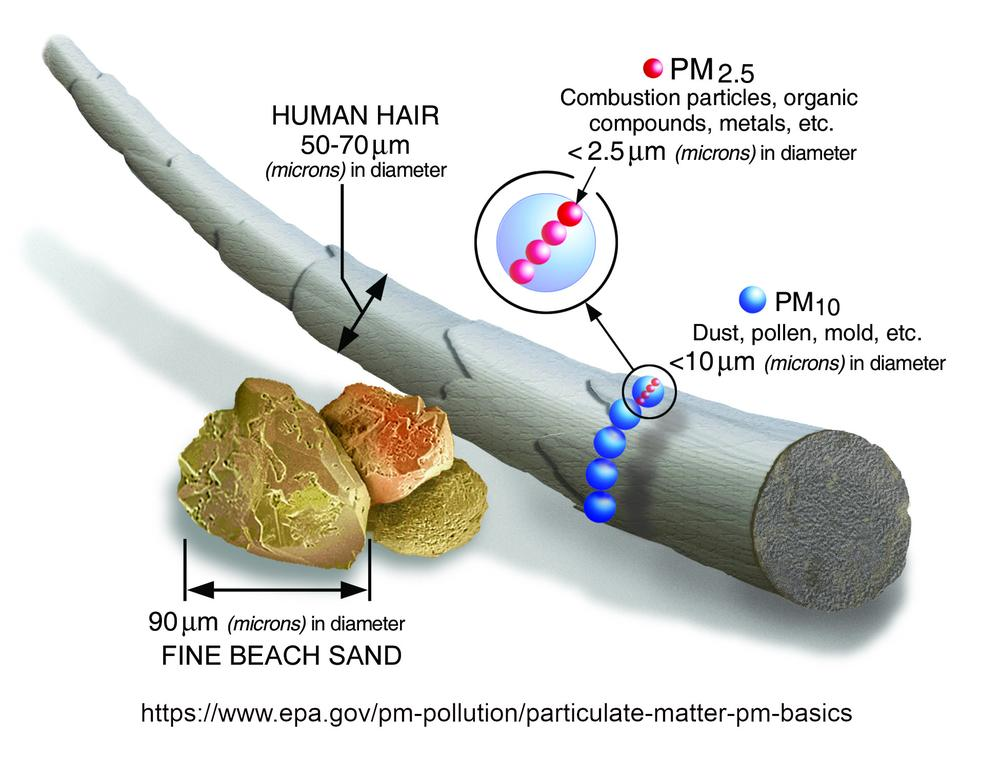
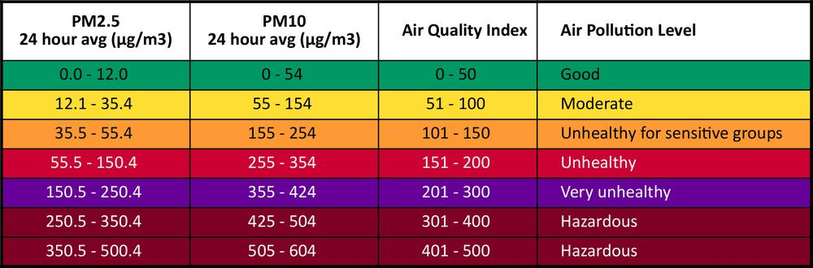
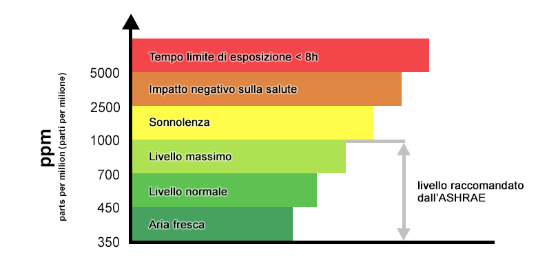
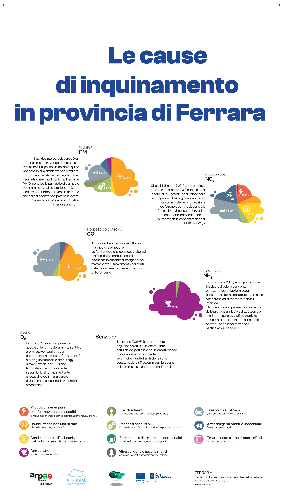
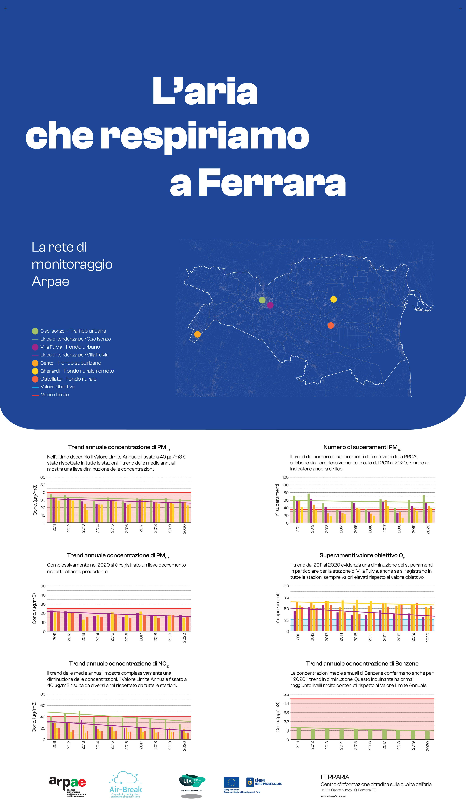
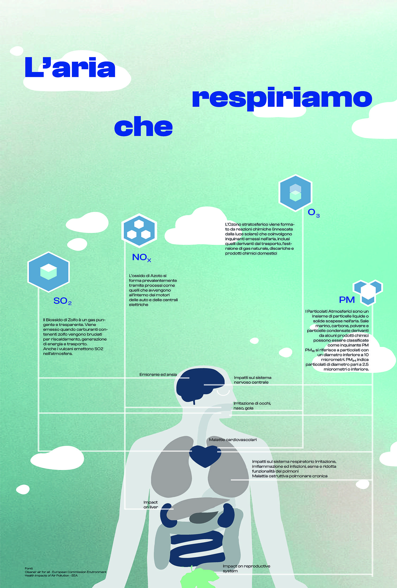
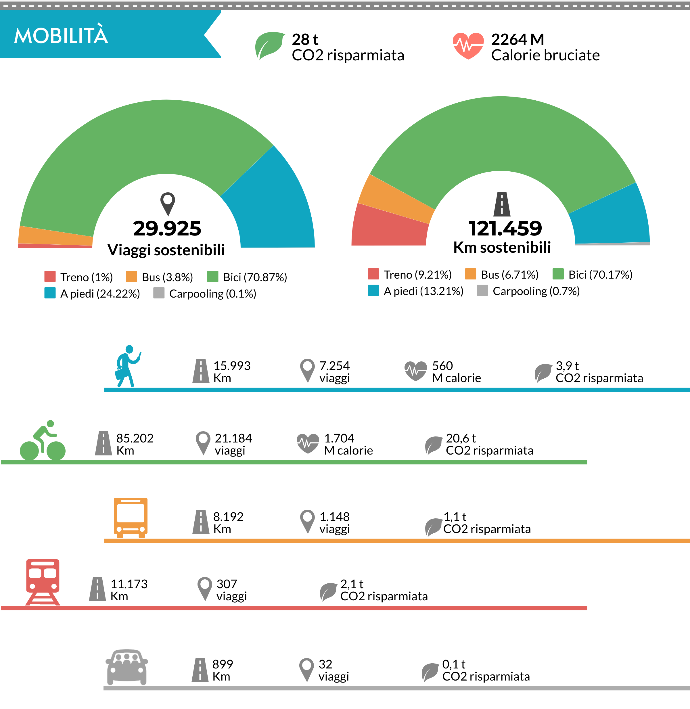

Qualità dell'aria
=================

Per un problema multi-scala, monitoraggio multi-scala
-----------------------------------------------------

La legislazione europea dice che in una città come Bologna bastano due
o tre stazioni per la misura della qualità dell'aria.

Sono sufficienti per monitorare gli aspetti generali dell'inquinamento
urbano, poi però esistono punti di accumulo locali (sotto i portici,
nelle strade strette), differenze tra il primo e l'ultimo piano,
emissioni locali (impianti), anche episodiche (cantieri, ingorghi,
caminetti accesi), inquinamento dentro le case...

Non basterebbero centinaia di centraline per monitorare tutta questa
varietà di situazioni, e i costi delle reti di misura sono già adesso
difficili da sostenere.

L'Agenzia Ambientale Europea promuove l'integrazione di strumenti
diversi: satelliti, modelli, poche stazioni con strumenti avanzati e
reti di microsensori a basso costo gestite da volontari (scuole,
associazioni, cittadini).

INQUINAMENTO DELL'ARIA - Cosa stiamo respirando
-----------------------------------------------

.. raw:: html

     <iframe width="560" height="315"
     src="https://www.youtube.com/embed/AQBm5C8M7zE?si=44wFoclqZFU94pPy"
     title="YouTube video player" frameborder="0"
     allow="accelerometer; autoplay; clipboard-write; encrypted-media;
     gyroscope; picture-in-picture; web-share"
     referrerpolicy="strict-origin-when-cross-origin"
     allowfullscreen></iframe>

Video dei Cartoni Morti

Principali agenti indoor e potenziali fonti interne
...................................................

Il Joint Research Centre (JCR) dell’UE ha condotto uno studio dal
quale è emerso che negli spazi interni sono presenti maggiori quantità
di sostanze nocive rispetto che all’aperto. Non sono rari i livelli di
concentrazione che col tempo hanno degli effetti dannosi sulla salute.

+------------------------------------------------------------------------+--------------------------------------------------------------------------+ 
| FONTI                                                                  | INQUINANTI                                                               |
+------------------------------------------------------------------------+--------------------------------------------------------------------------+ 
| Processi di combustione a gas o carbone per                            | Prodotti di combustione (CO, NOx, SO2, particolato)                      |
|                                                                        |                                                                          |
| riscaldare e/o cucinare,                                               |                                                                          |
|                                                                        |                                                                          |
| camini e stufe a legna, gas di scarico veicoli                         |                                                                          |
+------------------------------------------------------------------------+--------------------------------------------------------------------------+ 
| Materiali da costruzione e isolanti                                    | amianto, fibre vetrose artificiali, Particolato, Radon; Agenti           |
|                                                                        |                                                                          |
|									 | biologici (per presenza di umidità e/o polvere)                          |
+------------------------------------------------------------------------+--------------------------------------------------------------------------+ 
| Materiali di rivestimento e moquette                                   | formaldeide, acrilati, COV e Agenti biologici (per presenza di umidità   |
|                                                                        |                                                                          |
|									 | e/o polvere)                                                             |
+------------------------------------------------------------------------+--------------------------------------------------------------------------+ 
| Arredi                                                                 | formaldeide, COV e Agenti biologici (per presenza di umidità e/o         |
|                                                                        |                                                                          |
|									 | polvere)                                                                 |
+------------------------------------------------------------------------+--------------------------------------------------------------------------+ 
| Liquidi e prodotti per la pulizia                                      | alcoli, fenoli, COV                                                      |
+------------------------------------------------------------------------+--------------------------------------------------------------------------+ 
| Fotocopiatrici                                                         | ozono (O3), polvere di toner, idrocarburi volatili (COV)                 |
+------------------------------------------------------------------------+--------------------------------------------------------------------------+ 
| Fumo di sigaretta                                                      | idrocarburi policiclici, COV formaldeide, CO, particolato fine           |
+------------------------------------------------------------------------+--------------------------------------------------------------------------+ 
| Impianti di condizionamento                                            | CO2 e COV (per scarso numero di ricambi orari o eccesso di riciclo);     |
|                                                                        |                                                                          |
| 									 | Agenti biologici (per mancanza di pulizia/manutenzione)                  |
+------------------------------------------------------------------------+--------------------------------------------------------------------------+ 
| Polvere                                                                | Agenti biologici (allergeni indoor: acari)                               |
+------------------------------------------------------------------------+--------------------------------------------------------------------------+ 
| Individui                                                              | CO2 e Agenti biologici (batteri, virus ecc.)                             |
+------------------------------------------------------------------------+--------------------------------------------------------------------------+ 
| Animali                                                                | Allergeni indoor (peli ecc)                                              |
+------------------------------------------------------------------------+--------------------------------------------------------------------------+ 
| Sorgenti naturali (lave, tufi, graniti, ecc.)                          | Radon                                                                    |
+------------------------------------------------------------------------+--------------------------------------------------------------------------+ 

Particelle di aerosol atmosferico
---------------------------------

Conosciute anche come particolato atmosferico (PM), le particelle di
aerosol consistono in una miscela complessa di particelle solide e
goccioline liquide di sostanze organiche e inorganiche nell’aria.

I componenti principali del PM sono solfati, nitrati, ammoniaca,
cloruro di sodio, carbone nero, polvere minerale e acqua.

Classificazione del Pmx: x sta per diametro della particella, che è
uguale a o minore di x μm. PM2,5, per esempio, definisce particelle
con diametri inferiori o uguali a 2,5 μm.

Rischi per la salute
....................

Le particelle più dannose per la salute sono quelle con un diametro
pari o inferiore a 10 μm, poiché tali piccole particelle possono
penetrare nella barriera polmonare umana ed entrare nel sistema
sanguigno.

«L’Organizzazione Mondiale della Sanità (OMS) ha designato il
particolato atmosferico aerotrasportato come cancerogeno del
Gruppo 1. Gli studi hanno dimostrato che non vi è alcun livello sicuro
di esposizione al PM e con l’aumento di concentrazione di PM nell’aria
il tasso di cancro aumenta in modo proporzionale». [res.mdpi.com]

**Indice di qualità dell’aria (IQA)**

Negli Stati Uniti, l’agenzia per la protezione dell’ambiente (EPA)
stabilisce gli standard per le concentrazioni accettabili di
particolato atmosferico PM2,5 e PM10 attraverso lo standard nazionale
di qualità dell’aria ambiente (NAAQS) per il particolato atmosferico.

	   
https://www.gpo.gov/fdsys/pkg/FR-2013-01-15/pdf/2012-30946.pdf

Biossido di carbonio
--------------------

La concentrazione media di CO2 nell’aria atmosferica al 2015 è di circa 719 mg/m3 (400,83 ppmv)

Di solito le concentrazioni di CO2 nell’aria indoor sono più elevate e
dipendono dal numero e dalla presenza degli occupanti di un ambiente,
che richiedono continuamente ossigeno e che producono CO2 come
sottoprodotto del sistema respiratorio.  Di conseguenza un sostanziale
incremento di CO2 comporta una corrispondente diminuzione della
concentrazione di ossigeno (O2) nell’aria stessa e quindi un rischio
per la salute umana.

CO2, l’indicatore più importante per la qualità dell’aria

La maggior parte delle persone passa ogni giorno più di 20 ore
all’interno di ambienti chiusi. La CO2 (anidride carbonica) presente
nell’aria è l'indicatore più importante della qualità dell'aria.

Concentrazioni di C02 di riferimento
....................................

 Uno studio di Pettenkofer (1858) ha comprovato che le persone che si
 trovano in stanze con una concentrazione di CO2 al di sotto dello
 0,1% (1.000 ppm) si sentono a loro agio, mentre si sentono
 chiaramente a disagio in stanze con concentrazioni al di sopra dello
 0,2% (2.000 ppm).
 
In Germania viene fissato come valore limite per gli spazi abitativi
lo 0,15% (1.500 ppm) di CO2. Se si vuole fare un confronto, si
consideri che in una camera da letto non ventilata oppure anche in una
classe piena possono essere misurati dei valori di concentrazione che
sono spesso il triplo (fino a 5.000 ppm).

Per mantenere la concentrazione di CO2 al massimo allo 0,15% (1.500
ppm) devono essere immessi mediamente 25 m³/h di aria nuova per
persona (se si sta per esempio praticando uno sport anche di più).

:download:`pdf <16_15_web.pdf>`

https://www.iss.it/documents/20126/45616/16_15_web.pdf

   Un’elevata concentrazione di CO2 provoca il calo della
   concentrazione e sonnolenza.

Co-creare un futuro più salutare
--------------------------------

.. image:: Pannelli_FerrAria_Air-Break_AirQualityPanels-jan-2022-def_Page_1-3.jpg

.. image:: infografica_impianti_emissioni.jpg

L’aria che respiriamo contiene sostanze che possono impattare o meno
la nostra salute a seconda della loro concentrazione. Spesso, si pensa
che la colpa sia di un attore solo, oppure si pensa che la sfida sia
troppo complessa per essere risolta, sopratutto da un singolo
cittadino. Invece, qualcosa possiamo fare. Vi offriamo qui l’accesso a
diverse carte interattive per acquisire importanti informazioni sul
comportamento della città di Ferrara, in modo da diventare più
consapevoli dei dati disponibili, e usarli al meglio per co-creare un
futuro più salutare.

La Mobilità ad Alta Emissione Il settore dei trasporti è attualmente
responsabile del 30% del totale nazionale delle emissioni di gas serra
(circa 104 Mton CO2 eq nel 2018). Considerando la distribuzione delle
emissioni per modalità di trasporto, quasi il 95% è dovuto al
trasporto su strada, con un peso delle automobili pari a circa il 70%,
seguito da camion e veicoli commerciali leggeri (insieme circa il
25%).

Fonte: MiTe: “Strategia Italiana di lungo termine sulla riduzione
delle emissioni dei gas a effetto serra”, Gennaio 2021

L’agenzia europea dell’ambiente conferma: i trasporti continuano a
costituire una fonte significativa di inquinamento atmosferico,
soprattutto nelle città. Gli inquinanti atmosferici, come il
particolato (PM2,5 e PM10) e il biossido di azoto (NO2), hanno un
impatto significativo sulla salute umana e l’ambiente. Nonostante
l’inquinamento atmosferico dovuto ai trasporti sia diminuito grazie
all’introduzione di norme di qualità per i carburanti, alle norme EURO
sulle emissioni dei veicoli e all’uso di tecnologie più pulite, le
concentrazioni d’inquinanti atmosferici sono ancora troppo elevate. Le
città italiane, inclusa Ferrara, stanno testando nuove alternative di
mobilità per ridurre le emissioni. Avrete di certo incontrato le
soluzioni della mobilità elettrica, dai veicoli ai monopattini e le
bici. Diversi studi e ricerche stanno contribuendo all’elaborazione di
un quadro conoscitivo sull’impatto di queste alternative che sembrano
ancora lontane dall’obiettivo di azzerare le emissioni. Per
approfondimenti, consultare “Micromobilità con monopattini elettrici”

Infine, oltre all’inquinamento, occorre considerare che automobili e
altri veicoli a motore sono responsabili della quasi totalità degli
incidenti stradali: dal 2004, ogni anno si sono registrati in media
oltre 700 incidenti, con 900 feriti e 14 vittime (Fonte: Comune di
Ferrara, Sistema Informativo Territoriale e Contatore degli incidenti
stradali).

Inquinamento e Riscaldamento domestico
......................................

Più del 40% del PM10 primario è emesso dagli impianti domestici a
biomassa in Emilia Romagna. Le regole sulle biomasse sono solo una
delle 94 azioni del Piano Aria Integrato Regionale, che agisce sulle
altre fonti di inquinamento atmosferico.  Fonte: l’inventario
regionale delle emissioni in atmosfera, realizzato mediante il
software INEMAR (INventario EMissioni ARia) (2017), fonte: ARPAE

Che fare?
.........

Ci serve ridurre i consumi energetici legati al riscaldamente e al
raffrescamento ottimizando l’efficienza energetica delle nostre
abitazioni e abandonare gli impianti termici a biomasssa. Diverse
misure strutturali come il “Bonus 110%” sono oggi disponibili e
favoriscono la transizione progressiva verso un parco residenziale a
basse emissioni e l’adozione di sistemi più efficienti alimentati da
fonti rinnovabili (es. pompe di calore elettriche). La Regione
Emilia-Romagna si propone di contribuire al miglioramento della
qualità dell’aria e all’incremento dell’efficienza energetica
attraverso la sostituzione dei generatori di calore alimentati a
biomassa legnosa. Consulta il sito di ARPAE per più informazioni
.https://www.arpae.it/it/temi-ambientali/aria/liberiamo-laria/impianti-a-biomassa

Vuoi capire come i dati ti possono servire per migliorare la
situazione? Abbiamo sviluppato diverse attività per : capire cosa
raccontano i dati a scala locale, distinguere le relazioni
causa-effetto, e identificare le opportunità di azione. In questa
missione riconosciamo una ampia geografia della responsabilità.

Bibliografia
............

* https://eur-lex.europa.eu/legal-content/IT/TXT/PDF/?uri=CELEX:32008L0050&from=IT
* https://www.isprambiente.gov.it/files/aria/lineeguidaretimonitoraggio.pdf
* https://www.london.gov.uk/sites/default/files/air_quality_monitoring_guidance_january_2018.pdf
* https://library.wmo.int/?lvl=notice_display&id=12407 

