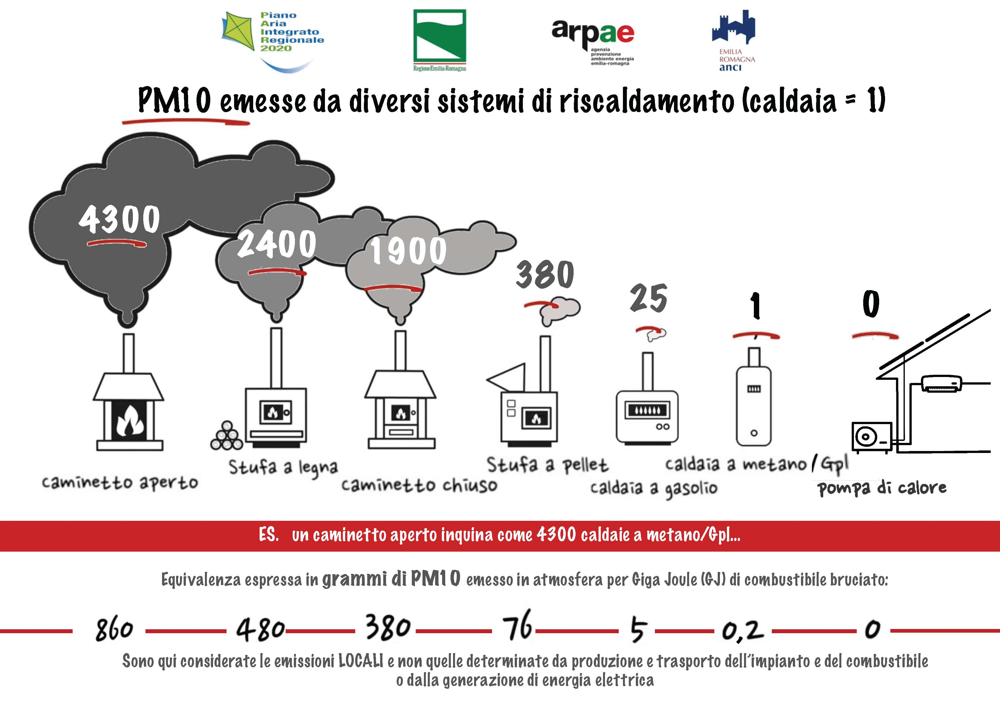

Qualità dell'aria
=================

INQUINAMENTO DELL'ARIA - Cosa stiamo respirando
-----------------------------------------------

.. raw:: html

     <iframe width="560" height="315"
     src="https://www.youtube.com/embed/AQBm5C8M7zE?si=44wFoclqZFU94pPy"
     title="YouTube video player" frameborder="0"
     allow="accelerometer; autoplay; clipboard-write; encrypted-media;
     gyroscope; picture-in-picture; web-share"
     referrerpolicy="strict-origin-when-cross-origin"
     allowfullscreen></iframe>

Video dei Cartoni Morti

Co-creare un futuro più salutare
--------------------------------

.. image:: Pannelli_FerrAria_Air-Break_AirQualityPanels-jan-2022-def_Page_1-3.jpg
.. image:: Pannelli_FerrAria_Air-Break_AirQualityPanels-jan-2022-def_Page_2-3.jpg
.. image:: Pannelli_FerrAria_Air-Break_AirQualityPanels-jan-2022-def_Page_3-1.jpg
.. image:: FerrAria-Aria-e-Salute-1.jpg

.. image:: 002.png

L’aria che respiriamo contiene sostanze che possono impattare o meno
la nostra salute a seconda della loro concentrazione. Spesso, si pensa
che la colpa sia di un attore solo, oppure si pensa che la sfida sia
troppo complessa per essere risolta, sopratutto da un singolo
cittadino. Invece, qualcosa possiamo fare. Vi offriamo qui l’accesso a
diverse carte interattive per acquisire importanti informazioni sul
comportamento della città di Ferrara, in modo da diventare più
consapevoli dei dati disponibili, e usarli al meglio per co-creare un
futuro più salutare.

La Mobilità ad Alta Emissione Il settore dei trasporti è attualmente
responsabile del 30% del totale nazionale delle emissioni di gas serra
(circa 104 Mton CO2 eq nel 2018). Considerando la distribuzione delle
emissioni per modalità di trasporto, quasi il 95% è dovuto al
trasporto su strada, con un peso delle automobili pari a circa il 70%,
seguito da camion e veicoli commerciali leggeri (insieme circa il
25%).

Fonte: MiTe: “Strategia Italiana di lungo termine sulla riduzione
delle emissioni dei gas a effetto serra”, Gennaio 2021

L’agenzia europea dell’ambiente conferma: i trasporti continuano a
costituire una fonte significativa di inquinamento atmosferico,
soprattutto nelle città. Gli inquinanti atmosferici, come il
particolato (PM2,5 e PM10) e il biossido di azoto (NO2), hanno un
impatto significativo sulla salute umana e l’ambiente. Nonostante
l’inquinamento atmosferico dovuto ai trasporti sia diminuito grazie
all’introduzione di norme di qualità per i carburanti, alle norme EURO
sulle emissioni dei veicoli e all’uso di tecnologie più pulite, le
concentrazioni d’inquinanti atmosferici sono ancora troppo elevate. Le
città italiane, inclusa Ferrara, stanno testando nuove alternative di
mobilità per ridurre le emissioni. Avrete di certo incontrato le
soluzioni della mobilità elettrica, dai veicoli ai monopattini e le
bici. Diversi studi e ricerche stanno contribuendo all’elaborazione di
un quadro conoscitivo sull’impatto di queste alternative che sembrano
ancora lontane dall’obiettivo di azzerare le emissioni. Per
approfondimenti, consultare “Micromobilità con monopattini elettrici”

Infine, oltre all’inquinamento, occorre considerare che automobili e
altri veicoli a motore sono responsabili della quasi totalità degli
incidenti stradali: dal 2004, ogni anno si sono registrati in media
oltre 700 incidenti, con 900 feriti e 14 vittime (Fonte: Comune di
Ferrara, Sistema Informativo Territoriale e Contatore degli incidenti
stradali).

Inquinamento e Riscaldamento domestico
^^^^^^^^^^^^^^^^^^^^^^^^^^^^^^^^^^^^^^

Più del 40% del PM10 primario è emesso dagli impianti domestici a
biomassa in Emilia Romagna. Le regole sulle biomasse sono solo una
delle 94 azioni del Piano Aria Integrato Regionale, che agisce sulle
altre fonti di inquinamento atmosferico.  Fonte: l’inventario
regionale delle emissioni in atmosfera, realizzato mediante il
software INEMAR (INventario EMissioni ARia) (2017), fonte: ARPAE

Che fare?
^^^^^^^^^

Ci serve ridurre i consumi energetici legati al riscaldamente e al
raffrescamento ottimizando l’efficienza energetica delle nostre
abitazioni e abandonare gli impianti termici a biomasssa. Diverse
misure strutturali come il “Bonus 110%” sono oggi disponibili e
favoriscono la transizione progressiva verso un parco residenziale a
basse emissioni e l’adozione di sistemi più efficienti alimentati da
fonti rinnovabili (es. pompe di calore elettriche). La Regione
Emilia-Romagna si propone di contribuire al miglioramento della
qualità dell’aria e all’incremento dell’efficienza energetica
attraverso la sostituzione dei generatori di calore alimentati a
biomassa legnosa. Consulta il sito di ARPAE per più informazioni
.https://www.arpae.it/it/temi-ambientali/aria/liberiamo-laria/impianti-a-biomassa

Vuoi capire come i dati ti possono servire per migliorare la
situazione? Abbiamo sviluppato diverse attività per : capire cosa
raccontano i dati a scala locale, distinguere le relazioni
causa-effetto, e identificare le opportunità di azione. In questa
missione riconosciamo una ampia geografia della responsabilità.

Classificazione delle stazioni di monitoraggio
^^^^^^^^^^^^^^^^^^^^^^^^^^^^^^^^^^^^^^^^^^^^^^

Non tutte le stazioni di monitoraggio della qualità dell’aria sono
uguali. Possono differenziarsi per il tipo di sensori installati, per
la loro posizione, e per il tipo di misurazione a cui sono preposte.

L’Agenzia Europea per l’Ambiente (https://www.eea.europa.eu/it) ha
stilato dei criteri per la classificazione di questo tipo di
centraline a seconda della loro tipologia e delle caratteristiche
dell’ambiente in cui sono installate. Senza voler scendere troppo nei
dettagli, possiamo dividere le stazioni in tre grandi categorie:

misurazione dell’inquinamento da TRAFFICO (T): stazioni che misurano
il livello di inquinamento generato prevalentemente da emissioni da
traffico, provenienti da strade limitrofe con intensità di traffico
medio alta;

misurazione dell’inquinamento di FONDO (B): stazioni posizione lontano
da specifiche fonti di inquinamento (industrie, traffico,
riscaldamento residenziale, etc.) che non sono influenzate, cioè, da
una fonte prevalente di inquinamento.

monitoraggio di fonti di inquinamento INDUSTRIALI (I): stazioni
ubicate in una zona in cui l’inquinamento sia generato in prevalenza
da singole industrie o da vicine zone industriali

Anche l’ambiente che accoglie la stazione viene categorizzato dalla
stessa direttiva e suddiviso in aree di tipo Urbano (U), Suburbano (S)
e Rurale (R).

Le aree urbane sono quelle densamente popolate, quelle suburbane, o
periferiche, sono caratterizzate da un'alternanza di aree edificate ed
aree libere da edifici, quelle rurali possono essere caratterizzate
per esclusione.

Questa classificazione di massima viene affinata in base all’attività
umana prevalente in aree Residenziali (R), Commerciali (C),
Industriali (I), Agricole (A) e Naturali (N).

Le stazioni vengono indicate con una sigla che ne rappresenta il tipo,
ad esempio, ad una stazione di misurazione del traffico situata in
un’area urbana a vocazione commerciale sarà attribuito il codice TU-C,
ad una che misura l’inquinamento di fondo in periferia, quello BS-R
(in caso la prevalenza di strutture antropiche sia di tipo
residenziale).

Non tutte le combinazioni di questi fattori possono essere utilizzate,
ad esempio non sarà mai possibile classificare una stazione come TU-N
perché per definizione un’area urbana, registra una forte presenza
umana.  A seconda dell’ambiente che le ospita, si considera che le
stazioni coprano un’area che va da circa 200m² di una stazione
installata in ambito urbano a diverse decine di chilometri per le
stazioni situate in un ambiente rurale, o a centinaia di chilometri
quadrati nel caso di aree rurali remote (distanti più di 50 km da
centri abitati e zone industriali).

Le misurazioni attese dalle stazioni, quindi, dipenderanno dalla loro
tipologia. La valutazione delle letture effettuate dovrà tenere conto
delle stazioni circostanti e di altri fattori che sarebbe fuori luogo
elencare in questo documento ma che possono essere un valido spunto di
discussione da approfondire in classe.

Nelle linee guida per la predisposizione delle reti di monitoraggio
della qualità dell’aria, l’Istituto Superiore per la Protezione e la
Ricerca Ambientale individua le scuole come luoghi adatti
all’installazione di stazioni di background urbano e suburbano.

Criteri per la selezione del sito di installazione
^^^^^^^^^^^^^^^^^^^^^^^^^^^^^^^^^^^^^^^^^^^^^^^^^^

Per far sì che i dati raccolti dalle stazioni possano essere
paragonabili, è importante che il posizionamento di queste ultime sia
il più possibile omogeneo. Due sensori che misurano la concentrazione
di particolato, posizionati su un palazzo, e posti uno a piano strada,
e l’altro sul lastrico solare, ad esempio, daranno, nello stesso
istante, valori che possono essere molto diversi tra di loro.

Le linee guida sono particolarmente dettagliate sul tipo di
posizionamento dei punti di misura di una stazione in base ai
parametri monitorati ed al tipo di stazione.

Allo stato attuale, le stazioni Stima misurano, oltre a temperatura ed
umidità, PM2.5, PM10, CO2. Idealmente una stazione che registra questo
tipo di parametri, dovrebbe essere posizionata ad altezza uomo intorno
ai 2m dal livello del suolo, ma, per proteggere l’apparato da
manomissioni e furti, si può prendere in considerazione la possibilità
di posizionarle ad un’altezza che varia tra i 2 e 4 metri.

Visto che le concentrazioni di particolato diminuiscono con l’altezza,
sarebbe opportuno che tutte le stazioni fossero installate ad
un'altezza simile.

Anche la distanza dall’edificio che dovesse dare loro supporto
influenza le misurazioni. Se possibile, bisognerebbe usare una staffa
che distanzi la stazione di almeno 20 centimetri dal muro che la
sostiene.

È importante assicurarsi che ci sia un buon circolo d'aria attorno
alla stazione. In caso contrario i valori registrati potrebbero essere
sottostimati. Anche una posizione troppo esposta potrebbe portare a
valutazioni inesatte. Ad esempio, la turbolenza prodotta dai veicoli
in transito potrebbe portare a misurazioni più alte dei valori
realmente.

La stazione Stima ha bisogno di essere alimentata continuamente e di
trasmettere periodicamente i campioni perché possano essere
trasformati in osservazioni utilizzabili.  Per fare ciò è necessario
assicurarsi che il punto prescelto permetta alla stazione di
collegarsi tramite rete Wi-Fi ad internet. Potrete trovare alcuni
criteri per permettere un utilizzo sicuro e protetto della connessione
più avanti in questa guida.

Bibliografia
^^^^^^^^^^^^

* https://eur-lex.europa.eu/legal-content/IT/TXT/PDF/?uri=CELEX:32008L0050&from=IT
* https://www.isprambiente.gov.it/files/aria/lineeguidaretimonitoraggio.pdf
* https://www.london.gov.uk/sites/default/files/air_quality_monitoring_guidance_january_2018.pdf
* https://library.wmo.int/?lvl=notice_display&id=12407 

