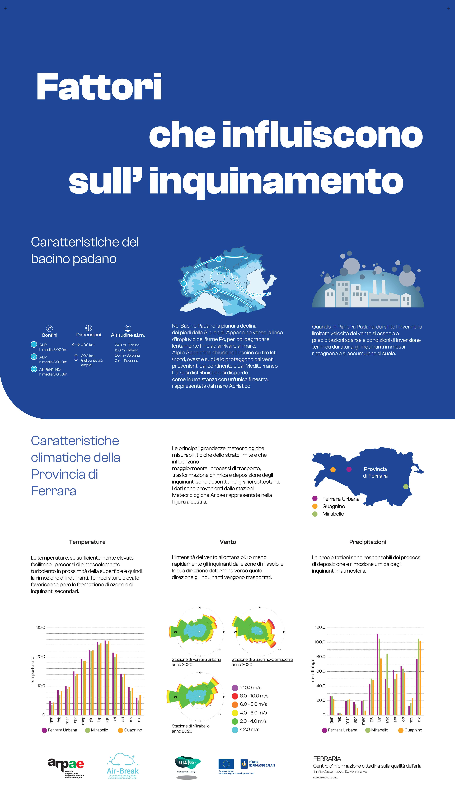

Qualità dell'aria
=================

INQUINAMENTO DELL'ARIA - Cosa stiamo respirando
-----------------------------------------------

.. raw:: html

     <iframe width="560" height="315"
     src="https://www.youtube.com/embed/AQBm5C8M7zE?si=44wFoclqZFU94pPy"
     title="YouTube video player" frameborder="0"
     allow="accelerometer; autoplay; clipboard-write; encrypted-media;
     gyroscope; picture-in-picture; web-share"
     referrerpolicy="strict-origin-when-cross-origin"
     allowfullscreen></iframe>

Video dei Cartoni Morti

Co-creare un futuro più salutare
--------------------------------

.. image:: Pannelli_FerrAria_Air-Break_AirQualityPanels-jan-2022-def_Page_2-3.jpg

.. image:: FerrAria-Aria-e-Salute-1.jpg
.. image:: infografica_impianti_emissioni.jpg
.. image:: 002.png

L’aria che respiriamo contiene sostanze che possono impattare o meno
la nostra salute a seconda della loro concentrazione. Spesso, si pensa
che la colpa sia di un attore solo, oppure si pensa che la sfida sia
troppo complessa per essere risolta, sopratutto da un singolo
cittadino. Invece, qualcosa possiamo fare. Vi offriamo qui l’accesso a
diverse carte interattive per acquisire importanti informazioni sul
comportamento della città di Ferrara, in modo da diventare più
consapevoli dei dati disponibili, e usarli al meglio per co-creare un
futuro più salutare.

La Mobilità ad Alta Emissione Il settore dei trasporti è attualmente
responsabile del 30% del totale nazionale delle emissioni di gas serra
(circa 104 Mton CO2 eq nel 2018). Considerando la distribuzione delle
emissioni per modalità di trasporto, quasi il 95% è dovuto al
trasporto su strada, con un peso delle automobili pari a circa il 70%,
seguito da camion e veicoli commerciali leggeri (insieme circa il
25%).

Fonte: MiTe: “Strategia Italiana di lungo termine sulla riduzione
delle emissioni dei gas a effetto serra”, Gennaio 2021

L’agenzia europea dell’ambiente conferma: i trasporti continuano a
costituire una fonte significativa di inquinamento atmosferico,
soprattutto nelle città. Gli inquinanti atmosferici, come il
particolato (PM2,5 e PM10) e il biossido di azoto (NO2), hanno un
impatto significativo sulla salute umana e l’ambiente. Nonostante
l’inquinamento atmosferico dovuto ai trasporti sia diminuito grazie
all’introduzione di norme di qualità per i carburanti, alle norme EURO
sulle emissioni dei veicoli e all’uso di tecnologie più pulite, le
concentrazioni d’inquinanti atmosferici sono ancora troppo elevate. Le
città italiane, inclusa Ferrara, stanno testando nuove alternative di
mobilità per ridurre le emissioni. Avrete di certo incontrato le
soluzioni della mobilità elettrica, dai veicoli ai monopattini e le
bici. Diversi studi e ricerche stanno contribuendo all’elaborazione di
un quadro conoscitivo sull’impatto di queste alternative che sembrano
ancora lontane dall’obiettivo di azzerare le emissioni. Per
approfondimenti, consultare “Micromobilità con monopattini elettrici”

Infine, oltre all’inquinamento, occorre considerare che automobili e
altri veicoli a motore sono responsabili della quasi totalità degli
incidenti stradali: dal 2004, ogni anno si sono registrati in media
oltre 700 incidenti, con 900 feriti e 14 vittime (Fonte: Comune di
Ferrara, Sistema Informativo Territoriale e Contatore degli incidenti
stradali).

Inquinamento e Riscaldamento domestico
^^^^^^^^^^^^^^^^^^^^^^^^^^^^^^^^^^^^^^

Più del 40% del PM10 primario è emesso dagli impianti domestici a
biomassa in Emilia Romagna. Le regole sulle biomasse sono solo una
delle 94 azioni del Piano Aria Integrato Regionale, che agisce sulle
altre fonti di inquinamento atmosferico.  Fonte: l’inventario
regionale delle emissioni in atmosfera, realizzato mediante il
software INEMAR (INventario EMissioni ARia) (2017), fonte: ARPAE

Che fare?
^^^^^^^^^

Ci serve ridurre i consumi energetici legati al riscaldamente e al
raffrescamento ottimizando l’efficienza energetica delle nostre
abitazioni e abandonare gli impianti termici a biomasssa. Diverse
misure strutturali come il “Bonus 110%” sono oggi disponibili e
favoriscono la transizione progressiva verso un parco residenziale a
basse emissioni e l’adozione di sistemi più efficienti alimentati da
fonti rinnovabili (es. pompe di calore elettriche). La Regione
Emilia-Romagna si propone di contribuire al miglioramento della
qualità dell’aria e all’incremento dell’efficienza energetica
attraverso la sostituzione dei generatori di calore alimentati a
biomassa legnosa. Consulta il sito di ARPAE per più informazioni
.https://www.arpae.it/it/temi-ambientali/aria/liberiamo-laria/impianti-a-biomassa

Vuoi capire come i dati ti possono servire per migliorare la
situazione? Abbiamo sviluppato diverse attività per : capire cosa
raccontano i dati a scala locale, distinguere le relazioni
causa-effetto, e identificare le opportunità di azione. In questa
missione riconosciamo una ampia geografia della responsabilità.

Bibliografia
^^^^^^^^^^^^

* https://eur-lex.europa.eu/legal-content/IT/TXT/PDF/?uri=CELEX:32008L0050&from=IT
* https://www.isprambiente.gov.it/files/aria/lineeguidaretimonitoraggio.pdf
* https://www.london.gov.uk/sites/default/files/air_quality_monitoring_guidance_january_2018.pdf
* https://library.wmo.int/?lvl=notice_display&id=12407 

