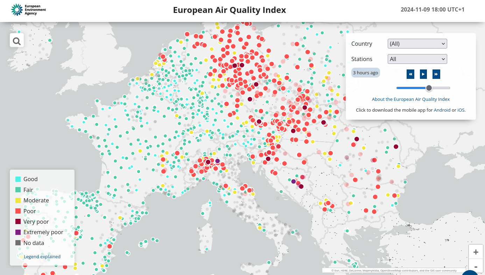
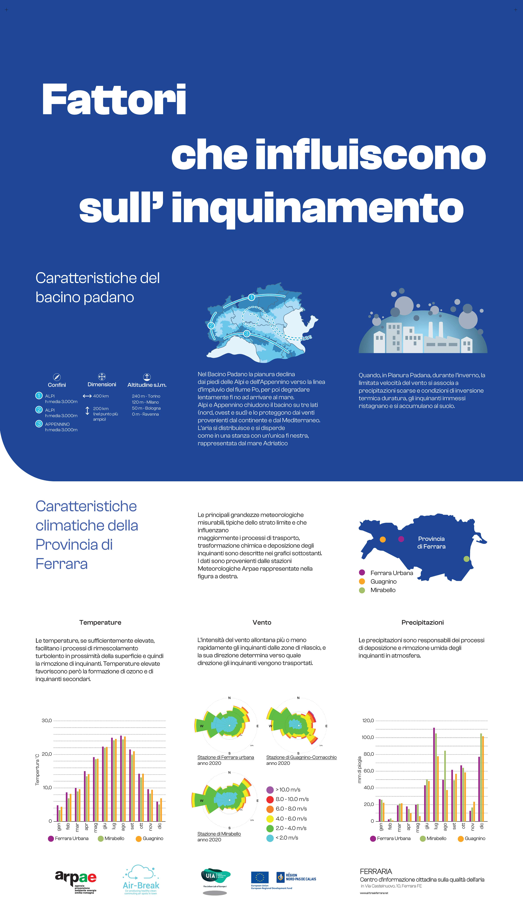
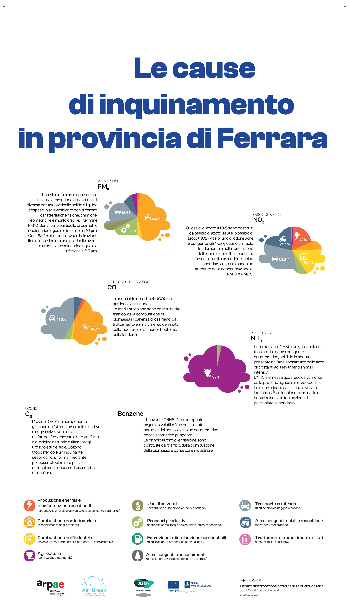
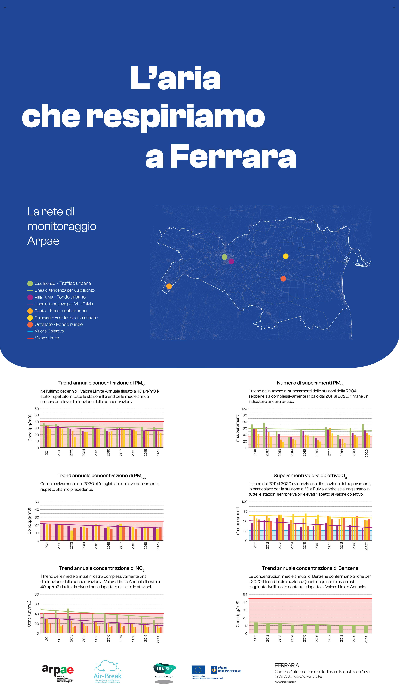
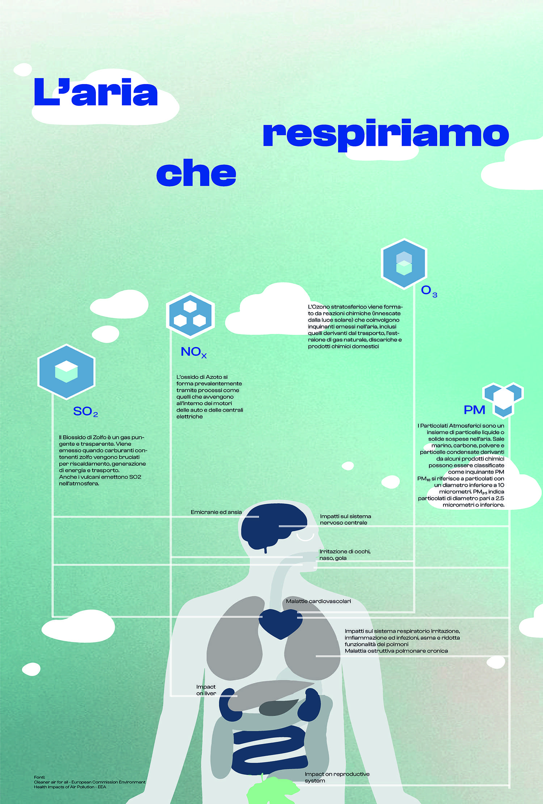
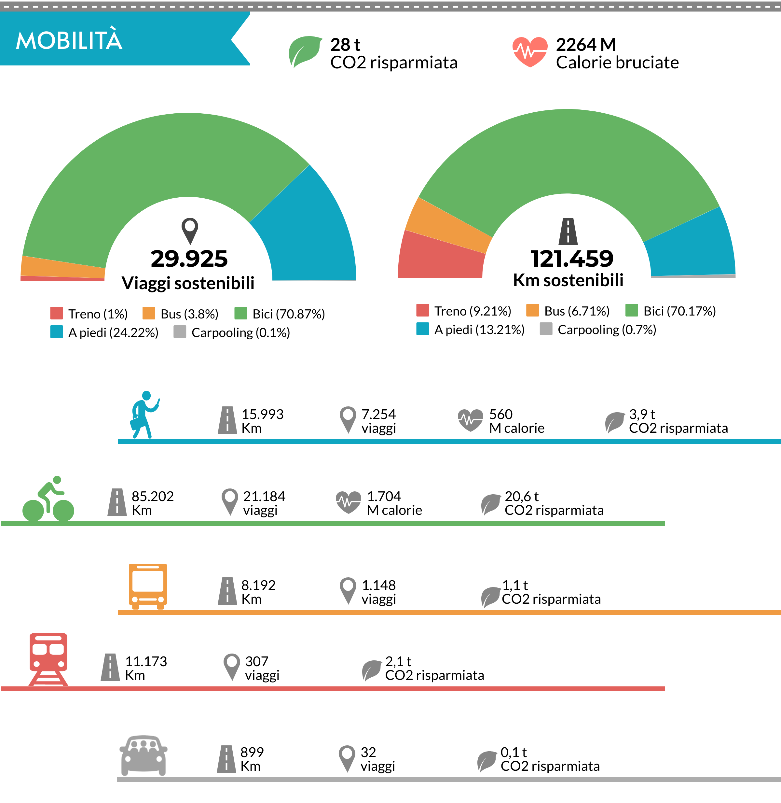

Qualità dell'aria
=================

Sai cos’è l’indice di qualità dell’aria?
----------------------------------------

L’indice di qualità dell’aria (IQA) è un indicatore che permette di
fornire una stima immediata e sintetica sullo stato dell’aria. Non
esiste un modo univoco di definire un tale indice ed attualmente sono
adoperate in Italia ed in Europa diverse formulazioni che tengono
conto delle concentrazioni misurate, stimate o previste di un numero
variabile di inquinanti che hanno effetti sulla salute, specialmente
di tipo respiratorio, cardiaco e cardiovascolare.

The European Air Quality Index
------------------------------

The European Air Quality Index allows users to understand more about
air quality where they live, work or travel. Displaying up-to-date
information for Europe, users can gain insights into the air quality
in individual countries, regions and cities.

The Index is based on concentration values for up to five key pollutants, including:

*    particulate matter (PM10);
*    fine particulate matter (PM2.5);
*    ozone (O3);
*    nitrogen dioxide (NO2);
*    sulphur dioxide (SO2).

It reflects the potential impact of air quality on health, driven by
the pollutant for which concentrations are poorest due to associated
health impacts.

The index is calculated hourly for more than 3.500 air quality
monitoring stations across Europe, using a combination of up-to-date
data reported by EEA member countries (not formally verified by
countries) and forecast of the air quality level as provided by
Copernicus Atmospheric Monitoring Service (CAMS).

By default, the air quality index depicts the situation 3 hours
ago. Users can then select any hour in the preceding 48 hours and view
forecast values for the following 24 hours.

The user can filter the selection by country and by station
type. Stations are classified in relation to the predominant emission
sources: traffic, industry and background (where the pollution level
is dominated neither by traffic nor by industry). The user can view
all stations, traffic stations only or non-traffic stations only
(i.e. industrial and background stations).

European Union legislation sets air quality standards for both
short-term (hourly or daily) and long-term (annual) air quality
levels. Standards for long-term levels are stricter than for
short-term levels, since serious health effects may occur from
long-term exposure to pollutants.

The Index indicates the short-term air quality situation. It does not
reflect the long-term (annual) air quality situation, which may differ
significantly.

The air quality index is not a tool for checking compliance with air
quality standards and cannot be used for this purpose.  Methodology

The Index uses ‘up-to-date’ air quality data officially reported every
hour by EEA member countries, complemented where necessary by modelled
air quality data from the European Union’s Copernicus Atmosphere
Monitoring Service (CAMS).

Concentrations values for up to five key pollutants determine the
index level that reflects air quality at each monitoring station. The
index corresponds to the poorest level for any of five pollutants,
according to the table shown below.

Circles and dots on the map represent the locations of air quality
monitoring stations. The colours reflect air quality at the given hour
at that station.  Calculating the index for traffic stations

When calculating the index for traffic stations we only use data for
NO2 and PM (either PM2.5, PM10 or both). This is because SO2
concentrations can be high in localized areas and distort the picture
of local air quality, while ozone levels are normally very low at
traffic stations.  Calculating the index for industrial and background
stations

At industrial and background stations, the index is calculated for
those stations with data (either measured or modelled) for at least
the three pollutants NO2, O3 and PM (either PM2.5, PM10 or both).
Stations missing data for certain pollutants

To avoid leaving out stations that do not report data for all
pollutants or for which missing data cannot be gap-filled, the index
is calculated for all monitoring stations with data for at least one
pollutant. Those stations that do not report data or for which data
cannot be gap-filled for the minimum pollutants for that station type
are depicted as semi-transparent circles , indicating that the index
is not calculated with the minimum range of pollutants. The station is
coloured as grey unless the index is poor or worse, when the current
index colour is used.

Grey dots indicate stations for which no data have been reported to
allow the index to be calculated.

Averaging time for pollutants
^^^^^^^^^^^^^^^^^^^^^^^^^^^^^

For NO2, O3 and SO2, hourly concentrations are fed into the
calculation of the index.

For PM10 and PM2.5, the 24-hour running means for the past 24 hours
are fed into the calculation of the index. A 24-hour running mean will
be calculated if there are values for at least 18 out of the 24 hours.

Missing data and gap filling
^^^^^^^^^^^^^^^^^^^^^^^^^^^^

When data is not reported for a given hour, values are approximated,
or 'gap-filled' using CAMS modelled air quality data. In such cases,
it is marked with an asterisk.

The method used for gap-filling depends on the pollutant.

    For NO2, PM2.5 and PM10 we use the difference method.
    For O3 we use the multiplicative method.
    No gap filling is performed for SO2

Difference method: The value is approximated by taking the CAMS
modelled value and adding or subtracting a correction difference. This
correction is the average difference between previously measured
values and the CAMS modelled value for the same hour for at least
three of the four previous days.

Multiplicative method: The value is approximated by taking the CAMS
modelled value, and applying a correction factor. This correction is
the average ratio between the previously measured values and the CAMS
modelled values for the same hour for at least three of the four
previous days.

In cases where there are no measured values for the same hour over
three of the four previous days, the value for the given pollutant is
not calculated.  Forecast index

Forecast values are shown as transparent circles. Circles are coloured
as grey if the minimum number of required pollutants, depending on the
type of station, could not be forecast and the forecast index is good,
fair or moderate.

To calculate the forecast values for the following 24 hours, CAMS
modelled air quality data are used and corrected using the gap-filling
methods described above. No forecast values are provided for SO2.

Bands of concentrations and index levels

The bands are based on the relative risks associated to short-term
exposure to PM2.5, O3 and NO2, as defined by the World Health
Organization in its report on the Health Risks of Air Pollution in
Europe project (HRAPIE project report).

The relative risk of exposure to PM2.5 is taken as basis for driving
the index, specifically the increase in the risk of mortality per 10
µg/m3 increase in the daily mean concentration of PM2.5.

Assuming linearity across the relative risks functions for O3 and NO2,
we calculate the concentrations of these pollutants that pose an
equivalent relative risk to a 10 µg/m3 increase in the daily mean of
PM2.5.

For PM10 concentrations, a constant ratio between PM10 and PM2.5 of
1:2 is assumed, in line with the World Health Organization´s air
quality guidelines for Europe.

For SO2, the bands reflect the limit values set under the EU Air Quality Directive.

Pollutant 	Index level
(based on pollutant concentrations in µg/m3)
Good 	Fair 	Moderate 	Poor 	Very poor 	Extremely poor
Particles less than 2.5 µm (PM2.5) 	0-10 	10-20 	20-25 	25-50 	50-75 	75-800
Particles less than 10 µm (PM10) 	0-20 	20-40 	40-50 	50-100 	100-150 	150-1200
Nitrogen dioxide (NO2) 	0-40 	40-90 	90-120 	120-230 	230-340 	340-1000
Ozone (O3) 	0-50 	50-100 	100-130 	130-240 	240-380 	380-800
Sulphur dioxide (SO2) 	0-100 	100-200 	200-350 	350-500 	500-750 	750-1250

Air quality measurements that exceed the maximum values in the
‘extremely poor’ category are not taken into account for the index
calculation, since these values are typically found to be erroneous.

Health messages

The index bands are complemented by health related messages that
provide recommendations for both the general population and sensitive
populations. The latter includes both adults and children with
respiratory problems and adults with heart conditions.

AQ index 	General population 	Sensitive populations
Good 	The air quality is good. Enjoy your usual outdoor activities. 	The air quality is good. Enjoy your usual outdoor activities.
Fair 	Enjoy your usual outdoor activities 	Enjoy your usual outdoor activities
Moderate 	Enjoy your usual outdoor activities 	Consider reducing intense outdoor activities, if you experience symptoms.
Poor 	Consider reducing intense activities outdoors, if you experience symptoms such as sore eyes, a cough or sore throat 	Consider reducing physical activities, particularly outdoors, especially if you experience symptoms.
Very poor 	Consider reducing intense activities outdoors, if you experience symptoms such as sore eyes, a cough or sore throat 	Reduce physical activities, particularly outdoors, especially if you experience symptoms.
Extremely poor 	Reduce physical activities outdoors. 	Avoid physical activities outdoors.
Additional information

When clicking on a station on the map, a pop-up window appears with
the following additional information:

1. The name of the station and the air quality index at that station and hour.

2. A “View station” option, that provides the location of the station using © Google Maps.

3. A “Show details” option, with a summary of the station information;
   the air quality index and the associated health advice for the
   general population and sensitive populations; links to information
   on air pollution for the country where the station is located and
   to the webpage of the administration in charge of reporting the
   concentrations for that station and two graphs.

The values indicated when hovering over the horizontal pizza-diagrams
show the hourly AQ Index, the hourly concentrations for NO2, O3 and
SO2, and the 24-hour running means for PM measured at the station or
gap-filled over the last 7 days. An asterisk next to a value indicates
that the value has been gap-filled

The pie chart indicates the number of days that feel under each Index
band over the past 365 days. The highest hourly Index level in a day
determines the daily Index level taken into account.  Further
information

The European Environment Agency publishes a range of information on
air quality:

*    Air pollution web page
*    Air quality live: Up-to-date air quality measurement
*    Key air quality statistics for the main air pollutants: map viewer
*    ‘Air Quality in Europe’ – latest report
*    Air pollution country profiles

The European Air Quality Index was developed jointly by the European
Commission’s Directorate General for Environment and the European
Environment Agency to inform citizens and public authorities about the
recent air quality status across Europe.

Co-creare un futuro più salutare
--------------------------------

.. image:: infografica_impianti_emissioni.jpg

L’aria che respiriamo contiene sostanze che possono impattare o meno
la nostra salute a seconda della loro concentrazione. Spesso, si pensa
che la colpa sia di un attore solo, oppure si pensa che la sfida sia
troppo complessa per essere risolta, sopratutto da un singolo
cittadino. Invece, qualcosa possiamo fare. Vi offriamo qui l’accesso a
diverse carte interattive per acquisire importanti informazioni sul
comportamento della città di Ferrara, in modo da diventare più
consapevoli dei dati disponibili, e usarli al meglio per co-creare un
futuro più salutare.

La Mobilità ad Alta Emissione Il settore dei trasporti è attualmente
responsabile del 30% del totale nazionale delle emissioni di gas serra
(circa 104 Mton CO2 eq nel 2018). Considerando la distribuzione delle
emissioni per modalità di trasporto, quasi il 95% è dovuto al
trasporto su strada, con un peso delle automobili pari a circa il 70%,
seguito da camion e veicoli commerciali leggeri (insieme circa il
25%).

Fonte: MiTe: “Strategia Italiana di lungo termine sulla riduzione
delle emissioni dei gas a effetto serra”, Gennaio 2021

L’agenzia europea dell’ambiente conferma: i trasporti continuano a
costituire una fonte significativa di inquinamento atmosferico,
soprattutto nelle città. Gli inquinanti atmosferici, come il
particolato (PM2,5 e PM10) e il biossido di azoto (NO2), hanno un
impatto significativo sulla salute umana e l’ambiente. Nonostante
l’inquinamento atmosferico dovuto ai trasporti sia diminuito grazie
all’introduzione di norme di qualità per i carburanti, alle norme EURO
sulle emissioni dei veicoli e all’uso di tecnologie più pulite, le
concentrazioni d’inquinanti atmosferici sono ancora troppo elevate. Le
città italiane, inclusa Ferrara, stanno testando nuove alternative di
mobilità per ridurre le emissioni. Avrete di certo incontrato le
soluzioni della mobilità elettrica, dai veicoli ai monopattini e le
bici. Diversi studi e ricerche stanno contribuendo all’elaborazione di
un quadro conoscitivo sull’impatto di queste alternative che sembrano
ancora lontane dall’obiettivo di azzerare le emissioni. Per
approfondimenti, consultare “Micromobilità con monopattini elettrici”

Infine, oltre all’inquinamento, occorre considerare che automobili e
altri veicoli a motore sono responsabili della quasi totalità degli
incidenti stradali: dal 2004, ogni anno si sono registrati in media
oltre 700 incidenti, con 900 feriti e 14 vittime (Fonte: Comune di
Ferrara, Sistema Informativo Territoriale e Contatore degli incidenti
stradali).

Inquinamento e Riscaldamento domestico
^^^^^^^^^^^^^^^^^^^^^^^^^^^^^^^^^^^^^^

Più del 40% del PM10 primario è emesso dagli impianti domestici a
biomassa in Emilia Romagna. Le regole sulle biomasse sono solo una
delle 94 azioni del Piano Aria Integrato Regionale, che agisce sulle
altre fonti di inquinamento atmosferico.  Fonte: l’inventario
regionale delle emissioni in atmosfera, realizzato mediante il
software INEMAR (INventario EMissioni ARia) (2017), fonte: ARPAE

Che fare?
^^^^^^^^^

Ci serve ridurre i consumi energetici legati al riscaldamente e al
raffrescamento ottimizando l’efficienza energetica delle nostre
abitazioni e abandonare gli impianti termici a biomasssa. Diverse
misure strutturali come il “Bonus 110%” sono oggi disponibili e
favoriscono la transizione progressiva verso un parco residenziale a
basse emissioni e l’adozione di sistemi più efficienti alimentati da
fonti rinnovabili (es. pompe di calore elettriche). La Regione
Emilia-Romagna si propone di contribuire al miglioramento della
qualità dell’aria e all’incremento dell’efficienza energetica
attraverso la sostituzione dei generatori di calore alimentati a
biomassa legnosa. Consulta il sito di ARPAE per più informazioni
.https://www.arpae.it/it/temi-ambientali/aria/liberiamo-laria/impianti-a-biomassa

Vuoi capire come i dati ti possono servire per migliorare la
situazione? Abbiamo sviluppato diverse attività per : capire cosa
raccontano i dati a scala locale, distinguere le relazioni
causa-effetto, e identificare le opportunità di azione. In questa
missione riconosciamo una ampia geografia della responsabilità.

Classificazione delle stazioni di monitoraggio
^^^^^^^^^^^^^^^^^^^^^^^^^^^^^^^^^^^^^^^^^^^^^^

Non tutte le stazioni di monitoraggio della qualità dell’aria sono
uguali. Possono differenziarsi per il tipo di sensori installati, per
la loro posizione, e per il tipo di misurazione a cui sono preposte.

L’Agenzia Europea per l’Ambiente (https://www.eea.europa.eu/it) ha
stilato dei criteri per la classificazione di questo tipo di
centraline a seconda della loro tipologia e delle caratteristiche
dell’ambiente in cui sono installate. Senza voler scendere troppo nei
dettagli, possiamo dividere le stazioni in tre grandi categorie:

misurazione dell’inquinamento da TRAFFICO (T): stazioni che misurano
il livello di inquinamento generato prevalentemente da emissioni da
traffico, provenienti da strade limitrofe con intensità di traffico
medio alta;

misurazione dell’inquinamento di FONDO (B): stazioni posizione lontano
da specifiche fonti di inquinamento (industrie, traffico,
riscaldamento residenziale, etc.) che non sono influenzate, cioè, da
una fonte prevalente di inquinamento.

monitoraggio di fonti di inquinamento INDUSTRIALI (I): stazioni
ubicate in una zona in cui l’inquinamento sia generato in prevalenza
da singole industrie o da vicine zone industriali

Anche l’ambiente che accoglie la stazione viene categorizzato dalla
stessa direttiva e suddiviso in aree di tipo Urbano (U), Suburbano (S)
e Rurale (R).

Le aree urbane sono quelle densamente popolate, quelle suburbane, o
periferiche, sono caratterizzate da un'alternanza di aree edificate ed
aree libere da edifici, quelle rurali possono essere caratterizzate
per esclusione.

Questa classificazione di massima viene affinata in base all’attività
umana prevalente in aree Residenziali (R), Commerciali (C),
Industriali (I), Agricole (A) e Naturali (N).

Le stazioni vengono indicate con una sigla che ne rappresenta il tipo,
ad esempio, ad una stazione di misurazione del traffico situata in
un’area urbana a vocazione commerciale sarà attribuito il codice TU-C,
ad una che misura l’inquinamento di fondo in periferia, quello BS-R
(in caso la prevalenza di strutture antropiche sia di tipo
residenziale).

Non tutte le combinazioni di questi fattori possono essere utilizzate,
ad esempio non sarà mai possibile classificare una stazione come TU-N
perché per definizione un’area urbana, registra una forte presenza
umana.  A seconda dell’ambiente che le ospita, si considera che le
stazioni coprano un’area che va da circa 200m² di una stazione
installata in ambito urbano a diverse decine di chilometri per le
stazioni situate in un ambiente rurale, o a centinaia di chilometri
quadrati nel caso di aree rurali remote (distanti più di 50 km da
centri abitati e zone industriali).

Le misurazioni attese dalle stazioni, quindi, dipenderanno dalla loro
tipologia. La valutazione delle letture effettuate dovrà tenere conto
delle stazioni circostanti e di altri fattori che sarebbe fuori luogo
elencare in questo documento ma che possono essere un valido spunto di
discussione da approfondire in classe.

Nelle linee guida per la predisposizione delle reti di monitoraggio
della qualità dell’aria, l’Istituto Superiore per la Protezione e la
Ricerca Ambientale individua le scuole come luoghi adatti
all’installazione di stazioni di background urbano e suburbano.

Criteri per la selezione del sito di installazione
^^^^^^^^^^^^^^^^^^^^^^^^^^^^^^^^^^^^^^^^^^^^^^^^^^

Per far sì che i dati raccolti dalle stazioni possano essere
paragonabili, è importante che il posizionamento di queste ultime sia
il più possibile omogeneo. Due sensori che misurano la concentrazione
di particolato, posizionati su un palazzo, e posti uno a piano strada,
e l’altro sul lastrico solare, ad esempio, daranno, nello stesso
istante, valori che possono essere molto diversi tra di loro.

Le linee guida sono particolarmente dettagliate sul tipo di
posizionamento dei punti di misura di una stazione in base ai
parametri monitorati ed al tipo di stazione.

Allo stato attuale, le stazioni Stima misurano, oltre a temperatura ed
umidità, PM2.5, PM10, CO2. Idealmente una stazione che registra questo
tipo di parametri, dovrebbe essere posizionata ad altezza uomo intorno
ai 2m dal livello del suolo, ma, per proteggere l’apparato da
manomissioni e furti, si può prendere in considerazione la possibilità
di posizionarle ad un’altezza che varia tra i 2 e 4 metri.

Visto che le concentrazioni di particolato diminuiscono con l’altezza,
sarebbe opportuno che tutte le stazioni fossero installate ad
un'altezza simile.

Anche la distanza dall’edificio che dovesse dare loro supporto
influenza le misurazioni. Se possibile, bisognerebbe usare una staffa
che distanzi la stazione di almeno 20 centimetri dal muro che la
sostiene.

È importante assicurarsi che ci sia un buon circolo d'aria attorno
alla stazione. In caso contrario i valori registrati potrebbero essere
sottostimati. Anche una posizione troppo esposta potrebbe portare a
valutazioni inesatte. Ad esempio, la turbolenza prodotta dai veicoli
in transito potrebbe portare a misurazioni più alte dei valori
realmente.

La stazione Stima ha bisogno di essere alimentata continuamente e di
trasmettere periodicamente i campioni perché possano essere
trasformati in osservazioni utilizzabili.  Per fare ciò è necessario
assicurarsi che il punto prescelto permetta alla stazione di
collegarsi tramite rete Wi-Fi ad internet. Potrete trovare alcuni
criteri per permettere un utilizzo sicuro e protetto della connessione
più avanti in questa guida.

Bibliografia
^^^^^^^^^^^^

* https://eur-lex.europa.eu/legal-content/IT/TXT/PDF/?uri=CELEX:32008L0050&from=IT
* https://www.isprambiente.gov.it/files/aria/lineeguidaretimonitoraggio.pdf
* https://www.london.gov.uk/sites/default/files/air_quality_monitoring_guidance_january_2018.pdf
* https://library.wmo.int/?lvl=notice_display&id=12407 

