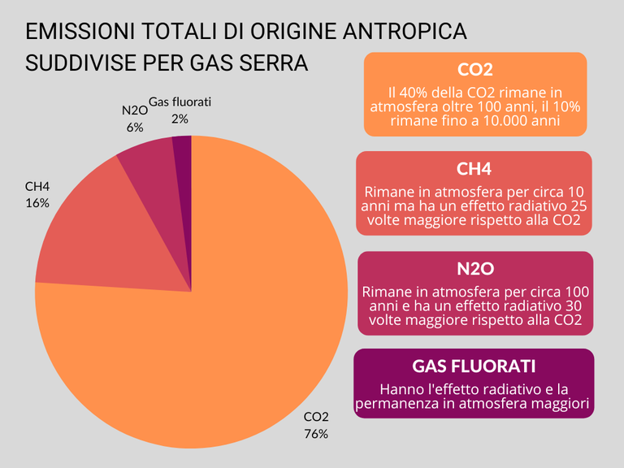
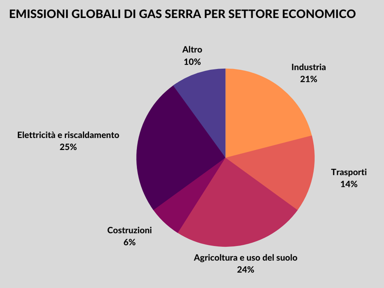
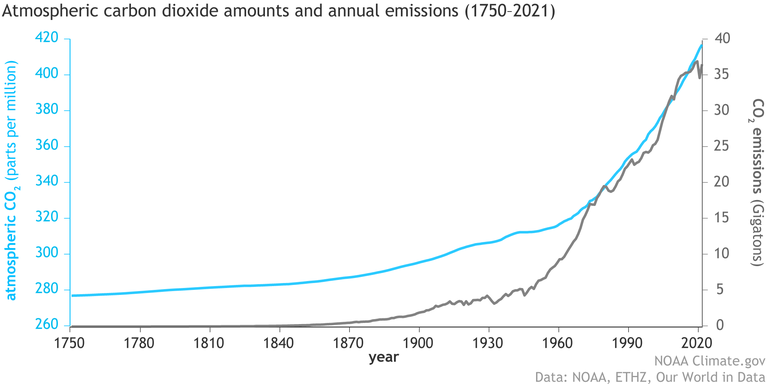
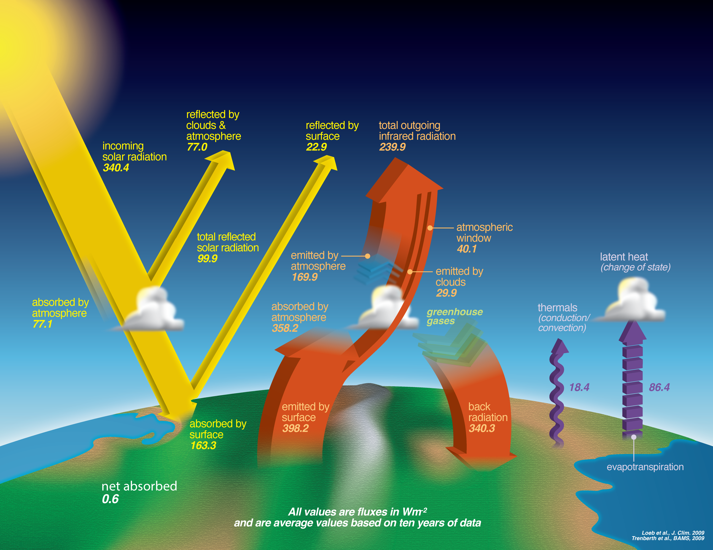
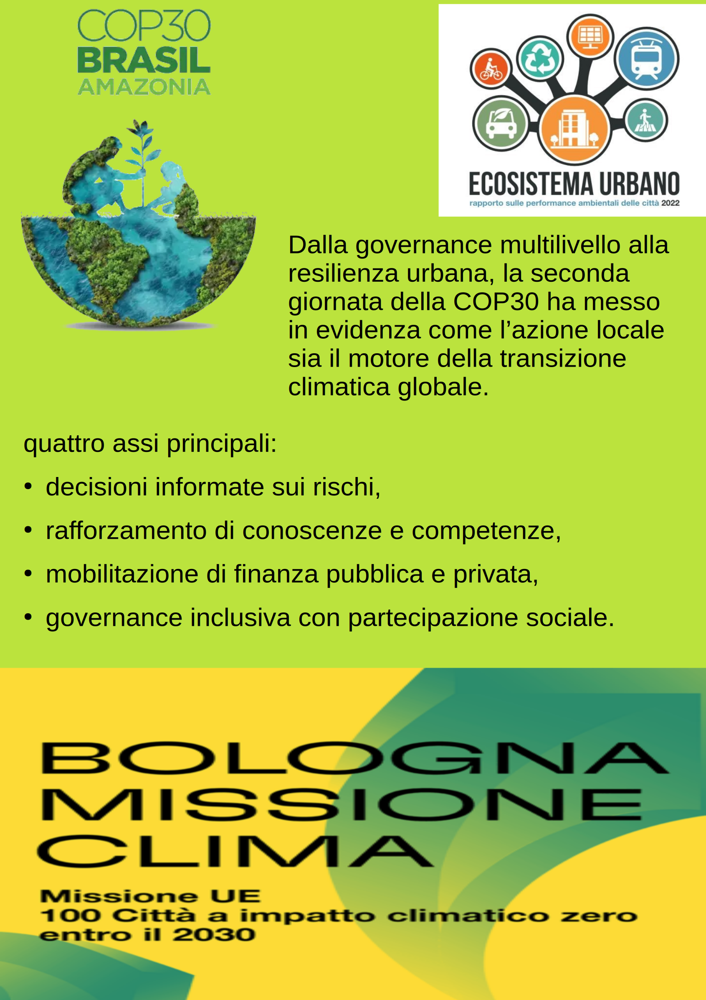

Riscaldamento globale
=====================

È davvero un problema il CAMBIAMENTO CLIMATICO?
-----------------------------------------------

.. raw:: html

	 <iframe width="560" height="315"
         src="https://www.youtube.com/embed/ALp4Cl31iM8?si=g0wRVQIq1Q7_5xmS"
         title="YouTube video player" frameborder="0"
         allow="accelerometer; autoplay; clipboard-write;
         encrypted-media; gyroscope; picture-in-picture; web-share"
         referrerpolicy="strict-origin-when-cross-origin"
         allowfullscreen></iframe>

Video dei Cartoni Morti

Giustizia Climatica
-------------------

Report Oxfam "Climate Plunder": I Super-Ricchi e la Crisi Climatica
...................................................................

`Report Oxfam "Climate Plunder" <www.oxfamitalia.org/wp-content/uploads/2025/10/Climate-Plunder-EN-Final-Paper.pdf>`_

Il rapporto denuncia l'enorme e crescente impatto delle emissioni di
carbonio dei super-ricchi sul clima globale e le forti disuguaglianze
che ne derivano.

Aumento delle Emissioni dei Super-Ricchi:

* Dal 1990, la quota di emissioni attribuibile ai super-ricchi è
  aumentata del 32%.
* Nello stesso periodo, la quota di emissioni della metà più povera
  della popolazione mondiale si è ridotta del 3%.
* Questo evidenzia come i maggiori responsabili della crisi climatica
  siano gli individui più ricchi.

Il Consumo Eccessivo:

* Si afferma che, se tutti vivessero secondo lo stile di vita
  dell'0,1% più ricco del mondo, l'intero "bilancio di carbonio"
  globale (la quantità massima di CO2​ che si può emettere per restare
  entro 1.5∘C) si esaurirebbe in meno di tre settimane.

* Questo sottolinea l'entità del consumo e dello spreco delle élite,
  spesso legato all'uso di jet privati, mega-yacht e altre attività ad
  alta intensità di carbonio.

Impatto e Responsabilità:

* Il rapporto evidenzia come i Paesi e le persone più povere siano le
  vittime principali degli impatti del cambiamento climatico (come
  alluvioni, siccità, aumento del livello del mare), pur avendo
  contribuito meno alla loro causa.

* C'è un appello affinché i Paesi ricchi e le persone più abbienti
  assumano la loro responsabilità storica e contribuiscano con
  finanziamenti consistenti per aiutare i Paesi vulnerabili ad
  affrontare e adattarsi alla crisi climatica.

In sintesi, "Climate Plunder" è un'accusa forte contro la
disuguaglianza climatica, dove una minuscola élite è la maggiore
responsabile delle emissioni che minacciano il futuro del pianeta,
mentre le comunità più povere ne subiscono le conseguenze più gravi.

Il ciclo del carbonio
---------------------

.. raw:: html

	 <iframe width="560" height="315"
	 src="https://www.youtube.com/embed/H4FiGvB5mrM?si=8eRuKG74k3HUB1ZP"
	 title="YouTube video player" frameborder="0"
	 allow="accelerometer; autoplay; clipboard-write;
	 encrypted-media; gyroscope; picture-in-picture; web-share"
	 referrerpolicy="strict-origin-when-cross-origin"
	 allowfullscreen></iframe>

L'effetto serra
---------------

L'effetto serra è un processo naturale che regola il bilancio termico
planetario. La radiazione emessa dal Sole passa attraverso l’atmosfera
e arriva alla superficie terrestre, dalla quale viene in parte
assorbita. La superficie terrestre a sua volta emette radiazione verso
l’esterno, ma a una frequenza diversa (prevalentemente nello spettro
dell’infrarosso) che la rende in parte intercettabile dai gas serra,
che la assorbono e riemettono verso la superficie terrestre,
riscaldandola. In assenza di gas serra, la temperatura media globale,
che si attesta su +15 °C, sarebbe di circa -18 °C.

I gas responsabili dell’effetto serra sono: l’anidride carbonica
(CO2), il vapore acqueo (H2O), il protossido di azoto (N2O), il metano
(CH4) e l’ozono (O3); a questi, si aggiungono altri gas di origine
unicamente antropica, quali i clorofluorocarburi (CFC), gli
idrofluorocarburi (HFC), gli idroclorofluorocarburi (HCFC) e i
perfluorocarburi (PFC).

L’influenza di ogni gas serra dipende da tre fattori:

* concentrazione: si misura generalmente in ppm (parti per milioni) e
  indica quante molecole di gas sono presenti in atmosfera per ogni
  milione di molecole di aria. È da distinguere rispetto
  all’emissione, che indica un flusso e viene espressa in unità di
  massa per unità di tempo;
* effetto radiativo: indica la capacità di ogni gas serra di assorbire
  energia solare; per mettere a confronto l’effetto forzante di tutti
  i gas serra viene utilizzata la misura CO2 equivalente, che indica
  la massa di CO2 necessaria per ottenere lo stesso potenziale di
  riscaldamento climatico (Global Warming Potential);
* durata: si riferisce alla permanenza dei gas serra in atmosfera.

   Emissioni totali di origine antropica suddivise per gas serra (Rielaborazione su dati IPCC 2014)

   Emissioni globali di gas serra suddivise per settore economico (Rielaborazione su dati IPCC 2014)

Le attività antropiche sono responsabili sia dell’aumento della
concentrazione dei gas serra di origine naturale sia dell’immissione
di gas normalmente non presenti in atmosfera, alimentando un processo
che porta a un incremento dell’effetto serra, fenomeno che sta alla
base del riscaldamento globale e quindi del cambiamento climatico
(IPCC, 2014).

	   
   Emissioni e concentrazione atmosferica di CO2 dal 1750 al 2020 (Fonte: NOAA)

.. raw:: html

	 <iframe src="https://ourworldindata.org/grapher/global-co2-concentration?time=earliest..2025-08-15&tab=line"
	 loading="lazy" style="width: 100%; height: 600px; border: 0px none;" allow="web-share; clipboard-write">
	 </iframe>

	 

   Il bilancio energetico della terra descrive i vari tipi e le
   quantità di energia che entrano e escono dal sistema terra. Esso
   include sia la componente radiativa (luce e calore) che altre
   componenti quali conduzione, evaporazione e evaporazione che
   possono trasportare calore dalla superfice terrestre. La quantità
   di energia in arrivo dal sole uguaglia la quantità di energia
   uscente (luce solare riflessa e emissione infrarossa).
   Crediti: NASA
   
.. raw:: html

	 <iframe width="560" height="315"
	 src="https://www.youtube.com/embed/wObY19rt3Wg?si=V07ke0OXf5g_k6uF"
	 title="YouTube video player" frameborder="0"
	 allow="accelerometer; autoplay; clipboard-write;
	 encrypted-media; gyroscope; picture-in-picture; web-share"
	 referrerpolicy="strict-origin-when-cross-origin"
	 allowfullscreen></iframe>

Cause del cambiamento climatico
-------------------------------

.. raw:: html

	 <iframe width="560" height="315"
	 src="https://www.youtube.com/embed/P0qn279jwTg?si=6T0j09XgXMPVnPwy"
	 title="YouTube video player" frameborder="0"
	 allow="accelerometer; autoplay; clipboard-write;
	 encrypted-media; gyroscope; picture-in-picture; web-share"
	 referrerpolicy="strict-origin-when-cross-origin"
	 allowfullscreen></iframe>

Documenti ufficiali sul cambiamento climatico
---------------------------------------------

2024 - a second record-breaking year, following the exceptional 2023

* `Global Climate Highlights 2024 <https://climate.copernicus.eu/global-climate-highlights-2024>`_

climatereanalyzer.org

* `Explore Climate Change <https://climatereanalyzer.org/clim/explore/>`_

Trattati internazionali
-----------------------

COP30 a Belém -Brasile  - 10-21 novembre 2025
.............................................

30esima edizione della Conferenza delle Parti sui cambiamenti
climatici sotto l’egida dell’Onu

Delusione e nessun impegno di abbandono delle fonti fossili

Belém luogo simbolico accanto la foresta dell’Amazzonia, il “polmone
verde” del mondo, che si sta sempre più riducendo per via di incendi e
disboscamenti.

La crisi climatica rappresenta una delle sfide più complesse del
nostro tempo: il cambiamento climatico non solo genera impatti
differenziati sui popoli, accrescendo le disuguaglianze, ma le stesse
politiche di transizione possono produrre effetti regressivi, se non
adeguatamente progettate.  Occorre  integrare obiettivi di
sostenibilità ambientale, sociale ed economica

Alcune date importanti

* La **Conferenza di Rio de Janeiro del 1992**, che ha rappresentato la
  prima risposta globale alla sfida dei cambiamenti climatici. Sono
  state adottate tre principali convenzioni ambientali multilaterali
  : **la Convenzione sulla Diversità Biologica**, la **Convenzione quadro
  delle Nazioni Unite sui cambiamenti climatici (UNFCCC)** e
  la **Convenzione delle Nazioni Unite per la lotta alla
  desertificazione (UNCCD)**.  La conferenza ha anche prodotto l'Agenda
  21 e la Dichiarazione di Rio.
  
* **Accordi e sviluppi successivi:** **Protocollo di Kyoto (1997)**,
  che è stato il primo accordo globale a fissare obiettivi vincolanti
  di riduzione delle emissioni di gas serra per i paesi
  industrializzati. L'Italia ha ratificato il Protocollo di Kyoto con
  la legge 1 giugno 2002, n. 120.  **Accordo di Parigi (2015)**, che
  ha rafforzato il quadro dell'UNFCCC, stabilendo che tutti i Paesi si
  uniscono per lavorare verso l'obiettivo di 1,5 °C. L'Italia ha
  firmato l'Accordo di Parigi sul clima il 22 aprile 2016,
  legge n. 204/2016. Il Paese ha poi preso ulteriori impegni nel
  quadro europeo. Il **Green Deal europeo** il **piano d'azione
  dell'UE** per attuare l'Accordo di Parigi e rendere l'Europa il
  primo continente climaticamente neutro entro il 2050, stabilendo
  obiettivi vincolanti di riduzione delle emissioni e un insieme di
  leggi e strategie per raggiungerli. Obiettivi intermedi: Una
  riduzione delle emissioni del 55% entro il 2030 e Una strategia che
  riguarda settori come energia, trasporti, industria, agricoltura e
  finanza. Piani per la promozione delle energie rinnovabili,
  l'efficienza energetica, il trasporto sostenibile e la riduzione dei
  rifiuti. Natura-Strategia e piano d'azione interno dell'UE, con
  l'obiettivo di guidare la transizione verso un'economia e una
  società a zero emissioni.

**Posizioni UE in COP 30**

* Riduzione delle emissioni: L'UE mira a una riduzione delle emissioni
  nette di gas serra compresa tra il 66,25% e il 72,5% entro il 2035
  rispetto ai livelli del 1990, come aggiornamento del proprio NDC
  (Contributo Determinato a Livello Nazionale).
* Transizione energetica: L'UE sostiene una transizione graduale dai
  combustibili fossili, garantendo al contempo che sia equa e
  inclusiva per tutti i paesi.
* Adattamento: L'UE si è impegnata a rafforzare l'azione di
  adattamento per aumentare la resilienza globale ai cambiamenti
  climatici.
* Finanziamenti: L'UE ha ribadito l'importanza di aumentare la
  mobilitazione dei finanziamenti internazionali per il clima, con un
  focus particolare sui paesi vulnerabili.
* Cooperazione internazionale: L'UE ha sottolineato la necessità di
  una cooperazione internazionale rafforzata e ha esortato i
  principali paesi responsabili delle emissioni ad aggiornare i loro
  NDC con maggiore ambizione.

L’Italia complessivamente si è caratterizzata come un blocker
all’interno del gruppo europeo, sulla base di un’assenza di mandato da
parte del Consiglio UE. Non ha aderito all’appello per promuovere la
roadmap per l’uscita dalle fonti fossili. Ha confermato la propria
disponibilità rispetto alla finanza per l’adattamento, ma non si è
esposta su mitigazione e just transition.
  
La mostra sul cambiamento climatico: Atmosfere Possibili
--------------------------------------------------------

.. image :: out-0.jpg
	   :width: 100%
.. image :: out-1.jpg
	   :width: 100%
.. image :: out-2.jpg
	   :width: 100%
.. image :: out-3.jpg
	   :width: 100%
.. image :: out-4.jpg
	   :width: 100%
.. image :: out-5.jpg
	   :width: 100%
.. image :: out-6.jpg
	   :width: 100%
.. image :: out-7.jpg
	   :width: 100%
.. image :: out-8.jpg
	   :width: 100%
.. image :: out-9.jpg
	   :width: 100%
.. image :: out-10.jpg
	   :width: 100%
.. image :: out-11.jpg
	   :width: 100%
.. image :: out-12.jpg
	   :width: 100%
  
