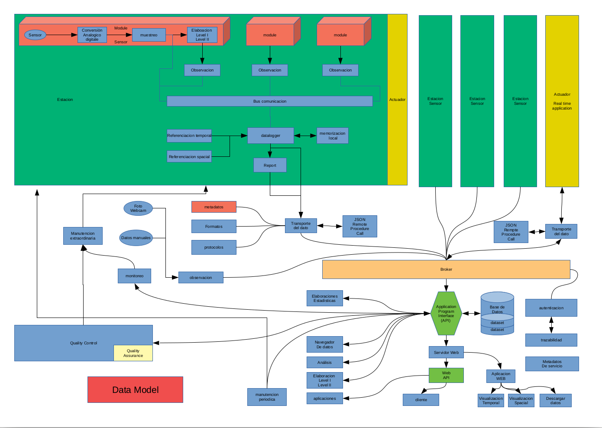

RMAP
====

Obiettivi R-map
---------------

* Raccogliere e distribuire dati ambientali rilevati dai cittadini
* Rendere disponibili questi dati ai servizi meteorologici, alle
  agenzie di prevenzione ambientale, alla protezione civile e istituti
  di ricerca
* Fornire feedback ai fornitori di dati in modo che essi abbiano
  servizi per testare e migliorare la qualità dei dati
* Divulgazione scientifica e sensibilizzazione ai temi ambientali
* Coinvolgimento di scuole e università a scopi formativi
* Creare un circolo virtuoso tra Enti Formativi, Pubbliche
  Amministazioni, Aziende private e cittadini.

Soggetti coinvolti
------------------

* ARPAE Emilia Romagna SIMC
* ARPA Regione Veneto
* Cineca Consorzio Interuniversitario per il supercalcolo e
  l’innovazione tecnologica
* Dipartimento informatica Università di Bologna
* RaspiBO: gruppo informale di appassionati di elettronica ed
  informatica libera della zona di Bologna
* Soggetti privati
  
  * DigitEco SRL Via del Fonditore 16A, 40138 Bologna (BO), Italy
  * CAE S.p.A. - Via Colunga, 20 40068 San Lazzaro di Savena (BO) - Italy
  * ETG SRL Via di Porto 159 - 50018 Scandicci (FI),
  * BE20 Innovation srl
  * MEEO srl https://www.meeo.it/company/
  
* Associazione di volontariato Parco dei Cedri nel cuore
* Scuole

Cosa è RMAP
-----------

**Un insieme di specifiche**

* Protocollo di rilevamento dati:

  - Specifiche metrologiche dei sensori
  - Specifiche per la rappresentatività delle misure
  - Post elaborazioni

* Sistema per lo scambio dati:

  - Protocolli di trasmissione
  - Formati dati
  - Metadati

**Implementazioni hardware e software**

Sono specifiche realizzazioni che aderiscono allo standard RMAP
tramite open hardware e open software

Implementazioni disponibili:

* stazioni Stima
* Server RMAP

Le specifiche RMAP per stazioni di monitoraggio ambientale
----------------------------------------------------------

* RMAP è una rete di monitoraggio partecipativo promossa da più di
  dieci anni da vari soggetti pubblici e privati che si propone di
  definire metadati, protocolli e formati per raccogliere e
  condividere dati ambientali.

* La rappresentazione dei dati è basata su un data model equilibrato
  tra le necessità di rappresentare differenti tipologie di dati e la
  semplicità di utilizzo e di ottimizzazione dei sistemi. Questo data
  model è in grado di rappresentare sia stazioni fisse e mobili, che
  dati osservati e previsti.

* Lo standard RMAP permette l’adozione e l’interscambio di
  implementazioni software e hardware con differenti scelte tecniche,
  sia a livello server che nelle stazioni di misura; permette
  soluzioni modulari realizzate con open hardware stabile e basato su
  sviluppo cooperativo.

* RMAP, di fatto, comprende una serie di standard tra cui la
  comunicazione tra stazione e server di raccolta dati

Schema flusso dati
..................

Formati
.......

JSON
^^^^

http://www.json.org/json-it.html

JSON (JavaScript Object Notation) è un semplice formato per lo scambio
di dati. Per le persone è facile da leggere e scrivere, mentre per le
macchine risulta facile da generare e analizzarne la sintassi.

Rispetta il data model

Ogni elemento è il report con i dati di una certa stazione per un
certo istante di riferimento.

Bufr
^^^^

Il Binary Universal Form for the Representation of meteorological data
(BUFR) è un formato di dati binari gestito dall'Organizzazione
meteorologica mondiale (WMO).

Il BUFR è stato progettato per essere portatile, compatto e
universale. È possibile rappresentare qualsiasi tipo di dato, insieme
al suo specifico contesto spazio-temporale e a qualsiasi altro
metadato associato. Nella terminologia dell'OMM, il BUFR appartiene
alla categoria delle forme di codice guidate da tabelle, in cui il
significato degli elementi dei dati è determinato facendo riferimento
a un insieme di tabelle che sono conservate e mantenute separatamente
dal messaggio stesso.

Descrittori: tutti i descrittori degli elementi si trovano nella
sezione delle specifiche BUFR nota come "Tabella B".  La definizione
della Tabella B di un descrittore di elemento comprende il numero, la
definizione di testo breve, i parametri di decodifica (larghezza di
bit, fattore di scala e bias) e il tipo (numerico, stringa di
caratteri, tabella di codice, ecc.).

Formato GeoJSON per punti sparsi
^^^^^^^^^^^^^^^^^^^^^^^^^^^^^^^^

http://geojson.org/ https://macwright.org/2015/03/23/geojson-second-bite.html
the Internet Engineering Task Force (IETF) ha pubblicato in Agosto 2016 RFC 7946

E' un formato molto verboso (soprattutto per le serie temporali) ma
rispetta il data model RMAP (anche se in modo non ottimale)

E' uno dei formati vettoriali interpretati da
* GDAL/OGR
* OpenLayers
* QGIS
* ...

Software di decodifica Bufr
,,,,,,,,,,,,,,,,,,,,,,,,,,,

* WREPORT: a featureful C++ library for BUFR and CREX encoding and
  decoding http://sourceforge.net/p/wreport/home/Home/
* ecCodes https://software.ecmwf.int/wiki/display/ECC/ecCodes+Home

Protocolli
..........

E' fondamentale: aderire a standard IOT e l'integrazione con le
funzioni e le specifiche richieste dalle applicazioni per la domotica

MQTT (Message Queue Telemetry Transport)
^^^^^^^^^^^^^^^^^^^^^^^^^^^^^^^^^^^^^^^^

E' un protocollo publish/subscribe particolarmente leggero, adatto per
la comunicazione M2M tra dispositivi con poca memoria o potenza di
calcolo e server o message broker.

Il mittente di un messaggio si limita a "pubblicare" il proprio
messaggio al broker. I destinatari si rivolgono a loro volta al broker
"abbonandosi" alla ricezione di messaggi.

Il meccanismo di sottoscrizione consente ai subscriber di precisare a
quali messaggi sono interessati tramite un pattern (topic).

Client e broker si scambiano messaggi di polling per monitorare lo
stato delle comunicazioni; sono previsti messaggi "will and testament"

AMQP (Advanced Message Queuing Protocol)
^^^^^^^^^^^^^^^^^^^^^^^^^^^^^^^^^^^^^^^^

E' protocollo per comunicazioni attraverso code di messaggi. Sono
garantite l'interoperabilità, la sicurezza, l'affidabilità, la
persistenza. Nella sua implementazione Rabbitmq exporta un broker MQTT
e fornisce delle api web Json è il formato per il payload

HTTP/HTTPS
^^^^^^^^^^

E' possibile utilizzare il protocollo http con una get per inviare i
dati; la get http sarà immediatamente convertita dal server in una
"pub" al broker mqtt. Http è molto inefficiente rispetto mqtt e qui è
utilizzato solo come "bridge" a mqtt quando dovesse essere necessario.

Json-rpc
^^^^^^^^

Json (JavaScript Object Notation) ed è un formato adatto ad
immagazzinare varie tipologie di informazioni, e quindi a scambiare
queste informazioni tra applicazioni client/server.  JSON possiede una
struttura semplicissima

JSON-RPC è un protocollo leggero per remote procedure call simile a
XML-RPC. E' progettato per essere semplice!

Esempi:

::

   --> {"jsonrpc": "2.0", "method": "subtract", "params": {"subtrahend": 23, "minuend": 42}, "id": 3}
   <-- {"jsonrpc": "2.0", "result": 19, "id": 3}
   
   --> {"jsonrpc": "2.0", "method": "subtract", "params": {"minuend": 42, "subtrahend": 23}, "id": 4}
   <-- {"jsonrpc": "2.0", "result": 19, "id": 4}

La richiesta
,,,,,,,,,,,,

Tutti i parametri trasferiti di ogni tipo sono singoli oggetti,
serializzati usando JSON. Una richiesta è una chiamata a uno specifico
metodo disponibile sul sistema remoto; deve contenere tre specifiche
proprietà:

* method  -  Una stringa col nome del metodo da invocare.
* Params - Un array di oggetti come parametri al metodo invocato.
* id - Un valore di qualsiasi tipo, usato per riferire la risposta alla richiesta a cui si sta rispondendo. 

La risposta
,,,,,,,,,,,

Il server che riceve la richiesta deve rispondere con una risposta
valida a tutte le richieste ricevute. Una risposta deve contenere le
proprietà descritte qui sotto:

* result - I dati ritornati dal metodo invocato. Se c'è un errore invocando il metodo, il valore deve essere null.
* error - Uno specifico codice di errore se l'invocazione del metodo ha dato luogo a un errore, altrimenti null.
* id - L'id della richiesta a cui si sta rispondendo. 

Json-rpc un modo per fare tutto...
,,,,,,,,,,,,,,,,,,,,,,,,,,,,,,,,,,

Questo un esempio di interrogazione e risposta di un sensore di
temperatura

::

   SEND:{"jsonrpc":"2.0", "method":"getjson", "params":{"node":1, "type":"TMP", "driver":"I2C", "address":72},"id": 0}
   RECEIVE: {"jsonrpc":"2.0","result":{"B12101":30633},"id":0}

B12101 indica che il numero che segue è una temperatura in centesimi
di gradi Kelvin, quindi 33.18 C.

SOS
^^^

Introduzione
,,,,,,,,,,,,

* Standard OGC dal 2007
* http://www.opengeospatial.org/standards/sos
* Standard che definisce l’interfaccia di un servizio web per
  l’interrogazione di osservazioni, metadati dei sensori e
  rappresentazione delle caratteristiche osservate

Tre servizi di base:

* GetCapabilities: informazioni sul servizio e sui sensori disponibli
* DescribeSensor: metadati del sensore (SensorML)
* GetObservation: valori misurati dai sensori (Observations and
  Measurements)

Più Servizi opzionali

Parole chiave
'''''''''''''

* **Procedure** è ciò che produce l’osservazione

  * Sensore
  * Postprocessamento (e.g. media, massima, minima)
    
* **Observed property** è la proprietà osservata
* **Feature Of Interest** è l’oggetto georeferenziato che viene
  misurato. Nel nostri casi, generalmente coincide con la stazione
* **Observation offering** è un gruppo di osservazioni che sono
  fornite insieme

  * Singolo sensore
  * Stazione
  * Rete
  * ...

Compatibilità con rmap
,,,,,,,,,,,,,,,,,,,,,,

* Una **procedure** può coincidere con un sensore
  e.g. -/1212345,4312345/rmap/254,0,0/103,2000,-,-/B12101
* Una **observed property** può coincidere con

  * La terna (timerange, livello, var) e.g. 254,0,0/103,2000,-,-/B12101
  * La sola var e.g. B12101

* Una **feature of interest** può coincidere con la stazione
  e.g. -/1212345,4312345/rmap

Implementazione in rmap
,,,,,,,,,,,,,,,,,,,,,,,

::

   http://rmap.cc/sos?service=SOS&acceptVersions=1.0.0&request=GetCapabilities
   http://rmap.cc/sos/?service=SOS&version=1.0.0&request=DescribeSensor&procedure=urn:rmap:procedure:digiteco/1162336,4465346/rmap/254,0,0/103,2000,-,-/B12101
   http://rmap.cc/sos/?service=SOS&version=1.0.0&request=GetObservation&responseFormat=text/xml;subtype="om/1.0.0"&offering=urn:rmap:procedure:digiteco/1162336,4465346/rmap/254,0,0/103,2000,-,-/B12101&observedProperty=urn:rmap:procedure:digiteco/1162336,4465346/rmap/254,0,0/103,2000,-,-/B12101

Implementazioni Hardware e Software
-----------------------------------

Stazioni Stima
..............

* :ref:`StimaWiFi V3<stimawifi_v3-reference>`
* :ref:`Stima V3<stima_v3-reference>`
* :ref:`Stima V4<stima_v4-reference>`

Server RMAP
...........

* :ref:`Server RMAP<server-reference>`
