RMAP e Stima: cronistoria del progetto
======================================

01/12/2012
----------

RaspiBO nasce su iniziativa di un gruppo eterogeneo
di appassionati di elettronica e informatica libera provenienti dal
mondo dell’associazionismo, dell’attivismo e dell’università, fra cui
docenti e studenti.

Insieme a esso nasce il progetto RMAP con il contributo di personale
di ARPAE-SIMC

23/10/2012
----------

Linux Day a Bologna

Presentazione

Stima: prototipo di stazione meteo rete monitoraggio ambientale partecipativo

01/09/2013
----------

Inizio raccolta dati su server RMAP casalingo.

18/10/2013
----------

Inizia lo sviluppo del codice su piattaforma Sourceforge
https://sourceforge.net/projects/r-map/

:ref:`Stima V0 <stima_v0-reference>`

:ref:`Stima V1 <stima_v1-reference>`      

Un altro Linux Day non ben collocato nello spazio e nel tempo

01/06/2014
----------

:ref:`Stima V2 <stima_v2-reference>`

01/07/2014
----------

server RMAP in ARPA Veneto

03/10/2014
----------

Partecipazione a Maker Faire Roma

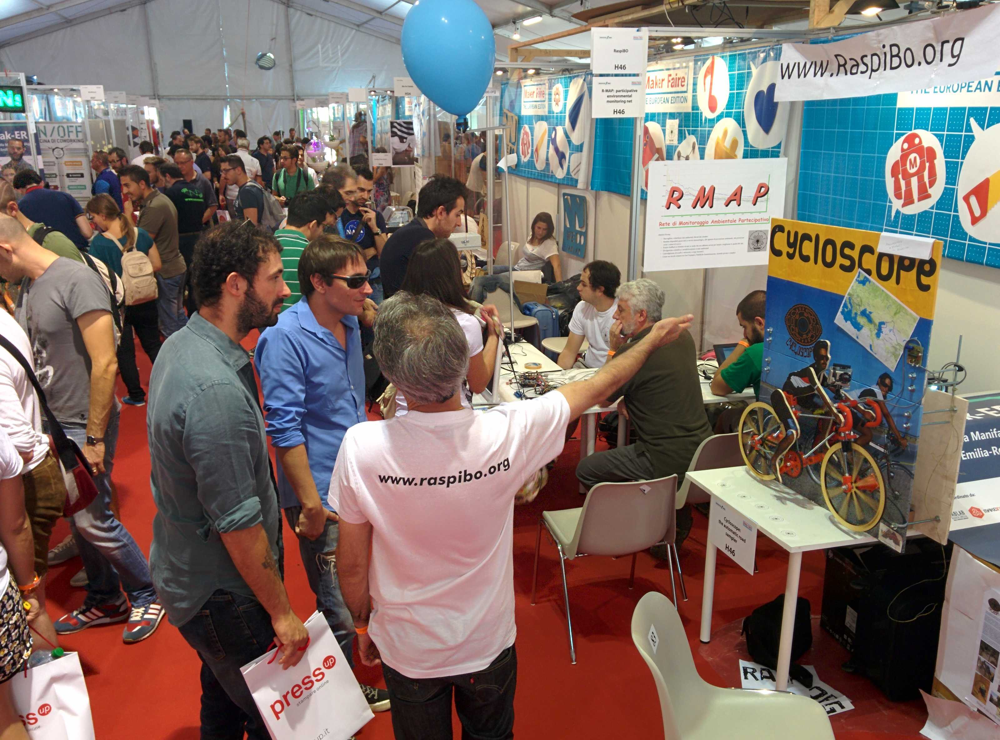

01/01/2015
----------

Prende corpo lo sviluppo del server RMAP

01/06/2015
----------

Pubblicazione articolo su Ecoscienza 6/2015
Il progetto RMAP, rete di monitoraggio ambientale partecipativo

Articolo :download:`pdf <patruno_desavino_es2015_6.pdf>`

01/12/2015
----------

Pubblicazione su Elettronica In in 3 puntate

Rilasciata :ref:`Stima V2 <stima_v2-reference>`

19/07/2015
----------

* Migrato progetto su piattaforma GitHub
* Rilasciata :ref:`StimaWiFi V2 <stimawifi_v2-reference>`
* Rilasciata :ref:`Stima V2 mobile <modulo_stima_bluetooth>`

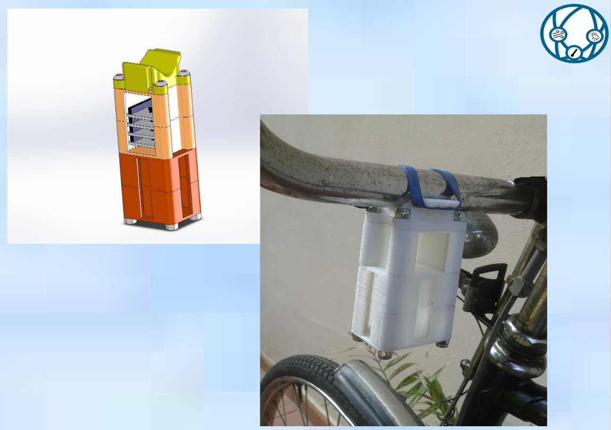

Installazione stazione complessa a Molinella a cura di ARPAE-SIMC

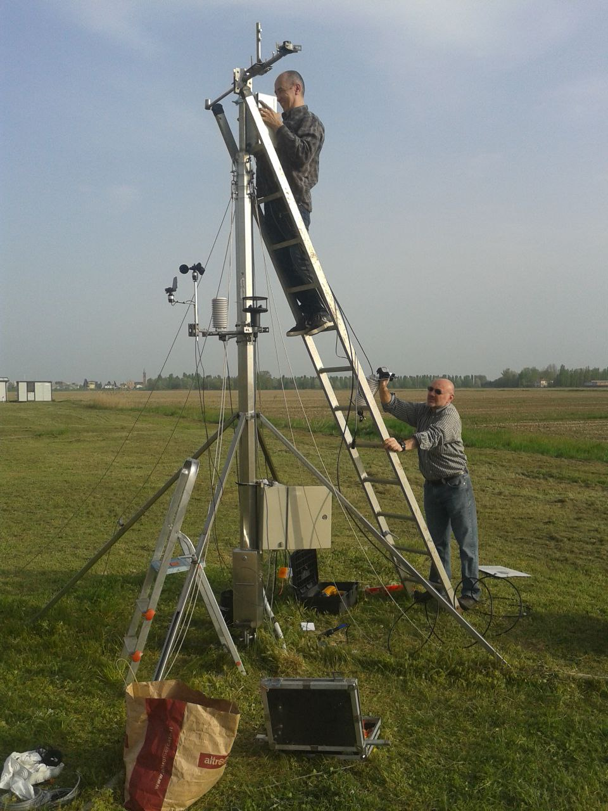
	   
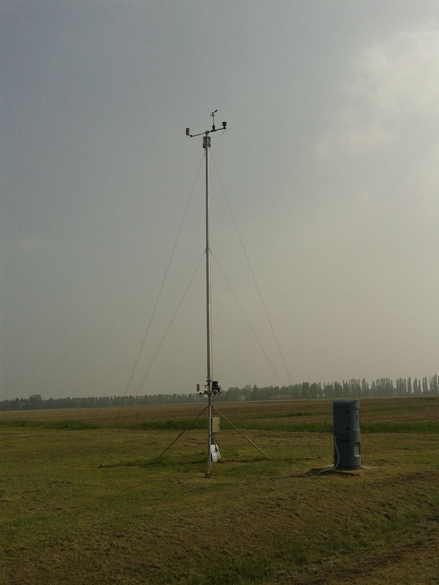
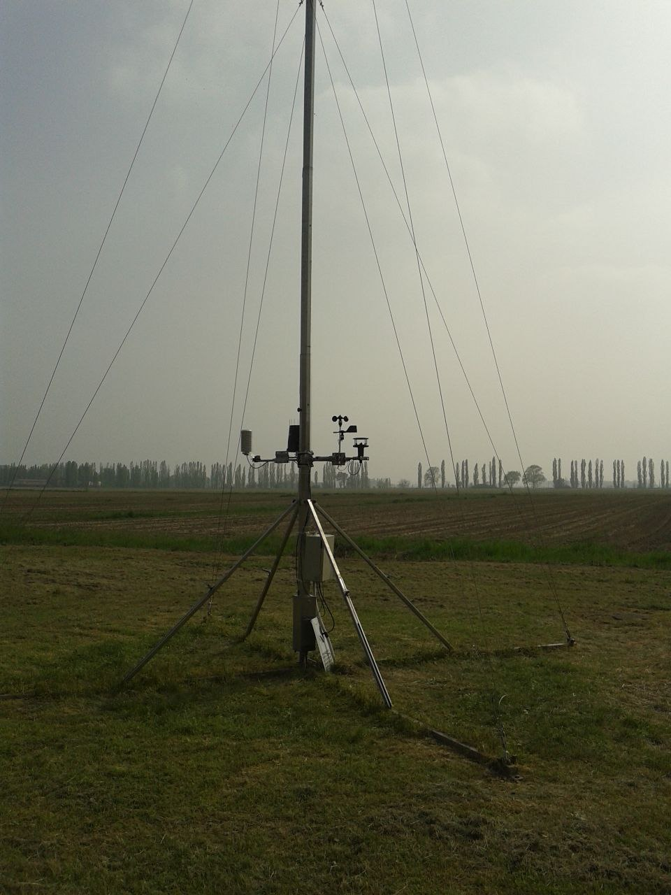
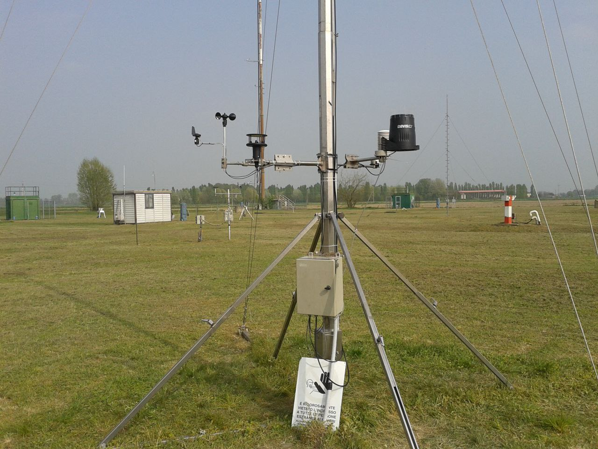
	   
03/02/ 2016
-----------

Pubbllicato come report tecnico di ARPAE e Cineca su dati Meteonetwork e ARPAE:
"Studio statistico dell’impatto della rete MeteoNetwork sulla stima di
parametri meteo superficiali in Emilia-Romagna"

Report :download:`pdf <report.pdf>`	   

15/12/2016
----------

Bando di gara ARPAE per Stima V3 € 38.000
assegnata a DIGITECO s.r.l.

:ref:`Stima V3 <stima_v3-reference>`

Ulteriore fornitura di Stima V3 Air Quality (3 stazioni per ARPAE)

20/07/2017
----------

**Siminaria ARPAE-SIMC**
Stima: prototipo di stazione meteo rete monitoraggio ambientale partecipativo

28/01/2018
----------

Aria Pesa

La prima mappa partecipata sull'inquinamento da No2 https://ariapesa.org/

01/05/2018
----------

Ottavo nano

Progetto del Laboratorio Territoriale (LTO)

Opificio Golinelli per Liceo Malpighi di Bologna e IIS Archimede di
San Giovanni in Persiceto Bologna

Stima WiFi nelle scuole

01/09/2018
----------

:ref:`Installazione testa di prelievo <testa_di_prelievo_per_sensori_air_quality>`

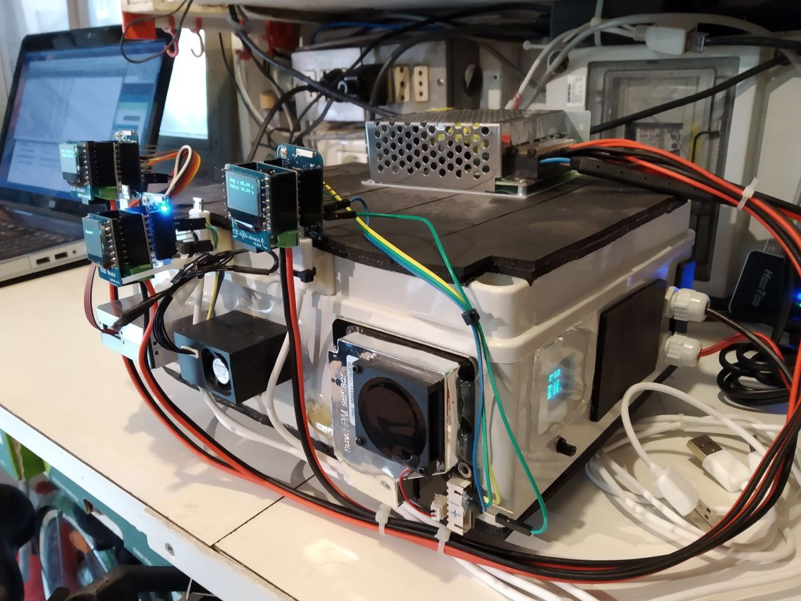

15/12/2018
----------

Progetto RAINBO
https://partecipa.rainbolife.eu

13/06/2018
----------
**Siminaria ARPAE-SIMC**

LoRaWAN su infrastruttura The Things Network per il monitoraggio ambientale

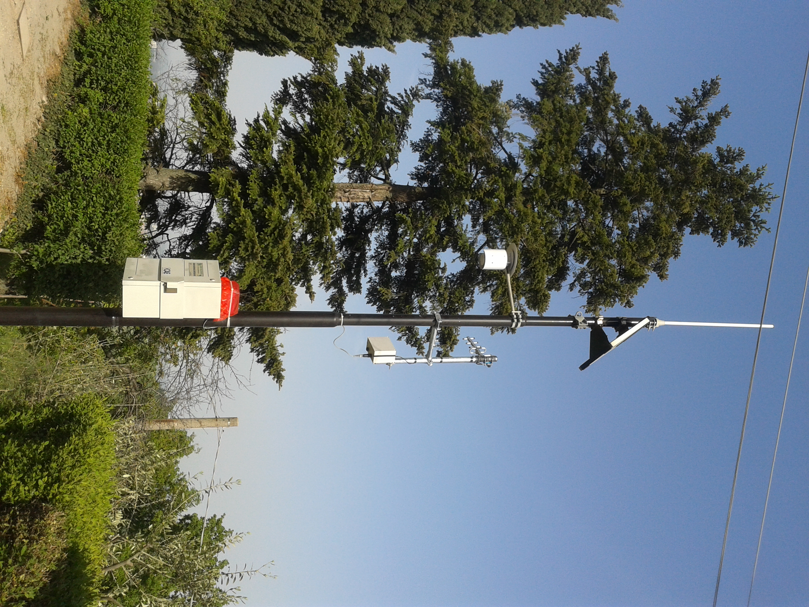

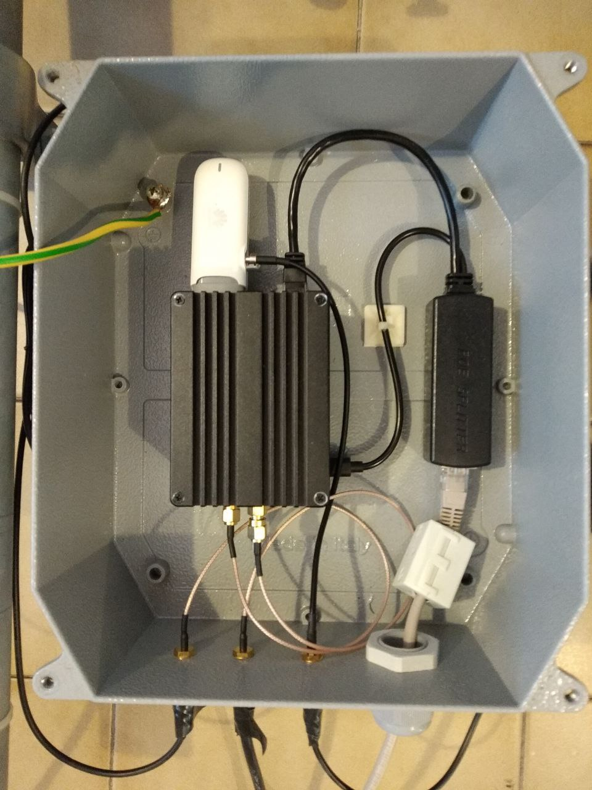

	   
24/10/2018
----------

**Presentazione a ARPA Piemonte**

01/02/2019
----------

Server RMAP in ARPAE

01/04/2019
----------

**Bolivia**

EU Aid Volunteers è un’iniziativa dell'Unione europea che offre
l’opportunità ai cittadini europei che hanno compiuto 18 anni di
essere coinvolti come volontari in progetti umanitari nel sud del
mondo.

L'iniziativa permette di fornire supporto professionale attraverso
l'impiego di volontari senior o junior adeguatamente formati e
preparati, rafforzando la capacità e la resilienza delle comunità
vulnerabili nei paesi del sud, attraverso la realizzazione di progetti
comuni tra gli operatori umanitari esperti e le organizzazioni locali.

Il programma è promosso dalla Direzione generale per gli Aiuti
umanitari - DG ECHO

.. image:: IMG_20190413_085005.jpg

https://www.raspibo.org/wiki/index.php/Gruppo_Meteo/Bolivia

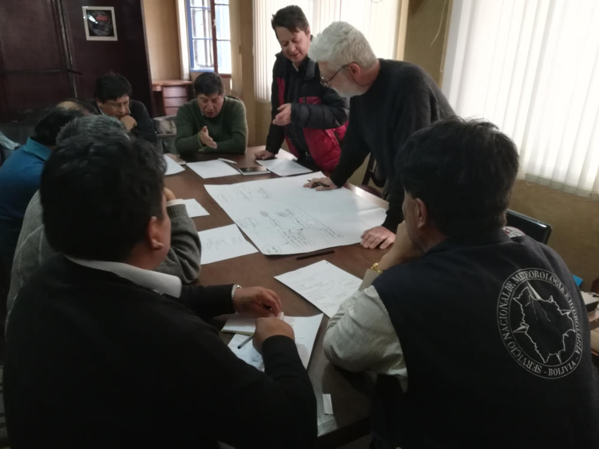
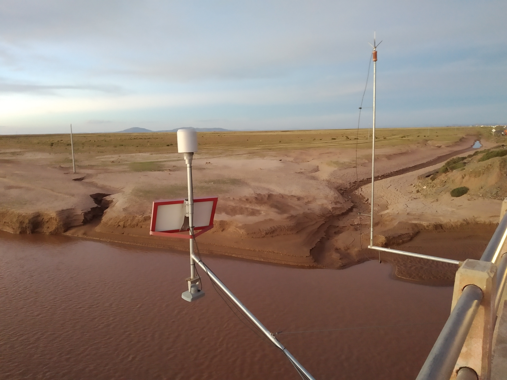

19/06/2019
----------
Siminaria ARPAE-SIMC Bologna

Le specifiche RMAP per stazioni di monitoraggio ambientale

26/11/2019
----------

Pubblicazione su Weather

Validation of high-impact weather event predictions using an
integrated institutional–citizen observational network

01/06/2020
----------

Mistral e MeteoHub

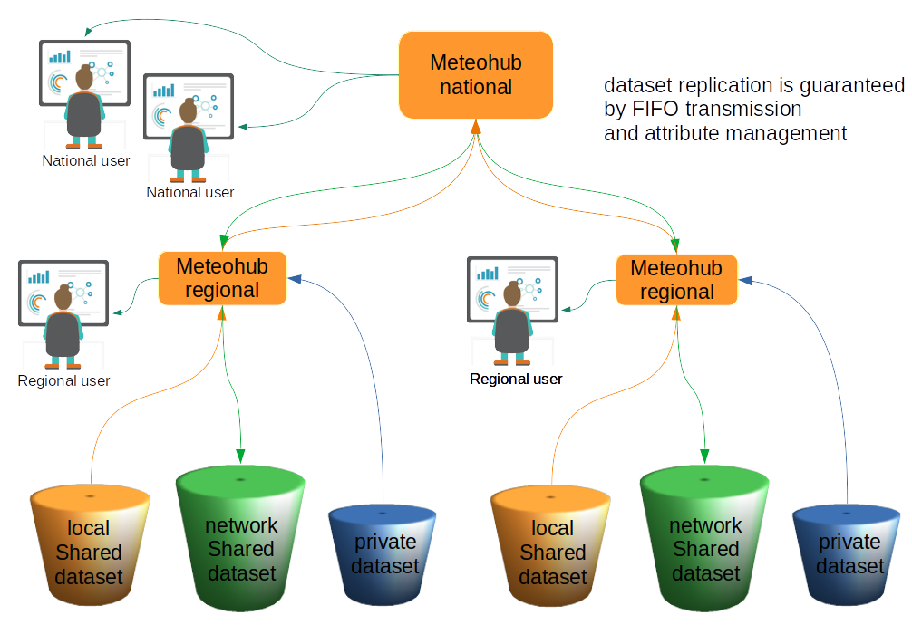
	   
Articolo :download:`pdf <The_Italian_open_data_meteorological_portal_MISTRAL.pdf>`	   

Comprende i dati di Meteonetwork

01/10/2020
----------

Installazioni StimaWiFi

.. image:: stimawifi.jpg
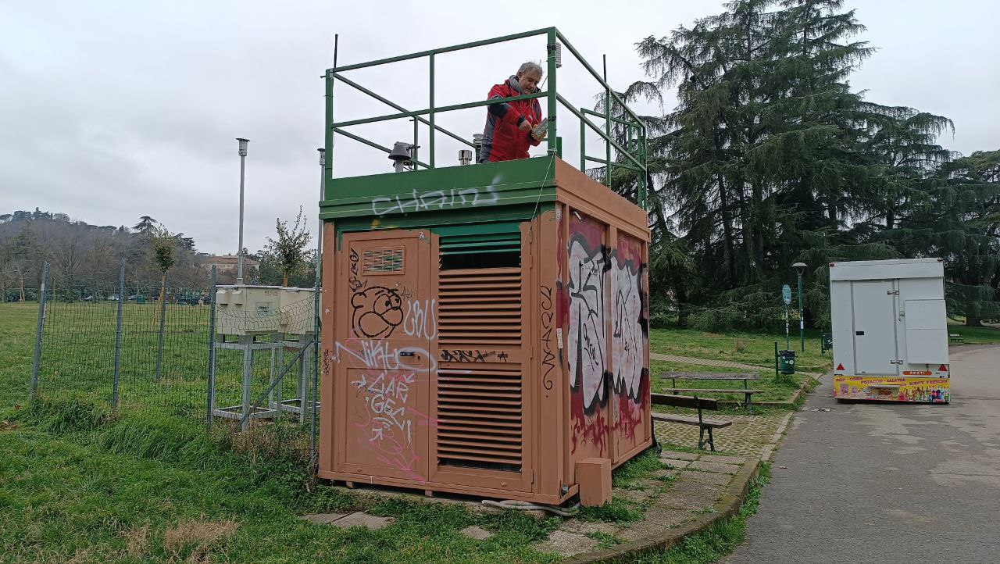
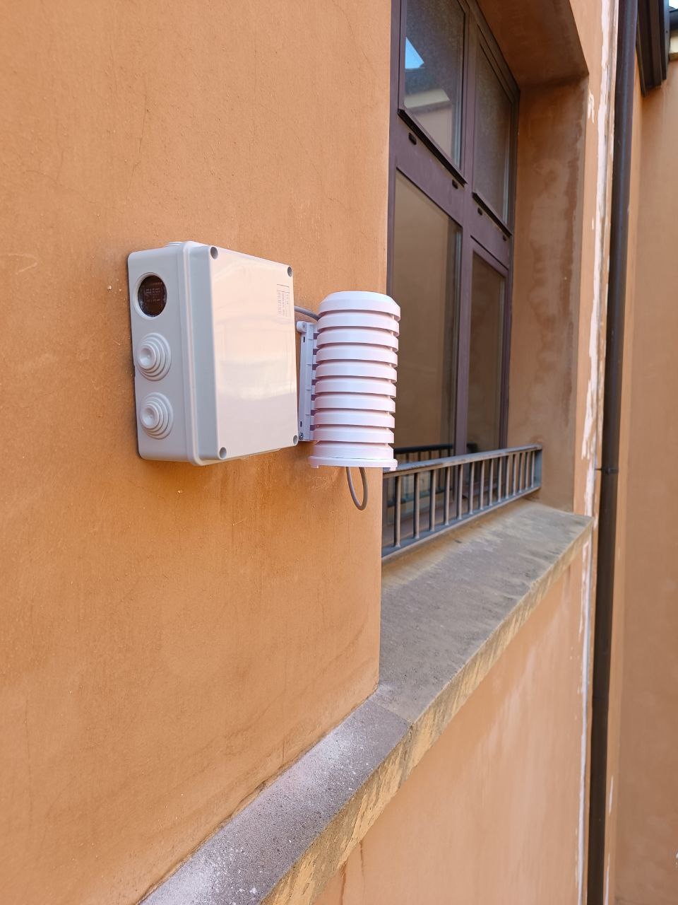
   
01/01/2021
----------

Progetto Air Break, finanziato nell’ambito del Programma Europeo Urban Innovative Actions
https://airbreakferrara.net/

Varie iniziative con laboratori con tutor per l'asssemblaggio e
installazioni di stazioni in territorio urbano.

01/05/2021
----------

Gara ARPAE per Corte Suprema Dati Osservati (COSUDO)
Interfaccia grafica utente per controllo di qualità dati osservati

https://github.com/ARPA-SIMC/cosudo

01/09/2021
----------

Progetto Fotosintesi Urbana

* https://ponmetro.comune.bologna.it/wp-content/uploads/2019/11/collpaimp_fotosintesiurbana.pdf

* https://fisica-e-scuola.difa.unibo.it/attivita-per-il-pubblico/esposizione/fotosintesi-urbana

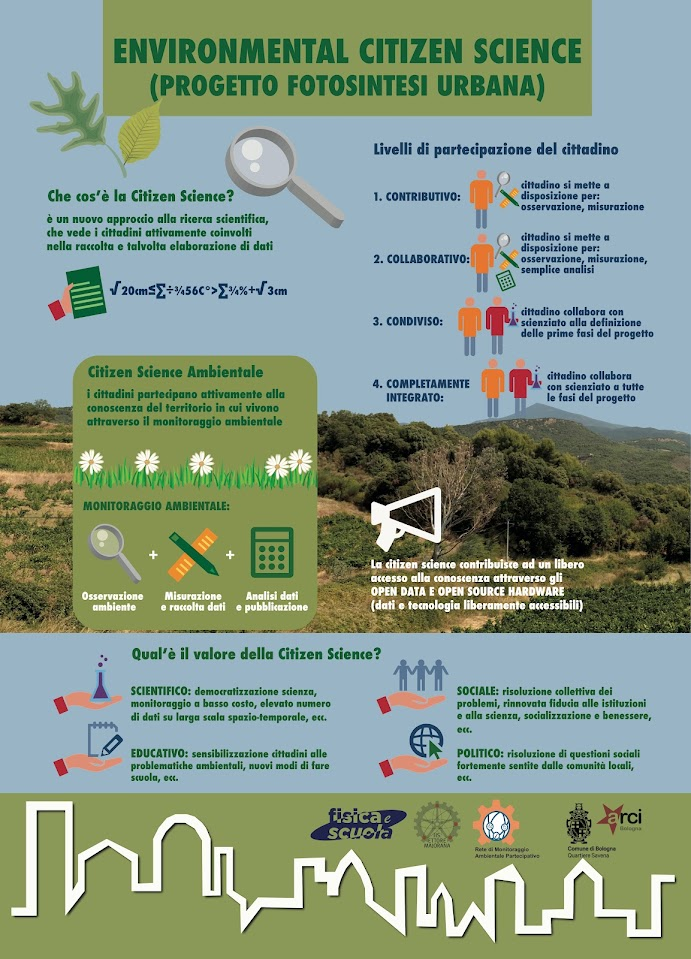
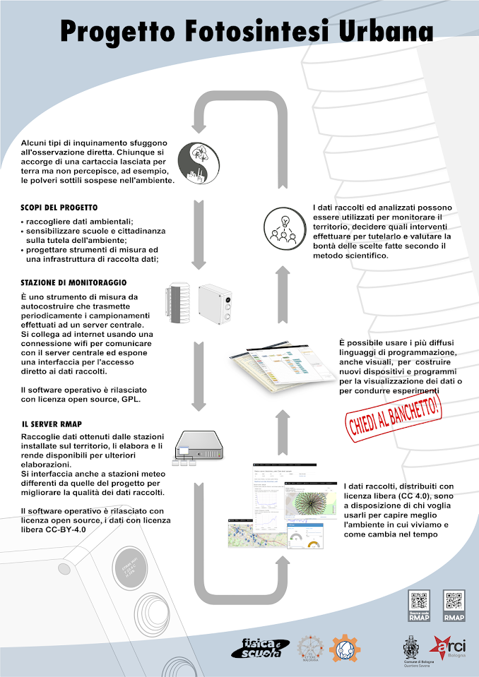
	   

24/09/2021
----------

Notte Europea dei Ricercatori 2021 a Bologna

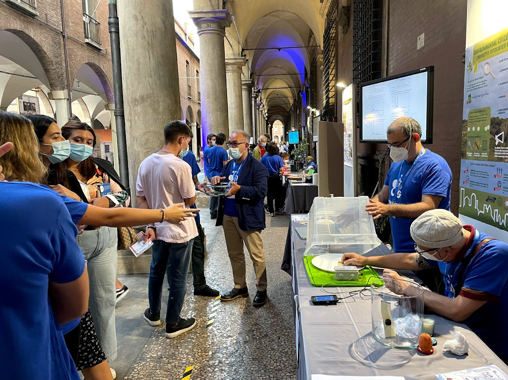

20/12/2021
----------

Assegnazione gara ARPAE
Fornitura e installazione di n. 44 stazioni e 1 anno di garanzia
Manutenzione preventiva e correttiva delle 44 stazioni per 3 anni
520.000 E
RTI tra: CAE Spa e DigitEco Srl

Consegna 1/09/2024

01/10/2022
----------

Gara di ARPAE per tre stazioni complesse assegnate a ETG srl

01/08/2025
----------

Convenzione ARPAE Parco dei Cedri ODV

Separazione tra Server RMAP operativo in ARPAE
e server crowdsourcing gestito da Parco dei Cedri ODV

01/01/2025
----------

:ref:`StimaWifi V3 (mobile) <stimawifi_v3-reference>`
   
Stato dell'arte su GitHub
-------------------------

* 8 contributori
* 3700 commit
* 2200 commit pat1
* quasi 500 issue

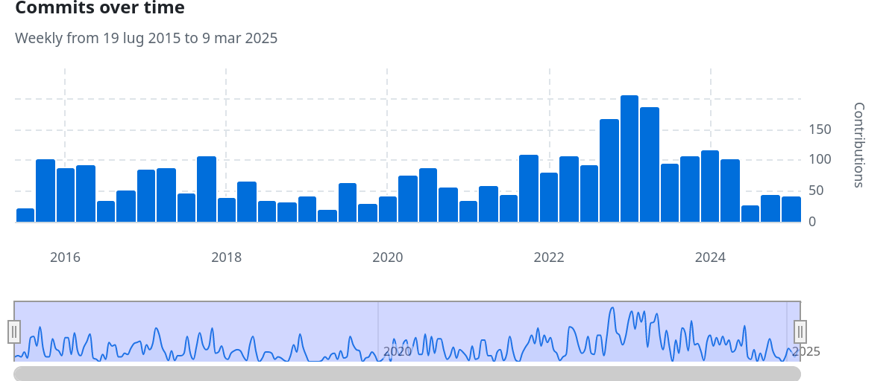

::

   Server RMAP:
   
   Total Physical Source Lines of Code (SLOC)                = 34,407
   Development Effort Estimate, Person-Years (Person-Months) = 8.21 (98.56)
   Schedule Estimate, Years (Months)                         = 1.19 (14.31)
   Estimated Average Number of Developers (Effort/Schedule)  = 6.89
   Total Estimated Cost to Develop                           = $ 1,109,483

   Stima:
   
   Total Physical Source Lines of Code (SLOC)                = 1,673,698
   Development Effort Estimate, Person-Years (Person-Months) = 485.17 (5,822.00)
   Schedule Estimate, Years (Months)                         = 5.62 (67.40)
   Estimated Average Number of Developers (Effort/Schedule)  = 86.38
   Total Estimated Cost to Develop                           = $ 65,539,417

   (Basic COCOMO model, Person-Months = 2.4 * (KSLOC**1.05))
   (Basic COCOMO model, Months = 2.5 * (person-months**0.38))
   (average salary = $56,286/year, overhead = 2.40).
   
Stato dell'arte implementazioni
-------------------------------

* :ref:`StimaWiFi V3<stimawifi_v3-reference>`
* :ref:`Stima V3<stima_v3-reference>`
* :ref:`Stima V4<stima_v4-reference>`

* :ref:`Server RMAP<server-reference>`

* :ref:`Testa di Prelievo per qualità dell'aria<testa_di_prelievo_per_sensori_air_quality>`
* Stima LoraWan TTN
* Stima base

Scambio dei dati
----------------

Nel tempo sono molte le attività di scambio dati attivati in modo più
o meno persistente.

Grossomodo possiamo elencare:

* ARPA Veneto
* Meteonetwork
* Lepida
* Consorzi di difesa tramite Meteonetwork
* Rete fiduciaria Emilia Romagna
* Luftdaten https://maps.sensor.community
* MeteoHub
* Open data qualità dell'aria ARPAE
* dati da stazioni di reti private

  
