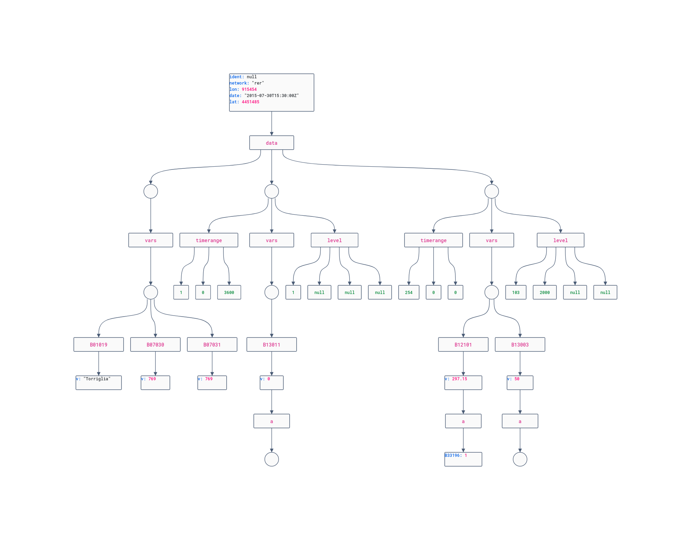

RFC rmap versione 3.3
=====================

Storia del documento
--------------------

- 2023/05/26 v. 3.2 : aggiunta alla Remote Procedure Call admin parametro fupdate; corretto root topic per il messaggio testamento mqtt 
- 2023/03/06 v. 3.2 : Revisionate le Remote Procedure Call
- 2023/02/21 v. 3.1 : Migliorata documentazione RMAP web services, riassuntivo
- 2022/06/10 v. 3.0 : Versione 1 (precedentemente 0) del protocollo RMAP over MQTT
- 2021/11/21 v. 2.8 : corretto topic MQTT per RPC
- 2021/10/15 v. 2.7 : corretto topic MQTT per constant station data; corretto configure RPC e aggiunto parametro "sd"
- 2021/03/10 v. 2.6 : aggiunte alcune jsonrpc: prepare, getjson, prepandget
- 2021/03/03 v. 2.5 : bug nella descrizione del livello; rimozione dei valori interi nel formato json; 
- 2020/10/09 v. 2.4 : specificato il formato della data in json
- 2019/06/18 v. 2.3 : aggiunte specifiche JSRPC

Definizioni
-----------

Campionamento e processo di misurazione
^^^^^^^^^^^^^^^^^^^^^^^^^^^^^^^^^^^^^^^

-  Campionamento è il processo per ottenere una discretizzata sequenza
   di misure di una quantità.
-  Misurazione: processo volto a ottenere sperimentalmente uno o più
   valori che possono essere ragionevolmente attribuiti a una grandezza
   (UNI CEI 70099:2008);
-  Valore: elemento di un sistema di misura che è direttamente
   influenzato dal fenomeno, corpo o sostanza che propongono la
   grandezza da sottoporre a misurazione (UNI CEI 70099:2008). Una
   osservazione (valore di una grandezza) è il risultato del processo di
   campionamento. Nel contesto di analisi di serie, un'osservazione è
   derivata da un numero di campioni.
-  Risultato di misura: insieme di valori attribuiti a un misurando
   congiuntamente a ogni altra informazione pertinente disponibile (UNI
   CEI 70099:2008);
-  Taratura (Calibration): operazione eseguita in condizioni
   specificate, che in una prima fase stabilisce una relazione tra i
   valori di una grandezza, con le rispettive incertezze di misura,
   forniti da campioni di misura, e le corrispondenti indicazioni,
   comprensive delle incertezze di misura associate, e in una seconda
   fase usa queste informazioni per stabilire una relazione che consente
   di ottenere un risultato di misura a partire da un'indicazione (UNI
   CEI 70099:2008). NOTA: Il termine "calibrazione" non dovrebbe essere
   usato per designare la taratura.
-  Trasduttore di misura: dispositivo, impiegato in una misurazione, che
   fornisce una grandezza di uscita avente una relazione specificata con
   la grandezza di ingresso (UNI CEI 70099:2008). ESEMPI Termocoppia,
   trasformatore di corrente elettrica, estensimetro, elettrodo per la
   misurazione del pH, tubo di Bourdon, lama bimetallica.
-  Variabili atmosferiche come la velocità del vento, temperatura,
   pressione e umidità sono funzioni di quattro dimensioni - due
   orizzontali, una verticale e una temporale. Esse variano
   irregolarmente in tutte e quattro, e lo scopo dello studio del
   campionamento è quello di definire le procedure di misura pratiche
   per ottenere osservazioni rappresentative con incertezze accettabili
   nelle stime delle medie e variabilità.

.. _data_level-reference:
   
Data Level
^^^^^^^^^^

-  Dati Level I , sono le letture dirette degli strumenti espresse in
   appropriate unità fisiche e georeferenziate (campionamenti)
-  Dati Level II, dati riconosciuti come variabili meteorologiche
   (osservazioni/misurazioni); possono essere ottenuti direttamente da
   strumenti o derivati dai dati Level I
-  Dati Level III sono quelli contenuti in dataset internamente
   consistenti, generalmente su grigliato.

I dati scambiati a livello internazionale sono livello II o livello III

Report
^^^^^^

Un report è un insieme (sincrono) di osservazioni a livello II completo
di metadati o con la possibilità di ricostruire i metadati.

Protocolli per R-map
^^^^^^^^^^^^^^^^^^^^

-  MQTT (Message Queue Telemetry Transport) è un protocollo
   publish/subscribe particolarmente leggero, adatto per la
   comunicazione M2M tra dispositivi con poca memoria o potenza di
   calcolo e server o message broker.
-  AMQP (Advanced Message Queuing Protocol) è protocollo per
   comunicazioni attraverso code di messaggi. Sono garantite
   l'interoperabilità, la sicurezza, l'affidabilità, la persistenza.
   Nella sua implementazione Rabbitmq exporta un broker MQTT e fornisce
   delle api web

Sistema di misura
^^^^^^^^^^^^^^^^^

Un `sistema di misura` è costituito da 3
componenti:

* sensore: trasforma le variazioni di una grandezza misurata in variazioni di una grandezza di tipo elettrico;
* sistema di controllo deputato a svolgere le seguenti funzioni:

 - acquisizione ad intervalli prestabiliti dei segnali provenienti dal
   sensore;
 - eventuale memorizzazione locale dei dati;
 - trasmissione dei dati.

*  sistema di alimentazione.

Visione generale
----------------

Seguendo un semplice flusso dei dati di una rete rmap compatibile si
possono prevedere le seguenti fasi:

-  digitalizzazione dei campionamenti o osservazioni
-  pubblicazione dei campionamenti su broker MQTT con root topic "sample"
-  pubblicazione delle osservazioni su broker MQTT con root topic "report"
-  eventuale trasformazione dei campionamenti (level I) in osservazioni
   (level II) e eventuale pubblicazione sul broker MQTT
-  composizione di un report
-  invio del report ad un broker tramite AMQP
-  archiviazione dei dati in modo permanente
-  disponibilità dei dati in archivio tramite web services

Questo è uno schema tra i più semplici; rimane la possibilità di
articolarlo replicando i servizi, distribuendoli in rete etc.

Data Model: Dati e Metadati
---------------------------

Ogni dato è un valore associato a 6 metadati univoci.

-  Time: date time della osservazione o di termine del periodo di
   osservazione
-  Longitudine, latitudine e identificativo: coordinate geografiche e
   identificativo del generatore del dati
-  Network: definisce stazioni con caratteristiche omogenee (classe
   degli strumenti, rappresentatività e/o stazioni mobili o fisse)
-  Time range: indica osservazione o tempo della previsione ed eventuale
   elaborazione “statistica” in forma codificata tramite tabella
-  Level: le coordinate verticali (eventualmente strato) in forma
   codificata tramite tabella
-  Variabile: parametro fisico definito con una descrizione, unità di
   misura , campo di misura e cifre significative

Ogni dato può essere dotato inoltre di attributi (a esempio prodotti dal
controllo di qualità) definiti dalla stessa tabella variabili. E`
inoltre possibile associare dei dati statici (di anagrafica, ossia
invariabili nel tempo, timerange e level) con i soli metadati
longitudine, latitudine, identicativo, report

Time
^^^^

L'istante di riferimento del dato in ora GMT: si riferisce all'istante
finale della misurazione. Di conseguenza, una precipitazione cumulata su
30 minuti con istante di riferimento "2015-08-05T12:00:00Z" è la
precipitazione cumulata tra le 11:30:00Z e le 12:00:00Z del giorno
2015-08-05.

Longitudine, latitudine e identificativo
^^^^^^^^^^^^^^^^^^^^^^^^^^^^^^^^^^^^^^^^

Le coordinate sono espresse con rappresentazione sessadecimale.

-  longitudine: coordinate geografiche (ETRF89 - WGS84)
-  latitudine: coordinate geografiche (ETRF89 - WGS84)
-  identificativo : identificativo fornitore dati/volo aereo/nave
   (obbligatorio nel caso di stazioni mobili)

Network
^^^^^^^

Definisce stazioni con caratteristiche omogenee: classe degli strumenti,
rappresentatività e/o stazioni mobili o fisse. Per le stazioni che non
appartengono a reti omogenee con un ente gestore il valore di "network"
segue la seguente regola:

-  "fixed" per tutte le stazioni fisse, le cui coordinate non variano
   nel tempo
-  "mobile" per tutte le stazioni/punti di misura le cui coordinate
   cambiano nel tempo

Time range
^^^^^^^^^^

Definition of the main concepts related to the description of time range
and statistical processing for observed and forecast data:

Validity time is defined as the time at which the data are measured or
at which forecast is valid; for statistically processed data, the
validity time is the end of the time interval.

Reference time is defined as the nominal time of an observation for
observed values, or as the time at which a model forecast starts for
forecast values.

The date and time in rmap are always the validity date and time of a
value, regardless of the value being an observation or a forecast.

The Timerange field is composed by:

-  pindicator : integer from table timerange ( unsigned integer)
-  P1 is defined as the difference in seconds between validity time and
   reference time. For forecasts it is the positive forecast time. For
   observed values, the reference time is usually the same as the
   validity time, therefore P1 is zero. However P1 < 0 is a valid case
   for reports containing data in the past with respect to the nominal
   report time. (unsigned integer)
-  P2 is defined as the duration of the period over which statistical
   processing is performed, and is always nonnegative. Note that, for
   instantaneous values, P2 is always zero. (usigned integer)

The following table lists the possible values for pindicator and the
interpretation of the corresponding values of P1 and P2 specifying a
time range:

+-----------------------------------+-----------------------------------+
| Pindicator                        | Description                       |
+-----------------------------------+-----------------------------------+
| 0                                 | Average                           |
+-----------------------------------+-----------------------------------+
| 1                                 | Accumulation                      |
+-----------------------------------+-----------------------------------+
| 2                                 | Maximum                           |
+-----------------------------------+-----------------------------------+
| 3                                 | Minimum                           |
+-----------------------------------+-----------------------------------+
| 4                                 | Difference (value at the end of   |
|                                   | the time range minus value at the |
|                                   | beginning)                        |
+-----------------------------------+-----------------------------------+
| 5                                 | Root Mean Square                  |
+-----------------------------------+-----------------------------------+
| 6                                 | Standard Deviation                |
+-----------------------------------+-----------------------------------+
| 7                                 | Covariance (temporal variance)    |
+-----------------------------------+-----------------------------------+
| 8                                 | Difference (value at the          |
|                                   | beginning of the time range minus |
|                                   | value at the end)                 |
+-----------------------------------+-----------------------------------+
| 9                                 | Ratio                             |
+-----------------------------------+-----------------------------------+
| 51                                | Climatological Mean Value         |
+-----------------------------------+-----------------------------------+
| 10-191                            | Reserved                          |
+-----------------------------------+-----------------------------------+
| 192-254                           | Reserved for Local Use            |
+-----------------------------------+-----------------------------------+
| 200                               | Vectorial mean                    |
+-----------------------------------+-----------------------------------+
| 201                               | Mode                              |
+-----------------------------------+-----------------------------------+
| 202                               | Standard deviation vectorial mean |
+-----------------------------------+-----------------------------------+
| 203                               | Vectorial maximum                 |
+-----------------------------------+-----------------------------------+
| 204                               | Vectorial minimum                 |
+-----------------------------------+-----------------------------------+
| 205                               | Product with a valid time ranging |
|                                   | inside the given period           |
+-----------------------------------+-----------------------------------+
| 254                               | Istantaneous value                |
+-----------------------------------+-----------------------------------+

Level
^^^^^

Level/layer

This table lists the possible values for leveltype1 or leveltype2 and
the interpretation of the corresponding numerical value l1 or l2.
Leveltype values in the range 0-255 can be used for defining either a
single level (leveltype1) or a surface delimiting a layer (leveltype1
and leveltype2) with any meaningful combination of leveltypes; values of
leveltype >255 have a special use for encoding cloud values in SYNOP
reports and they do not strictly define physical surfaces.

The idea is borrowed from the GRIB edition 2 fixed surface concept and
the values for leveltype coincide with the GRIB standard where possible.

The level field is composed by:

-  leveltype1 : from level table (unsigned integer value)
-  l1 : first level defined by leveltype1 (unsigned integer value)
-  leveltype2 : from level table (unsigned integer value); needed with layer only,
   missing otherwise (unsigned integer value)
-  l2 : second level defined by leveltype2 ; needed with layer only,
   missing otherwise (unsigned integer value)

Should be everytime l1 < l2

+-----------------------+-----------------------+-----------------------+
| leveltype             | Meaning               | unit/contents of      |
|                       |                       | l1/l2                 |
+-----------------------+-----------------------+-----------------------+
| 0                     | Reserved              |                       |
+-----------------------+-----------------------+-----------------------+
| 1                     | Ground or Water       |                       |
|                       | Surface               |                       |
+-----------------------+-----------------------+-----------------------+
| 2                     | Cloud Base Level      |                       |
+-----------------------+-----------------------+-----------------------+
| 3                     | Level of Cloud Tops   |                       |
+-----------------------+-----------------------+-----------------------+
| 4                     | Level of 0C Isotherm  |                       |
+-----------------------+-----------------------+-----------------------+
| 5                     | Level of Adiabatic    |                       |
|                       | Condensation Lifted   |                       |
|                       | from the Surface      |                       |
+-----------------------+-----------------------+-----------------------+
| 6                     | Maximum Wind Level    |                       |
+-----------------------+-----------------------+-----------------------+
| 7                     | Tropopause            |                       |
+-----------------------+-----------------------+-----------------------+
| 8                     | Nominal Top of the    |                       |
|                       | Atmosphere            |                       |
+-----------------------+-----------------------+-----------------------+
| 9                     | Sea Bottom            |                       |
+-----------------------+-----------------------+-----------------------+
| 10-19                 | Reserved              |                       |
+-----------------------+-----------------------+-----------------------+
| 20                    | Isothermal Level      | K/10                  |
+-----------------------+-----------------------+-----------------------+
| 21-99                 | Reserved              |                       |
+-----------------------+-----------------------+-----------------------+
| 100                   | Isobaric Surface      | Pa                    |
+-----------------------+-----------------------+-----------------------+
| 101                   | Mean Sea Level        |                       |
+-----------------------+-----------------------+-----------------------+
| 102                   | Specific Altitude     | mm                    |
|                       | Above Mean Sea Level  |                       |
+-----------------------+-----------------------+-----------------------+
| 103                   | Specified Height      | mm                    |
|                       | Level Above Ground    |                       |
+-----------------------+-----------------------+-----------------------+
| 104                   | Sigma Level           |                       |
+-----------------------+-----------------------+-----------------------+
| 105                   | Hybrid Level          |                       |
+-----------------------+-----------------------+-----------------------+
| 106                   | Depth Below Land      | mm                    |
|                       | Surface               |                       |
+-----------------------+-----------------------+-----------------------+
| 107                   | Isentropic (theta)    | K/10                  |
|                       | Level                 |                       |
+-----------------------+-----------------------+-----------------------+
| 108                   | Level at Specified    | Pa                    |
|                       | Pressure Difference   |                       |
|                       | from Ground to Level  |                       |
+-----------------------+-----------------------+-----------------------+
| 109                   | Potential Vorticity   | 10-9 K m2 kg-1 s-1    |
|                       | Surface               |                       |
+-----------------------+-----------------------+-----------------------+
| 110                   | Reserved              |                       |
+-----------------------+-----------------------+-----------------------+
| 111                   | Eta (NAM) Level (see  | 1/10000               |
|                       | note below)           |                       |
+-----------------------+-----------------------+-----------------------+
| 112                   | 116 Reserved          |                       |
+-----------------------+-----------------------+-----------------------+
| 117                   | Mixed Layer Depth     | mm                    |
+-----------------------+-----------------------+-----------------------+
| 118-159               | Reserved              |                       |
+-----------------------+-----------------------+-----------------------+
| 160                   | Depth Below Sea Level | mm                    |
+-----------------------+-----------------------+-----------------------+
| 161-191               | Reserved              |                       |
+-----------------------+-----------------------+-----------------------+
| 200                   | Entire atmosphere     |                       |
|                       | (considered as a      |                       |
|                       | single layer)         |                       |
+-----------------------+-----------------------+-----------------------+
| 201                   | Entire ocean          |                       |
|                       | (considered as a      |                       |
|                       | single layer)         |                       |
+-----------------------+-----------------------+-----------------------+
| 204                   | Highest tropospheric  |                       |
|                       | freezing level        |                       |
+-----------------------+-----------------------+-----------------------+
| 206                   | Grid scale cloud      |                       |
|                       | bottom level          |                       |
+-----------------------+-----------------------+-----------------------+
| 207                   | Grid scale cloud top  |                       |
|                       | level                 |                       |
+-----------------------+-----------------------+-----------------------+
| 209                   | Boundary layer cloud  |                       |
|                       | bottom level          |                       |
+-----------------------+-----------------------+-----------------------+
| 210                   | Boundary layer cloud  |                       |
|                       | top level             |                       |
+-----------------------+-----------------------+-----------------------+
| 211                   | Boundary layer cloud  |                       |
|                       | layer                 |                       |
+-----------------------+-----------------------+-----------------------+
| 212                   | Low cloud bottom      |                       |
|                       | level                 |                       |
+-----------------------+-----------------------+-----------------------+
| 213                   | Low cloud top level   |                       |
+-----------------------+-----------------------+-----------------------+
| 214                   | Low cloud layer       |                       |
+-----------------------+-----------------------+-----------------------+
| 215                   | Cloud ceiling         |                       |
+-----------------------+-----------------------+-----------------------+
| 220                   | Planetary Boundary    |                       |
|                       | Layer                 |                       |
+-----------------------+-----------------------+-----------------------+
| 222                   | Middle cloud bottom   |                       |
|                       | level                 |                       |
+-----------------------+-----------------------+-----------------------+
| 223                   | Middle cloud top      |                       |
|                       | level                 |                       |
+-----------------------+-----------------------+-----------------------+
| 224                   | Middle cloud layer    |                       |
+-----------------------+-----------------------+-----------------------+
| 232                   | High cloud bottom     |                       |
|                       | level                 |                       |
+-----------------------+-----------------------+-----------------------+
| 233                   | High cloud top level  |                       |
+-----------------------+-----------------------+-----------------------+
| 234                   | High cloud layer      |                       |
+-----------------------+-----------------------+-----------------------+
| 235                   | Ocean Isotherm Level  | K/10                  |
+-----------------------+-----------------------+-----------------------+
| 240                   | Ocean Mixed Layer     |                       |
+-----------------------+-----------------------+-----------------------+
| 241                   | Ordered Sequence of   |                       |
|                       | Data                  |                       |
+-----------------------+-----------------------+-----------------------+
| 242                   | Convective cloud      |                       |
|                       | bottom level          |                       |
+-----------------------+-----------------------+-----------------------+
| 243                   | Convective cloud top  |                       |
|                       | level                 |                       |
+-----------------------+-----------------------+-----------------------+
| 244                   | Convective cloud      |                       |
|                       | layer                 |                       |
+-----------------------+-----------------------+-----------------------+
| 245                   | Lowest level of the   |                       |
|                       | wet bulb zero         |                       |
+-----------------------+-----------------------+-----------------------+
| 246                   | Maximum equivalent    |                       |
|                       | potential temperature |                       |
|                       | level                 |                       |
+-----------------------+-----------------------+-----------------------+
| 247                   | Equilibrium level     |                       |
+-----------------------+-----------------------+-----------------------+
| 248                   | Shallow convective    |                       |
|                       | cloud bottom level    |                       |
+-----------------------+-----------------------+-----------------------+
| 249                   | Shallow convective    |                       |
|                       | cloud top level       |                       |
+-----------------------+-----------------------+-----------------------+
| 251                   | Deep convective cloud |                       |
|                       | bottom level          |                       |
+-----------------------+-----------------------+-----------------------+
| 252                   | Deep convective cloud |                       |
|                       | top level             |                       |
+-----------------------+-----------------------+-----------------------+
| 253                   | Lowest bottom level   |                       |
|                       | of supercooled liquid |                       |
|                       | water layer           |                       |
+-----------------------+-----------------------+-----------------------+
| 254                   | Highest top level of  |                       |
|                       | supercooled liquid    |                       |
|                       | water layer           |                       |
+-----------------------+-----------------------+-----------------------+
| 256                   | Clouds                |                       |
+-----------------------+-----------------------+-----------------------+
| 257                   | Information about the |                       |
|                       | station that          |                       |
|                       | generated the data    |                       |
+-----------------------+-----------------------+-----------------------+
| 258                   | (use when ltype1=256) |                       |
|                       | Cloud Data group, L1  |                       |
|                       | = 1 low clouds, 2     |                       |
|                       | middle clouds, 3 high |                       |
|                       | clouds, 0 others      |                       |
+-----------------------+-----------------------+-----------------------+
| 259                   | (use when ltype1=256) |                       |
|                       | Individual cloud      |                       |
|                       | groups, L1 = group    |                       |
|                       | number                |                       |
+-----------------------+-----------------------+-----------------------+
| 260                   | (use when ltype1=256) |                       |
|                       | Cloud drift, L1 =     |                       |
|                       | group number          |                       |
+-----------------------+-----------------------+-----------------------+
| 261                   | (use when ltype1=256) |                       |
|                       | Cloud elevation, L1 = |                       |
|                       | group number; (use    |                       |
|                       | when ltype1=264) L2 = |                       |
|                       | swell wave group      |                       |
|                       | number                |                       |
+-----------------------+-----------------------+-----------------------+
| 262                   | (use when ltype1=256) |                       |
|                       | Direction and         |                       |
|                       | elevation of clouds,  |                       |
|                       | L1 is ignored         |                       |
+-----------------------+-----------------------+-----------------------+
| 263                   | (use when ltype1=256) |                       |
|                       | Cloud groups with     |                       |
|                       | bases below station   |                       |
|                       | level, L1 = group     |                       |
|                       | number                |                       |
+-----------------------+-----------------------+-----------------------+
| 264                   | Waves                 |                       |
+-----------------------+-----------------------+-----------------------+
| 265                   | Non-physical data     | engineering ordinal   |
|                       | level                 | level                 |
+-----------------------+-----------------------+-----------------------+

Variabile
^^^^^^^^^

La tabella B (vedi codifica BUFR del WMO) descrive i dati e la loro
eventuale codifica.

I dati possono essere inviati come numeri a virgola mobile o stringhe di caratteri.
Il formato consigliato è quello a stringhe di caratteri per
evitare problemi di troncamento nella rappresentazione dei valori
visto che al suo interno la rappresentazione è intera.
La rappresentazione di valori numerici nel formato a stringa di caratteri  si ottiene 
convertendo la rappresentazione del valore in intero con segno in
una rappresentazione decimale in una stringa (es. "27315" per una
temperatura di 273.15K) Il valore intero con segno si ottiene
moltiplicando il valore rappresentato con la unità di misura
descritta da "units" per il fattore di scala "scale".

Le restanti colonne della tabella B vengono utilizzate nella de/codifica
in formato Bufr e Crex. Fare riferimento a
http://www.wmo.int/pages/prog/www/WMOCodes.html

Description
^^^^^^^^^^^

The description in table B is a simple description of the data.

Units
^^^^^

The units of Table B entries refer to the format of how the data is
represented. The data may be numeric or character. When data is in
character form, the character representation is always according to the
CCITT International Alphabet No. 5. The units may also refer to a code
or flag table, where the code or flag table is described in the WMO
Manual On Codes or if not provided by WMO defined as local table. Other
units are in Standard International (SI) units, such as meters or
degrees Kelvin.

Scale
^^^^^

The scale refers to the power of 10 that the element has been multiplied
by in order to retain the desired precision in the transmitted data when
the integer format is used. For example, the units of temperature are
whole Kelvin degrees in Table B. But this is not precise enough for most
usages, therefore the elements are to be multipli ed by 100 (10^2) so
that the transmitted precision will be centidegrees, a more useful
precision. On the other hand, the (SI) unit of pressure in Table B is
Pascal, a rather small unit that would result in unnecessarily precise
numbers being transmitted. The BUFR Ta ble B calls for pressure to be
divided by 10 (10^-1) resulting in a transmitted unit of 10ths of hPa,
or tenths of millibars, a more reasonable precision for meteorological
usage.

Other values in the table B used in Bufr de/coding
^^^^^^^^^^^^^^^^^^^^^^^^^^^^^^^^^^^^^^^^^^^^^^^^^^

The reference value is a value that is to be subtracted from the data
after multiplication by the scale factor, if any, before encoding into
Section 4 in order to produce, in all cases, a positive value. In the
case of lati tude and longitude, south latitude and west longitude are
negative before applying the refe rence value. If, for example, a
position of 35.50 degrees south latitude were being encoded, multiplying
-35.50 by 100 (scale of 2) would produce -3550. Subtracting the refere
nce value -9000 would give 5450 that would be encoded.

To obtain the original value in decoding, adding back the -9000
reference value to 5450 would result in -3550, then dividing by the
scale (100) would obtain -35.50.

The data width of Table B entries is a count of how many bits the
largest possible value of an individual data item occupies.

Tabella variabile (B table)
^^^^^^^^^^^^^^^^^^^^^^^^^^^

B table example; SAMPLE VALUES ONLY ! (the full table is big !)

Get the full table from:
https://github.com/ARPA-SIMC/dballe/blob/master/tables/dballe.txt

+-----------------+-----------------+-----------------+-----------------+
| Code            | Description     | Units           | Scale           |
+-----------------+-----------------+-----------------+-----------------+
| 001001          | WMO BLOCK       | Numeric         | 0               |
|                 | NUMBER          |                 |                 |
+-----------------+-----------------+-----------------+-----------------+
| 001002          | WMO STATION     | Numeric         | 0               |
|                 | NUMBER          |                 |                 |
+-----------------+-----------------+-----------------+-----------------+
| 001006          | AIRCRAFT FLIGHT | Character       | 0               |
|                 | NUMBER          |                 |                 |
+-----------------+-----------------+-----------------+-----------------+
| 001007          | SATELLITE       | CODE TABLE 1007 | 0               |
|                 | IDENTIFIER      |                 |                 |
+-----------------+-----------------+-----------------+-----------------+
| 001008          | AIRCRAFT        | Character       | 0               |
|                 | REGISTRATION    |                 |                 |
|                 | NUMBER OR OTHER |                 |                 |
|                 | IDENTIFICATION  |                 |                 |
+-----------------+-----------------+-----------------+-----------------+
| 001011          | SHIP OR MOBILE  | Character       | 0               |
|                 | LAND STATION    |                 |                 |
|                 | IDENTIFIER      |                 |                 |
+-----------------+-----------------+-----------------+-----------------+
| 001012          | DIRECTION OF    | DEGREE TRUE     | 0               |
|                 | MOTION OF       |                 |                 |
|                 | MOVING          |                 |                 |
|                 | OBSERVING       |                 |                 |
|                 | PLATFORM*\*     |                 |                 |
+-----------------+-----------------+-----------------+-----------------+
| 001013          | SPEED OF MOTION | M/S             | 0               |
|                 | OF MOVING       |                 |                 |
|                 | OBSERVING       |                 |                 |
|                 | PLATFORM\*      |                 |                 |
+-----------------+-----------------+-----------------+-----------------+
| 012101          | TEMPERATURE/DRY | K               | 2               |
|                 | -BULB           |                 |                 |
|                 | TEMPERATURE     |                 |                 |
+-----------------+-----------------+-----------------+-----------------+
| 012102          | WET-BULB        | K               | 2               |
|                 | TEMPERATURE     |                 |                 |
+-----------------+-----------------+-----------------+-----------------+
| 012103          | DEW-POINT       | K               | 2               |
|                 | TEMPERATURE     |                 |                 |
+-----------------+-----------------+-----------------+-----------------+

Formati
-------

L'accentramento dei dati della rete comprende due passaggi:

-  composizione di un report composto da una selezione di osservazioni
   (sincrone) di tipo II
-  invio a un concentratore tramite protocollo AMQP

BUFR
^^^^

Il formato BUFR è definito dal WMO:
http://www.wmo.int/pages/prog/www/WMOCodes.html

Sono utilizzabili solo alcuni template definiti dal WMO o da ECMWF:

-  acars-ecmwf - ACARS ECMWF (4.145)
-  acars-wmo - ACARS WMO
-  airep-ecmwf - AIREP ECMWF (4.142)
-  amdar-ecmwf - AMDAR ECMWF (4.144)
-  amdar-wmo - AMDAR WMO
-  buoy - Buoy (1.21)
-  metar - Metar (0.140)
-  pilot-ecmwf - Pilot (2.91)
-  pilot-wmo - Pilot (2.1, 2.2, 2.3)
-  pollution - Pollution (8.171)
-  ship - Synop ship (autodetect)
-  ship-abbr - Synop ship (abbreviated) (1.9)
-  ship-auto - Synop ship (auto) (1.13)
-  ship-plain - Synop ship (normal) (1.11)
-  ship-reduced - Synop ship (reduced) (1.19)
-  ship-second - Synop ship (second record) (1.12)
-  ship-wmo - Ship WMO
-  synop-ecmwf - Synop ECMWF (autodetect) (0.1)
-  synop-ecmwf-auto - Synop ECMWF land auto (0.3)
-  synop-ecmwf-land - Synop ECMWF land (0.1)
-  synop-ecmwf-land-high - Synop ECMWF land high level station (0.1)
-  synop-wmo - Synop WMO (0.1)
-  temp-ecmwf - Temp ECMWF (autodetect)
-  temp-ecmwf-land - Temp ECMWF land (2.101)
-  temp-ecmwf-ship - Temp ECMWF ship (2.102)
-  temp-radar - Temp radar doppler wind profile (6.1)
-  temp-ship - Temp ship (autodetect)
-  temp-wmo - Temp WMO (2.101)

E' possibile e consigliato usare un template denominato "generic"
specifico per il Data Model descritto sopra con il quale è possibile la
codifica di tutti i dati pubblicabili secondo lo standard RMAP.

generic template
^^^^^^^^^^^^^^^^

Il template generic non è qui documentato in quanto al momento non
esistono specifiche stabili. Per la scrittura e lettura di un messaggio
BUFR con template "generic" si consiglia vivamente l'utilizzo della
libreria software DB-all.e https://github.com/ARPA-SIMC/dballe anche
tramite tools disponibili.

Json
^^^^

Ogni oggetto json è un report con tutti i dati di una certa stazione per
un certo istante di riferimento.

La stazione è identificata univocamente dai seguenti campi:

-  \`ident`: identificativo della stazione (necessario solo se
   la stazione è mobile, nullo per stazioni fisse).
-  \`lon`: longitudine
-  \`lat`: latitudine
-  \`network`: nome della rete a cui appartiene la stazione (minuscolo).

Le latitudini e longitudini devono essere scritte come coordinate
geodetiche espresse in sessadecimale, come numero intero dopo aver
moltiplicato per 10^5 (quindi espresso in 10^-5 gradi sessadecimali).

L'istante di riferimento è il campo \`datetime\` che si
riferisce all'istante finale della misurazione. Di conseguenza, una
precipitazione cumulata su 30 minuti con istante di riferimento
"2015-08-05T12:00:00Z" è la precipitazione cumulata tra le 11:30:00Z e
le 12:00:00Z del giorno 2015-08-05.
Il formato è ISO 8601 con alcune limitazioni:
``YYYY-MM-DDTHH:MM:SSZ``. Uno spazio è accettato al posto di ``T``,
il carattere ``Z`` alla fine può essere omesso. Il formato
``YYYY-MM-DDTHH:MM:SSZ`` rimane quello consigliato.

I dati sono nel campo \`data\` sotto forma di array. Ogni elemento
dell'array è un oggetto con i seguenti campi:

-  livello: coordinate verticali. Si veda il capitolo dedicato.
-  timerange: definisce il periodo di tempo e l'eventuale processamento
   (e.g. dato istantaneo, media oraria, etc). Si veda il capitolo
   dedicato.
-  vars: oggetto i cui campi sono i codici della tabella B locale, i.e.
   i parametri misurati (vedi tabella relativa). Ognuno di questi è
   associato ad un oggetto con i campi \`v\` (il valore) e \`a\`
   (oggetto degli attributi del dato, in cui i campi sono altri codici
   della tabella B a cui è associato un valore).

Tra questi, un solo elemento non ha i campi \`level\` e \`timerange`.
Tali dati sono relativi a dati invarianti della stazione in se (e.g. il
nome, l'altezza, etc.)

Esempio
^^^^^^^

Stazione fissa (`ident: null`) delle rete (`network`) \`rer\`
posizionata nel punto \`(9.15454, 4451485)\` (`lon`, \`lat`) con i
seguenti dati (`data`) statici (l'elemento dell'array che non ha
\`level\` e \`timerange`):

-  Nome della stazione (`B01019`): 'Torriglia'
-  Altezza della stazione (`B07030`): 769.0m
-  Altezza barometrica della stazione (`B07031`): 769.0m

E per l'istante di riferimento "2015-07-30T15:30:00Z" ha registrato i
seguenti dati:

-  Al suolo (`level: [1, null, null, null]`) le seguenti cumulate orarie
   (`timerange: [1, 0, 3600]`):

   -  Precipitazione (`B13011`): 0.0

-  A 2m dal suolo (`level: [103, 2000, null, null]`) i seguenti valori
   istantanei:

   -  Temperatura (`B12101`): 297.15K. Il dato è stato invalidato
      manualmente (attributo \`B33196: 1`).
   -  Umidità relativa (`B13003`): 50%

::      

   {
       "ident": null,
       "network": "rer",
       "lon": 915454,
       "date": "2015-07-30T15:30:00Z",
       "lat": 4451485,
       "data": [
           {
               "vars": {
                   "B01019": {
                       "v": "Torriglia"
                   },
                   "B07030": {
                       "v": 769.0
                   },
                   "B07031": {
                       "v": 769.0
                   }
               }
           },
           {
               "timerange": [
                   1,
                   0,
                   3600
               ],
               "vars": {
                   "B13011": {
                       "a": {
                       },
                       "v": 0.0
                   }
               },
               "level": [
                   1,
                   null,
                   null,
                   null
               ]
           },
           {
               "timerange": [
                   254,
                   0,
                   0
               ],
               "vars": {
                   "B12101": {
                       "a": {
                           "B33196": 1
                       },
                       "v": 297.15
                   },
                   "B13003": {
                       "a": {
                       },
                       "v": 50
                   }
               },
               "level": [
                   103,
                   2000,
                   null,
                   null
               ]
           }
       ]
   }

Rappresentazione grafica:

|imagejrmap_json|   

   
JSON Lines text format
^^^^^^^^^^^^^^^^^^^^^^

In alternativa al formato json è possibile utilizzare questa variante
che in molti casi risulta vantaggiosa.

La documentazione del formato JSON Lines text format, chiamato anche
newline-delimited JSON è reperibile qui: http://jsonlines.org/

Protocolli
----------

L'accentramento dei dati della rete può essere effettuato a differenti
livelli determinati dall'hardware disponibile, dal tipo di connettività
e dai dati da inviare:

-  invio dei dati (campionamenti o osservazioni) a un broker tramite
   protocollo MQTT
-  invio di un report composto da un insieme di osservazioni (sincrone)
   di tipo II a un broker tramite protocollo AMQP

Dati e Metadati su MQTT
^^^^^^^^^^^^^^^^^^^^^^^

Versioni del protocollo utilizzabili
^^^^^^^^^^^^^^^^^^^^^^^^^^^^^^^^^^^^

MQTT protocol versions 3.1 and 3.1.1

Non utilizzare SSL/TLS

Autenticazione
^^^^^^^^^^^^^^

MQTT provides username/password authentication as part of the protocol.
To pubblish mqtt messages on a rmap server follow standard registration
procedure on rmap server and get username and password.

Quality of Service
^^^^^^^^^^^^^^^^^^

E possibile utilizzare Quality of Service 0 o 1. Ovviamente quando
possibile è consigliato utilizzare QoS 1.

Client ID
^^^^^^^^^

MQTT 3.1.1 allows clients to connect with a zero length client id and
have the broker generate a client id for them. Use this method as
alternative method to the only allowed method that is to use an ID
starting with the username used in authentication.

.. _data-level-1:

Root topics
^^^^^^^^^^^

root topic:

::

   <version>/<data_level>

maint topic:

::

   <version>/maint

rpc topic:

::

   <version>/rpc

Version
^^^^^^^

Versione del protocollo RMAP over MQTT

attualmente corrisponde alla versione:

::

   1

Data Level
^^^^^^^^^^

-  I dati pubblicati nel root topic MQTT:

   ::

      sample

appartengono solo al data level type I

-  I dati pubblicati nel root topic MQTT:

   ::

      report

appartengono solo al data level type II

Stato della connessione
^^^^^^^^^^^^^^^^^^^^^^^

Alla connessione deve essere inviato dalla stazione una eventuale
segnalazione di sconnessione gestita male con will (retained):

::
   
   <mainttopic>/USER/IDENT/COORDS/NETWORK/254,0,0/265,0,-,-/B01213/

payload : **{"v": "error01"}**

poi questo messaggio viene "ricoperto" con:

::
   
   <mainttopic>/USER/IDENT/COORDS/NETWORK/254,0,0/265,0,-,-/B01213/

payload : **{ "v": "conn"}**

alla disconnessione allo stesso topic dovrà essere inviato:

payload : **{ "v": "disconn"}**

Data e Constant Data
^^^^^^^^^^^^^^^^^^^^

Data
''''

Ogni topic corrisponde ai metadati univoci, mentre il payload è composto
dal valore, eventuali attributi e dall'instante temporale. Json è il
formato per il payload.

Forma simbilica del topic:

::
   
   <roottopic>/USER/IDENT/COORDS/NETWORK/TRANGE/LEVEL/VAR

-  **USER**: utente che pubblica i dati
-  **IDENT**: identificativo della stazione per stazioni mobili, ""
   (campo vuoto) per stazioni fisse
-  **COORDS**: nella forma lon,lat. Le coordinate sono espresse con
   rappresentazione sessadecimale nella forma int(valore*10^5) con
   eventuale segno negativo
-  **NETWORK**: etichetta massimo 16 caratteri
-  **TRANGE**: nella forma indicator,p1,p2; Indicator e p2 interi senza
   segno, p1 intero con eventuale segno negativo. "-" per valori non
   significativi
-  **LEVEL**: nella forma type1,l1,type2,l2; Type1, type2 interi con
   eventuale segno negativo, l1e l2 interi con eventuale segno negativo.
   "-" per valori non significativi
-  **VAR**: nella forma BXXYYY come da tabelle B codice BUFR WMO

Il payload è in formato JSON: **{ "v": VALUE, "t": TIME, "a": {
"BXXYYY": VALUE, … } }**

-  **VALUE**: valore in formato intero o a virgola mobile o stringa
   (vedi specifiche precedenti)
-  **TIME**: formato YYYY-mm-ddTHH:MM:SS.MSC (secondi e millisecondi
   opzionali) un sottoinsime delle specifiche in
   https://tools.ietf.org/html/rfc3339

Gli attributi ("a") solitamente per controllo di qualità sono opzionali;
la chiave fa riferimento alla tabella B e VALUE ha la stessa
rappresentazione di VALUE descritto sopra.

Constant Data
'''''''''''''

I metadati per i dati costanti (anagrafica) sono caratterizzati da
questo topic:

::
   
   <roottopic>/USER/IDENT/COORDS/NETWORK/-,-,-/-,-,-,-/VAR

con payload simile a quello dei dati, in particolare dovrà essere omessa
la chiave "t".

payload : **{ "v": VALUE, "a": { "BXXYYY": VALUE, … } }**

.. _rmaprfc_estensioni-reference:

Estensioni
^^^^^^^^^^

Queste estensioni sono state create per ottimizzare in alcuni casi
l'invio dei dati. Possono essere utilizzate solo quando il loro utilizzo
comporti un risparmio sul numero di byte necessari per la trasmissione.

Prima forma contratta tabella D
'''''''''''''''''''''''''''''''

In questa forma contratta non è necessario inviare messaggi relativi
allo stato della connessione.

Il topic e come quello della forma standard senza l'ultimo parametro
"VAR". Ad esempio:

::
   
   <roottopic>/myuser//1131908,4449301/fixed/254,0,0/103,2000,-,-

Il payload prevede due parametri più uno opzionale:

-  "d" che descrive quale elemento della tabella D è preso in
   considerazione
-  "p" con un array di valori corrispondenti ai "VAR" descritti
   nell'elemento in tabella D
-  "a" attributi solitamente per controllo di qualità sono opzionali;
   la chiave fa riferimento alla tabella B e il contenuto è un array
   di valori che si riferiscono posizionalmente ai relativi dati

Ad esempio:

::
   
   {"d":50,"p":[1,2,3,4,5,6,7,8,9,10,11,12,13,14,15,16,17,18,19,20,21,22,23,24],"a":{"B33199":[100,20,100,100,50,60,70,80,90,100,100,10,30,40,50,60,70,80,90,100,10,20,30,40]}}

Tabella D
         
::
   
   dtable={"50":["B49198","B49199","B49200","B49201","B49202","B49203","B49204",
                 "B49205","B49206","B49207","B49208","B49209","B49210","B49211",
                 "B49212","B49213","B49214","B49215","B49216","B49217","B49218",
                 "B49219","B49220","B49221"],
           "51":["B11211","B11212","B11213","B11214","B11215","B11216"],
           "52":["B49198","B49199","B49200","B49201","B49202","B49203","B49204",
                 "B49205","B49206","B49207","B49208","B49209"]}

Ad esempio:

::
   {"d":51,"p":[10,20,30,40,50,100],"t":"2023-05-26T20:48:00","a":{"B33199":[100,90,80,70,60,50]}}

si sviluppa in:

::

   1/report/userv4//1212345,4512345/test/9,0,180/103,10000,-,-/B11211 {"t": "2023-05-26T20:48:00", "v": 10, "a": {"B33199": 100}}
   1/report/userv4//1212345,4512345/test/9,0,180/103,10000,-,-/B11212 {"t": "2023-05-26T20:48:00", "v": 20, "a": {"B33199": 90}}
   1/report/userv4//1212345,4512345/test/9,0,180/103,10000,-,-/B11213 {"t": "2023-05-26T20:48:00", "v": 30, "a": {"B33199": 80}}
   1/report/userv4//1212345,4512345/test/9,0,180/103,10000,-,-/B11214 {"t": "2023-05-26T20:48:00", "v": 40, "a": {"B33199": 70}}
   1/report/userv4//1212345,4512345/test/9,0,180/103,10000,-,-/B11215 {"t": "2023-05-26T20:48:00", "v": 50, "a": {"B33199": 60}}
   1/report/userv4//1212345,4512345/test/9,0,180/103,10000,-,-/B11216 {"t": "2023-05-26T20:48:00", "v": 100, "a": {"B33199": 50}}

   
		 
Seconda forma contratta tabella E
'''''''''''''''''''''''''''''''''

In questa forma contratta non è previsto l'invio di attributi del dato.
In questa forma contratta non è necessario inviare messaggi relativi
allo stato della connessione. Il topic e come quello della forma
standard senza i parametri "VAR", "LEVEL" e "TRANGE". Ad esempio:

::
   
   <roottopic>/myuser//1131908,4449301/fixed

Il payload prevede due parametri:

-  "e" che descrive quale elemento della tabella E è preso in
   considerazione
-  "p" con un array di valori corrispondenti ai "VAR", "LEVEL" e
   "TRANGE" descritti nell'elemento in tabella E

Ad esempio:

::
   
   {"p":[27315,73],"e":1}

Tabella E
         
::
   
   # template 1: temperature and humidity``
     etable={"1":{"B12101"={"timerange":"254,0,0","level":"103,2000,-,-"},
                  "B13003"={"timerange":"254,0,0","level":"103,2000,-,-"}},
   # template 2: temperature, humidity and PM2.5
             "2":{"B12101"]={"timerange":"254,0,0","level":"103,2000,-,-"},
                  "B13003"]={"timerange":"254,0,0","level":"103,2000,-,-"},
                  "B15198"]={"timerange":"254,0,0","level":"103,2000,-,-"}}
   }

.. _rmaprfc_rpc-reference:

Remote procedure over MQTT
^^^^^^^^^^^^^^^^^^^^^^^^^^

Le RPC sono in formato json (json-rpc) e utilizzano due topics MQTT:

-  topiccom è il topic utilizzato per l'invio delle richieste RPC al
   server

::
   
   <rpctopic>/USER/IDENT/COORDS/NETWORK/com

-  topicres è il topic utilizzato dal server per le
   risposte.

::
   
   <rpctopic>/USER/IDENT/COORDS/NETWORK/res
   
IDENT corrisponde all'utente utilizzato per l'autenticazione al broker MQTT.

Il payload seguirà le specifiche `JSON-RPC 2.0
Specification <https://www.jsonrpc.org/specification>`__

Ogni payload comando/risposta Jsonrpc non deve superare i 144 caratteri.

Non sono ammessi accessi concorrenziali e ogni utente è tenuto a gestire
di conseguenza gli accessi.

Remote procedure supportate
'''''''''''''''''''''''''''

configure
      

Configura la stazione.

parametri:

-  bool reset: se true riporta le configurazioni ai valori di default e
   rimuove ogni sensore precedentemente configurato; questa operazione è
   la prima ad essere effettuata dal server (default false)
-  char datalevel: "sample" o "report"; prima parte del topic di
   pubblicazione su MQTT per i dati (default "report")
-  char network: "fixed" o "mobile"; prima parte del topic di
   pubblicazione su MQTT per i dati (default "fixed")
-  int lat: latitudine espressa con rappresentazione sessadecimale nella
   forma int(valore*10^5) con eventuale segno negativo
-  int lon: longitudine espressa con rappresentazione sessadecimale
   nella forma int(valore*10^5) con eventuale segno negativo
-  char mqttmainttopic: prima parte del topic di pubblicazione su MQTT per
   i messaggi di funzionamento (default "maint")
-  int sampletime: intervallo tra le misure in secondi (default 900)
-  char mqttserver: server MQTT (default "rmap.cc")
-  char mqttuser: MQTT user ( no default)
-  char mqttpass: MQTT password ( no default)
-  char ntpserver: NTP server (no default)
-  array int[6] date: set date and time [esempio: 2014,2,10,18,45,18]
   (no default)
-  array byte mac[6]: ethernet mac address (esempio: use (0,0,0,0,0,1)
   for board1, use (0,0,0,0,0,2) for board2 etc.) (no default)
-  JSON object sd:
   
   -  char btable: constant station data (e.g. station name and heigth)
      coded as described by bufr table B btable and written as string

-  bool save: if true save configuration into permanent memory; questa
   operazione è l'ultima ad essere effettuata dal server (default false)
-  array sens:

   -  char tr: timerange (esempio: "1,0,60") (no default)
   -  char lev: level (esempio "1,-,-,-") (no default)
   -  char var: variabile tabella B (esempio "B13011") (no default)
   -  any ext: configurazione relativa a una implementazione specifica
      di un sensore nella stazione OPZIONALE:
      
ad esempio nella implementazione Stima ext contiene:

-  char driver: driver locale del sensore
-  char type: driver remoto
-  int address: address I2C

esempi:

-  reset, configurazione e salvatataggio in una unica RPC

::
   
   {"jsonrpc": "2.0", "method": "configure", "params": {"reset":true,"save":true,"mqttserver":"rmap.cc", "sensors":[{"mqttpath":"105,2000,,/1,0,900", ext":{"driver":"HIH"}}]}, "id": 0}

-  reset, configurazione, addizione sensori e salvataggio in differenti
   RPC

::

   {"jsonrpc": "2.0", "method": "configure", "params": {"reset":true,}, "id": 0}
   {"jsonrpc": "2.0", "method": "configure", "params": {"sd": {"B01019": "test station"}}, "id": 0}
   {"jsonrpc": "2.0", "method": "configure", "params": {"sd": {"B07030": "20"}}, "id": 0}
   {"jsonrpc": "2.0", "method": "configure", "params": {"mqttserver":"rmap.cc", "mqttuser":"myuser", "mqttpass":"mypassword"}, "id": 1}
   {"jsonrpc": "2.0", "method": "configure", "params": {"datalevel":"report", "network":"fixed", "lon":1112345, "lat":4412345}, "id": 1}
   {"jsonrpc": "2.0", "method": "configure", "params": {"sens":[{"tr":"1,0,60", "lev":"1,-,-,-", "var":"B130111", ext":{"driver":"HIH"}}]}, "id": 2}
   {"jsonrpc": "2.0", "method": "configure", "params": {"sens":[{"tr":"254,0,0", "lev":"105,2000,-,-", "var":"B12101", ext":{"driver":"TMP"}}]}, "id": 3}
   {"jsonrpc": "2.0", "method": "configure", "params": {"save":true}, "id": 4}

- pinout
      

Attuatore che accende/spegne uno o più pin.

parametri:

-  array di oggetti con la seguente struttura:

   -  integer n: pin number
   -  bool s: true=on; false=off

::

   {"jsonrpc": "2.0", "method": "pinout", "params": [{"n":4,"s":true},{"n":5,"s":false}], "id": 0}

- recovery
        
Senza parametri: richiede il re-invio dei dati non trasmessi al server; 

esempio:

::

   {"jsonrpc": "2.0", "method": "recovery", "id": 0}

Con parametri: richiede il re-invio dei dati non trasmessi al server da una data
iniziale a una data finale

-  int[6] dts: start date and time; anno, mese, giorno, ora, minuti,
   secondi [esempio: 2014,2,10,18,45,18]
-  int[6] dte: end date and time; anno, mese, giorno, ora, minuti,
   secondi [esempio: 2015,3,25,12,0,0]

esempio:

::
   
   {"jsonrpc": "2.0", "method": "recovery", "params": {"dts":[2014,2,10,18,45,18],"dte":[2015,3,25,12,0,0] }, "id": 0}

admin
      

Comandi di amministrazione

parametri:

-  bool fdownload: true= richiede il download del nuovo firmware disponibile sul server
-  bool cdownload: true= richiede il download della configurazione disponibile sul server

esempio:

::
   
   {"jsonrpc": "2.0", "method": "reboot","params": {"fupdate":true}, "id": 0}

   
reboot
      

Richiede il riavvio della stazione

parametri:

-  bool fupdate: true=update firmware available on SDcard

esempio:

::
   
   {"jsonrpc": "2.0", "method": "reboot","params": {"fupdate":true}, "id": 0}

prepare
      

Richiede l'attivazione di un sensore e inizio misurazione.

parametri:

-  int    node: nodo per l'eventuale comunicazione radio
-  char driver: nome del driver del sensore (trasporto) ( 3 caratteri)
-  char   type: nome del tipo del sensore ( driver sensore) (3 caratteri)
-  int address: indirizzo del sensore

ritorna:

-  int waittime: tempo di attesa prima di poter richiedere il risultato della misura (millisec)
   
esempio:

::
   
   {"jsonrpc": "2.0", "method": "prepare", "params": {"node":1, "driver":"I2C", "type":"TMP", "address":72}, "id": 0}

getjson
      

Richiede i valori delle misure; necessita una precedente rpc "prepare"

parametri:

-  int    node: nodo per l'eventuale comunicazione radio
-  char driver: nome del driver del sensore (trasporto) ( 3 caratteri)
-  char   type: nome del tipo del sensore ( driver sensore) (3 caratteri)
-  int address: indirizzo del sensore

ritorna una serie di Bcode:value :

-  char Bcode: codice della variabile come da tabella B
-  int  value: valore della misura espresso come intero   
   
esempio:

::
   
   {"jsonrpc": "2.0", "method": "getjson", "params": {"node":1, "driver":"I2C", "type":"TMP", "address":72}, "id": 0}

   {"jsonrpc":"2.0","result":{"B12101":27315},"id":0}

prepandget
      
Prepara il sensore per le misure e dopo apportuna attesa restituisce i valori delle misure.

parametri:

-  int    node: nodo per l'eventuale comunicazione radio
-  char driver: nome del driver del sensore (trasporto) ( 3 caratteri)
-  char   type: nome del tipo del sensore ( driver sensore) (3 caratteri)
-  int address: indirizzo del sensore

ritorna una serie di Bcode:value :

-  char Bcode: codice della variabile come da tabella B
-  int  value: valore della misura espresso come intero   
   
esempio:

::
   
   {"jsonrpc": "2.0", "method": "prepandget", "params": {"node":1, "driver":"I2C", "type":"TMP", "address":72}, "id": 0}

   torna:
   {"jsonrpc":"2.0","result":{"B12101":27315},"id":0}

   
.. _rmaprfc_http-reference:
   
HTTP
^^^^

E' possibile utilizzare il protocollo http con una get per inviare i
dati; la get http sarà immediatamente convertita dal server in una "pub"
al broker mqtt. Http è molto inefficiente rispetto mqtt e qui è
utilizzato solo come "bridge" a mqtt quando dovesse essere necessario.

I parametri della get sono:

-  **topic** il topic mqtt
-  **payload** il payload mqtt
-  **username** username dell'utente
-  **password** password dell'utente
-  **time** richiede data e ora nella risposta del server (opzionale)

Se l'invio dei dati ha successo la risposta terminerà con la stringa
"OK".

Ad esempio:

-  get:

::
   
   http://rmap.cc/http2mqtt/?user=<myuser>&password=<password>&topic=1/sample/<myuser>//945000,4530000/fixed/1,0,60/1,-,-,-/B13011&payload={"v":0, "t":"2015-07-30T15:30:00"}

risposta:

``OK``

Per dati non differiti è possibile omettere la chiave "t" nel payload.

-  get:

::
   
   http://rmap.cc/http2mqtt/?user=<myuser>&password=<password>&topic=1/sample/<myuser>//945000,4530000/fixed/1,0,60/1,-,-,-/B13011&payload={"v":0}

risposta:

``OK``

-  get:

::
   
   http://rmap.cc/http2mqtt/?time

risposta:

``19/06/18,13:06:59+00 please set topic``

AMQP
^^^^

AMQP is a binary messaging protocol and semantic framework for
microservices and enterprise messaging.

https://www.rabbitmq.com/resources/specs/amqp0-9-1.pdf

Versioni del protocollo supportate
^^^^^^^^^^^^^^^^^^^^^^^^^^^^^^^^^^

-  0-9-1
-  0-9
-  0-8

.. _autenticazione-1:

Autenticazione
^^^^^^^^^^^^^^

La pubblicazione dei messaggi è ammessa solo dopo autenticazione.

L'autenticazione si effettua tramite una coppia username/password
fornite dall'amministratore del server.

Tls
^^^

L'uso di TLS (amqps) non è richiesto, ma potrà essere implementato in
future versioni di queste specifiche.

Formati dei messaggi
^^^^^^^^^^^^^^^^^^^^

Il report che costituisce il messaggio dovrà essere scritto nei formati
json, jsonline o bufr sopra descritti.

BUFR messages over AMQP
'''''''''''''''''''''''

Il payload dovrà essere inviato con protocollo AMQP al broker tramite
autenticazione su exchange "rmap_bufr".

JSON Line messages over AMQP
''''''''''''''''''''''''''''

Il payload dovrà essere inviato con protocollo AMQP al broker tramite
autenticazione su exchange "rmap_jsonline".

JSON messages over AMQP
'''''''''''''''''''''''

Il payload dovrà essere inviato con protocollo AMQP al broker tramite
autenticazione su exchange "rmap_dbajson".

RMAP web services
-----------------

Composizione degli URL per un HTTP GET request
^^^^^^^^^^^^^^^^^^^^^^^^^^^^^^^^^^^^^^^^^^^^^^

Versioning
^^^^^^^^^^

Le \`API\` avranno come prefisso la versione in uso.

Ad esempio, serie temporale mensile usando la versione 1:

::
   
   http://api.borinud.arpa.emr.it/v1/dbajson/-/1120000,4450000/generic/254,0,0/103,2000,-,-/B12101/timeseries/2013/09

Format
^^^^^^

Il secondo prametro delle api è il formato; questa la scelta:

-  dbajson
-  jsonline
-  geojson

ad esempio:

::
   
   http://api.borinud.arpa.emr.it/v1/geojson/-/1120000,4450000/generic/254,0,0/103,2000,-,-/B12101/timeseries/2013/09

metadati
^^^^^^^^

La "base" della richiesta è quella descritta per il topic MQTT, i.e.:

::
   
   /ident/coords/network/timerange/level/bcode/

Ad esempio:

::
   
   /-/1207738,4460016/locali/254,0,0/103,2000,-,-/B12101

E' l'URL che identifica la misurazione effettuata dalla stazione fissa
(`-`) con longitudine 12,07738 e latitudine 44.60016 (`1207738,4460016`)
per la rete \`locali`; la grandezza misurata è istantanea (`254,0,0`), è
stata presa a 2 metri dal suolo (`103,2000,-,-`) ed è una temperatura
(`B12101`).

Ogni parametro incluso nelle "/" può essere sostituito con "*"
equivalente a dire "tutti".

Anagrafica
''''''''''

Elenco stazioni indipendenti dal timerange e livello sono specificati così:

::

   /-/<lon>,<lat>/<network>/-,-,-/-,-,-,-/*/stations
   
   /<ident>/*/<network>/-,-,-/-,-,-,-/*/stations

I dati restituiti sono analoghi a quelli restituiti con una richiesta dati.

I dati costanti nel tempo e indipendenti dal timerange e livello sono
specificati così:

::
   
   /-/<lon>,<lat>/<network>/-,-,-/-,-,-,-/*/stationdata
   
   /<ident>/*/<network>/-,-,-/-,-,-,-/*/stationdata

I dati restituiti sono analoghi a quelli restituiti con una richiesta
dati.

Serie dei dati o riassuntivo
^^^^^^^^^^^^^^^^^^^^^^^^^^^^

Serie temporale
'''''''''''''''

Serie temporale annuale,mensile, giornaliera e oraria:

::

   /ident/coords/network/timerange/level/bcode/timeseries/year
   /ident/coords/network/timerange/level/bcode/timeseries/year/month
   /ident/coords/network/timerange/level/bcode/timeseries/year/month/day
   /ident/coords/network/timerange/level/bcode/timeseries/year/month/day/hour

nel dettaglio:

::
   
   /<ident>/<lon>,<lat>/<network>/<pind>,<p1>,<p2>/<lt1>,<l1>,<lt2>,<l2>/<bcode>/timeseries/<year>/<month>/<day>/<hour>

Ad esempio:

::
   
   /-/1207738,4460016/locali/254,0,0/103,2000,-,-/B12101/timeseries/2011
   /-/1207738,4460016/locali/254,0,0/103,2000,-,-/B12101/timeseries/2011/01
   /-/1207738,4460016/locali/254,0,0/103,2000,-,-/B12101/timeseries/2011/01/13
   /-/1207738,4460016/locali/254,0,0/103,2000,-,-/B12101/timeseries/2011/01/13/06

Serie spaziale
''''''''''''''

Serie spaziale di una rete, con granularità giornaliera o oraria (± 30
minuti):

::
   
 /ident/coords/network/timerange/level/bcode/spatialseries/year/month/day
 /ident/coords/network/timerange/level/bcode/spatialseries/year/month/day/hour

"ident" e "coords" possono assumere il valore "*"

nel dettaglio:

::
   
   /<ident>/<lon>,<lat>/<network>/<pind>,<p1>,<p2>/<lt1>,<l1>,<lt2>,<l2>/<bcode>/spatialseries/<year>/<month>/<day>/<hour

Ad esempio:

::

   /-/*/locali/254,0,0/103,2000,-,-/B12101/spatialseries/2011/01/13
   /-/*/*/254,0,0/103,2000,-,-/B12101/spatialseries/2011/01/13/06

Riassuntivo
'''''''''''

Riassuntivo di tutto il database:

::
   
   /*/*/*/*/*/*/summaries

Riassuntivo di una stazione (fissa o mobile):

::
   
   /-/<lon>,<lat>/<network>/*/*/*/summaries
   
   /<ident>/*/<network>/*/*/*/summaries

Riassuntivo di una misurazione in un dato mese:

::

   /*/*/<network>/<pind>,<p1>,<p2>/<lt1>,<l1>,<lt2>,<l2>/<bcode>/summaries/<year>/<month>

I dati restituiti sono analoghi a quelli restituiti con una richiesta
dati fatto salvo che:
- i dati non sono presenti ( "v": null )
- il campo date è un array che riporta la data inizio presenza dati e la data fine presenza dati ( "date": ["2023-02-15T00:00:00",  "2023-02-21T07:15:00"])

Formati dati
------------

Json
^^^^

Vedi sopra formato \`Json\`

Jsonline
^^^^^^^^

Vedi sopra formato \`Jsonline\`

Geojson
^^^^^^^

http://geojson.org/

Questo un esempio di \`GeoJSON`:

::
   
   {
     "type": "FeatureCollection",
     "features": [
                   {
                     "geometry":  {
                                    "type": "Point",
				    "coordinates": [
				                    10.26667,
						    46.81667
						  ]
				   },
		     "type": "Feature",
		     "properties": {
		                    "date": "2011-01-25T00:00:00",
				    "level": [103,2000,null,null],
				    "ident": null,
				    "network": "locali",
				    "bcode": "B12101",
				    "value": 263.75,
				    "trange": [254,0,0]
		    },
		    ...
		 ]
   }

Ritrasmissioni e correzioni
---------------------------

I dati possono essere ritrasmessi e sarà l'ultimo dato ricevuto a
vincere sui vecchi.

Attenzione va posta alla gestione degli attributi che possono contenere
il risultato del controllo di qualità dei dati. AI dati che non superano
il controllo di qualità viene aggiunta loro una flag corrispondente
all'attributo B33007, che fornisce una % di confidenza del dato ( = 0
per valore invalidato). I dati con attributo B33007 dovranno quindi
essere offuscati ( mancante, valore = null) alle applicazioni. In questo
modo vengono gestite le correzioni, ossia è possibile che un dato sia
inviato prima senza attributo B33007; poi in seguito alle procedure di
controllo di qualità il dato viene invalidato e ritrasmesso con valore
null e attributo B33007=0; in questo caso chi riceve il dato dovrebbe
procedere a invalidarlo/rimuoverlo. Nella gestione di questo flusso dati
i tools forniti insieme alla libreria software DB-all.e possono
agevolare molto il lavoro.

