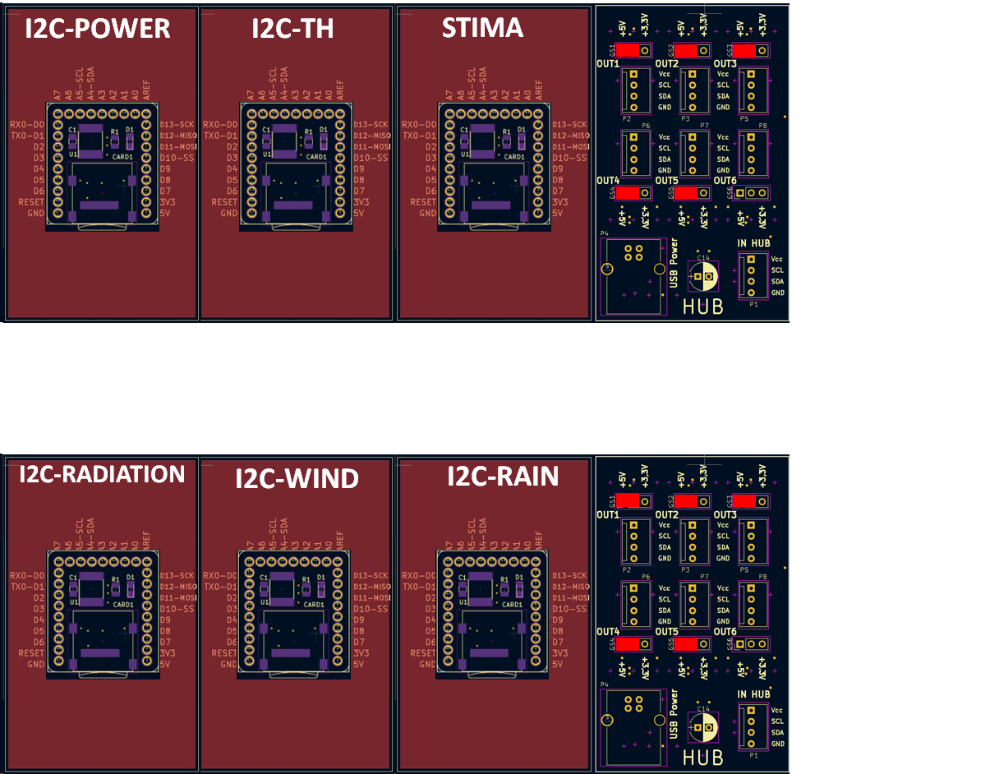
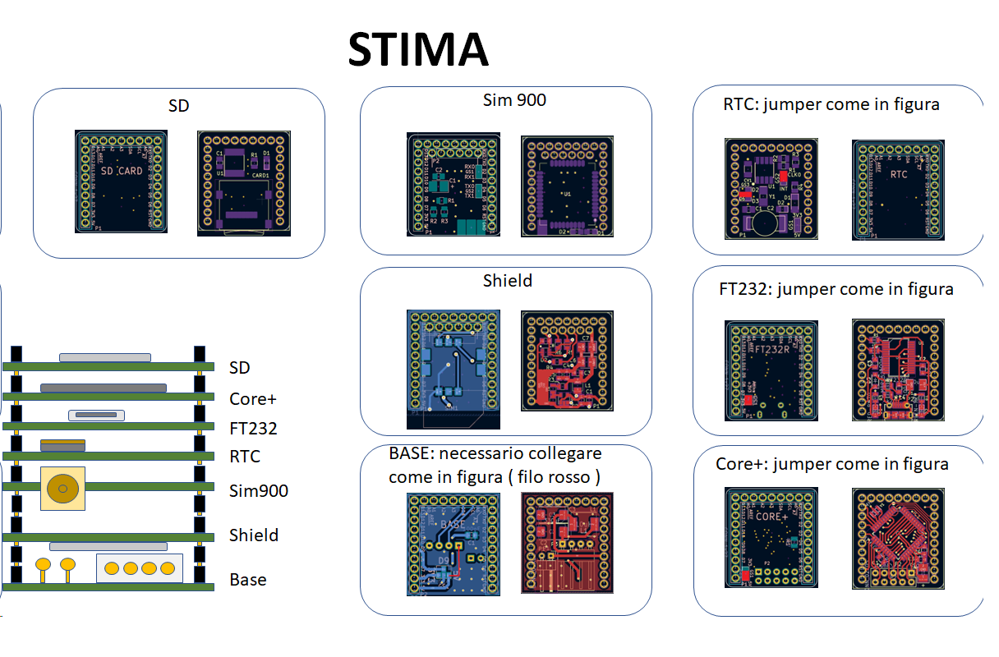
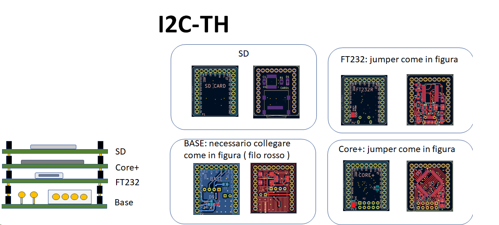
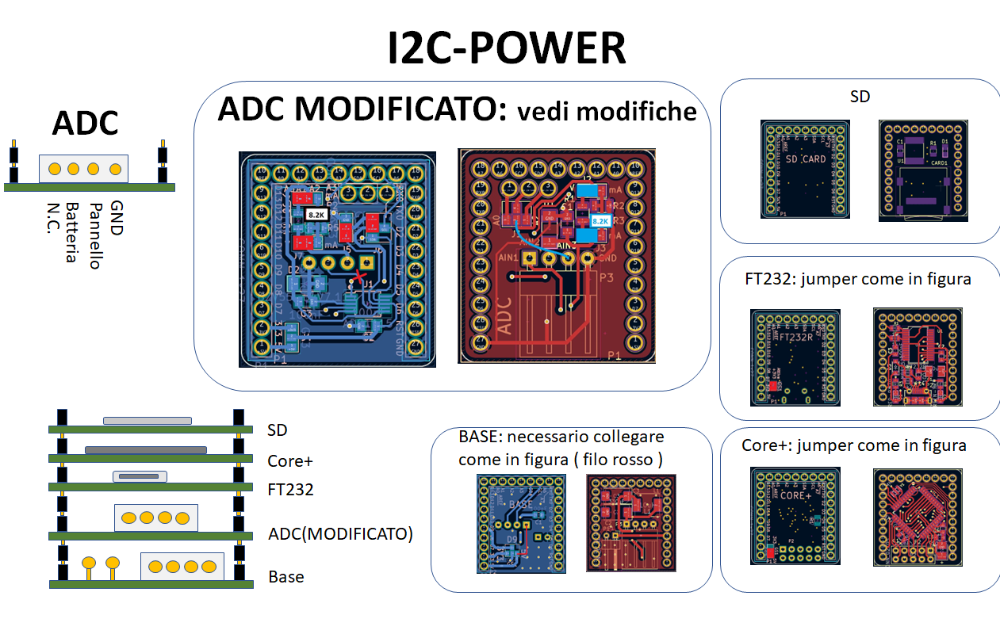
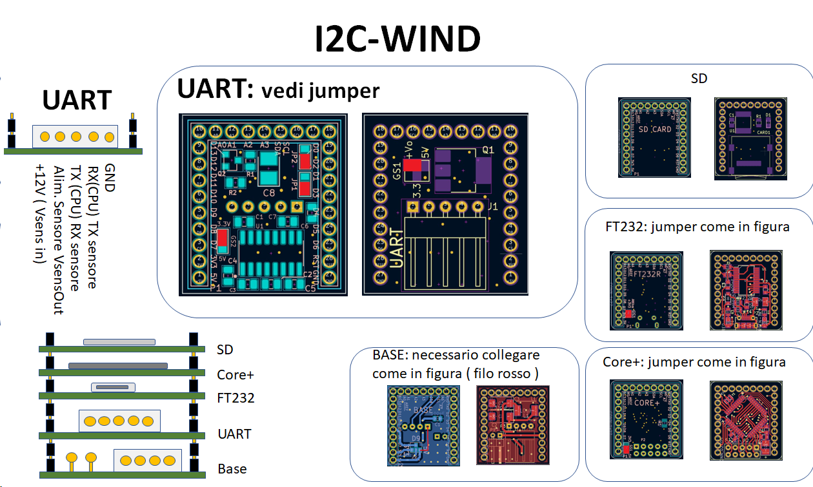
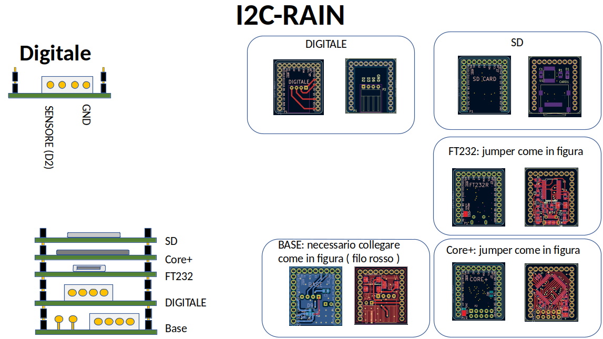
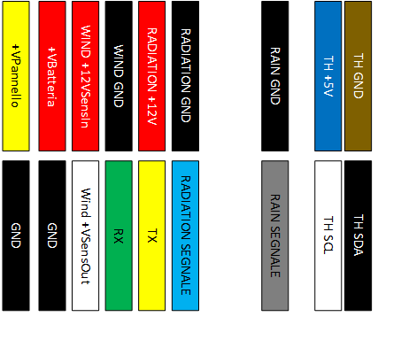

Howto per Stima versione 3.2
============================

Le stazioni nella versione completa consentono la lettura ,
memorizzazione e invio dei seguenti sensori:

-  Anemometro GILL WINDOSONIC OPTION1
-  Sensore Temperatura umidità basato sul sensore SHT35
-  Pluviometro a bascula da 0.2mm
-  Radiometro 0-1V 0-2000W/m2
-  Batteria e pannello solare

La soluzione prevista è quella mostrata in figura:

|image0|

Cioè si compone di 6 moduli che seguono:

-  Stima
-  i2c-th
-  i2c-Power
-  i2c-radiation
-  i2c-wind
-  i2c-rain

Master
~~~~~~

In figuralo schema di massima della pila Master con jumper e
configurazione:

|image1|

i2c-th
~~~~~~

In figura lo schema di massima della pila i2c-th con jumper e
configurazione:

|image2|

i2c-power
~~~~~~~~~

In figura lo schema di massima della pila i2c-power con jumper e
configurazione:

|image3|

In particolare per la scheda ADC è prevista una modifica con taglio
pista e la sostituzione delle resistenza R3 e R7 da 20k a 8.2k.

i2c-radiation
~~~~~~~~~~~~~

In figura lo schema di massima della pila i2c-radiation con jumper e
configurazione:

|image4|

i2c-wind
~~~~~~~~

In figura lo schema di massima della pila i2c-wind con jumper e
configurazione:

|image5|

i2c-rain
~~~~~~~~

In figura lo schema di massima della pila i2c-wind con jumper e
configurazione:

|image6|

Schema di collegamento
----------------------

In figura è riportato lo schema di collegamento del quadro:

|image7|

Segue invece schema dettaglio della morsettiera di confine:

|image8|

.. |image4| image:: ./img/i2c-radiation.png

.. |image7| image:: ./img/schema.png

