Howto per Stima versione 3
==========================

Caratteristiche hardware dei singoli moduli
-------------------------------------------

Stima core+644 e Stima core+1284
................................
|image0|\ |image1|

Le due board Stima core+644 e Stima core+1284 sono realizzate sul
medesimo circuito stampato, appositamente progettato per accogliere
indifferentemente il microcontrollore ATmega644 o ATmega1284 nelle
configurazioni a 8 MHz a 3.3V o 16 MHz a 5V.

Per selezionare la corretta tensione di alimentazione sul
microcontrollore, è sufficiente un punto di saldatura sullo switch delle
piste del circuito stampato della scheda, a patto di aver selezionato il
giusto quarzo in funzione della tensione di alimentazione.

Entrambe le board sono realizzate sullo standard UPIN-27.

Gli schemi elettrici realizzati in KiCad sono disponibili nella cartella:

kicad/r-map_v3/Microduino_Core+_DE

Stima I2C-Base
..............

|image2|\ |image3|

Basato sullo standard UPIN-27 e quindi impilabile come un normalissimo
modulo Microduino, è stato progettato per far fronte alle necessità di
alimentazione e collegamento su bus I\ :sup:`2`\ C dell’intero stack.

È dotato di un connettore a quattro pin, posto nella parte frontale del
modulo (l’unico libero dal connettore UPIN-27) la cui funzione duale è
quella di alimentare lo stack e di fornire il collegamento su bus
I\ :sup:`2`\ C a tutti i moduli ad esso collegati.

Per la corretta configurazione hardware di tale modulo, è necessario
effettuare un punto di saldatura sullo switch delle piste del circuito
stampato atto a selezionare l’alimentazione (3.3V o 5V) e la
corrispondente tensione di alimentazione del bus I\ :sup:`2`\ C sullo
stack di moduli nel quale verrà installato.

Inoltre, tale switch presenta un’ulteriore via che prevede
l’abilitazione dell’alimentazione sul bus I\ :sup:`2`\ C controllabile
attraverso un pin di un microcontrollore impilato nello stack: funzione
utile nel caso di test o di configurazione di particolari sensori
I\ :sup:`2`\ C.

Si specifica che il connettore a quattro pin presenta clip di
collegamento elettriche in materiale anti ossidante in grado di
garantire un perfetto contatto elettrico nel corso degli anni. Inoltre è
realizzato in modo tale da non permettere il distacco accidentale del
cavo, assicurando la comunicazione. Altra peculiarità è quella di poter
essere innestato in un unico verso evitando l’inversione di polarità di
alimentazione e di collegamento del bus.

Tale board, inoltre, presenta due pin cortocircuitabili temporaneamente
attraverso un jumper atto a consentire la configurazione della stazione
attraverso porta seriale.

A causa dell’ingombro in altezza maggiorato rispetto ad una board
standard dovuto al connettore a quattro pin, tale scheda è impilabile
solamente attraverso l’adozione di due file di pin del tipo UPIN-27.

Gli schemi elettrici realizzati in KiCad sono disponibili nella cartella:

kicad/r-map_v3/Microduino_BASE_DE

Stima I2C-Digital
.................

|image4|\ |image5|

Il modulo in oggetto, realizza le funzioni di input o output di segnali
digitali. Basato sullo standard UPIN-27, sarà dotato di un connettore a
quattro pin del tipo usato nel modulo Stima I2C-Base ma adoperato per
l’input o l’output di segnali digitali.

In particolare, sono presenti tre pin corrispondenti alle tre linee di
interrupt fisiche fornite dai microcontrollori ed un pin di massa,
comune alle tre linee.

A causa dell’ingombro in altezza maggiorato rispetto ad una board
standard dovuto al connettore a quattro pin, tale scheda è impilabile
solamente attraverso l’adozione di due file di pin del tipo UPIN-27.

Gli schemi elettrici realizzati in KiCad sono disponibili nella cartella:

kicad/r-map_v3/Microduino_DIGITALE_DE

Stima I2C-RTC
.............

|image6|\ |image7|

Tale modulo, compatibile con lo standard UPIN-27, assolve le funzioni di
mantenimento della data ed ora nel tempo, attraverso l’adozione del Real
Time Clock (RTC), interfacciato al microcontrollore attraverso bus
I\ :sup:`2`\ C.

Per la corretta configurazione hardware di tale modulo, è necessario
effettuare un punto di saldatura sullo switch delle piste del circuito
stampato atto a selezionare l’alimentazione (3.3V o 5V).

Inoltre, per garantire il funzionamento dello stesso nel caso di
distacco dell’alimentazione principale, è provvisto di un super
condensatore in grado di fornire energia sufficiente a garantirne il
funzionamento per alcune ore.

Un’ulteriore caratteristica del modulo, è quella di poter generare un
segnale a frequenza costante e programmabile via software, che potrà
essere convogliata su una delle tre linee digitali ad interrupt del
microcontrollore, utilizzabile come segnale di risveglio per il
microcontrollore impostato in risparmio energetico profondo, in modo
tale da poter ridurre i consumi energetici dell’intera stazione.

Gli schemi elettrici realizzati in KiCad sono disponibili nella cartella:

kicad/r-map_v3/Microduino_RTC_DE

Stima I2C-FT232RL
.................

|image8|\ |image9|

Il modulo in questione, permette di collegare la porta seriale zero del
microcontrollore ad un bus USB (ad esempio, quello di un computer) in
modo tale da poter facilmente instaurare una comunicazione seriale con
il microcontrollore. Tale metodo di comunicazione risulta comodo sia nel
caso di upload del firmware che nel caso di configurazione della
stazione.

Inoltre, l’integrato FT232RL è in grado di generare una tensione a 3.3V
a bassa potenza in grado di alimentare direttamente il microcontrollore
nella configurazione 3.3V e 8MHz, permettendone la programmazione dello
stesso quando non è alimentato da una fonte di alimentazione esterna.

Tale tensione può o meno essere fornita al microcontrollore effettuando
o meno una saldatura sul circuito stampato della board. L’intero modulo
è realizzato secondo lo standard UPIN-27.

Gli schemi elettrici realizzati in KiCad sono disponibili nella cartella:

kicad/r-map_v3/Microduino_FT232R_DE

Stima SD-Card
.............

|image10|\ |image11|

Tale board permette il collegamento di una micro SD-Card al
microcontrollore permettendo il salvataggio dei dati dei sensori e
l’upload del firmware con il bootloader Digitecoboot. L’intera board è
anch’essa basata sullo standard UPIN-27.

Gli schemi elettrici realizzati in KiCad sono disponibili nella cartella:

kicad/r-map_v3/Microduino_SD_DE

Stima SIM800C Power
...................

|image12|\ |image13|

Il modulo SIM800C Power costituisce il modulo di alimentazione per il
modulo GSM/GPRS SIM800C ed include il connettore per la SIM Card in
formato standard. Basato sul connettore UPIN-27, necessita di ulteriori
6 pin posti a contatto con la parte posteriore del connettore
principale, atti al trasporto di tensioni di alimentazione e segnali
verso il modulo SIM800C posto nella board Stima SIM800C Module.

Il comparto di alimentazione è realizzato mediante alimentatore
switching e fornisce la giusta alimentazione al modulo SIM800C a partire
dalla tensione di alimentazione primaria di 5V.

A causa dell’ingombro in altezza maggiorato rispetto ad una board
standard dovuto alla componentistica elettronica, tale scheda è
impilabile solamente attraverso l’adozione di una fila di pin del tipo
UPIN-27.

Gli schemi elettrici realizzati in KiCad sono disponibili nella cartella:

kicad/r-map_v3/Microduino_GSM_DE/SIM_shield_DE

Stima SIM800C Module
....................

|image14|\ |image15|

In tale modulo basato sul connettore UPIN-27, trova alloggio il modulo
GSM/GPRS SIM800C, due led di funzionamento ed il connettore SMA per il
collegamento dell’antenna, introdotto in quanto molto più solido,
robusto e di facile installazione rispetto a quello adottato sulle board
Microduino.

Per garantire il risparmio energetico della stazione, il modulo GSM/GPRS
è sempre spento e viene acceso solo nel momento in cui si rende
necessario il suo utilizzo. L’operazione di accensione o spegnimento è
effettuata ponendo a livello logico basso il pin dedicato del modulo per
almeno un secondo. L’identificazione di tale pin è inserita nel file
gsm_config.h nella cartella platformio/stima_ve/stima/include.

Il modulo è provvisto di due led di stato che forniscono indicazioni sul
funzionamento e sullo stato della rete. In particolare, osservando il
modulo frontalmente, il led di sinistra:

*  Acceso: il modulo è acceso ed è in funzionamento
*  Spento: il modulo è spento

Il led di destra:

*  Spento: il modulo è spento
*  Acceso per 64ms e spento per 800ms: il modulo non è registrato sulla
   rete
*  Acceso per 64ms e spento per 3000ms: il modulo è registrato sulla
   rete
*  Acceso per 64ms e spento per 300ms: comunicazione GPRS in corso

Si consiglia quindi di impilare per prima la board Stima SIM800C Power,
di interporre un’ulteriore fila di pin del connettore UPIN-27 e di
impilare in testa la board Stima SIM800C Module.

Gli schemi elettrici realizzati in KiCad sono disponibili nella cartella:

kicad/r-map_v3/Microduino_GSM_DE/SIM800C_DE

Stima I2C-HUB
.............

|image16|\ |image17|

Il modulo Stima I2C-HUB garantisce la massima modularità dell’intero
progetto della stazione meteorologica Stima, preservando la
compatibilità con tutti i moduli Stima esistenti e garantendo il
collegamento su bus I\ :sup:`2`\ C di dispositivi operanti a tensioni di
3.3 V e 5 V contemporaneamente.

L’HUB presenta una porta in ingresso e sei porte in uscita, utilizzabili
per il collegamento e/o alimentazione di moduli su bus I\ :sup:`2`\ C.
Ogni porta è realizzata mediante il connettore a quattro pin dello
stesso tipo di quello installato negli altri moduli (Stima I2C-Base e
Stima I2C-Digital).

Fatta eccezione per la porta in ingresso, la quale dev’essere sempre
collegata ad un bus I\ :sup:`2`\ C a 5V, ognuna delle sei porte in
uscita è configurabile indipendentemente per collegare e/o alimentare
moduli funzionanti a tensioni di 3.3V o 5V, selezionabili facilmente e
velocemente attraverso un jumper posto in prossimità di ogni porta.
Inoltre, ogni singola porta è bufferizzata e protetta contro scariche
elettrostatiche.

L’HUB è in grado di ricevere alimentazione a 5V attraverso il connettore
USB tipo B o dalla porta in ingresso con connettore a quattro pin. Tale
alimentazione, verrà propagata sull’intera linea a 5V e su tutti i
moduli connessi all’HUB.

Diversamente, un circuito di alimentazione da 5V a 3.3V posto sull’HUB,
provvederà ad alimentare tutti i moduli collegati sul bus a 3.3V.

Con riferimento alla porta in ingresso con connettore a quattro pin, si
evidenzia che tale porta può essere adottata per collegare un HUB B ad
un ad HUB A nel caso in cui vi sia la necessità di collegare un certo
numero di periferiche sull’HUB B posto a distanza dall’HUB A. In tal
caso, sarà sufficiente collegare attraverso un cavo, una delle sei porte
in uscita dell’HUB A impostata a 5V al connettore in ingresso dell’HUB
B.

Stima I2C-HUB consente la piena modularità della stazione Stima,
garantendo molteplici topologie di collegamento dei moduli o dei
sensori, facilitandone la connessione ed il cablaggio e dimenticandosi
di calcolare di volta in volta i giusti valori di resistenze di pull-up
e il massimo limite di capacità del bus I\ :sup:`2`\ C.

Gli schemi elettrici realizzati in KiCad sono disponibili nella cartella:

kicad/r-map_v3/Microduino_HUB_DE

Regolatore di tensione e carica della batteria con bus I\ :sup:`2`\ C DigitecoPower
...................................................................................

Il regolatore di alimentazione DigitecoPower, di tipo switching, è
progettato per garantire un uso efficiente della batteria con
funzionamento in tampone.

Nel caso specifico, il regolatore monitorerà lo stato di salute della
batteria fornendo i dati riassuntivi tramite interrogazione su bus
I\ :sup:`2`\ C. È provvisto di una linea di alimentazione 12-30 V DC
fornita da un pannello fotovoltaico o da un alimentatore DC, di una
linea a 12V in uscita per la connessione di una batteria al piombo di
tipo sigillato e di quattro pin per la connessione di tale alimentatore
alla porta a quattro pin in ingresso al HUB.

In particolare, i valori monitorabili ed acquisiti attraverso la
libreria DigitecoPower implementata nella libreria SensorDriver, sono:

*  Tensione di alimentazione
*  Corrente di alimentazione
*  Tensione di batteria
*  Corrente di batteria
*  Percentuale di carica della batteria
*  Tensione a 5V

Per la verifica istantanea del funzionamento, è presente un led di
notifica tri-colore (rosso, giallo, verde) in grado di indicare la
carica o meno della batteria ed il livello di energia della stessa:

*  Led rosso: batteria scarica
*  Led giallo: batteria mediamente carica
*  Led verde: batteria carica
*  Led lampeggiante lentamente: batteria in scarica
*  Led lampeggiante velocemente: batteria in carica

Ad esempio, un led rosso con un lampeggio veloce indica che la batteria
è scarica e si sta caricando, diversamente, un led verde con lampeggio
lento, indica che la batteria è carica ma si sta scaricando.

Per l’interfacciamento di tale modulo, si faccia riferimento al seguente
schema di collegamento:

============ ========  ====================================================
Collegamento Nome      Descrizione
============ ========  ====================================================
1            VCC_IN    ingresso alimentazione 12-30V DC VCC (+)
2            GND_IN    ingresso alimentazione 12-30V DC GND (-)
3            VCC_BAT   uscita alimentazione batteria 12V DC VCC (+)
4            GND_BAT   uscita alimentazione batteria 12V DC GND (-)
5            LED       LED di stato
6            VCC_OUT   uscita tensione di alimentazione HUB 5V DC VCC (+)
7            SCL       I2C SCL HUB
8            SDA       I2C SDA HUB
9            GND_OUT   uscita tensione di alimentazione HUB 5V DC GND (-)
============ ========  ====================================================

Display LCD 20x4 con interfaccia I2C
....................................

Il display consente di visualizzare lo stato della stazione: prossimo
orario di acquisizione, stato del salvataggio dei dati su sd-card, stato
dell’invio dei dati attraverso mqtt ed un valore rappresentativo
dell’ultima acquisizione, utile per verificare in campo il corretto
funzionamento della strumentazione.

Inoltre, è provvisto di un pulsante per l’accensione temporanea della
retroilluminazione, evitando inutilmente il consumo della batteria.

Configurazioni hardware dei moduli Stima
----------------------------------------

Modulo Stima Ethernet
.....................

|image18|\

Il modulo Stima Ethernet consente la connessione della stazione
attraverso Ethernet con eventuale alimentazione PoE ed è realizzabile
assemblando i seguenti moduli (dal basso verso l’alto):

1. Stima I2C-Base @ 5V
2. Microduino Ethernet WIZ
3. Microduino RJ45
4. Stima core+1284 @ 5V
5. Stima I2C-RTC @ 5V
6. Stima FT232RL
7. Stima SD-Card

Successivamente sarà necessario fornire connettività Ethernet e
alimentazione attraverso una delle seguenti modalità:

*  Power over ethernet (PoE)
*  Connettore micro USB posto sulla board Stima FT232RL
*  Connettore a quattro pin posto sulla board Stima I2C-Base
*  Collegando il modulo a Stima I2C-HUB

Modulo Stima GSM/GPRS
.....................

|image19|\

Il modulo Stima GSM/GPRS consente la connessione della stazione
attraverso GPRS ed è realizzabile assemblando i seguenti moduli (dal
basso verso l’alto):

1. Stima I2C-Base @ 5V
2. Stima SIM800C Power
3. Stima SIM800C Module
4. Stima core+1284 @ 5V
5. Stima I2C-RTC @ 5V
6. Stima FT232RL
7. Stima SD-Card

Infine, è necessario collegare un’antenna GPRS Dual Band 850/1900 MHz
attraverso il connettore SMA posto sulla board Stima SIM800C Module e
fornire alimentazione attraverso una delle seguenti modalità:

*  Connettore micro USB posto sulla board Stima FT232RL
*  Connettore a quattro pin posto sulla board Stima I2C-Base
*  Collegando il modulo a Stima I2C-HUB

Modulo Stima Passivo
....................

Tale modulo passivo permette di acquisire i sensori collegati su bus
I\ :sup:`2`\ C e di esporre i dati ad un altro modulo “attivo”
attraverso Remote Procedure Call (RPC) ed è realizzabile assemblando i
seguenti moduli (dal basso verso l’alto):

1. Stima I2C-Base @ 5V / 3.3V
2. Stima core+1284 @ 5V / Stima core+644 @ 3.3V
3. Stima I2C-RTC @ 5V / 3.3V
4. Stima FT232RL

A tale modulo, è possibile fornire alimentazione attraverso una delle
seguenti modalità:

*  Connettore micro USB posto sulla board Stima FT232RL
*  Connettore a quattro pin posto sulla board Stima I2C-Base
*  Collegando il modulo a Stima I2C-HUB

Modulo Stima I2C-TH
...................

Acquisisce i dati dai sensori di temperatura e umidità collegati su bus
I\ :sup:`2`\ C fornendo elaborazioni relative a valori istantanei,
minimi, medi e massimi. Tali dati potranno essere acquisiti da uno dei
moduli atti a tale operazione, attraverso la libreria SensorDriver.

|image20|\

Nello specifico, assemblare il modulo con le seguenti board (dal basso
verso l’alto):

1. Stima I2C-Base @ 3.3V
2. Stima core+644 @ 3.3V
3. Stima FT232RL
4. Stima SD-Card

Per garantire il risparmio energetico della stazione, il modulo Stima
I2C-TH è perennemente posto in risparmio energetico sufficiente al
mantenimento del funzionamento del clock della CPU e del timer ad
elevata precisione posto all’interno del microcontrollore.

Il timer è programmato per generare un interrupt allo scadere di un
certo intervallo di tempo in secondi (programmabile via software),
corrispondente all’intervallo di acquisizione dei sensori di temperatura
e umidità.

Al termine delle operazioni di acquisizione dei sensori, il
microcontrollore torna in risparmio energetico attendendo il successivo
istante di acquisizione.

Modulo Stima I2C-Rain
.....................

Effettua un conteggio del numero di basculate di un pluviometro
nell’arco di tempo desiderato. Tale dato sarà acquisito da uno dei
moduli atti a tale operazione, attraverso la libreria SensorDriver.

|image21|\

Nello specifico, assemblare il modulo con le seguenti board
(dal basso verso l’alto):

1. Stima I2C-Base @ 3.3V
2. Stima core+644 @ 3.3V
3. Stima I2C-Digital
4. Stima FT232RL
5. Stima SD-Card

In genere la segnalazione di una basculata del pluviometro viene fornita
con la chiusura di un contatto elettrico. Tale collegamento può essere
realizzato mediante collegamento al pin di massa e ad una delle tre
linee di interrupt presenti sul connettore a quattro pin sulla board
Stima I2C-Digital.

Per garantire il risparmio energetico della stazione, il modulo Stima
I2C-Rain è perennemente posto in risparmio energetico profondo e
risvegliato all’occorrenza da un interrupt scaturito dalla basculata del
pluviometro.

Configurazioni software dei moduli Stima
----------------------------------------

Installazione del software per la configurazione
................................................

Installare Centos 8.

Aggiunta repository e installazione pacchetti da utente amministratore
::

  dnf -y install epel-release
  dnf install yum-plugin-copr
  dnf copr enable simc/stable
  dnf copr enable pat1/rmap
  dnf config-manager --set-enabled powertool
  dnf groupinstall rmap

Installazione del software per la compilazione dei firmware
...........................................................

Per compilazione del firmware è necessario installare PlatformIO
https://platformio.org

Utilizzeremo per la copilazione i comandi a CLI tramite Command Line Tool.
Quindi seguire le istruzioni a: 
https://platformio.org/install/cli

Installazione dei sorgenti dei firmware e dei progetti kicad
............................................................

Scaricare e scompattare l'ultima release denominata Stima disponibile a:
https://github.com/r-map/rmap/releases
ad esempio:
https://github.com/r-map/rmap/archive/refs/tags/3.4.tar.gz

Modulo Stima GSM/GPRS
.....................

1. Il progetto per platformio si trova in:
   platformio/stima_v3/stima

2. Aprire il file stima-config.h in arduino/sketchbook/stima_v3/stima:

   -  Impostare la #define MODULE_TYPE con il valore
      STIMA_MODULE_TYPE_REPORT_GSM per definire una stazione di tipo
      report o STIMA_MODULE_TYPE_SAMPLE_GSM per definire una stazione di
      tipo sample

3. Aprire il file sensors_config.h nella cartella
   platformio/stima_v3/stima/include:

   -  Settare la #define USE_JSON con il valore true
   -  Settare le altre #define USE_SENSOR_XXX con valori true o false a
      seconda dei sensori che si vuole abilitare o disabilitare
   -  Impostare il valore in decimi di mm di pioggia per ogni basculata
      del pluviometro nella #define RAIN_FOR_TIP

4. 

   -  Impostare il numero di valori da leggere per ogni singolo sensore
      nella #define VALUES_TO_READ_FROM_SENSOR_COUNT (tra tutti i valori
      a disposizione, inserire quello più alto)

5. 

   -  Impostare il valore in minuti per il calcolo di un’osservazione
      nella #define OBSERVATIONS_MINUTES (in genere 1)
   -  Impostare il numero di osservazioni necessarie a produrre un dato
      utile per il report nella #define STATISTICAL_DATA_COUNT (in
      genere 15)

6. Impostare il microcontrollore su core+1284 a 5V

7. Compilare il firmware e caricarlo attraverso il cavo USB
   tramite il comando:
   ::
   
      cd platformio/stima_v3/stima
      pio run -e 1284p16m -t upload
   
8. Inserire il jumper sulla board Stima I2C-Base, configurare la
   stazione e rimuovere il jumper a configurazione terminata

Per la configurazione:

* Per ottenere una username e una password iscriversi al sito `<http://rmap.cc/registrazione/register/>`_
* Eventualmente (dopo la prima configurazione) ponticellare sulla scheda i pin "Set".
* Eseguire i comandi:

  ::

     rmapctrl --syncdb
     rmap-configure --wizard --station_slug=<nome_stazione> --height=<height> --stationname=<nome_descrittivo> --username=<username> --password=<password> --server=rmap.cc --lat=<xx.xxxxx> --lon=<xx.xxxxx> --mqttrootpath=report --mqttmaintpath=maint
     rmap-configure --addboard --station_slug=<nome_stazione> --board_slug=<board_name> --user=<username> --serialactivate --mqttactivate --mqttuser=<username> --mqttpassword=<password> --mqttsamplerate=900
     rmap-configure --addsensors_by_template=stima_report_thpb --station_slug=<nome_stazione> --board_slug=<nome_board> --user=<username> --password=<password> --upload_to_server
     rmap-configure --config_station --station_slug=<nome_stazione> --board_slug=<nome_board> --username=<username> --baudrate 115200
   
  sostituendo i valori <> con opportuni valori.

* Rimuovere il ponticello ai pin "Set".

Modulo Stima Ethernet
.....................

1. Il progetto per platformio si trova in:
   platformio/stima_v3/stima
2. Aprire il file stima-config.h in platformio/stima_v3/stima/src:

   -  Impostare la #define MODULE_TYPE con il valore
      STIMA_MODULE_TYPE_REPORT_ETH per definire una stazione di tipo
      report o STIMA_MODULE_TYPE_SAMPLE_ETH per definire una stazione di
      tipo sample

3. Aprire il file sensors_config.h nella cartella
   platformio/stima_v3/stima/include:

   -  Settare la #define USE_JSON con il valore true
   -  Settare le altre #define USE_SENSOR_XXX con valori true o false a
      seconda dei sensori che si vuole abilitare o disabilitare
   -  Impostare il valore in decimi di mm di pioggia per ogni basculata
      del pluviometro nella #define RAIN_FOR_TIP
   -  Impostare il numero di valori da leggere per ogni singolo sensore
      nella #define VALUES_TO_READ_FROM_SENSOR_COUNT (tra tutti i valori
      a disposizione, inserire quello più alto)
   -  Impostare il valore in minuti per il calcolo di un’osservazione
      nella #define OBSERVATIONS_MINUTES (in genere 1)
   -  Impostare il numero di osservazioni necessarie a produrre un dato
      utile per il report nella #define STATISTICAL_DATA_COUNT (in
      genere 15)

4. Impostare il microcontrollore su core+1284 a 5V
5. Compilare il firmware e caricarlo attraverso il cavo USB
   tramite il comando:
   ::
   
      cd platformio/stima_v3/stima
      pio run -e 1284p16m -t upload
   
6. Inserire il jumper sulla board Stima I2C-Base, configurare la
   stazione e rimuovere il jumper a configurazione terminata.

Per la configurazione:

* Per ottenere una username e una password iscriversi al sito `<http://rmap.cc/registrazione/register/>`_
* Eventualmente (dopo la prima configurazione) ponticellare sulla scheda i pin "Set".
* Eseguire i comandi:

  ::

     rmapctrl --syncdb
     rmap-configure --wizard --station_slug=<nome_stazione> --height=<height> --stationname=<nome_descrittivo> --username=<username> --password=<password> --server=rmap.cc --lat=<xx.xxxxx> --lon=<xx.xxxxx>  --mqttrootpath=report --mqttmaintpath=maint
     rmap-configure --addboard --station_slug=<nome_stazione> --board_slug=<nome_board> --user=<username> --serialactivate --mqttactivate --mqttuser=<username> --mqttpassword=<password> --mqttsamplerate=900 --tcpipactivate --tcpipntpserver="it.pool.ntp.org" --tcpipname=stima
     rmap-configure --addsensors_by_template=stima_report_thpb --station_slug=<nome_stazione> --board_slug=<nome_board> --user=<username> --password=<password> --upload_to_server
     rmap-configure --config_station --station_slug=<nome_stazione>  --board_slug=<nome_board> --username=<username> --baudrate 115200
   
  sostituendo i valori tra <> con opportuni valori.

* Rimuovere il ponticello ai pin "Set". 

  
Modulo Stima Passive
....................

1. Il progetto per platformio si trova in:
   platformio/stima_v3/stima
2. Aprire il file stima-config.h arduino/sketchbook/stima_v3/stima/src:
   
   -  Impostare la #define MODULE_TYPE con il valore
      STIMA_MODULE_TYPE_PASSIVE per definire una stazione di tipo
      passivo

3. Aprire il file sensors_config.h nella cartella
   platformio/stima_v3/stima/include:

   -  Settare la #define USE_JSON con il valore true
   -  Settare le altre #define USE_SENSOR_XXX con valori true o false a
      seconda dei sensori che si vuole abilitare o disabilitare
   -  Impostare il valore in decimi di mm di pioggia per ogni basculata
      del pluviometro nella #define RAIN_FOR_TIP
   -  Impostare il numero di valori da leggere per ogni singolo sensore
      nella #define VALUES_TO_READ_FROM_SENSOR_COUNT (tra tutti i valori
      a disposizione, inserire quello più alto)
   -  Impostare il valore in minuti per il calcolo di un’osservazione
      nella #define OBSERVATIONS_MINUTES (in genere 1)
   -  Impostare il numero di osservazioni necessarie a produrre un dato
      utile per il report nella #define STATISTICAL_DATA_COUNT (in
      genere 15)

4. Compilare il firmware e caricarlo attraverso il cavo USB
   tramite il comando:
   ::
   
      cd platformio/stima_v3/stima
      pio run -e 1284p16m -t upload
   
5. Inserire il jumper sulla board Stima I2C-Base, configurare la
   stazione e rimuovere il jumper a configurazione terminata

Modulo Stima I2C-TH
...................

1. Aprire lo sketch i2c-th.ino nella cartella
   platformio/stima_v3/i2c-th
2. Aprire il file sensors_config.h nella cartella
   platformio/stima_v3/i2c-th/include:

   -  Settare la #define USE_JSON con il valore false
   -  Settare le altre #define USE_SENSOR_XXX con valori true o false a
      seconda dei sensori che si vuole abilitare o disabilitare
   -  Impostare il numero di valori da leggere per ogni singolo sensore
      nella #define VALUES_TO_READ_FROM_SENSOR_COUNT (tra tutti i valori
      a disposizione, inserire quello più alto)
   -  Impostare il valore in minuti per il calcolo di un’osservazione
      nella #define OBSERVATIONS_MINUTES (in genere 1 o in accordo con
      quanto impostato per la compilazione dello sketch stima.ino)
   -  Impostare il numero di osservazioni necessarie a produrre un dato
      utile per il report nella #define STATISTICAL_DATA_COUNT (in
      genere 15 o in accordo con quanto impostato per la compilazione
      dello sketch stima.ino)

3. Compilare il firmware e caricarlo attraverso il cavo USB
   tramite il comando:
   ::
   
      cd platformio/stima_v3/i2c-th
      pio run -e 644pa8m -t upload
   
4. Configurare il suddetto modulo attraverso lo sketch sensor_config
   presente nella cartella arduino\sketchbook\stima_v3

Modulo Stima I2C-Rain
.....................

1. Il progetto platformio si trova nella cartella:
   platformio/stima_v3/i2c-rain
2. Aprire il file sensors_config.h nella cartella
   platformio/stima_v3/i2c-rain/include:

   -  Settare la #define USE_JSON con il valore false
   -  Settare le altre #define USE_SENSOR_XXX con valori true o false a
      seconda dei sensori che si vuole abilitare o disabilitare
   -  Impostare il numero di valori da leggere per ogni singolo sensore
      nella #define VALUES_TO_READ_FROM_SENSOR_COUNT (tra tutti i valori
      a disposizione, inserire quello più alto)
   -  Impostare la quantità di pioggia espressa in decimi di millimetro
      da conteggiare per ogni basculata del pluviometro nella #define
      RAIN_FOR_TIP

3. Compilare il firmware e caricarlo attraverso il cavo USB
   tramite il comando:
   ::
   
      cd platformio/stima_v3/i2c-rain
      pio run -e 644pa8m -t upload
   
   
4. Configurare il suddetto modulo attraverso lo sketch sensor_config
   presente nella cartella arduino\sketchbook\stima_v3

Compilazione e caricamento del bootloader Digitecoboot
------------------------------------------------------

1. Aprire il file avr_conf nella cartella digitecoboot
2. Editare la variabile AVR_DIR inserendo il percorso corretto per la
   directory AVR
3. Nella cartella digitecoboot compilare il bootloader attraverso
   -  make atmega644p
   -  make atmega1284p

4. La compilazione produce i seguenti files:
   -  digitecoboot_atmega644p.hex: booatloader per core+644
   -  digitecoboot_atmega1284p.hex: booatloader per core+1284

5. Caricare il bootloader attraverso un programmatore impostando i
   seguenti parametri: stk500v1, 19200 baud, Low fuse 0xFF, Extended
   fuse 0xFD, High fuse 0xD0
   
   Questo è un esempio dei comandi da impartire a avrdude:
   
   - avrdude  -v -patmega1284p -cavrisp -P/dev/ttyUSB0 -b19200 -e -Ulock:w:0x3F:m -Uefuse:w:0xFD:m -Uhfuse:w:0xD0:m -Ulfuse:w:0xFF:m
   - avrdude  -v -patmega1284p -cavrisp -P/dev/ttyUSB0 -b19200 -V -U digitecoboot_atmega1284p.hex
   - avrdude  -v -patmega1284p -cavrisp -P/dev/ttyUSB0 -b19200 -U lock:w:0x0F:m

Per usare arduino come programmatore riferirsi a:
   https://docs.arduino.cc/built-in-examples/arduino-isp/ArduinoISP
 
E' possibile utilizzare due moduli microduino core+, uno 1284p16m da usare come programmatore e il secondo con la stessa tensione di funzionamento da programmare collegati come da schema:
|image_arduino_isp_schema|

Un esempio di connessione rapida (il condensatore elettrolitico è assente):
|image_arduino_microduino_photo|

Programmare il microduino-core+ da usare come ISP con il firmware
ArduinoIsp in ambiente platformio che si trova in
platformio/stima_v3/arduino_isp

ed eseguire:

-  make atmega644p_isp

oppure:

- make atmega1284p_isp  
     
Compilazione del firmware in formato binario
--------------------------------------------

1. Compilare il firmware per i moduli Stima secondo quanto scritto ai
   punti precedenti
2. Localizzare il file firmware.elf compilato, solitamente
   -  rmap/platformio/stima_v3/stima/.pio/build/1284p16m
3. Attraverso una consolle o il prompt dei comandi, eseguire
   -  ~/.platformio/packages/toolchain-atmelavr/bin//avr-objcopy -I ihex -O binary firmware.elf FIRMWARE.BIN

Upload del firmware tramite micro SD-Card attraverso Digitecoboot
-----------------------------------------------------------------

1. Copiare il file FIRMWARE.BIN su una micro SD-Card formattata in FAT32
2. Creare un file sulla scheda SD con il nome esattamente corrispondente alla
   versione del firmware: ad esempio "3.6"
3. Inserire la micro SD-Card in uno dei moduli Stima Ethernet, Stima
   GSM/GPRS, Stima I2C-TH o Stima-Rain
4. Alimentare il modulo e attendere 30 secondi per la fine del
   caricamento del firmware
5. Spegnere il modulo e rimuovere eventualmente la micro SD-Card contenente il
   firmware
6. Verificare sul display LCD la corretta versione del firmware
7. Se necessario, inserire la micro SD-Card utile per il funzionamento
   del modulo (senza il file FIRMWARE.BIN)
8. Alimentare il modulo

Assemblaggio stazione Stima
---------------------------

Per assemblare una stazione Stima, è necessario disporre di:

-  Stima I2C-Master nella versione GSM/GPRS o Ethernet
-  Stima I2C-HUB
-  Stima I2C-TH
-  Stima I2C-Rain
-  Sensore di temperatura e umidità Digiteco TU022 (con sensore HYT221 o
   HYT271) oppure sensore di temperatura ADT7420 e sensore di umidità
   HIH6100
-  Pluviometro Digiteco PL005 o Digiteco PL010 o qualsiasi altro
   pluviometro con uscita a contatto
-  Cavi di collegamento:
   
   -  per sensore di temperatura e umidità Digiteco TU022: cavo 4 poli
      con connettore a vite lato sensore e connettore 4 pin lato HUB
   -  o per sensori ADT7420 e HIH6100 con cavi a 4 poli per sensore a
      saldare lato sensore e connettore 4 pin lato HUB
   -  per pluviometro a contatto: cavo a 2 poli con connettore 4 pin
      lato modulo Stima I2C-Rain
      
-  Antenna dual/quad band GPRS con connettore SMA per stazione GSM/GPRS
-  Contenitore stagno IP66 310x425x160
-  Batteria sigillata al piombo 12V e relativi cavi di collegamento con
   fusibile di protezione
-  Pannello fotovoltaico 20W o sorgente di alimentazione continua 12-30
   V
-  DigitecoPower: se presente batteria tampone 12V con pannello
   fotovoltaico o sorgente di alimentazione esterna DC
-  Palo acciaio inox diametro 48 mm
-  Collare alluminio anodizzato per fissaggio a palo diametro 48 mm
-  Morsetto alluminio anodizzato per fissaggio a sensore diametro 40 mm
-  Braccetto alluminio anodizzato cilindrico per fissaggio del morsetto
   sensore al collare del palo
-  Supporto per pluviometro
-  Display I2C LCD con supporto in alluminio
-  Supporti per moduli Stima su guida DIN

Una volta aver collegato i sensori, i moduli Stima, compilato i firmware
e configurato tutti i moduli, così come illustrato nei capitoli
precedenti, la stazione è pronta per essere utilizzata.

Di seguito un esempio di installazione di una stazione Stima GSM/GPRS
con:

-  Stima I2C-TH
-  Stima I2C-Rain
-  Stima I2C-HUB
-  DigitecoPower
-  Batteria sigillata 12V
-  Pannello fotovoltaico

|image22|

A partire da sinistra, è visibile il modulo Stima GSM/GPRS dotato di
connettore tipo SMA per il collegamento dell’antenna. Al centro è
visibile il modulo Stima I2C-TH e subito a destra è posizionato il
modulo Stima I2C-Rain. Stima I2C-HUB collega i tre moduli, preleva
l’alimentazione attraverso il connettore in ingresso in basso a destra
dal modulo DigitecoPower e dispone di altre due porte libere per il
collegamento di ulteriori sensori e moduli su bus I\ :sup:`2`\ C.

Sono ben visibili i jumper, uno per porta, per la selezione della
corrispondente tensione di alimentazione (5V o 3.3V) per i moduli Stima
e per i sensori I2C.

|image23|

|image24|

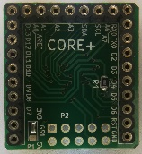
.. |image1| image:: Pictures/100000000000009A000000AEEEAB07A37000F6DA.jpg
   :width: 3.526cm
   :height: 3.999cm
.. |image2| image:: Pictures/100000000000009A000000ADE4C08B4E60589267.jpg
   :width: 3.56cm
   :height: 3.999cm
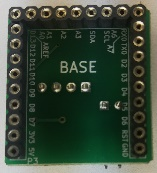
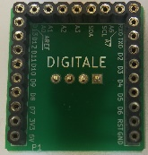
.. |image5| image:: Pictures/100000000000009E000000ADEB419933E3C33867.jpg
   :width: 3.641cm
   :height: 4.001cm
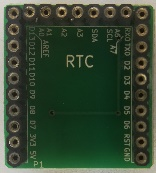
.. |image7| image:: Pictures/100000000000009C000000ADAF9C13A96CAA663F.jpg
   :width: 3.6cm
   :height: 4.001cm
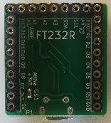
.. |image9| image:: Pictures/1000000000000099000000AD361FB05CE16B3BAD.jpg
   :width: 3.54cm
   :height: 4.001cm
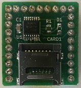
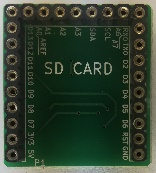
.. |image12| image:: Pictures/100000000000009C000000AD009D4C95E03328E3.jpg
   :width: 3.602cm
   :height: 4.001cm
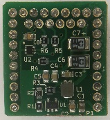
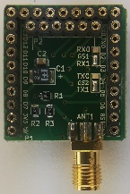
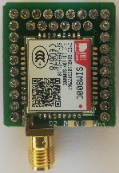
.. |image16| image:: Pictures/100000000000010E000001B1A0413A5CCCDE9CF2.jpg
   :width: 4.367cm
   :height: 7.001cm
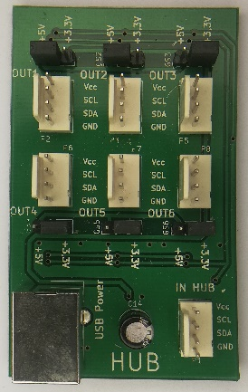
.. |image18| image:: Pictures/10000000000002080000039C7112DE85740F92D8.jpg
   :width: 5.999cm
   :height: 10.666cm
.. |image19| image:: Pictures/10000000000002080000039C60408299913E84DA.jpg
   :width: 6.001cm
   :height: 10.666cm
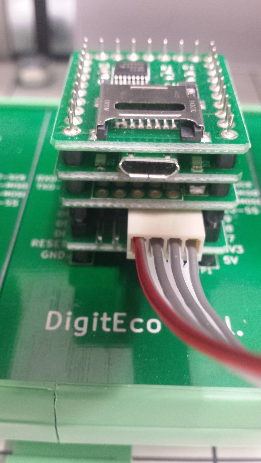
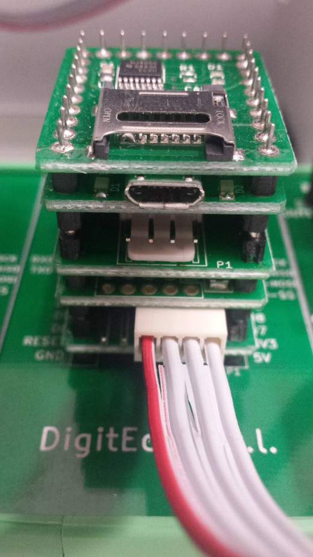
.. |image22| image:: Pictures/10000000000004660000027A5B0AC97A38FC96F0.jpg
   :width: 15cm
   :height: 8.437cm
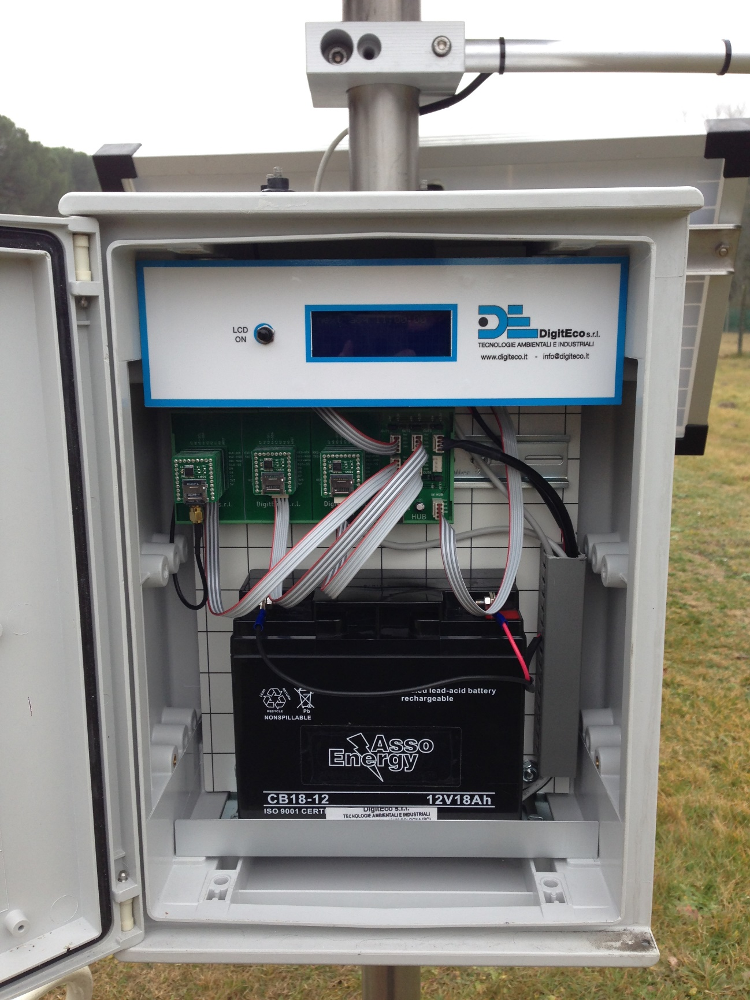
.. |image24| image:: Pictures/1000000000000512000006C284D72348DD042022.jpg
   :width: 15cm
   :height: 20.001cm

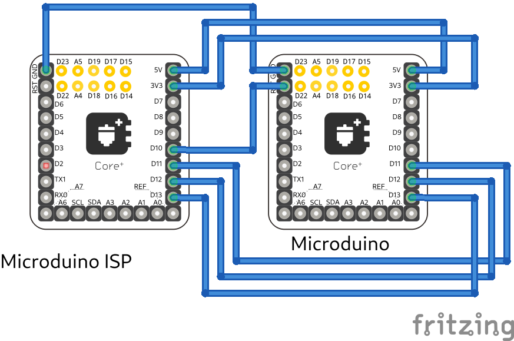
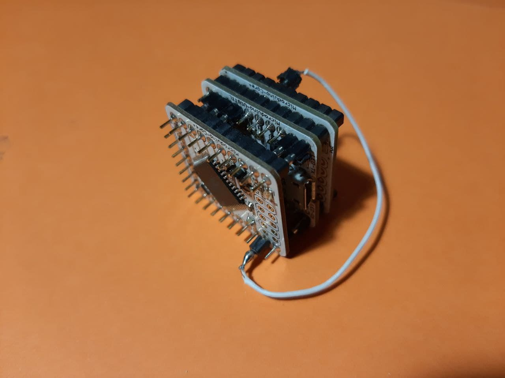

				      
	    
