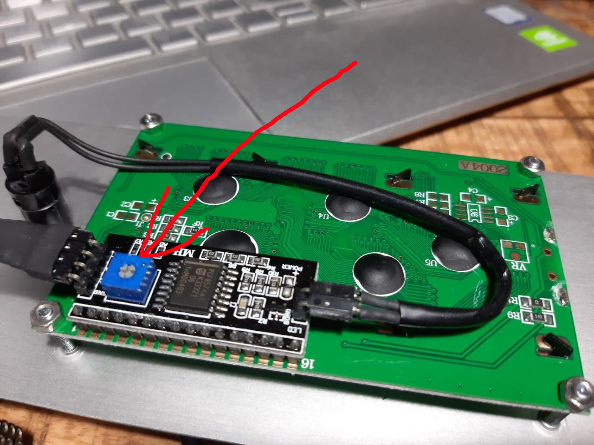
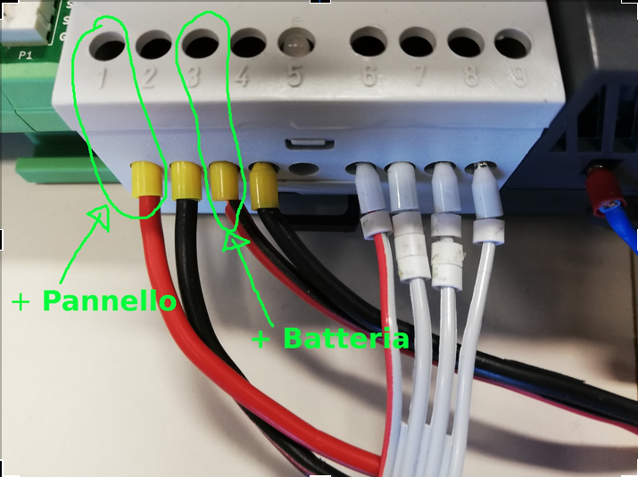

Manuale Utente
==============

Hardware
--------
Descrizione dell'hardware e delle sue principali funzioni.

Il datalogger è composto da moduli a loro volta composti board.
Una descrizione con alcune foto si trova a https://doc.rmap.cc/stima_v3/howto_stima_v3/howto_stima_v3.html e https://doc.rmap.cc/stima_v3/doxygen/index.html
a cui fare riferimento per maggiori dettagli.
I moduli si interconnettono tra loro tramite bus I2C.
Le board si interconnettono tramite interfaccia basata sullo standard UPIN-27.

funzioni svolte dalle Board
...........................

RTC
^^^
* determina la base dei tempi per il modulo master
* conserva data e ora anche in mancanza di alimentazione tramite la
  carica accumulata in un supercondensatore per non più di ~24h

Core+
^^^^^
Contiene il microcontrollore in queste due versioni:
* 8 MHz 3.3V
* 16 MHz 5V

USB
^^^
E' una interfaccia USB con la porta seriale del microcontrollore.
Permette di:
* caricare firmware
* effettuare debug

SDcard
^^^^^^
Permette di utilizzare una SDcard per effettuare:
* aggiornamento firmware
* salvataggio dati
* debug

I2C
^^^
Espone una 
* connessione e reset

GSM
^^^
* SIM
* antenna

HUB
^^^
* interconnessione
* alimentazione
* separazione BUS I2C e adattamento tensioni

Display
^^^^^^^
* Diagnostica

Funzioni software
-----------------

Accensione e supervisione (supervisor task)
...........................................

RTC task
........

Time task
.........

GSM task
........

Sensors reading task
....................

Data saving task
................

MQTT task
.........

Messa in opera
--------------

Connessione e disconnessione
............................

Impilamento board
^^^^^^^^^^^^^^^^^

Fare riferimento a:

* https://doc.rmap.cc/stima_v3/howto_stima_v3/howto_stima_v3.html e
* https://doc.rmap.cc/stima_v3/doxygen/index.html

Connessione moduli
^^^^^^^^^^^^^^^^^^
Fare riferimento a:

* https://doc.rmap.cc/stima_v3/howto_stima_v3/howto_stima_v3.html e
* https://doc.rmap.cc/stima_v3/doxygen/index.html

Effettuare tutte le operazioni senza alimentazione elettrica.
  
Per la connessione elettrica tra moduli bisogna quindi conoscere la
tensione di funzionamento di ciascun modulo/dispositivo da connettere
e verificare la predisposizione corretta del ponticello di
configurazione hardware sulla board I2C-hub.

Regolazione Display
...................

Il display dispone di una apposita vite di regolazione (trimmer) del
contrasto che deve essere regolato per rendere il display leggibile.
Una cattica regolazione del contrasto rende i caratteri sul display
completamente invisibili.  Dispone inoltre di un pulsante per attivare
la retroilluminazione.  Accendere la stazione per avere qualche
messaggio visualizzato sul display, premere il pulsante di
retrilluminazione e procedere alla regolazione fino a una
visualizzazione ottimale.

		    
Assemblaggio scatola stazione
.............................

I moduli possono essere montati in qualsiasi ordine.  Sulla piastra
HUB deve verificare se l’alimentazione e’ impostat a 3.3 V o 5 V; Tale
tensione si può impostare spostando il ponticello corrispondente. Nei
moduli nell board base e’ riportata una piccola saldatura in
prossimita’ della del valore stampato 3 V o 5 V che indica a quale
tensione funziona il modulo.  Il modulo primario ed il display hanno
una tensione di funzionamento di 5V.  I cavi interni di collegamento
tra moduli ed HUB hanno come differenza solo da lunghezza.

Quando si connette un cavo fare attenzione nel momento
dell'inserimento a non piegare i pin sulla scheda HUB.

Sostituzione  batteria
^^^^^^^^^^^^^^^^^^^^^^

Per misurare la tensione della batteria a vuoto è necessario staccare
un polo per misurare la tensione reale senza il contributo del
pannello solare.

Se c'è da cambiare la batteria bisogna staccare il connettore in hub,
in modo da non bloccare la stazione. Staccando il connettore non si
incorre infatti nel problema di alimentare il datalogger con una
tensione sotto i 6 V.

Per il cambio batteria procedere prima staccando il polo nero (-) e
poi il rosso (+). Poi connettere prima il polo rosso e poi il nero
alla nuova batteria.

Per togliere e ridare tensione alla stazione occorre agire sul
regolatore di carica pannello-batteria nel modo seguente:

Facendo riferimento alla figura

* rimuovere il positivo del pannello dal regolatore di carica, individuato dal numero 1
* rimuovere il positivo della batteria dal regolatore di carica, individuato dal numero 3
* aspettare 10 secondi
* ricollegare la batteria attraverso il pin numero 3
* ricollegare la batteria attraverso il pin numero 1

Quindi la sequenza dei collegamenti è 1-3-3-1

Antenna
^^^^^^^

Di solito l’antenna e’ posizionata internamento della scatola
stazione, ma può essere posizionata all'esterno praticando un foro
alla base della scatola e facendo uscire il cavo tramite un passacavo.
Il connettore e’ standard quindi si può usare anche una antenna
esterna di tipo direzionale.

SDcard
......

Formattazione
^^^^^^^^^^^^^

La formattazione della SDcard deve essere eseguita in modo corretto
per garantire il funzionamento del datalogger.
Sono accettati due tipi di formattazione:

* FAT16
* FAT32

Per essere certi di formattare correttamentela card ci sono due possibilità:

* per windows e MAC https://www.sdcard.org/downloads/formatter/
* per tutti i sistemi l'apposito firmware SdFormatter messo a disposizione con Stima V3

Il metodo consigliato è il secondo.

Come formattare l'SDcard con il firmware SdFormatter.
"""""""""""""""""""""""""""""""""""""""""""""""""""""

Inserire l'SDcard nel modulo master e collegare solo il modulo master tramite cavo USB.
eseguire::

  pio run -e 1284p16m -t upload
  pio device monitor

e seguire le indicazioni del programma.

Aggiornamento Firmware
^^^^^^^^^^^^^^^^^^^^^^
(Vedi sotto)
  
Logging
^^^^^^^
(vedi sotto in diagnostica)

Recupero dati
^^^^^^^^^^^^^
(vedi sotto)

Configurazione
--------------

Creare un nuovo utente RMAP
...........................

Tramite interfaccia WEB
^^^^^^^^^^^^^^^^^^^^^^^

Per iscriversi alla piattarforma RMAP bisogna collegarsi al sito:
http://rmap.cc/

andare con il mouse sul menù "Il mio RMAP", sulla destra della barra
nera, e clickare su "Entra".

Apparirà una maschera che chiede utente e password.  Nella seconda
riga sotto a questa maschera clickare sul bottone blu "Registrazione"
e si verrà inoltrati automaticamente alla maschera di registrazione.

Per registrarsi bisognerà scegliere ed inviare le seguenti informazioni:

* username (una stringa lunga al massimo 9 caratteri che possono essere sia lettere che numeri);
* la propria e-mail
* la password (da inserire due volte per sicurezza). 

Quindi bisogna clickare sul quadratino per dichiarare di aver letto le
Condizioni di Servizio (descritte nel quadrato sotto riportato).
Completate queste operazioni si può procedere a clickare su "Invia".
Fatto questo il server RMAP invierà una mail di conferma all'indirizzo
indicato nella maschera di registrazione.  La registrazione verrà
conclusa aprendo il mail e confermando la propria intenzione di
iscriversi seguendo il link indicato.

Configurare una nuova stazione
..............................

Tramite interfaccia WEB
^^^^^^^^^^^^^^^^^^^^^^^

Tramite interfaccia WEB è possibile definire solo stazioni di modello
(tipo e sensori) predefinito. Per modelli di stazione non predefiniti
utilizzare la modalità a linea di comando.

In modalità guidata
"""""""""""""""""""

Per poter registrare una nuova stazione è utile aver configurato un
utente RMAP.

Seguire il link:
https://rmap.cc/insertdata/newstation

Si può seguire alternativamente una delle due seguenti procedure:

* indicare l'indirizzo esatto della stazione (il sito utilizza il
  DataBase geografico di OpenStreetMap che riconosce gli indirizzi
  solo se indicati con precisione, quindi è necessario inserire
  l'indirizzo con nome completo della via, es: "viale Antonio Silvani
  6, Bologna", oppure " via degli Albergati 32, Zola Predosa,
  Bologna").
* utilizzare la mappa sottostante, clickare sul segnaposto (quello a
  forma di goccia, ultimo in basso dei quattro centrali a sinistra
  della mappa) e posizionarlo sul punto preciso della mappa, con
  doppio click bottone sinistro del mouse. Se la posizione scelta non
  è corretta, si potrà cancellare la posizione (selezionare l'ultimo
  bottone a sinistra nella mappa a forma di bidone e poi clickare sul
  segnaposto) e riposizionare il marker, oppure spostare il segnaposto
  nella posizione corretta direttamente sulla mappa (selezionando
  prima il penultimo bottone a sinistra a forma di matita su foglio
  "edit layers", spostando il segnaposto e riclickando su "edit layer"
  per salvare la nuova posizione). Queste funzionalità potrebbero non
  essere disponibili su Android.

Individuata la posizione bisognerà indicare il nome della nuova
stazione ed infine il modello (tipo e template sensori).

La procedura di inserimento della nuova stazione si concluderà quindi
clickando su "invia".

In questa modalità non è possibile inserire i dati relativi al nome
stazione e altezza dal livello medio del mare, ma poi è possibile
integrarli tramite il modulo qui di seguito descritto

Tramite modulo
""""""""""""""

Per poter registrare una nuova stazione è utile aver configurato un
utente RMAP.

Seguire il link:
https://rmap.cc/insertdata/newstationdetail
e autenticarsi

compilare con i dati e confermare.

A linea di comando
^^^^^^^^^^^^^^^^^^
Il tool a linea di comando da utilizzare per configurare le stazioni è::
  
  rmap-configure

Quando si utizzano i tool a linea di comando bisogna sempre
considerare che saranno presenti due database:

* database sul server RMAP (persistente)
* database locale (volatile)

Mentre il database sul server RMAP è per definizione persistente
quello locale se non già presente va creato utilizzando il comando::

  rmapctrl --syncdb
  
Successivamente sono disponibili due comandi per mantenere i due
database sincronizzati:

* upload configuration to server::

     rmap-configure --upload_to_server --station_slug="myslug" --user="myuser" --password="mypassword" --server=rmap.cc
  
* download station configuration from server::

     rmap-configure --download_from_server --station_slug="myslug" --board_slug=default --user="myuser" --password="mypassword" --server=rmap.cc
  

Con modello (tipo e template sensori) predefinito
"""""""""""""""""""""""""""""""""""""""""""""""""

In questa modalità bisogna disporre di:

* myuser: nome utente RMAP
* mypassword: password utente RMAP
* mystationname: nome stazione esteso
* myslug: nome stazione breve
* mystationmodel: modello stazione e template sensori connessi
* mystationname: nome stazione esteso
* myheight: altezza stazione in metri
* mqttsamplerate: ogni quanti secondi deve essere elaborato e inviato un report
* mytcpipntpserver: NTP server da utilizzare per sincronizzare l'ora
* myapn: apn del provider GSM corrispondente alla schda SIM inserita in stazione (default="ibox.tim.it")

Comandi da impartire per configurare la stazione::

  rmap-configure --wizard --station_slug="myslug" --height="myheight" --stationname="mystationname" --username="myusername --password="mypassword" --server=rmap.cc --lat="mylat" --lon="mylon"  --mqttrootpath=report --mqttmaintpath=maint
  rmap-configure --addboard --station_slug="myslug" --board_slug=default --user="myuser" --serialactivate --mqttactivate --mqttuser="myuser" --mqttpassword="myuser" --mqttsamplerate="mymqttsamplerate" --tcpipactivate --tcpipntpserver="mytcpipntpserver" --tcpipname=stima --tcpipgsmapn="myapn"
  rmap-configure --addsensors_by_template="mystationmodel" --station_slug="myslug" --board_slug=default --user="myuser" --password="mypassword" --server=rmap.cc --upload_to_server
  
Esempio di configurazione::
  
  rmap-configure --wizard --station_slug=malborghetto --height=2 --stationname="Malborghetto di Boara" --username="myuser" --password="mypassword" --server=rmap.cc --lat=44.85892 --lon=11.65625  --mqttrootpath=report --mqttmaintpath=maint
  rmap-configure --addboard --station_slug=malborghetto --board_slug=default --user="myuser" --serialactivate --mqttactivate --mqttuser="myuser" --mqttpassword="myuser" --mqttsamplerate=900 --tcpipactivate --tcpipntpserver="it.pool.ntp.org" --tcpipname=stima --tcpipgsmapn internet.wind
  rmap-configure --addsensors_by_template=stima_report_thpbwr --station_slug=malborghetto --board_slug=default --user="myuser" --password="mypassword" --server=rmap.cc --upload_to_server

Con modello (tipo e template sensori) non predefinito
"""""""""""""""""""""""""""""""""""""""""""""""""""""

In questa modalità bisogna avere piena padronanza del data model, dei sensori connessi e dei relativi metadati.

Qui un esempio di configurazione::
  
  rmap-configure --wizard --station_slug="myslug" --height="altezzametri" --stationname=""""nome stazione"""" --username="myuser" --password="mypassword" --server=rmap.cc --lat="latitudine" --lon="longitudine"  --mqttrootpath=report --mqttmaintpath=maint
  rmap-configure --addboard --station_slug="myslug" --board_slug=default --user="myuser" --serialactivate --server=test.rmap.cc --mqttactivate --mqttuser="myuser" --mqttpassword="mypassword" --mqttsamplerate=900 --tcpipactivate --tcpipntpserver="it.pool.ntp.org" --tcpipname=stima --tcpipgsmapn ibox.tim.it
  rmap-configure --delsensors --station_slug="myslug" --board_slug=default --user="myuser"
  rmap-configure --addsensor  --station_slug="myslug" --board_slug=default --user="myuser" --sensorname="temperatura e umidità istantanea" --driver=I2C --type=ITH --address=35 --timerange="254,0,0" --level="103,2000,-,-" 
  rmap-configure --addsensor  --station_slug="myslug" --board_slug=default --user="myuser" --sensorname="temperatura e umidità minima"     --driver=I2C --type=NTH --address=35 --timerange="3,0,900" --level="103,2000,-,-" 
  rmap-configure --addsensor  --station_slug="myslug" --board_slug=default --user="myuser" --sensorname="temperatura e umidità media"      --driver=I2C --type=MTH --address=35 --timerange="0,0,900" --level="103,2000,-,-" 
  rmap-configure --addsensor  --station_slug="myslug" --board_slug=default --user="myuser" --sensorname="temperatura e umidità massima"    --driver=I2C --type=XTH --address=35 --timerange="2,0,900" --level="103,2000,-,-" 
  rmap-configure --addsensor  --station_slug="myslug" --board_slug=default --user="myuser" --sensorname="pioggia"                          --driver=I2C --type=TBR --address=33 --timerange="1,0,900" --level="1,-,-,-" 
  
  rmap-configure  --station_slug="myslug" --board_slug=default --user="myuser" --password="mypassword" --server=rmap.cc --upload_to_server
  rmap-configure --config_station --station_slug="myslug"  --board_slug=default --username="myuser" --baudrate=115200 --device=/dev/ttyUSB0

Modificare la configurazione di una stazione esistente
......................................................

Trasferire la configurazione al datalogger
..........................................

Ecco il comando da impartire per trasferire e salvare la configurazione nel datalogger::
  
  rmap-configure --config_station --station_slug="myslug"  --board_slug=default --username="myuser"  --baudrate=115200 --device=/dev/ttyUSB0

Aggiornamento Firmware
----------------------

Tramite SDcard
..............

Per l'aggiornamento del firmware è necessario avere a disposizione due file:

* FIRMWARE.BIN
* "majorversion" . "minorversion"

majorversion e minorversion indicano la versione del firmware in oggetto ad esempio::

  FIRMWARE.BIN
  3.7

I due file andranno posti nella cartella principale della SDcard.
Inserire l'SDcard nel modulo che necessita aggiornamento a modulo non
alimentato e alimentare il modulo e attendere almeno 30 secondi.

E' possibile verificare se l'aggiornamento ha avuto buon fine con il
modulo master tramite il display LCD che all'accensione deve
visualizzare la nuova versione del firmware.

Tramite porta USB
.................

Per l'aggiornamento del firmware è necessario avere a disposizione un file:

* FIRMWARE.BIN

che dorà risiedere nella cartella corrente da dove si eseguiranno i comandi.

Collegare il modulo tramite cavo USB e dovrà essere l'unico
dispositivo USB collegato in modalità seriale.

Per il modulo master e impartire il comando::

  avrdude -v -p atmega1284p -c arduino -b 115200 -D -P /dev/ttyUSB0 -U flash:w:FIRMWARE.BIN:i

Per gli altri moduli impartire il comando::

  avrdude -v -p atmega644p -c arduino -b 115200 -D -P /dev/ttyUSB0 -U flash:w:FIRMWARE.BIN:i

Recupero dati
-------------

Una volta recuperata la scheda Sdcard dal datalogger i dati possono
essere letti con apposito tool linea di comando.

Sono necessari almeno due file:

* AAAA_MM_GG.txt : AAAA = anno ; MM = mese ; GG = giorno
* info.dat  : metadati

Eseguire il seguente comando dalla stessa cartella contenete i file con i dati::

  mqtt2bufr -i -f AAAA_MM_GG.txt -a info.dat | bufr2mqtt -h rmap.cc -u "myusername" -P "mypassword"

dove:

* myuser: nome utente RMAP
* mypassword: password utente RMAP

Remote Procedure Call
---------------------

I dati vengono salvati sul modulo master ed è quella SD card che deve
essere asportata dopo aver scollegato l'alimentazione.

Le remote procedure call permettono di far eseguire delle operazioni
dal datalogger da remoto.

configure
.........

La configurazione da remoto è possibile tramite tool a linea di comando::

  rmap-configure --config_station --username="myuser" --station_slug="myslug" --transport=mqtt

Tramite un programma python:

.. code-block:: python
		
		from rmap import jsonrpc

		MQTT_HOST = 'rmap.cc'
		MQTT_RPCTOPIC = 'rpc/myuser/1112345,4412345/fixed/')
		MQTT_USERNAME = 'myuser'
		MQTT_PASSWORD = 'mypassword'

		with jsonrpc.ServerProxy( jsonrpc.JsonRpc20(),\
                          jsonrpc.TransportMQTT(
                              host=MQTT_HOST, user=MQTT_USERNAME,password=MQTT_PASSWORD,
                              rpctopic=MQTT_RPCTOPIC,
                              logfunc=jsonrpc.log_stdout,timeout=1000)) as rpcproxy :
    
			  rpcproxy.configure()
			  time.sleep(20)
			  #rpcproxy.configure(mqttrootpath='report/myuser/1112345,4412345/fixed/')
			  #rpcproxy.configure(mqttmaintpath='maint/myuser/1112345,4412345/fixed/')
			  #rpcproxy.configure(mqttrpcpath='rpc/myuser/1165625,4485892/fixed/')
			  rpcproxy.configure(mqttsampletime=180)
			  rpcproxy.configure(save=True)
			  rpcproxy.reboot()

reboot
......

Il reboot del modulo master è possibile tramite tool a linea di comando::

  rmap-configure --rpc_mqtt_reboot --username="myuser" --station_slug="myslug"

oppure tramite un programma python:

.. code-block:: python
		
		from rmap import jsonrpc

		MQTT_HOST = 'rmap.cc'
		MQTT_RPCTOPIC = 'rpc/myuser/1112345,4412345/fixed/')
		MQTT_USERNAME = 'myuser'
		MQTT_PASSWORD = 'mypassword'

		with jsonrpc.ServerProxy( jsonrpc.JsonRpc20(),\
                          jsonrpc.TransportMQTT(
                              host=MQTT_HOST, user=MQTT_USERNAME,password=MQTT_PASSWORD,
                              rpctopic=MQTT_RPCTOPIC,
                              logfunc=jsonrpc.log_stdout,timeout=1000)) as rpcproxy :
    
			  rpcproxy.reboot()

recovery
........

Il recupero dei dati salvati su SDcard è possibile tramite tool a linea di comando
specificando la data iniziale dei dati da recuperare (fino a data e ora corrente)::

  rmap-configure --rpc_mqtt_recovery --username="myuser" --station_slug="myslug" --datetime="2022-02-16T12:00"

oppure tramite un programma python:

.. code-block:: python
		
		from rmap import jsonrpc

		MQTT_HOST = 'rmap.cc'
		MQTT_RPCTOPIC = 'rpc/myuser/1112345,4412345/fixed/')
		MQTT_USERNAME = 'myuser'
		MQTT_PASSWORD = 'mypassword'
		DATETIMESTART=[2021,12,22,12,0,0]

		with jsonrpc.ServerProxy( jsonrpc.JsonRpc20(),\
                          jsonrpc.TransportMQTT(
                              host=MQTT_HOST, user=MQTT_USERNAME,password=MQTT_PASSWORD,
                              rpctopic=MQTT_RPCTOPIC,
                              logfunc=jsonrpc.log_stdout,timeout=1000)) as rpcproxy :
    
			  rpcproxy.recovery(dts=DATETIMESTART)

Diagnostica
-----------

tramite DISPLAY
...............

Temporizzazioni
^^^^^^^^^^^^^^^

Segnale Radio GSM/GPRS
^^^^^^^^^^^^^^^^^^^^^^

Dati sensori
^^^^^^^^^^^^

Salvataggio e invio dati
^^^^^^^^^^^^^^^^^^^^^^^^

Messaggi di errore
^^^^^^^^^^^^^^^^^^

tramite monitoraggio MQTT
.........................

Tramite porta seriale
.....................

Tramite SDcard
..............
