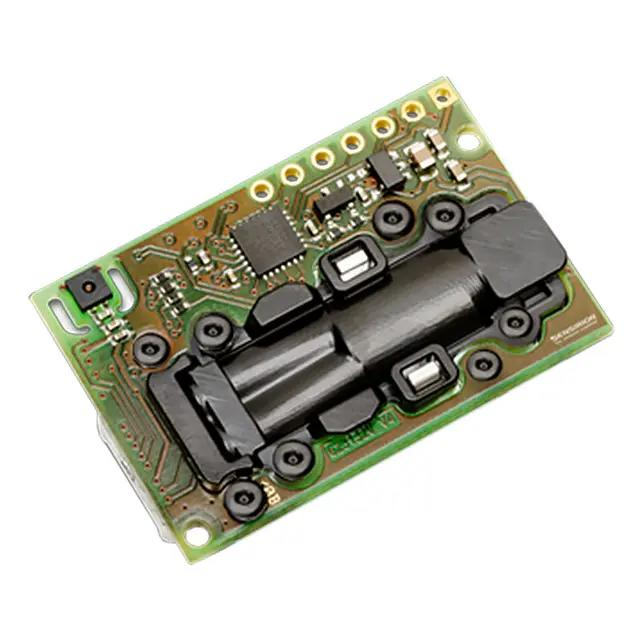

Stima WiFi V2
=============

| |Stima wifi con Honeywell HPM e sensore Temperatura e Umidità|

Elenco materiali
----------------

-  `Wemos D1 mini
   V3 <https://www.homotix.it/vendita/wemos-schede-cpu/wemos-mini-v310>`__
-  `OLED Shield V2.0.0 for Wemos D1
   mini <https://www.homotix.it/vendita/wemos/oled-shield-v110-for-wemos-mini>`__
-  `Wemos DC Power Shield
   V1.1.0 <https://www.homotix.it/vendita/wemos-shield-alimentazione/power-shield>`__
-  `wemos
   protoboard <https://www.homotix.it/vendita/wemos-shield-prototipazione-cavi/wemos-protoboard>`__
-  `connettore strip maschio
   12mm <https://www.homotix.it/vendita/connettori-morsettiere/connettore-strip-maschio-poli-12mm>`__
-  `connettori <https://www.homotix.it/vendita/wemos-shield-prototipazione-cavi/connettori>`__
   (quando necessari)

NOTA BENE

In particolare il sensore Honeywell HPMA richiede una alimentazione a 5V
stabilizzata e molto precisa

Alimentazione per distanze fino a circa 50m. dall'alimentazione di rete
a 220V:

-  `Alimentatore-12v-2a <https://www.homotix.it/vendita/alimentatori/alimentatore-12v-2a>`__
-  cavo bipolare della lunghezza opportuna

Sensore polveri Sensirion SPS30
~~~~~~~~~~~~~~~~~~~~~~~~~~~~~~~

.. figure:: sps30_overview.jpg
   :alt: sps30 overview

   sps30 overview

-  `sps30 <https://www.sensirion.com/en/environmental-sensors/particulate-matter-sensors-pm25/>`__
-  https://it.rs-online.com/web/p/sensori-di-qualita-dell-aria/1862540/

in alternativa
^^^^^^^^^^^^^^

-  `Plantower pms5003 <http://www.plantower.com/en/content/?108.html>`__

.. _in-alternativa-1:

in alternativa
^^^^^^^^^^^^^^

-  `Honeywell
   HPM-115S0 <https://it.rs-online.com/web/p/sensori-di-luce-e-colore/1454279/>`__
-  `Cavo connessione PicoBlade Molex 8
   vie <https://it.rs-online.com/web/p/wire-to-board-cable-assemblies/1250750/>`__

.. _in-alternativa-2:

in alternativa
^^^^^^^^^^^^^^

-  `SDS011 <https://www.homotix.it/vendita/sensori-polveri-sottili/sensore-polveri-sottili-sds011>`__

Sensore temperatura e umidità
~~~~~~~~~~~~~~~~~~~~~~~~~~~~~

-  `sensirion
   SHT85 <https://www.sensirion.com/en/environmental-sensors/humidity-sensors/sht85-pin-type-humidity-sensor-enabling-easy-replaceability/>`__
   |sht85 overview|
-  `negozio
   RS <https://it.rs-online.com/web/p/sensori-di-temperatura-e-umidita/1826530/>`__

.. _in-alternativa-3:

in alternativa
^^^^^^^^^^^^^^

temperatura 0.2C accuratezza
''''''''''''''''''''''''''''

-  `ADT7420 <https://www.analog.com/en/products/adt7420.html>`__

temperatura 0.5C accuratezza e umidità
''''''''''''''''''''''''''''''''''''''

-  `HIH6121 <https://sensing.honeywell.com/honeywell-sensing-humidicon-hih6100-series-product-sheet-009059-6-en.pdf>`__

Sensore di CO2
~~~~~~~~~~~~~~

   scd30 overview

-  `Sensirion
   SCD30 <https://www.sensirion.com/en/environmental-sensors/carbon-dioxide-sensors-co2/>`__
-  `negozio
   RS <https://it.rs-online.com/web/p/sensori-di-temperatura-e-umidita/1720552/>`__

Configurazioni sul server
-------------------------

Registrazione
~~~~~~~~~~~~~

`Registrasi <http://rmap.cc/registrazione/register/>`__ o fare
`1 <http://rmap.cc/registrazione/login>`__ login sul server.

Configurazione stazione
~~~~~~~~~~~~~~~~~~~~~~~

Registrare una nuova stazione sul
`server <http://rmap.cc/insertdata/newstation>`__; dopo aver selezionato
le coordinate utilizzando l'indirizzo o selezionandole dalla mappa
inserire il nome stazione ( nome consigliato come predefinito
"stimawifi") e il modello stazione che sarà

-  "airquality_sps_sht_scd" se sono collegati i sensori Sensirion delle
   polveri SPS30, temperatura e umidità SHT85 , sensore di CO2 SCD30
-  "airquality_sps_sht" se sono collegati i sensori Sensirion delle
   polveri SPS30, temperatura e umidità SHT85
-  "airquality_sps" se è collegato solo il sensori Sensirion delle
   polveri SPS30
-  "airquality_sds" se è collegato solo il sensore delle polveri SDS011.
-  "airquality_hpm" se è collegato solo il sensore delle polveri
   Honeywell HPM
-  "airquality_pms" se è collegato solo il sensore delle polveri
   Plantower pms5003
-  "stima_thd" se sono collegati il sensore delle polveri Honeywell HPM
   e il modulo stima_th
-  "stima_thdm" se sono collegati il sensore delle polveri Honeywell
   HPM, il modulo stima_th, il modulo stima_gas

Attivazione stazione
--------------------

Accendere la stazione collegandola tramite l'apposito alimentatore a una
alimentazione USB.

Se si ha il display
~~~~~~~~~~~~~~~~~~~

Tenendo premuto il pulsante A premere il pulsante Reset. Dovranno
apparire le seguenti scritte:

| ``Clean FS``
| ``Reset wifi configuration``

Con un PC o uno smathphone collegarsi al WIFI con ssed "STIMA-config" e
password "bellastima" come indicato sul display.

Una volta attivata la connessione dovrà comparire una pagina di
configurazione intitolata "STIMA-config".

Se questo non avviene automaticamente puntare il browser all'indirizzo
http://192.168.4.1/

Selezionare la prima voce "Configure WiFi".

Selezionare dall'elenco l'ssed della rete WiFi di accesso alla rete che
dovrà essere utilizzata dalla stazione e inserire nell'apposita casella
la relativa password di accesso se necessaria. Nella casella "rmap user"
inserire il nome utente utilizzato nella registrazione sul server e
nella casella "rmap password".

Lasciare "stimawifi" come nome stazione se non è sttao precedentemente
personalizzato.

premere il tasto "save" per salvare.

Se si ottiene la pagina con la scritta "Credentials Saved" la procedura
ha avuto successo.

A questo punto sul display dopo la pagina con la scritta "Starting up!"
e la versione del firmware dovrà comparire la scritta "WIFI OK".

Se questo non avviene rieseguire le istruzioni di questa sezione.

Se non si ha il display
~~~~~~~~~~~~~~~~~~~~~~~

Con un filo connettere il pin 7 a massa e premere il pulsante Reset e
attendere 5 secondi prima di scollegare il filo dal pin 7.

Con un PC o uno smathphone collegarsi al WIFI con ssed "STIMA-config" e
password "bellastima" come indicato sul display.

Una volta attivata la connessione dovrà comparire una pagina di
configurazione intitolata "STIMA-config".

Se questo non avviene automaticamente puntare il browser all'indirizzo
http://192.168.4.1/

Selezionare la prima voce "Configure WiFi".

Selezionare dall'elenco l'ssed della rete WiFi di accesso alla rete che
dovrà essere utilizzata dalla stazione e inserire nell'apposita casella
la relativa password di accesso se necessaria.

Nella casella "rmap user" inserire il nome utente utilizzato nella
registrazione sul server e nella casella "rmap password".

Lasciare "stimawifi" come nome stazione se non è sttao precedentemente
personalizzato.

premere il tasto "save" per salvare.

Se entro 60 secondi si accenderà un led blu per una decina di secondi
tutto è andato a buon fine.

Se questo non avviene rieseguire le istruzioni di questa sezione.

Legenda segnalazioni tramite LED blu onboard
--------------------------------------------

-  riavvio: 3 impulsi luminosi di 1 secondo
-  tentativo aggiornamento firmware in corso: led lampeggiante a 1Hz
-  risultato aggiornamento firmware:

   -  nessun aggiornamento disponibile: 1 impulso luminosi di 1 secondo
   -  aggiornamento firmware fallito: 2 impulsi luminosi di 1 secondo
   -  firmware aggiornato: 3 impulsi luminosi di 1 secondo

-  in attesa di configurazione: led lampeggiante a 1Hz per tutto il
   periodo di configurazione
-  configurazione remota fallita: led lampeggiante a 1Hz per 5 secondi
-  connect MQTT fallita/errore pubblicazione: impulso medio a 1Hz per 5
   secondi
-  sensore assente o rotto/errore comunicazione: impulso lungo a 1Hz per
   5 secondi
-  dato mancante: un impulso luminoso di 1 secondo a 2Hz

Un corretto funzionamento della stazione viene evidenziato dal led blu
che si accende per circa 5 secondi ogni 60 secondi.

Visualizzazione dei dati in tempo reale
---------------------------------------

Se la rete a cui accede la stazione è la stessa a cui avete collegato
il dispositivo che utilizzerete per visualizzare i dati con un browser
e tale rete è correttamente configurata per utilizzare i servizi
Zeroconf/Bonjour sarà' possibile visualizzare i dati tramite un
browser appena questi vengono rilevati dai sensori interrogando
direttamente la stazione senza interessare il server. Questa funsione
è consigliata ad esempio per creare pannelli informativi.

Accedere con il browser a:
| `Dati stazione <http://rmap.cc/accounts/profile/>`__

selezionare la propria stazione e selezionare "mostra dettagli stazione"
e successivamente "dati locali in tempo reale

E possibile accedere anche direttamente alla stazione tramite l'URL:
| `Dati stazione <http://NOMESTAZIONE/>`__

sostituendo NOMESTAZIONE con appunto il nome della vostra stazione in
forma abbreviata.

Cancellazione delle configurazioni e reset alle condizioni di "fabbrica"
------------------------------------------------------------------------

.. _se-si-ha-il-display-1:

Se si ha il display
~~~~~~~~~~~~~~~~~~~

Tenendo premuto il pulsante A premere il pulsante Reset. Dovranno
apparire le seguenti scritte:

| ``Clean FS``
| ``Reset wifi configuration``

Potranno essere necessarie alcune decine di secondi prima che queste
scritte scompaiano e si possa procedere.

.. _se-non-si-ha-il-display-1:

Se non si ha il display
~~~~~~~~~~~~~~~~~~~~~~~

Con un filo connettere il pin 7 a massa e premere il pulsante Reset e
attendere 5 secondi prima di scollegare il filo dal pin 7 e attendere
ulteriori 60 secondi.

Assemblaggio
------------

Infilare i connettori con i pin lunghi e saldarli sul modulo Wemos D1
mini. Se si dispone di un display Wemos v2 impilarlo sul modulo Wemos D1
mini. Aggiungere alla pila Wemos il DC Power Shield.

Saldare alla wemos protoboard i pin necessari a connettere tutti i
sensori e aggiungerlo alla pila Wemos come da foto.
|protoboard shield per wemos d1 mini|
|wemos protoboard connection| |protoboard saldata|
|pila wemos|

opzione display oled
~~~~~~~~~~~~~~~~~~~~

Se si possiede la versione v2.0.0 sul circuito stampato dal lato opposto
del display interrompere la piazzola sulla destra indicata con D3
(pulsante A, piazzola indicata con la freccia) e della stessa colonna di
piazzole saldare quella indicata con D7. Se si possiede la versione v1.x
(senza pulsanti A e B) è necessario realizzare una saldatura dove
previsto (sul retro del circuito stampato rispetto al display)
selezionando l'indirizzo I2C corrispondente a 0x3C.

Sensore Sensirion SPS30 per le polveri
~~~~~~~~~~~~~~~~~~~~~~~~~~~~~~~~~~~~~~

   sps30 connector

Connettere:

============= === =====
Wemos D1 mini     SPS30
============= === =====
5V            <-> PIN 1
D2            <-> PIN 2
D1            <-> PIN 3
GND           <-> PIN 4
GND           <-> PIN 5
============= === =====

Sensore Sensirion SCD30 per la CO2
~~~~~~~~~~~~~~~~~~~~~~~~~~~~~~~~~~

.. figure:: scds30_connector.png
   :alt: scds30 connector

   scds30 connector

Connettere:

============= === =====
Wemos D1 mini     SCD30
============= === =====
5V            <-> VDD
GND           <-> GND
D1            <-> SCL
D2            <-> SDA
============= === =====

Assemblaggio del sensore all'uscita del sensore di polveri:
|scd30 assemblaggio 1| |scd30 assemblaggio 2|

opzione sensore Plantower PMS5003 per le polveri
~~~~~~~~~~~~~~~~~~~~~~~~~~~~~~~~~~~~~~~~~~~~~~~~

numbering pins from left to right with "plantower" stamps on the floor

Effettuare i seguenti collegamenti tra Wemos e
`PMS5003 <https://github.com/r-map/rmap/blob/master/arduino/sketchbook/libraries/pms/doc/pms5003-manual_v2-3.pdf>`__:
Connettere:

============= === =======
Wemos D1 mini     PMS5003
============= === =======
GND           <-> PIN 2
5V            <-> PIN 1
D5            <-> PIN 5
D6            <-> PIN 4
============= === =======

eventualmente connettere anche il PIN 6 (reset) e PIN 3 (SET) (DA FARE)

opzione sensore SDS011 per le polveri
~~~~~~~~~~~~~~~~~~~~~~~~~~~~~~~~~~~~~

Effettuare i seguenti collegamenti tra Wemos e SDS011: Connettere:

============= === =========
Wemos D1 mini     SDS011
============= === =========
GND           <-> pin 5 GND
5V            <-> pin 3 5V
D5            <-> pin 7 TXD
D6            <-> pin 6 RXD
============= === =========

opzione sensore Honeywell HPM per le polveri
~~~~~~~~~~~~~~~~~~~~~~~~~~~~~~~~~~~~~~~~~~~~

| Effettuare i seguenti collegamenti tra Wemos e Honeywell hpm:
  |Honeywell pinout|
| Connettere:

============= === =============
Wemos D1 mini     Honeywell HPM
============= === =============
GND           <-> PIN 8 GND
5V            <-> PIN 2 5V
D5            <-> PIN 6 TX
D6            <-> PIN 7 RX
============= === =============

| |Assemblaggio moduli in scatola elettrica|
| |Assemblaggio materiale espanso per flusso aria|
| |Messa in opera con canaletta angolo a 90 gradi per flusso aria in/out
  antipioggia|
| |Uso di rete zanzariera per filtro contro gli insetti|

sensore SHT85 per temperatura e umidità
~~~~~~~~~~~~~~~~~~~~~~~~~~~~~~~~~~~~~~~

|sht85 connections| Connettere:

============= === ===============
Wemos D1 mini     modulo Stima-th
============= === ===============
GND           <-> PIN 3
3V3           <-> PIN 2
D1            <-> PIN 1
D2            <-> PIN 4
============= === ===============

Opzione modulo Stima-th con HIH6121 e ADT7420 per temperatura e umidità
~~~~~~~~~~~~~~~~~~~~~~~~~~~~~~~~~~~~~~~~~~~~~~~~~~~~~~~~~~~~~~~~~~~~~~~

| |Sensore temperatura e umidità all'interno di apposito schermo per le
  radiazioni|

-  ponticellare (con un resistore) A1-centrale con A1-
-  ponticellare (con un resistore) A0-centrale con A0+

Una volta saldati i terminali dei cavi e protetti con nastro
autoagglomerante è importante preservare le connessioni dalla corrosione
degli agenti atmosferici e consigliamo uno strato di silicone protettivo
spray del tipo Electrolube DCR200H; solo una volta asciugato lo strato
di vernice protettiva rimuovere la protezione adesiva del sensore HIH

Connettere:

============= === ===============
Wemos D1 mini     modulo Stima-th
============= === ===============
GND           <-> GND
3V3           <-> VCC
D1            <-> SCL
D2            <-> SDA
============= === ===============

| Se non si utilizza la wemos_protoboard è necessario fare una modifica
  al modulo wemos per aggiungere un pin di collegamento a GND. Saldare a
  45 gradi di inclinazione un pin aggiuntivo per connettore Dupont a GND
  come da figura: |Pin aggiunto a GND|

Opzione modulo Stima-i2c-sdsmics
~~~~~~~~~~~~~~~~~~~~~~~~~~~~~~~~

vedi:
http://www.raspibo.org/wiki/index.php?title=Gruppo_Meteo/HowTo#Modulo_Stima-i2c-sdsmics

Opzione per alimentazione con cavo di lunghezza superiore a 2m.
~~~~~~~~~~~~~~~~~~~~~~~~~~~~~~~~~~~~~~~~~~~~~~~~~~~~~~~~~~~~~~~

Tagliare il cavo dell'alimentatore e inserire una piattina bipolare con
rame di diametro opportuno ovviamente della lunghezza necessaria.

Per caricare il firmware
~~~~~~~~~~~~~~~~~~~~~~~~

Installare il driver USB2Serial
^^^^^^^^^^^^^^^^^^^^^^^^^^^^^^^

Windows
'''''''

Per comunicare col Wemos c’è bisogno del driver usb2serial.

Linux
'''''

Nessuna installazione necessaria.

MacOS
'''''

Per Sierra vedere queste instruzioni che sono state testate:
https://github.com/adrianmihalko/ch340g-ch34g-ch34x-mac-os-driver

Upload del firmware
^^^^^^^^^^^^^^^^^^^

Effettuare il download del firmware da
http://rmap.cc/media/firmware/rmap_esp8266.ino.d1_mini_yhbp7E2.bin e
caricarlo sul Wemos dopo averlo connesso tramite cavetto USB. Per fare
questo seguire le istruzioni a: https://github.com/espressif/esptool e
in particolare:
https://github.com/espressif/esptool#writing-binaries-to-flash

.. |Stima wifi con Honeywell HPM e sensore Temperatura e Umidità| image:: stima_wifi.jpg
   :width: 400px

.. |wemos protoboard connection| image:: wemos_protoboard_connection.png
.. |protoboard saldata| image:: protoboard_saldata.jpg
.. |pila wemos| image:: pila_wemos.jpg
.. |scd30 assemblaggio 1| image:: scd30_assemblaggio_1.jpg

.. |Assemblaggio materiale espanso per flusso aria| image:: assemblaggioinscatolaelettricaflusso.jpg
   :width: 400px

.. |Uso di rete zanzariera per filtro contro gli insetti| image:: filtroinsetti.jpg
   :width: 400px

.. |Pin aggiunto a GND| image:: stima_wifi_addpintognd.jpg
   :width: 300px
