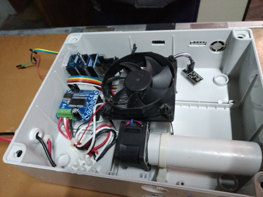

.. _testa_di_prelievo_per_sensori_air_quality:

Testa di prelievo per sensori Air Quality
=========================================

.. _a_cosa_serve:

A cosa serve
------------

Da bibliografia I sensori per il particolato di tipo OPC evidenziano
come principale fonte di errore l'elevata umidità relativa (> 85%).
Nelle condizioni di elevata umidità relativa infatti il computo della
dimensione della particella viene alterato essendo questa generalmente
igroscopica. Bisogna anche ridurre gli effetti dinamici del vento che
alterano il flusso di aria nello strumento regolato solo da una apposita
ventola.

.. _principio_di_funzionamento:

Principio di funzionamento
--------------------------

L'umidità relativa è definita come il rapporto della densità del vapore
contenuto nella miscela e la densità del vapore saturo alla temperatura
della miscela. L'obiettivo è quello di ridurre l'umidità relativa. Il
numeratore non è semplice da modificare mentre risulta facile modificare
il denominatore elevando la temperatura e quindi aumentando la densità
di vapore saturo. Quindi una riduzione di umidità relativa si realizza
quando necessario riscaldando opportunamente l'aria. E' stata creata
quindi una stanza all'interno della quale l'aria è convogliata da una
ventola con numero di giri regolabile per garantire il ricambio
permanente dei campioni d'aria. La stanza è termoregolata tramite un
elemento riscaldante da 36w termicamente connesso a un dissipatore e una
ventola per aumentare l'efficienza dello scambio di calore e
l'omogenizzazione dell'aria nella stanza. L'uscita del flusso d'aria
deve essere dimensionato in modo da no avere nessun effetto di
pressurizzazione nella stanza, ma al tempo stesso permettere
principalmente solo l'uscita dell'aria esterna prelevata. Viene
impostata l'umidità massima richiesta. all'interno della stanza è posto
un sensore di temperatura e di umidità. Dall'umidità misurata tramite la
formula di Tetens diretta e inversa vine calcolata la temperatura
necessaria per ottenere l'umidità richiesta. Nel caso in cui la
temperatura calcolata sia superiore a quella misurata viene attivato il
riscaldatore comandato tramite un PID.

Alla camera è possibile collegare tutti i sensori con la presa d'aria
predisposta.

Funzionalità
------------

Tramite l'encoder e il display è possibile impostare:

-  umidità massima richiesta
-  temperatura massima possibile (per protezione)
-  velocità della ventola di prelievo
-  ventola di prelievo on/off
-  3 parametri del PID
-  salvataggio di tutti i parametri in modo permanente

La funzione di salvataggio permette di conservare i parametri impostati
a un riavvio. Con una pressione lunga del bottone dell'encoder si esce
dalla modalità impostazione (altrimenti raggiunta anche dopo un timeout)
ed è possibile visualizzare sul display tutti i parametri di
funzionamento.

.. _implementazione_hardware:

Implementazione hardware
------------------------

Materiale
~~~~~~~~~

-  alimentatore 12V 50w
-  ponte H ibt_2
-  sensore I2C temperatura e umidità HIH della Honeywell
-  microcontrollore esp8266 Wemos D1 mini
-  display oled Wemos
-  modulo alimentazione Wemos
-  millefori Wemos
-  encoder
-  ventola 4cm. 12V
-  ventola 12cm. 12V
-  dissipatore
-  resistenza 4 ohm 50w

.. image:: IMG_20190209_122451.jpg.small.jpg

.. _implementazione_software:

Implementazione software
------------------------

Firmware
~~~~~~~~

https://github.com/r-map/rmap/blob/master/platformio/domotica/sample_head/src/sample_head.ino

.. _test_di_funzionamento:

Test di funzionamento
---------------------

.. image:: temperatura_e_umidita.png
