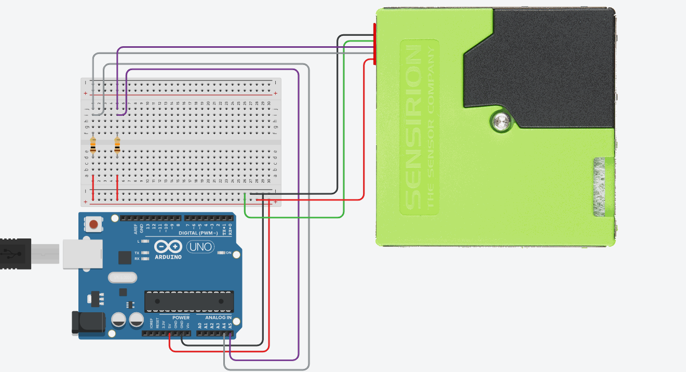

# Sensirion SPS30

## ===========================================================

A program to set instructions and get information from an SPS30. It has been
tested to run either UART or I2C communcation on ESP32, MEGA2560, ESP8266 and UNO.
  A detailed description of the options and findings are in SPS30.odt

## Getting Started
As part of a larger project I am looking at analyzing and understanding the air quality.
I have done a number of projects on air-sensors. The SPS30 sensor is a new kid on the block
that looks interesting. This is the first version of a working driver + examples.
More work is happening to create examples and compare against other sensors.

A word of warning: the SPS30 needs a female plug of ZHR-5 from JST Sales America Inc.
I have not been able to find a good source for that and was glad to buy the Sparkfun version
(https://www.sparkfun.com/products/15103) which does include a cable with this plug.

  May 2019 : there is also a library available for Raspberry Pi (https://github.com/paulvha/sps30_on_raspberry)

## About typical particle size (TPS)
   An answer on the typical size from Sensirion:

The typical particle size (TPS) is not a function of the other SPS30 outputs,
but an independent output. It gives an indication on the average particle diameter
in the sample aerosol. Such output correlates with the weighted average of the number
concentration bins measured with a TSI 3330 optical particle sizer.
Following this definition, lighter aerosols will have smaller TPS values than heavier aerosols.
The reactiveness of this output increases with the particle statistics: a larger number of
particles in the environment will generate more rapidly meaningful
TPS values than a smaller number of particles (i.e., clean air).

## Software installation
Obtain the zip and install like any other

## Program usage
### Program options
Please see the description in the top of the sketch and read the documentation (odt)

## Versioning

### version 1.1 / August 2019
 * Simplified for RMAP and no blocking use

### version 1.0 / January 2019
 * Initial version Arduino, ESP32, UNO

### version 1.0.1 / January 2019
 * Added examples 4 (with DS18x20) and 5 (with BME280)

### version 1.1.0 / January 2019
 * Added example 6 (plotting data)
 * Added ESP8266 support info

### version 1.2  / January 2019
 * Added force serial1 when TX = RX = 8
 * Added flag INCLUDE_SOFTWARE_SERIAL to optionally exclude software Serial
 * Tested by Ryan Brown on a Sparkfun Photon RED board and the code should also work with the Photon, P1, and Electrons

### version 1.2.1 / February 2019
 * Added example 7 (with SCD)
 * Added flag in sps30.h SOFTI2C_ESP32 to use SoftWire on ESP32 in case of SCD30 and SPS30 working on I2C
 * Update documentation / instructions

### version 1.3.0 / February 2019
 * Added check on the I2C receive buffer. If at least 64 bytes it try to read ALL information else only MASS results
 * Updated examples / documentation / instructions
 * Added example 8 (SPS30 + SCD30 + BME280)
 * Added || defined(__AVR_ATmega32U4__) || defined(__AVR_ATmega16U4__) for boards with small footprint (thanks Just van den Broecke)

### version 1.3.1 / February 2019
 * fixed the PM10 number always showing 0 issue.

### version 1.3.2 / February 2019
 * Added example 9 (with compare typical size)
 * Updated the documentation with compare results to SDS011 and Dylos-1700
 * Update all examples to have prototypes upfront as the ESP32 pre-processor sometimes does not create

### version 1.3.3 / March 2019
 * Added example 10 for ESP32 only: use SPS30 to create an airquality index by region
 * update documentation to 1.3

### version 1.3.4 / April 2019
 * corrected the stop measurement command (spotted by detamend)

### version 1.3.5 / May 2019
 * added support for MKRZERO/SAMD I2C buffer detection and disable softerial
 * updated documentation for PROMINI I2C buffer adjustment in odt-file (thanks toinput Bert Heusinkveld)

## Author
 * Paul van Haastrecht (paulvha@hotmail.com)

## License
This project is licensed under the GNU GENERAL PUBLIC LICENSE 3.0

## Acknowledgements
Make sure to read the datasheet from Sensirion. While draft it does provide good starting point. 
In case you are new to electronics and  wonder about pull-up resistors for I2C, see below (thanks to Shane Diller)

